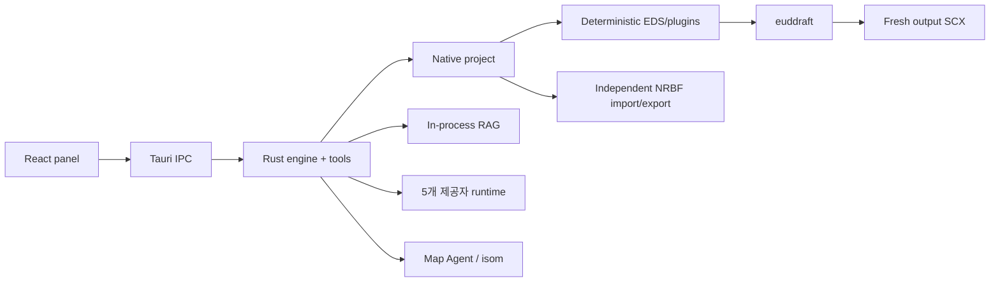

# eud-agent

> 스타크래프트 EUD 맵을 위한 Native AI 저작 도구 — canonical epScript/DAT 프로젝트, 검토 가능한 에이전트 변경, 직접 euddraft 빌드.

[English](./README.md)

`eud-agent`는 Tauri 2, Rust, React, TypeScript로 만든 Windows 데스크톱 앱입니다. 자연어로 맵 동작을 설명하면 에이전트가 실제 프로젝트와 맵을 읽고, 고정된 레퍼런스를 검색하고, typed tool로 epScript/DAT를 수정한 뒤 changeset 검토를 거쳐 euddraft로 결과 맵을 빌드합니다.

EUD Editor 3는 **runtime 의존성이 아닙니다**. 기존 `.e3s` 프로젝트는 독립 MS-NRBF 호환 계층으로 가져오고 내보낼 수 있습니다.

## 앱이 직접 소유하는 것

- versioned `project.eap` manifest
- confined `src/**/*.eps`·`src/**/*.py` 소스 트리, 순서가 있는 Python 진입점, 정확한 EPS MainFile
- sparse standard DAT/XDAT/TBL/requirements/buttons JSON
- deterministic EDS/plugin 생성
- bounded euddraft 실행과 structured diagnostics
- semantic journal, 승인/거부, rollback, restart persistence
- in-process BGE-M3 RAG와 pinned epScript preflight
- SCX/CHK 조회와 안전한 Map Agent mutation
- Codex, Claude Code, Antigravity, OpenCode Go, Ollama 기반 multi-session 대화, plan, ASK, changeset review

## 요구 사항

| 요구 사항 | 설명 |
|---|---|
| Windows 10/11 x64 | MSVC Rust target, 시스템 WebView2 runtime |
| euddraft | 최초 설정에서 최신 버전 자동 다운로드. 기존 폴더, `euddraft.exe`, `euddraft.py` 직접 지정도 지원 |
| 원본 맵 | `.scx` 또는 `.scm` |
| AI 제공자 | Codex, Claude Code, Antigravity, OpenCode Go, Ollama 중 하나 이상 설정 |
| StarCraft data | 지형/렌더링 자동 탐지가 실패할 때 설정 |

EUD Editor는 선택 사항입니다. 내보낸 호환 E3S를 다시 열 때만 필요합니다.

## 프로젝트 시작

일반 실행 시마다 **프로젝트 시작** 화면이 표시됩니다. 저장된 마지막 프로젝트를 자동으로 열지는 않습니다.

- 최근에 성공적으로 연 프로젝트 최대 20개를 최신순으로 표시합니다. 이름·경로 검색과 목록에서 제거를 지원하며, 제거해도 실제 파일은 삭제하지 않습니다.
- `.eap` 파일을 열거나 Native 프로젝트 폴더를 직접 선택할 수 있습니다.
- SCX/SCM에서 새 프로젝트를 만들거나 기존 E3S와 참조 맵을 빈 폴더로 가져올 수 있습니다.
- Windows 설치본은 `.eap`를 전용 프로젝트 아이콘과 연결합니다. `.eap` 파일을 더블클릭하면 해당 프로젝트로 바로 시작하며, 앱이 실행 중이면 기존 창으로 열기 요청을 전달합니다. 다른 JSON 파일의 연결은 변경하지 않습니다.
- 작업 중에는 상단 **프로젝트 전환**을 사용합니다. 빌드·에이전트·검토 작업 중이거나 맵 작업 창이 열려 있으면 전환을 막습니다. 전달된 파일 열기 요청은 보류되며 작업 완료 후 **다시 열기**로 진행할 수 있습니다.

## 최초 환경 설정

1. 프로젝트를 선택하거나 생성합니다.
2. 별도 지정하지 않으면 최신 [armoha/euddraft 배포본](https://github.com/armoha/euddraft)을 자동 다운로드. 기존 euddraft 폴더·파일을 선택해도 됩니다. 다운로드는 SHA-256 검증 후 `%LOCALAPPDATA%/eud-agent/euddraft`에 설치하며, 직접 지정한 경로를 우선 사용합니다.
3. checksum으로 검증되는 RAG/model asset 준비
4. AI 제공자 선택 및 연결

이미 준비된 환경 설정은 재사용합니다. **설정 → 프로젝트**의 열기/만들기/가져오기/내보내기도 계속 사용할 수 있습니다.

## Native 프로젝트 구조

```text
my-project/
├── project.eap             # 프로젝트 설정을 직접 담는 JSON manifest
├── src/
│   ├── main.eps
│   └── bootstrap.py         # 선택적 direct eudplib 소스
├── dat/
│   ├── standard.json
│   ├── xdat.json
│   ├── tbl.json
│   ├── requirements.json
│   └── buttons.json
├── maps/
│   └── source.scx
├── plugins/
├── build/
└── compat/
    └── editor-project.e3s   # E3S import 프로젝트만
```

schema v2 Manifest, EPS/Python tree, sparse DAT JSON이 canonical입니다. EDS, generated build helper/binary, output SCX, E3S는 build/compatibility artifact입니다.

`.eap`는 **EUD Agent Project**의 약자로, 연결용 파일이 아니라 프로젝트 이름·맵 경로·MainFile·설정·플러그인·순서가 있는 Python 진입점·정확한 PyPI 의존성 선언·해결된 wheel lock·E3S 호환 정보를 직접 담는 JSON manifest입니다. 한 폴더에 `.eap`가 하나라면 파일 이름을 바꿔도 열기와 저장이 유지됩니다. 소스·DAT·맵은 별도 파일이므로 이동할 때는 프로젝트 폴더 전체를 함께 옮기세요.

기존 `project.json` 또는 `.eudproj`는 파일 열기의 이전 형식 필터나 프로젝트 폴더 열기로 전환할 수 있습니다. 검증 후 `project.json`을 `project.eap`로 원자적으로 이름 변경하고 기존 연결 파일을 제거합니다. 이미 `.eap`와 이전 형식이 함께 있거나 `.eap`가 여러 개면 임의로 덮어쓰지 않고 중단합니다.

## E3S 호환 범위

가져오기/내보내기가 지원하는 상태:

- CUI epScript tree와 MainFile
- source/output map 참조
- standard DAT와 XDAT
- TBL, requirements, button sets
- 지원되는 main settings와 ordered EDS plugins

GUIEps, GUIPy, RawText, ClassicTrigger-as-MainFile은 조용히 손실시키지 않고 명시적으로 거부합니다. EPS-only Native 프로젝트는 정상적으로 빌드되지만, E3S 내보내기에는 가져올 때 보존한 compatibility base가 필요합니다. direct Python 소스·진입점·의존성·lock 중 하나라도 있으면 Editor가 손실 없이 표현할 수 없으므로 E3S 내보내기를 명시적으로 거부합니다.

## Direct eudplib Python

epScript가 기본 저작 언어입니다. 프로젝트 로컬 `src/**/*.py`는 완전히 신뢰되는 first-class 소스이며, manifest에서 선택한 진입점만 지정 순서대로 하나의 frozen `euddraft.exe` 프로세스에서 EPS MainFile보다 먼저 실행됩니다. 모든 Python 소스는 revision, snapshot, search, review, rollback에 포함됩니다.

의존성 preparation 뒤 `python_dependencies_set`을 호출해 완전한 exact `name==version` PyPI 목록을 반영합니다. eud-agent는 고정된 `uv` 0.11.3을 준비하고 모든 wheel URL/tag/SHA-256을 `project.eap`에 기록하며 frozen runtime 실빌드 probe를 거칩니다. 오프라인에서는 검증된 `%LOCALAPPDATA%/eud-agent/python-*` cache만 재사용합니다. `build_run`은 의존성 상태를 변경하지 않습니다.

E3S 가져오기는 이 PC에 **원래 E3S 경로로 저장된 하네스**가 있으면 승인 문서·계획, 프로젝트 메모리, DAT 위키, 일반 대화·맵 대화 기록도 복사합니다. 과거에 작은따옴표가 포함된 이름으로 저장된 메모리·세션도 인식합니다. 대화는 새 세션 ID로 복사하며 이름·제공자/모델 설정·시각·로그를 보존합니다. 이전 실행 연결·보류 중 승인·작업 상태·맵 후보 작업은 재개하지 않으며 원본은 그대로 둡니다. 연결이 모호하거나 파일이 없거나 손상되었거나 대상 자료와 충돌하면 해당 항목을 안내합니다. 기존 파일을 덮어쓰거나 정상 자료까지 모두 중단하지 않습니다. 하네스는 E3S에 내장되지 않으므로 다른 PC의 하네스를 E3S 파일만으로 복원할 수는 없습니다.

과거에 승인된 루트 문서와 `.md` 이외의 텍스트 문서도 보존하며, 삭제 이력만 남은 파일은 다시 만들지 않습니다. 가져오지 못한 일반 문서·계획·메모리·위키·대화는 범위, 경로, 사유를 함께 표시합니다. **검토한 N개를 제외하고 가져오기**를 눌렀을 때만 현재 검토한 항목을 제외하고 나머지를 가져옵니다. 문제가 달라지면 다시 동의를 받으며, **다시 확인**은 제외를 승인하지 않습니다. 원본은 보존합니다. E3S 자체·원본 맵·대상 폴더의 필수 조건이나 되돌리기가 실패한 경우는 별도 오류와 상세 사유를 표시합니다.

이제 하네스 자료는 프로젝트와 함께 이동합니다. `.eud-agent/workspace/`에는 승인 문서, `.eud-agent/state/`에는 승인 메타데이터와 이관 기록, `.eud-agent/memory/`에는 메모리와 `wiki/ledger.json`을 저장합니다. 기존 AppData 자료는 현재 프로젝트 소속을 확실하게 확인할 수 있을 때만 복사하고, 원본과 기존 로컬 파일은 덮어쓰지 않습니다. 폴더를 옮겨도 저장된 워크스페이스 ID를 유지하며, 이관 후 로컬에서 지운 파일을 옛 AppData 자료로 다시 만들지 않습니다. 대화·실행 작업·세션 워크스페이스·인증 정보·캐시는 프로젝트에 넣지 않고 PC의 AppData에 둡니다.

제품 runtime은 `BinaryFormatter`를 실행하거나 Editor assembly를 로드하지 않습니다. 호환 acceptance에서만 원본 .NET runtime으로 export fixture deserialize를 독립 검증합니다.

## 개발/검증

```powershell
cargo check -p eud-agent --lib
cargo test -p eud-agent

npm --prefix panel ci
panel\node_modules\.bin\tsc.cmd -b panel\tsconfig.json
npm --prefix panel test -- --run
npm --prefix panel run build
```

실제 euddraft와 E3S 검증 절차는 [`hivemind/docs/verify.md`](./hivemind/docs/verify.md)에 있습니다.

## 구조



상세 계약: [`architecture.md`](./hivemind/docs/architecture.md), [`rules.md`](./hivemind/docs/rules.md), [`tech-stack.md`](./hivemind/docs/tech-stack.md).

## 서드파티 데이터

`native/eud-editor-compat` 리소스에는 오픈소스 EUD Editor의 data definition, offset, TBL baseline, helper source가 compatibility/generator 계약으로만 포함됩니다. 원본 라이선스를 함께 제공합니다. EUD Editor 실행 파일과 assembly는 재배포하지 않습니다.
