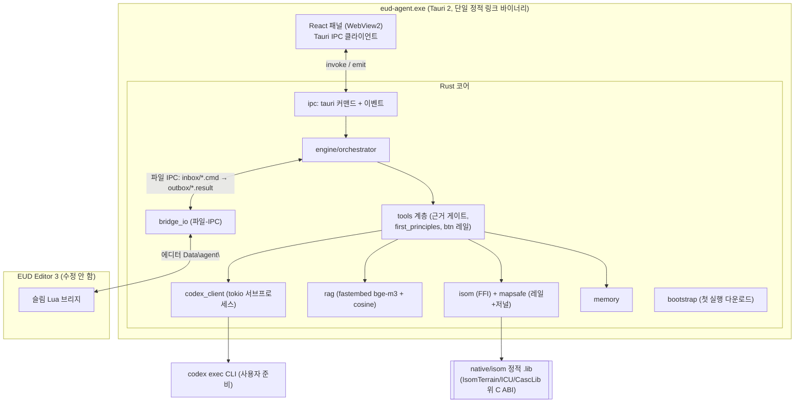
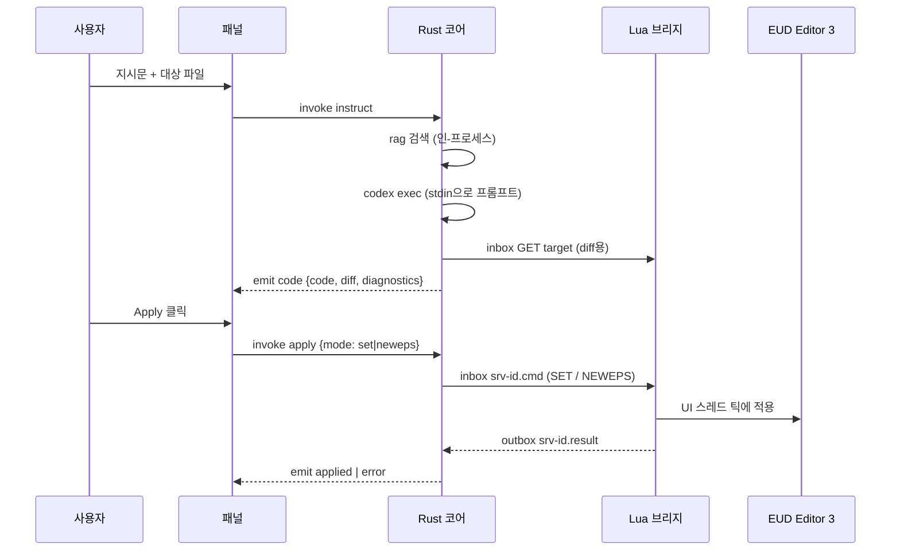

# eud-agent

> **EUD Editor 3**용 외부 AI 에이전트 — 자연어 지시를
> [epScript](https://github.com/armoha/euddraft)(eps) 코드로 바꿔 에디터에 곧바로 적용합니다.

[English](./README.md) · [한국어](./README.ko.md)

`eud-agent`는 EUD Editor 3(스타크래프트 EUD 맵 에디터) 옆에서 동작하는 독립 실행형
**Tauri 2 + Rust** 데스크톱 애플리케이션입니다. 원하는 동작을 자연어로 설명하면, 에이전트가
관련 레퍼런스를 검색하고 epScript를 생성한 뒤 diff를 보여주고, 사용자가 승인하면 얇은
파일-IPC 브리지를 통해 에디터에 적용합니다. 에디터 자체는 서드파티 도구(Buizz)이며 **절대
수정하지 않습니다** — 통합은 오직 파일 복사로만 이루어집니다.

---

## 주요 기능

- **자연어 → epScript.** 원하는 효과를 설명하면 바로 적용 가능한 eps 코드를 생성합니다.
- **인-프로세스 RAG.** [fastembed](https://github.com/Anush008/fastembed-rs)(bge-m3) +
  브루트포스 코사인으로 자체 코퍼스를 로컬 시맨틱 검색합니다 — 외부 벡터 DB 없음, 쿼리 시
  네트워크 없음.
- **근거 게이트 & 인용.** 문서 검색이 한 번이라도 실행되기 전에는 변경 동작이 차단되며,
  제안·답변에는 `[제목](url)` 형식의 출처 링크가 붙습니다(절대 날조하지 않음).
- **제1원칙 안전 레일.** 알려진 크래시 / EUD 오류 / 프리즈 원인이 프롬프트에 인코딩되어 있고
  도구 계층에서 기계적으로도 강제되므로, 스타크래프트나 에디터를 크래시시킬 변경은 거부합니다.
- **확신을 갖고 적용.** Monaco 편집 화면, 서버에서 렌더링한 unified diff, 메모리 전용
  `SET` / `NEWEPS`(저장은 사용자가 직접 제어).
- **FFI로 네이티브 맵 엔진.** C++ 맵 엔진(`isom`)을 벤더링하여 정적 링크하며, 맵 쓰기는 Rust
  안전 레일(백업, 잠금 탐지, 저널/롤백)을 거칩니다.
- **자체 업데이트.** minisign 서명된 NSIS 인스톨러 + 내장 업데이터. 브리지 Lua는 매 실행 시
  에디터로 재동기화됩니다.

---

## 요구 사항

| 요구 사항 | 비고 |
|---|---|
| **Windows** | Windows 10/11. 에디터가 Windows 전용이며, 앱은 MSVC 타깃입니다. |
| **EUD Editor 3** | 이 에이전트가 통합되는 서드파티 에디터입니다. |
| **WebView2 런타임** | 시스템 Evergreen 런타임. 인스톨러가 부트스트랩할 수 있습니다. |
| **codex CLI** | Rust 코어가 띄우는 LLM CLI. `npm install -g @openai/codex`로 설치하거나 `CODEX_CMD`에 전체 경로를 지정합니다. |

첫 실행 시 부트스트랩이 bge-m3 ONNX 모델(HuggingFace)과 RAG 인덱스(GitHub Release)를
내려받습니다. 모든 자산은 sha256으로 검증되고 원자적으로 배치됩니다.

### 소스 빌드를 위한 추가 요구 사항

| 요구 사항 | 비고 |
|---|---|
| **Rust** | ≥ 1.77.2 (MSVC 타깃), [rustup](https://rustup.rs) 사용. |
| **Tauri CLI** | `cargo install tauri-cli`. |
| **Node.js + npm** | React 패널(`panel/`) 빌드용. |
| **MSVC 툴체인** | 정적 링크되는 `isom` C++ 엔진(MSBuild) 빌드에 필요합니다. |

---

## 설치 (사용자)

1. [GitHub Releases](https://github.com/raravel/eud-agent/releases)에서 최신
   `eud-agent_*-setup.exe`를 내려받습니다.
2. 인스톨러를 실행합니다(사용자 단위 설치 — 관리자 권한 불필요).
3. codex CLI가 없다면 설치합니다: `npm install -g @openai/codex`.
4. **eud-agent**를 실행합니다. 첫 실행 시 모델과 RAG 인덱스를 설정한 뒤 패널을 표시합니다.

앱은 에디터의 생명주기와 독립적입니다. EUD Editor 3가 실행 중이 아니면, 브리지 하트비트가
나타날 때까지 패널에 *"editor not connected"*가 표시됩니다.

---

## 사용법

1. EUD Editor 3을 엽니다(에이전트가 실행 시 Lua 브리지를 자동으로 설치/갱신합니다).
2. 패널에서 **지시문**을 입력하고 **대상 파일**을 선택합니다.
3. 에이전트가 RAG 검색 → codex 생성을 수행한 뒤 **코드 + diff + 진단**을 보여줍니다.
4. diff를 검토하고 **Apply**를 클릭합니다(`set`은 덮어쓰기, `neweps`는 새 eps 생성).
5. 다음 UI 스레드 틱에 에디터 메모리에 적용됩니다 — **저장은 에디터에서 사용자가 직접 합니다.**

- `/compact`만 입력하면 Codex의 네이티브 대화 압축을 실행합니다. 활성 모델의 토큰
  임계치에 도달하면 Codex가 자동으로도 압축합니다.
- **설정 → Codex**에서 모델별 1M 컨텍스트를 켜거나 끌 수 있습니다. 선택은
  `%appdata%\eud-agent\config.json`에 저장됩니다. 지원하지 않는 모델은 Codex가 보고한
  기본 컨텍스트로 동작하며 다음 사용량 갱신 후 한 번 안내합니다.

> 설정/생성 가능한 텍스트 타입은 **CUI / RawText 전용**입니다. GUI 파일은 읽기 전용이며, SCA는
> 폐기된 타입으로 절대 노출되지 않습니다.

---

## 아키텍처

`eud-agent`는 단일 정적 링크 바이너리입니다. Rust 코어 위에 React 패널(WebView2 콘텐츠)이
올라가고, 얇은 파일-IPC Lua 브리지로 (수정하지 않은) 에디터와 통신하며, C++ 맵 엔진이 FFI로
링크됩니다.



의존성 방향: `panel → core → {isom .lib, 에디터 브리지, codex, 데이터 디렉터리}`. 무거운
작업(LLM, RAG, 오케스트레이션, 맵 바이너리 I/O)은 Rust/C++에 머무르고, Lua 브리지는 얇은
파일-IPC 도구 계층으로만 남아 앱을 역으로 호출하지 않습니다.

### 런타임 흐름 (지시 후 적용)



부트/부트스트랩 흐름, 데이터 디렉터리 레이아웃, 파일-IPC 프로토콜, 전체 설계 결정 등 더 깊은
내용은 [`hivemind/docs/architecture.md`](./hivemind/docs/architecture.md)와
[`hivemind/docs/rules.md`](./hivemind/docs/rules.md)를 참고하세요.

---

## 레포지토리 구조

```
eud-agent/
├── hivemind/                       # 하니스 문서 + 작업 (architecture, rules, ...)
├── bridge/ZZZ_10_agent_bridge.lua  # 슬림 파일-IPC 도구 계층 (에디터 측)
├── src-tauri/                      # Tauri 2 Rust 앱
│   └── src/                        # ipc, engine, tools, codex_client, rag,
│                                   # isom (FFI), mapsafe, bridge_io, memory,
│                                   # config, bootstrap, chk
├── crates/
│   ├── isom-sys/                   # FFI 바인딩 + build.rs (msbuild + link)
│   └── isom/                       # isom-sys 위 안전한 Rust 래퍼
├── native/isom/                    # 벤더링한 isom-poc C++ + C ABI 심
├── panel/                          # React 앱 (Tauri IPC 클라이언트)
├── ci/                             # RAG 인덱스 빌더 + 커밋된 코퍼스 (ci/corpus/*.jsonl)
├── tools/scraper/                  # Node/TS 코퍼스 스크레이퍼 (로컬)
└── scripts/                        # install_bridge.ps1, dev_run.ps1, release.ps1, ...
```

---

## 소스에서 빌드

```powershell
# 1. 패널 의존성 설치
cd panel; npm install; cd ..

# 2. 개발 모드 실행 (Rust 코어 + 앱 창에서 패널 핫리로드)
pwsh -NoProfile -File scripts\dev_run.ps1

# 3. 릴리스 빌드 (NSIS 인스톨러 + 업데이터 산출물)
cargo tauri build
```

`scripts\dev_run.ps1`은 `cargo tauri dev` 실행 전에 사전 요구 사항(codex CLI, cargo)을
점검합니다. 커밋된 `v*` 태그를 푸시하면 `.github/workflows/publish-app.yml`이 NSIS
설치 파일을 빌드·서명하고 업데이터용 `latest.json`을 게시합니다. 로컬 `tauri build`는
이를 생성하지 않으므로 `scripts\release.ps1`은 로컬 대체 릴리스 경로로 유지됩니다.

---

## 라이선스

`eud-agent`는 [MIT License](./LICENSE)로 배포됩니다.

이 프로젝트는 Buizz의 서드파티 도구인 **EUD Editor 3**와 통합되며, 이를 절대 수정하거나
재배포하지 않습니다. `native/isom/` 아래 벤더링된 C++ 맵 엔진을 비롯한 서드파티 구성요소는 각
원본 라이선스를 따릅니다.
