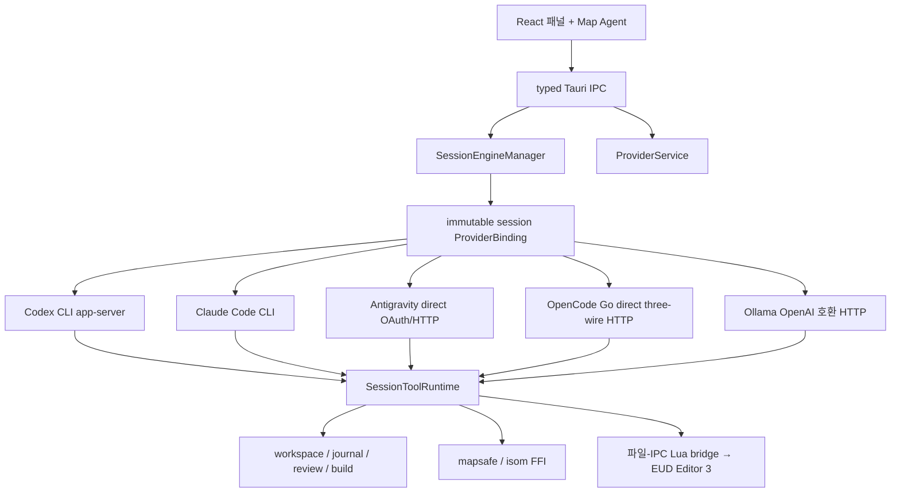
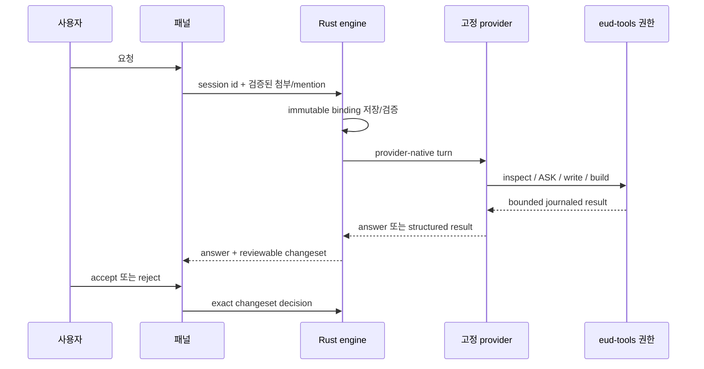

# eud-agent

> **EUD Editor 3**용 외부 AI 에이전트 — 자연어 지시를
> [epScript](https://github.com/armoha/euddraft)(eps) 코드로 바꿔 에디터에 곧바로 적용합니다.

[English](./README.md) · [한국어](./README.ko.md)

`eud-agent`는 EUD Editor 3(스타크래프트 EUD 맵 에디터) 옆에서 동작하는 독립 실행형
**Tauri 2 + Rust** 데스크톱 애플리케이션입니다. 원하는 동작을 자연어로 설명하면, 에이전트가
관련 레퍼런스를 검색하고 epScript를 생성한 뒤 diff를 보여주고, 사용자가 승인하면 얇은
파일-IPC 브리지를 통해 에디터에 적용합니다. 에디터 자체는 서드파티 도구(Buizz)이며 **절대
수정하지 않습니다** — 통합은 오직 파일 복사로만 이루어집니다.

---

## 주요 기능

- **자연어 → epScript.** 원하는 효과를 설명하면 바로 적용 가능한 eps 코드를 생성합니다.
- **인-프로세스 RAG.** [fastembed](https://github.com/Anush008/fastembed-rs)(bge-m3) +
  브루트포스 코사인으로 자체 코퍼스를 로컬 시맨틱 검색합니다 — 외부 벡터 DB 없음, 쿼리 시
  네트워크 없음.
- **근거 게이트 & 인용.** 문서 검색이 한 번이라도 실행되기 전에는 변경 동작이 차단되며,
  제안·답변에는 `[제목](url)` 형식의 출처 링크가 붙습니다(절대 날조하지 않음).
- **제1원칙 안전 레일.** 알려진 크래시 / EUD 오류 / 프리즈 원인이 프롬프트에 인코딩되어 있고
  도구 계층에서 기계적으로도 강제되므로, 스타크래프트나 에디터를 크래시시킬 변경은 거부합니다.
- **확신을 갖고 적용.** Monaco 편집 화면, 서버에서 렌더링한 unified diff, 메모리 전용
  `SET` / `NEWEPS`(저장은 사용자가 직접 제어).
- **FFI로 네이티브 맵 엔진.** C++ 맵 엔진(`isom`)을 벤더링하여 정적 링크하며, 맵 쓰기는 Rust
  안전 레일(백업, 잠금 탐지, 저널/롤백)을 거칩니다.
- **자체 업데이트.** minisign 서명된 NSIS 인스톨러 + 내장 업데이터. 브리지 Lua는 매 실행 시
  에디터로 재동기화됩니다.

---

## 요구 사항

| 요구 사항 | 비고 |
|---|---|
| **Windows** | Windows 10/11. 에디터가 Windows 전용이며, 앱은 MSVC 타깃입니다. |
| **EUD Editor 3** | 이 에이전트가 통합되는 서드파티 에디터입니다. |
| **WebView2 런타임** | 시스템 Evergreen 런타임. 인스톨러가 부트스트랩할 수 있습니다. |
| **AI 제공자 연결 1개** | 첫 실행에서 Codex(ChatGPT/API 키), Claude Code 구독, 실험적 Antigravity Google OAuth, OpenCode Go API 키, Ollama OpenAI 호환 endpoint 중 하나를 선택합니다. |

첫 실행은 bge-m3/RAG 자산만 검증·다운로드한 뒤 기본 제공자 하나를 요구합니다. Codex와
Claude Code는 앱 전용 프로필에 설치할 수 있으므로 전역 CLI는 필수 요구 사항이 아닙니다.

### 소스 빌드를 위한 추가 요구 사항

| 요구 사항 | 비고 |
|---|---|
| **Rust** | ≥ 1.77.2 (MSVC 타깃), [rustup](https://rustup.rs) 사용. |
| **Tauri CLI** | `cargo install tauri-cli`. |
| **Node.js + npm** | React 패널(`panel/`) 빌드용. |
| **MSVC 툴체인** | 정적 링크되는 `isom` C++ 엔진(MSBuild) 빌드에 필요합니다. |

Antigravity build에는 배포 소유 OAuth credential을 compile time에
`EUD_ANTIGRAVITY_OAUTH_CLIENT_ID`와 `EUD_ANTIGRAVITY_OAUTH_CLIENT_SECRET`으로 주입해야 합니다.
release workflow는 같은 이름의 GitHub Actions repository variable과 secret을 읽습니다. OAuth
client credential은 커밋하지 않으며, 사용자 token은 계속 Windows Credential Manager에만 격리됩니다.

---


## 설치 (사용자)

1. [GitHub Releases](https://github.com/raravel/eud-agent/releases)에서 최신
   `eud-agent_*-setup.exe`를 내려받습니다.
2. 사용자 단위 인스톨러를 실행합니다.
3. **eud-agent**를 실행하고 에디터 폴더, 에셋, 기본 제공자, 선택 제공자 인증/모델의 네
   단계를 완료합니다. 나머지 네 제공자는 연결하지 않아도 됩니다.

앱은 에디터의 생명주기와 독립적입니다. EUD Editor 3가 실행 중이 아니면, 브리지 하트비트가
나타날 때까지 패널에 *"editor not connected"*가 표시됩니다.

---

## 사용법

1. EUD Editor 3을 엽니다. eud-agent가 Lua 브리지를 자동 설치/갱신합니다.
2. 새 EPS 또는 Map 세션을 시작합니다. 첫 요청에서 현재 기본 제공자/모델이 고정됩니다.
3. 근거를 확인하고 eud-tools로 수정한 뒤 preflight/build와 changeset 승인·거절을
   수행합니다. 다섯 제공자는 같은 Rust 쓰기/검토 권한을 사용합니다.
4. **설정 → AI 제공자**에서 새 세션 기본값을 바꿀 수 있습니다. 기존 세션과 하네스
   retry는 생성 당시 제공자/모델을 유지하며, 제공자 변경에는 새 세션이 필요합니다.

- `/compact`는 고정된 제공자가 지원하는 네이티브 또는 direct-summary 압축을 사용합니다.
- 인증/quota/model/transport 실패 시 해당 제공자에서 중단하며 다른 제공자/모델로
  데이터를 무음 재전송하지 않습니다.
- Codex 전용 1M 컨텍스트 opt-in은 Codex 제공자 섹션에만 표시됩니다.

> 설정/생성 가능한 텍스트 타입은 **CUI / RawText 전용**입니다. GUI 파일은 읽기 전용이며, SCA는
> 폐기된 타입으로 절대 노출되지 않습니다.

---

## 아키텍처

`eud-agent`는 다섯 개의 닫힌 provider adapter를 가진 단일 Tauri/Rust 권한 경계입니다.
provider는 인증/catalog/대화/wire 변환만 소유하며 EUD 도구, 쓰기 lease, journal, review,
rollback, preflight, build, Map 후보 권한은 모두 공통 Rust runtime에 남습니다.



OMP/OpenCode runtime은 포함하지 않습니다. direct credential과 선택적 proxy API key는
Windows Credential Manager에 저장합니다. Ollama base URL은 새 세션 binding에 고정되며,
provider 장애가 다른 provider/model을 선택하지 않습니다.

### 런타임 흐름



부트/부트스트랩 흐름, 데이터 디렉터리 레이아웃, 파일-IPC 프로토콜, 전체 설계 결정 등 더 깊은
내용은 [`hivemind/docs/architecture.md`](./hivemind/docs/architecture.md)와
[`hivemind/docs/rules.md`](./hivemind/docs/rules.md)를 참고하세요.

---

## 레포지토리 구조

```
eud-agent/
├── hivemind/                       # 하니스 문서 + 작업 (architecture, rules, ...)
├── bridge/ZZZ_10_agent_bridge.lua  # 슬림 파일-IPC 도구 계층 (에디터 측)
├── src-tauri/                      # Tauri 2 Rust 앱
│   └── src/                        # provider service/driver/auth/transcript,
│                                   # engine/tools/workspace/journal/map/RAG,
│                                   # bridge I/O, config/bootstrap/security
├── crates/
│   ├── isom-sys/                   # FFI 바인딩 + build.rs (msbuild + link)
│   └── isom/                       # isom-sys 위 안전한 Rust 래퍼
├── native/isom/                    # 벤더링한 isom-poc C++ + C ABI 심
├── panel/                          # React 앱 (Tauri IPC 클라이언트)
├── ci/                             # RAG 인덱스 빌더 + 커밋된 코퍼스 (ci/corpus/*.jsonl)
├── tools/scraper/                  # Node/TS 코퍼스 스크레이퍼 (로컬)
└── scripts/                        # install_bridge.ps1, dev_run.ps1, release.ps1, ...
```

---

## 소스에서 빌드

```powershell
# 1. 패널 의존성 설치
cd panel; npm install; cd ..

# 2. 개발 모드 실행 (Rust 코어 + 앱 창에서 패널 핫리로드)
pwsh -NoProfile -File scripts\dev_run.ps1

# 3. 릴리스 빌드 (NSIS 인스톨러 + 업데이터 산출물)
cargo tauri build
```

`scripts\dev_run.ps1`은 Cargo/Tauri만 요구하며 provider 설치·인증은 앱이 담당합니다.
커밋된 `v*` 태그를 푸시하면 `.github/workflows/publish-app.yml`이 NSIS
설치 파일을 빌드·서명하고 업데이터용 `latest.json`을 게시합니다. 로컬 `tauri build`는
이를 생성하지 않으므로 `scripts\release.ps1`은 로컬 대체 릴리스 경로로 유지됩니다.

---

## 라이선스

`eud-agent`는 [MIT License](./LICENSE)로 배포됩니다.

이 프로젝트는 Buizz의 서드파티 도구인 **EUD Editor 3**와 통합되며, 이를 절대 수정하거나
재배포하지 않습니다. `native/isom/` 아래 벤더링된 C++ 맵 엔진을 비롯한 서드파티 구성요소는 각
원본 라이선스를 따릅니다.
