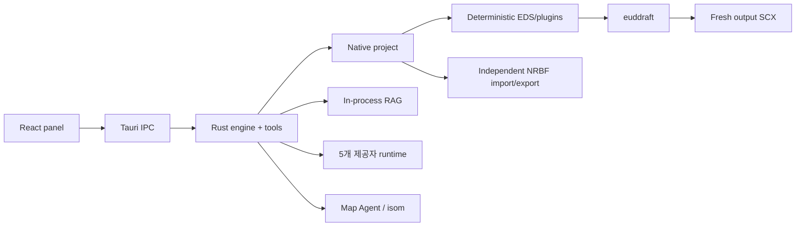

# eud-agent

> 스타크래프트 EUD 맵을 위한 Native AI 저작 도구 — canonical epScript/DAT 프로젝트, 검토 가능한 에이전트 변경, 직접 euddraft 빌드.

[English](./README.md)

`eud-agent`는 Tauri 2, Rust, React, TypeScript로 만든 Windows 데스크톱 앱입니다. 자연어로 맵 동작을 설명하면 에이전트가 실제 프로젝트와 맵을 읽고, 고정된 레퍼런스를 검색하고, typed tool로 epScript/DAT를 수정한 뒤 changeset 검토를 거쳐 euddraft로 결과 맵을 빌드합니다.

EUD Editor 3는 **runtime 의존성이 아닙니다**. 기존 `.e3s` 프로젝트는 독립 MS-NRBF 호환 계층으로 가져오고 내보낼 수 있습니다.

## 앱이 직접 소유하는 것

- versioned `project.json` manifest
- confined `src/**/*.eps` 소스 트리와 정확한 MainFile
- sparse standard DAT/XDAT/TBL/requirements/buttons JSON
- deterministic EDS/plugin 생성
- bounded euddraft 실행과 structured diagnostics
- semantic journal, 승인/거부, rollback, restart persistence
- in-process BGE-M3 RAG와 pinned epScript preflight
- SCX/CHK 조회와 안전한 Map Agent mutation
- Codex, Claude Code, Antigravity, OpenCode Go, Ollama 기반 multi-session 대화, plan, ASK, changeset review

## 요구 사항

| 요구 사항 | 설명 |
|---|---|
| Windows 10/11 x64 | MSVC Rust target, 시스템 WebView2 runtime |
| euddraft | 최초 설정에서 `euddraft.exe` 또는 `euddraft.py` 선택 |
| 원본 맵 | `.scx` 또는 `.scm` |
| AI 제공자 | Codex, Claude Code, Antigravity, OpenCode Go, Ollama 중 하나 이상 설정 |
| StarCraft data | 지형/렌더링 자동 탐지가 실패할 때 설정 |

EUD Editor는 선택 사항입니다. 내보낸 호환 E3S를 다시 열 때만 필요합니다.

## 최초 실행

1. **프로젝트**
   - 기존 Native 프로젝트 열기
   - SCX/SCM에서 빈 폴더에 새 프로젝트 만들기
   - 기존 E3S와 참조 맵을 빈 폴더로 가져오기
2. euddraft 선택
3. checksum으로 검증되는 RAG/model asset 준비
4. AI 제공자 선택 및 연결

설정 완료 뒤에도 **설정 → 프로젝트**에서 열기/만들기/가져오기/내보내기를 사용할 수 있습니다.

## Native 프로젝트 구조

```text
my-project/
├── project.json
├── src/
│   └── main.eps
├── dat/
│   ├── standard.json
│   ├── xdat.json
│   ├── tbl.json
│   ├── requirements.json
│   └── buttons.json
├── maps/
│   └── source.scx
├── plugins/
├── build/
└── compat/
    └── editor-project.e3s   # E3S import 프로젝트만
```

Manifest, EPS tree, sparse DAT JSON이 canonical입니다. EDS, generated Python/binary, output SCX, E3S는 build/compatibility artifact입니다.

## E3S 호환 범위

가져오기/내보내기가 지원하는 상태:

- CUI epScript tree와 MainFile
- source/output map 참조
- standard DAT와 XDAT
- TBL, requirements, button sets
- 지원되는 main settings와 ordered EDS plugins

GUIEps, GUIPy, RawText, ClassicTrigger-as-MainFile은 조용히 손실시키지 않고 명시적으로 거부합니다. Native-only 프로젝트는 정상적으로 빌드되지만, E3S 내보내기에는 가져올 때 보존한 compatibility base가 필요합니다.

제품 runtime은 `BinaryFormatter`를 실행하거나 Editor assembly를 로드하지 않습니다. 호환 acceptance에서만 원본 .NET runtime으로 export fixture deserialize를 독립 검증합니다.

## 개발/검증

```powershell
cargo check -p eud-agent --lib
cargo test -p eud-agent

npm --prefix panel ci
panel\node_modules\.bin\tsc.cmd -b panel\tsconfig.json
npm --prefix panel test -- --run
npm --prefix panel run build
```

실제 euddraft와 E3S 검증 절차는 [`hivemind/docs/verify.md`](./hivemind/docs/verify.md)에 있습니다.

## 구조



상세 계약: [`architecture.md`](./hivemind/docs/architecture.md), [`rules.md`](./hivemind/docs/rules.md), [`tech-stack.md`](./hivemind/docs/tech-stack.md).

## 서드파티 데이터

`native/eud-editor-compat` 리소스에는 오픈소스 EUD Editor의 data definition, offset, TBL baseline, helper source가 compatibility/generator 계약으로만 포함됩니다. 원본 라이선스를 함께 제공합니다. EUD Editor 실행 파일과 assembly는 재배포하지 않습니다.
