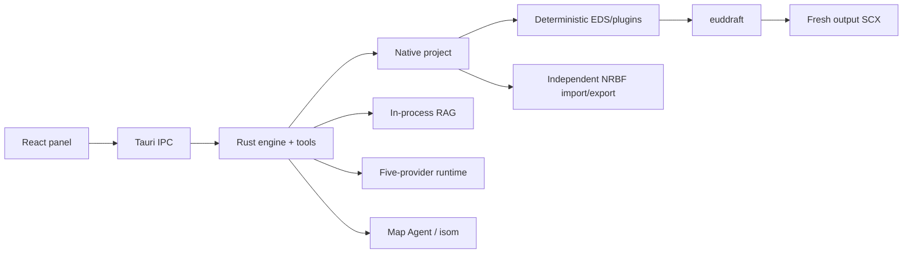

# eud-agent

> Native AI authoring for StarCraft EUD maps: canonical epScript/DAT projects, reviewable agent edits, and direct euddraft builds.

[한국어](./README.ko.md)

`eud-agent` is a standalone Windows desktop application built with Tauri 2, Rust, React, and TypeScript. Describe a map behavior in natural language; the agent reads the real project and map, retrieves pinned references, edits epScript or DAT through typed tools, shows a reviewable changeset, and builds the output map through euddraft.

EUD Editor 3 is **not** a runtime dependency. Existing `.e3s` projects can be imported and exported through an independent MS-NRBF compatibility layer.

## What it owns

- versioned `project.eap` manifest;
- confined `src/**/*.eps` and `src/**/*.py` source tree, ordered Python entrypoints, and exact EPS MainFile;
- sparse standard DAT, XDAT, TBL, requirement, and button JSON;
- deterministic EDS/plugin generation;
- direct bounded euddraft execution and structured diagnostics;
- semantic journal, accept/reject, rollback, and restart persistence;
- in-process BGE-M3 RAG and pinned epScript preflight;
- SCX/CHK map inspection and safe Map Agent mutations;
- multi-session Codex, Claude Code, Antigravity, OpenCode Go, and Ollama conversations, plans, ASK, and changeset review.

## Requirements

| Requirement | Notes |
|---|---|
| Windows 10/11 x64 | MSVC Rust target; system WebView2 runtime |
| euddraft | Latest release downloads automatically during setup; an existing folder, `euddraft.exe`, or `euddraft.py` can also be selected |
| Source map | `.scx` or `.scm` |
| AI provider | Codex, Claude Code, Antigravity, OpenCode Go, or Ollama; configure at least one during setup |
| StarCraft data | Needed by terrain/rendering features; configure when auto-detection is insufficient |

EUD Editor is optional and needed only if you choose to open an exported compatibility E3S.

## Starting a project

Every ordinary launch shows the project launcher instead of automatically reopening the saved project.

- Up to 20 successfully opened projects appear newest-first, with name/path search and list-only removal. Removing a recent entry never deletes project files.
- Open an `.eap` file or select a Native project folder.
- Create from SCX/SCM or import a legacy E3S and its referenced map into an empty folder.
- The Windows installer associates `.eap` with a dedicated project icon. Double-click the `.eap` file to start directly in that project; if the app is already running, the request goes to its existing window. Other JSON file associations are unchanged.
- Use **Switch project** in the workspace header. Builds, active agent/review work, and open map-work windows block switching. Forwarded file requests remain pending and can be explicitly retried after the work finishes.

## First-time environment setup

1. Select or create a project.
2. Let the app download the latest [armoha/euddraft release](https://github.com/armoha/euddraft), or select an existing euddraft folder/file. Downloads are SHA-256 verified and installed under `%LOCALAPPDATA%/eud-agent/euddraft`; an explicitly selected local path takes precedence.
3. Let the app verify/download checksummed RAG/model assets.
4. Select and connect an AI provider.

Already prepared environment settings are reused. Project open/create/import/export also remains available under **Settings → Project**.

## Native project layout

```text
my-project/
├── project.eap             # JSON manifest containing project settings directly
├── src/
│   ├── main.eps
│   └── bootstrap.py         # optional direct eudplib source
├── dat/
│   ├── standard.json
│   ├── xdat.json
│   ├── tbl.json
│   ├── requirements.json
│   └── buttons.json
├── maps/
│   └── source.scx
├── plugins/
├── build/
└── compat/
    └── editor-project.e3s   # imported projects only
```

The schema-v2 manifest, EPS/Python source tree, and sparse DAT JSON are canonical. EDS, generated build helpers/binaries, output SCX, and E3S are generated compatibility/build artifacts.

`.eap` means **EUD Agent Project**. It is the JSON manifest itself, containing the project name, map paths, MainFile, settings, plugins, ordered Python entrypoints, exact PyPI dependency declarations, their resolved wheel lock, and E3S compatibility metadata—not a pointer file. A project folder must contain exactly one `.eap`; renaming it preserves opening and subsequent saves. Sources, DAT, and maps remain separate files, so move the entire project folder together.

Open an old `project.json` or `.eudproj` through the legacy file-picker filter, or open its project folder, to migrate. After validation, the app atomically renames `project.json` to `project.eap` and removes the old descriptors. Coexisting old/new authorities or multiple `.eap` files are rejected rather than overwritten.

## E3S compatibility

Import/export supports:

- CUI epScript tree and MainFile;
- source/output map references;
- standard DAT and XDAT;
- TBL, requirements, and button sets;
- supported main settings and ordered EDS plugins.

GUIEps, GUIPy, RawText, and ClassicTrigger-as-MainFile are rejected explicitly instead of being silently lost. Native EPS-only projects build normally but require an imported compatibility base before E3S export. A project containing any direct Python source, entrypoint, dependency, or lock is rejected for E3S export because Editor cannot represent it losslessly.

## Direct eudplib Python

epScript remains the primary authoring language. Project-local `src/**/*.py` is first-class, fully trusted code: only manifest-selected entrypoints execute, in order, before the EPS MainFile in one frozen `euddraft.exe` process. All Python sources still participate in revision, snapshots, search, review, and rollback.

Use dependency preparation followed by `python_dependencies_set` to commit a complete exact `name==version` PyPI list. eud-agent provisions pinned `uv` 0.11.3, records every resolved wheel URL/tag/SHA-256 in `project.eap`, probes the frozen runtime, and reuses only verified `%LOCALAPPDATA%/eud-agent/python-*` caches offline. `build_run` never changes dependency state.

E3S import also copies this machine's harness associated with the **original E3S full path**: accepted documents, approved plans, project memory, the DAT wiki, and EPS/Map conversation history. Historical quoted memory/session keys are recognized. Conversations receive fresh native session IDs while retaining their names, provider/model settings, timestamps, and logs; old execution connections, pending reviews, task state, and map candidates are not resumed. Originals remain unchanged. Ambiguous bindings, unavailable files, corruption, and occupied destinations are reported as optional omissions instead of overwriting data or aborting every recoverable item. Harness data is not embedded in E3S, so the file alone cannot restore another computer's harness.

Historical accepted root-level and non-Markdown text documents are preserved; deletion tombstones never recreate files. The import review lists each unavailable item's scope, path, and reason, including missing ordinary documents/plans, memory/wiki failures, and session conflicts. **검토한 N개를 제외하고 가져오기** authorizes only the currently reviewed omissions; changed issues require renewed consent. Recheck grants no exclusions. Healthy remaining data is imported without changing originals. Core E3S/map/destination failures and failed rollback remain errors with accessible details.

Durable harness data now travels with the project: `.eud-agent/workspace/` holds accepted documents, `.eud-agent/state/` holds trusted approval metadata and the migration receipt, and `.eud-agent/memory/` holds memory and `wiki/ledger.json`. Existing AppData data is copied only when its project binding is unambiguous; originals are retained and existing local files win. The stored workspace ID survives moving the project folder. A completed migration is not replayed when a local file is later deleted. Conversations, running jobs, session workspaces, credentials, and caches remain machine-local AppData, not inside the project.

The product never executes `BinaryFormatter` or loads Editor assemblies. Real compatibility acceptance independently deserializes exported fixtures with the original .NET runtime.

## Development

```powershell
# Rust
cargo check -p eud-agent --lib
cargo test -p eud-agent

# Panel
npm --prefix panel ci
panel\node_modules\.bin\tsc.cmd -b panel\tsconfig.json
npm --prefix panel test -- --run
npm --prefix panel run build
```

Real build and E3S acceptance commands are documented in [`hivemind/docs/verify.md`](./hivemind/docs/verify.md).

### macOS (local development)

Windows is the release platform. macOS (Apple silicon) builds and runs for development with Xcode command-line tools, Rust, Node.js/npm, and the Tauri CLI:

```sh
cargo install tauri-cli --locked
(cd panel && npm ci)
scripts/dev_run.sh                 # cargo tauri dev; merges src-tauri/tauri.macos.conf.json
cargo test -p eud-agent
```

Platform differences on macOS:

- euddraft: select the extensionless `euddraft` launcher from the official `euddraft<version>-macos.zip` (or `euddraft.py`); the in-app update downloads the `-macos` release asset.
- App data: `~/Library/Application Support/eud-agent` (Roaming equivalent) and `~/Library/Caches/eud-agent` (LocalAppData equivalent).
- Provider API keys live in the login Keychain; provider profiles use owner-only (0700/0600) permissions.
- Codex resolves from the executable override or `PATH` (no managed download); Claude Code installs the signed `darwin` build.
- Windows-only: managed FFmpeg (sound import), managed uv / Python package dependencies, runtime trace tests (StarCraft x86 client), and the SCMDraft no-share map-lock probe.

## Architecture



See [`hivemind/docs/architecture.md`](./hivemind/docs/architecture.md), [`rules.md`](./hivemind/docs/rules.md), and [`tech-stack.md`](./hivemind/docs/tech-stack.md).

## Third-party data

The bundled `native/eud-editor-compat` resource contains open-source EUD Editor data definitions, offsets, TBL baselines, and helper source used solely as a compatibility/generation contract. Its original license is included. EUD Editor executables and assemblies are not redistributed.
