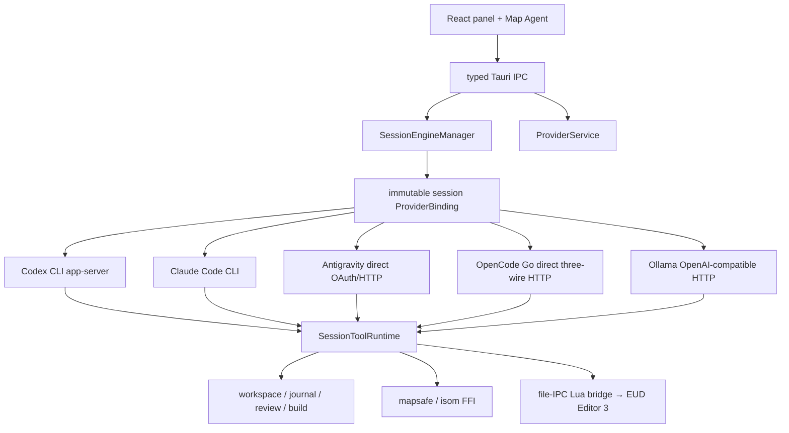
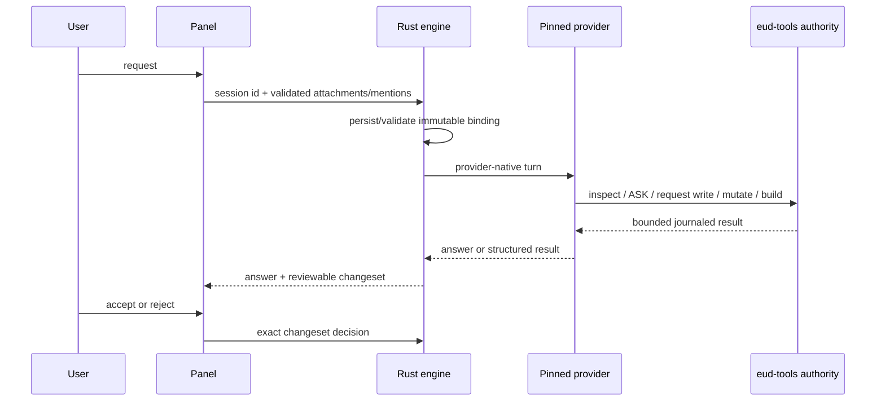

# eud-agent

> External AI agent for **EUD Editor 3** — turn natural-language instructions into
> [epScript](https://github.com/armoha/euddraft) (eps) code and apply it straight into the editor.

[English](./README.md) · [한국어](./README.ko.md)

`eud-agent` is a standalone **Tauri 2 + Rust** desktop application that sits next to
EUD Editor 3 (a StarCraft EUD map editor). You describe what you want in plain language;
the agent retrieves relevant references, generates epScript, shows you a diff, and — on your
approval — applies it to the editor through a thin file-IPC bridge. The editor itself is a
third-party tool (Buizz) and is **never modified** — integration is file copies only.

---

## Features

- **Natural-language → epScript.** Describe an effect; get ready-to-apply eps code.
- **In-process RAG.** Local semantic search over an in-house corpus using
  [fastembed](https://github.com/Anush008/fastembed-rs) (bge-m3) with brute-force cosine —
  no external vector DB, no network at query time.
- **Evidence gate & citations.** Mutating actions are blocked until a documentation search
  has run; proposals and answers carry `[title](url)` source links (never fabricated).
- **First-principles safety rails.** Known crash / EUD-error / freeze causes are encoded in
  the prompt *and* mechanically enforced in the tool layer, so the agent refuses changes that
  would crash StarCraft or the editor.
- **Apply with confidence.** Monaco edit surface, a server-rendered unified diff, and
  memory-only `SET` / `NEWEPS` (you stay in control of saving).
- **Native map engine via FFI.** The C++ map engine (`isom`) is vendored and statically
  linked; map writes go through Rust safety rails (backup, lock probe, journal/rollback).
- **Self-updating.** Signed (minisign) NSIS installer with a built-in updater; the bridge
  Lua re-syncs into the editor on every launch.

---

## Requirements

| Requirement | Notes |
|---|---|
| **Windows** | Windows 10/11. The editor is Windows-only; the app targets MSVC. |
| **EUD Editor 3** | The third-party editor this agent integrates with. |
| **WebView2 runtime** | System Evergreen runtime; the installer can bootstrap it. |
| **One AI provider connection** | Choose Codex (ChatGPT/API key), Claude Code subscription, experimental Antigravity Google OAuth, OpenCode Go API key, or an Ollama OpenAI-compatible endpoint during first run. |

First-run setup downloads and verifies only bge-m3/RAG assets, then requires one default provider.
Codex and Claude Code can be installed in app-owned profiles from the provider card; no global CLI
is an unconditional prerequisite.

### Additional requirements for building from source

| Requirement | Notes |
|---|---|
| **Rust** | ≥ 1.77.2 (MSVC target), via [rustup](https://rustup.rs). |
| **Tauri CLI** | `cargo install tauri-cli`. |
| **Node.js + npm** | For the React panel (`panel/`). |
| **MSVC toolchain** | Required to build the statically-linked `isom` C++ engine (MSBuild). |

Antigravity builds require deployment-owned OAuth credentials at compile time through
`EUD_ANTIGRAVITY_OAUTH_CLIENT_ID` and `EUD_ANTIGRAVITY_OAUTH_CLIENT_SECRET`. The release workflow
reads them from the matching GitHub Actions repository variable and secret. OAuth client
credentials are never committed; user tokens remain isolated in Windows Credential Manager.

---

## Installation (users)

1. Download the latest `eud-agent_*-setup.exe` from
   [GitHub Releases](https://github.com/raravel/eud-agent/releases).
2. Run the per-user installer.
3. Launch **eud-agent** and complete the four setup steps: editor folder, assets, default provider,
   and selected-provider authentication/model. The other four providers are optional.

The app is independent of the editor's lifecycle: if EUD Editor 3 isn't running, the panel
shows *"editor not connected"* until the bridge heartbeat appears.

---

## Usage

1. Open EUD Editor 3; eud-agent installs/refreshes its Lua bridge automatically.
2. Start a new EPS or Map session. The current default provider/model is pinned on first request.
3. Ask, inspect evidence, edit through eud-tools, run preflight/build, and accept or reject the
   journaled changeset. Every provider uses the same Rust write/review authority.
4. Change global defaults under **Settings → AI Providers**; existing sessions and harness retries
   keep their original provider/model. Use a new session to change providers.

- `/compact` uses the pinned provider's supported native or direct-summary compaction path.
- Provider/auth/quota/model failures stop on that provider. eud-agent never silently resends data
  to another provider or model.
- Codex-only 1M context opt-in remains under its provider section.

> Settable/creatable text types are **CUI / RawText only**; GUI files are read-only and SCA is
> a defunct type that is never exposed.

---

## Architecture

`eud-agent` is one Tauri/Rust authority with five closed provider adapters. Providers own only
auth/catalog/conversation/wire translation; every EUD tool, write lease, journal, review,
rollback, preflight, build, and Map candidate remains in the shared Rust runtime.



No OMP/OpenCode runtime is embedded. Direct and optional proxy credentials stay in Windows
Credential Manager. Ollama base URLs are pinned into new session bindings; provider failure never
selects another provider/model.

### Runtime flow



For deeper detail (boot/bootstrap flow, data-directory layout, file-IPC protocol, and the full
set of design decisions), see [`hivemind/docs/architecture.md`](./hivemind/docs/architecture.md)
and [`hivemind/docs/rules.md`](./hivemind/docs/rules.md).

---

## Repository layout

```
eud-agent/
├── hivemind/                       # harness docs + tasks (architecture, rules, ...)
├── bridge/ZZZ_10_agent_bridge.lua  # slim file-IPC tool layer (editor side)
├── src-tauri/                      # Tauri 2 Rust app
│   └── src/                        # provider service/drivers/auth/transcripts,
│                                   # engine/tools/workspace/journal/map/RAG,
│                                   # bridge I/O, config/bootstrap/security
├── crates/
│   ├── isom-sys/                   # FFI bindings + build.rs (msbuild + link)
│   └── isom/                       # safe Rust wrapper over isom-sys
├── native/isom/                    # vendored isom-poc C++ + C ABI shim
├── panel/                          # React app (Tauri IPC client)
├── ci/                             # RAG index builder + committed corpus (ci/corpus/*.jsonl)
├── tools/scraper/                  # Node/TS corpus scraper (local)
└── scripts/                        # install_bridge.ps1, dev_run.ps1, release.ps1, ...
```

---

## Building from source

```powershell
# 1. Install the panel dependencies
cd panel; npm install; cd ..

# 2. Run in dev mode (Rust core + panel hot-reload in the app window)
pwsh -NoProfile -File scripts\dev_run.ps1

# 3. Produce a release build (NSIS installer + updater artifacts)
cargo tauri build
```

`scripts\dev_run.ps1` requires Cargo/Tauri only; provider installation and authentication are
owned by the app. Pushing a committed `v*` tag runs `.github/workflows/publish-app.yml`,
which builds and signs the NSIS installer and publishes the updater `latest.json`.
`scripts\release.ps1` remains the local fallback because a local `tauri build` does not emit it.

---

## License

`eud-agent` is released under the [MIT License](./LICENSE).

It integrates with **EUD Editor 3**, a third-party tool by Buizz that is never modified or
redistributed. The vendored C++ map engine under `native/isom/` and other third-party
components retain their respective upstream licenses.
