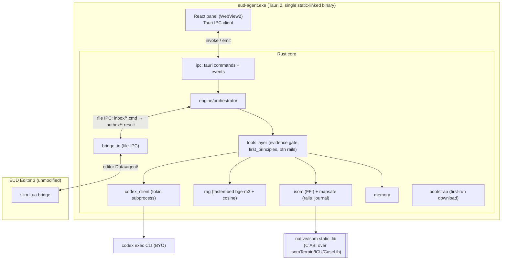
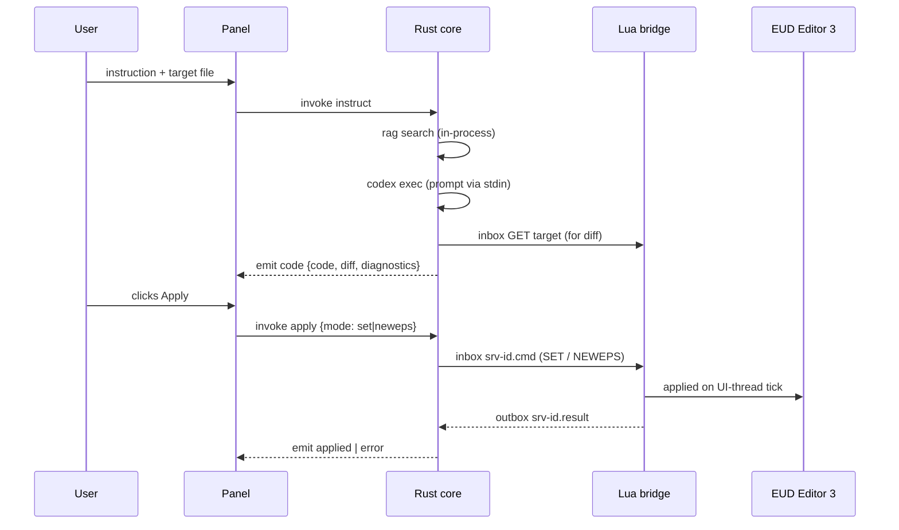

# eud-agent

> External AI agent for **EUD Editor 3** — turn natural-language instructions into
> [epScript](https://github.com/armoha/euddraft) (eps) code and apply it straight into the editor.

[English](./README.md) · [한국어](./README.ko.md)

`eud-agent` is a standalone **Tauri 2 + Rust** desktop application that sits next to
EUD Editor 3 (a StarCraft EUD map editor). You describe what you want in plain language;
the agent retrieves relevant references, generates epScript, shows you a diff, and — on your
approval — applies it to the editor through a thin file-IPC bridge. The editor itself is a
third-party tool (Buizz) and is **never modified** — integration is file copies only.

---

## Features

- **Natural-language → epScript.** Describe an effect; get ready-to-apply eps code.
- **In-process RAG.** Local semantic search over an in-house corpus using
  [fastembed](https://github.com/Anush008/fastembed-rs) (bge-m3) with brute-force cosine —
  no external vector DB, no network at query time.
- **Evidence gate & citations.** Mutating actions are blocked until a documentation search
  has run; proposals and answers carry `[title](url)` source links (never fabricated).
- **First-principles safety rails.** Known crash / EUD-error / freeze causes are encoded in
  the prompt *and* mechanically enforced in the tool layer, so the agent refuses changes that
  would crash StarCraft or the editor.
- **Apply with confidence.** Monaco edit surface, a server-rendered unified diff, and
  memory-only `SET` / `NEWEPS` (you stay in control of saving).
- **Native map engine via FFI.** The C++ map engine (`isom`) is vendored and statically
  linked; map writes go through Rust safety rails (backup, lock probe, journal/rollback).
- **Self-updating.** Signed (minisign) NSIS installer with a built-in updater; the bridge
  Lua re-syncs into the editor on every launch.

---

## Requirements

| Requirement | Notes |
|---|---|
| **Windows** | Windows 10/11. The editor is Windows-only; the app targets MSVC. |
| **EUD Editor 3** | The third-party editor this agent integrates with. |
| **WebView2 runtime** | System Evergreen runtime; the installer can bootstrap it. |
| **codex CLI** | The LLM CLI the Rust core spawns. Install with `npm install -g @openai/codex`, or set `CODEX_CMD` to a full path. |

First-run bootstrap downloads the bge-m3 ONNX model (from HuggingFace) and the RAG index
(from a GitHub Release); every asset is sha256-verified and placed atomically.

### Additional requirements for building from source

| Requirement | Notes |
|---|---|
| **Rust** | ≥ 1.77.2 (MSVC target), via [rustup](https://rustup.rs). |
| **Tauri CLI** | `cargo install tauri-cli`. |
| **Node.js + npm** | For the React panel (`panel/`). |
| **MSVC toolchain** | Required to build the statically-linked `isom` C++ engine (MSBuild). |

---

## Installation (users)

1. Download the latest `eud-agent_*-setup.exe` from the
   [GitHub Releases](https://github.com/raravel/eud-agent/releases) page.
2. Run the installer (per-user install — no admin rights required).
3. Install the codex CLI if you don't have it: `npm install -g @openai/codex`.
4. Launch **eud-agent**. On first run it sets up the model and RAG index, then shows the panel.

The app is independent of the editor's lifecycle: if EUD Editor 3 isn't running, the panel
shows *"editor not connected"* until the bridge heartbeat appears.

---

## Usage

1. Open EUD Editor 3 (the agent installs/refreshes its Lua bridge automatically on launch).
2. In the panel, enter an **instruction** and pick a **target file**.
3. The agent runs RAG search → codex generation, then shows **code + diff + diagnostics**.
4. Review the diff and click **Apply** (`set` to overwrite, `neweps` to create a new eps).
5. The change is applied in editor memory on the next UI-thread tick — **you save in the editor.**

- Enter `/compact` by itself to run Codex's native conversation compaction. Codex also
  compacts automatically when the active model reaches its configured token threshold.
- **Settings → Codex** enables the 1M context override per model. The choice is persisted in
  `%appdata%\eud-agent\config.json`; unsupported models keep their Codex-reported default
  window and show one warning after the next usage update.

> Settable/creatable text types are **CUI / RawText only**; GUI files are read-only and SCA is
> a defunct type that is never exposed.

---

## Architecture

`eud-agent` is a single static-linked binary: a React panel (WebView2 content) over a Rust
core, talking to the unmodified editor through a slim file-IPC Lua bridge, with the C++ map
engine linked in via FFI.



Dependency direction: `panel → core → {isom .lib, editor bridge, codex, data dir}`. Heavy work
(LLM, RAG, orchestration, map binary I/O) stays in Rust/C++; the Lua bridge stays a thin
file-IPC tool layer and never calls back into the app.

### Runtime flow (instruct, then apply)



For deeper detail (boot/bootstrap flow, data-directory layout, file-IPC protocol, and the full
set of design decisions), see [`hivemind/docs/architecture.md`](./hivemind/docs/architecture.md)
and [`hivemind/docs/rules.md`](./hivemind/docs/rules.md).

---

## Repository layout

```
eud-agent/
├── hivemind/                       # harness docs + tasks (architecture, rules, ...)
├── bridge/ZZZ_10_agent_bridge.lua  # slim file-IPC tool layer (editor side)
├── src-tauri/                      # Tauri 2 Rust app
│   └── src/                        # ipc, engine, tools, codex_client, rag,
│                                   # isom (FFI), mapsafe, bridge_io, memory,
│                                   # config, bootstrap, chk
├── crates/
│   ├── isom-sys/                   # FFI bindings + build.rs (msbuild + link)
│   └── isom/                       # safe Rust wrapper over isom-sys
├── native/isom/                    # vendored isom-poc C++ + C ABI shim
├── panel/                          # React app (Tauri IPC client)
├── ci/                             # RAG index builder + committed corpus (ci/corpus/*.jsonl)
├── tools/scraper/                  # Node/TS corpus scraper (local)
└── scripts/                        # install_bridge.ps1, dev_run.ps1, release.ps1, ...
```

---

## Building from source

```powershell
# 1. Install the panel dependencies
cd panel; npm install; cd ..

# 2. Run in dev mode (Rust core + panel hot-reload in the app window)
pwsh -NoProfile -File scripts\dev_run.ps1

# 3. Produce a release build (NSIS installer + updater artifacts)
cargo tauri build
```

`scripts\dev_run.ps1` checks prerequisites (codex CLI, cargo) before launching
`cargo tauri dev`. Pushing a committed `v*` tag runs `.github/workflows/publish-app.yml`,
which builds and signs the NSIS installer and publishes the updater `latest.json`.
`scripts\release.ps1` remains the local fallback because a local `tauri build` does not emit it.

---

## License

`eud-agent` is released under the [MIT License](./LICENSE).

It integrates with **EUD Editor 3**, a third-party tool by Buizz that is never modified or
redistributed. The vendored C++ map engine under `native/isom/` and other third-party
components retain their respective upstream licenses.
