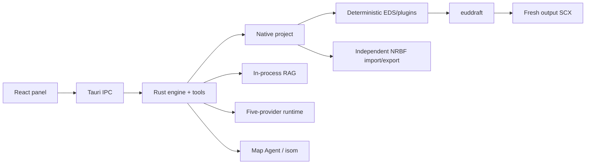

# eud-agent

> Native AI authoring for StarCraft EUD maps: canonical epScript/DAT projects, reviewable agent edits, and direct euddraft builds.

[한국어](./README.ko.md)

`eud-agent` is a standalone Windows desktop application built with Tauri 2, Rust, React, and TypeScript. Describe a map behavior in natural language; the agent reads the real project and map, retrieves pinned references, edits epScript or DAT through typed tools, shows a reviewable changeset, and builds the output map through euddraft.

EUD Editor 3 is **not** a runtime dependency. Existing `.e3s` projects can be imported and exported through an independent MS-NRBF compatibility layer.

## What it owns

- versioned `project.json` manifest;
- confined `src/**/*.eps` source tree and exact MainFile;
- sparse standard DAT, XDAT, TBL, requirement, and button JSON;
- deterministic EDS/plugin generation;
- direct bounded euddraft execution and structured diagnostics;
- semantic journal, accept/reject, rollback, and restart persistence;
- in-process BGE-M3 RAG and pinned epScript preflight;
- SCX/CHK map inspection and safe Map Agent mutations;
- multi-session Codex, Claude Code, Antigravity, OpenCode Go, and Ollama conversations, plans, ASK, and changeset review.

## Requirements

| Requirement | Notes |
|---|---|
| Windows 10/11 x64 | MSVC Rust target; system WebView2 runtime |
| euddraft | Select `euddraft.exe` or `euddraft.py` during setup |
| Source map | `.scx` or `.scm` |
| AI provider | Codex, Claude Code, Antigravity, OpenCode Go, or Ollama; configure at least one during setup |
| StarCraft data | Needed by terrain/rendering features; configure when auto-detection is insufficient |

EUD Editor is optional and needed only if you choose to open an exported compatibility E3S.

## First run

1. **Project**
   - open an existing Native project;
   - create a new project from SCX/SCM in an empty folder;
   - import a legacy E3S and its referenced map in an empty folder.
2. Select euddraft.
3. Let the app verify/download checksummed RAG/model assets.
4. Select and connect an AI provider.

Project open/create/import/export remains available under **Settings → Project**.

## Native project layout

```text
my-project/
├── project.json
├── src/
│   └── main.eps
├── dat/
│   ├── standard.json
│   ├── xdat.json
│   ├── tbl.json
│   ├── requirements.json
│   └── buttons.json
├── maps/
│   └── source.scx
├── plugins/
├── build/
└── compat/
    └── editor-project.e3s   # imported projects only
```

The manifest, source tree, and sparse DAT JSON are canonical. EDS, generated Python/binaries, output SCX, and E3S are generated compatibility/build artifacts.

## E3S compatibility

Import/export supports:

- CUI epScript tree and MainFile;
- source/output map references;
- standard DAT and XDAT;
- TBL, requirements, and button sets;
- supported main settings and ordered EDS plugins.

GUIEps, GUIPy, RawText, and ClassicTrigger-as-MainFile are rejected explicitly instead of being silently lost. Native-only projects build normally but require an imported compatibility base before E3S export.

The product never executes `BinaryFormatter` or loads Editor assemblies. Real compatibility acceptance independently deserializes exported fixtures with the original .NET runtime.

## Development

```powershell
# Rust
cargo check -p eud-agent --lib
cargo test -p eud-agent

# Panel
npm --prefix panel ci
panel\node_modules\.bin\tsc.cmd -b panel\tsconfig.json
npm --prefix panel test -- --run
npm --prefix panel run build
```

Real build and E3S acceptance commands are documented in [`hivemind/docs/verify.md`](./hivemind/docs/verify.md).

## Architecture



See [`hivemind/docs/architecture.md`](./hivemind/docs/architecture.md), [`rules.md`](./hivemind/docs/rules.md), and [`tech-stack.md`](./hivemind/docs/tech-stack.md).

## Third-party data

The bundled `native/eud-editor-compat` resource contains open-source EUD Editor data definitions, offsets, TBL baselines, and helper source used solely as a compatibility/generation contract. Its original license is included. EUD Editor executables and assemblies are not redistributed.
