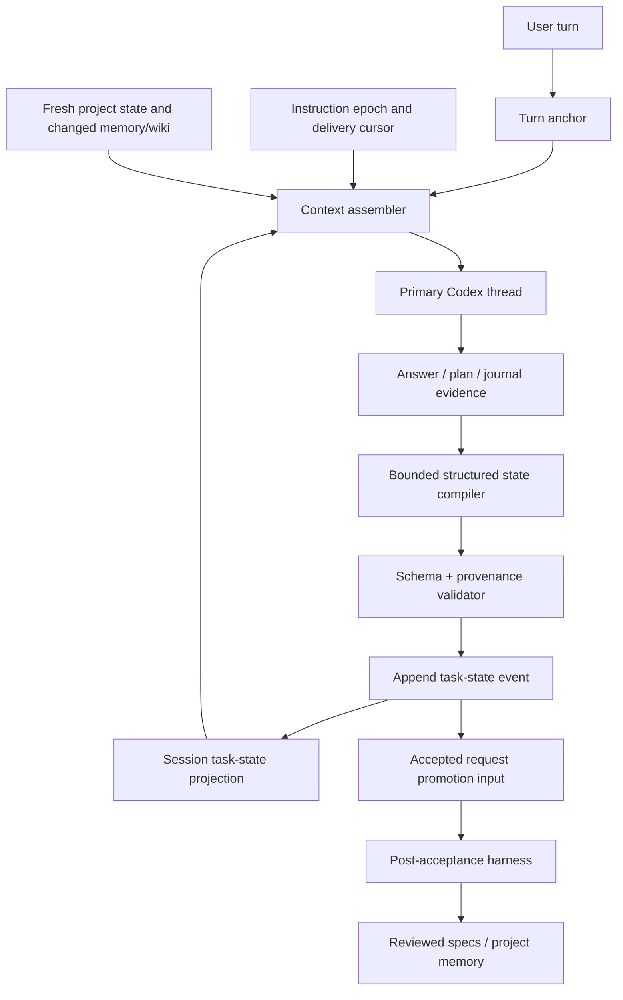

# 활성 작업 상태 및 컨텍스트 epoch 구현 계획

## 1. 목표

EUD Agent가 긴 Codex 스레드에서 원시 대화와 반복 삽입된 일반 지침에 의존하지 않고, 현재 작업의 목표·범위·대상 집합·합의·권위 문서·검증 기준을 세션 단위의 구조화된 상태로 유지하도록 한다.

이번 작업은 다음 두 변경을 하나의 기능으로 구현한다.

1. 기존 스레드에 정적 프롬프트 구조를 매 턴 다시 삽입하지 않고, 최초 baseline과 이후 delta를 instruction epoch로 관리한다.
2. 세션별 append-only 활성 작업 이벤트와 그 이벤트에서 파생한 현재 projection을 저장하고, 다음 턴의 모델 컨텍스트에 bounded snapshot/delta로 제공한다.

활성 작업 상태는 모델의 작업 기억을 보조하는 근거 포함 context일 뿐이다. 사용자 지시, 현재 프로젝트 파일, 저장된 멘션, write authority, journal, 빌드 결과를 대체하거나 새로운 쓰기 권한을 만들지 않는다.

## 2. 확정 결정

- 범위: 컨텍스트 baseline/delta 관리와 활성 작업 상태를 함께 구현한다.
- 상태 모델: append-only 이벤트 그래프와 파생 projection을 사용한다.
- 수명: 활성 상태는 세션에 한정한다. 승인된 안정 사실만 기존 post-acceptance harness를 통해 `specs/` 또는 project memory로 승격한다.
- 계획 파일: Hivemind task가 아닌 독립 계획 파일로 유지한다.
- 도구 계층: `eud-tools`에 최근 파일 자동 조회, 지시어별 특수 처리, 숨은 context 삽입을 추가하지 않는다.
- 호환성: 기존 세션 이름·panel log·Codex thread·pending review를 보존한다. 새 필드는 `serde(default)`로 추가하며 schema cutover나 기존 세션 초기화를 하지 않는다.

## 3. 현재 문제

### 3.1 반복 주입

`src-tauri/src/engine.rs::resume_turn_text_with_mentions()`는 활성 Codex thread의 후속 턴에도 다음 전체 구조를 매번 추가한다.

- `[project state]`
- `[project memory]`
- `[wiki facts]`
- `WORKSPACE_GUIDE`
- `EPS_IDIOMS`
- `EPS_PROJECT_ARCHITECTURE_GUIDE`
- `[reference context]`
- `[user message]`

같은 thread는 이전 입력을 이미 보유하므로 정적 지침과 변경되지 않은 동적 섹션이 턴마다 누적된다. 컨텍스트 창을 초과하지 않아도 관련 사실의 상대적 중요도가 낮아지고, 현재 소스의 가장 쉬운 해석에 앵커링되기 쉽다.

### 3.2 세션 저장과 작업 상태의 분리 부재

현재 `SessionRecord`는 `thread_id`, pending request ids, context usage, opaque `panel_log`만 저장한다. 다음 정보는 구조화되어 있지 않다.

- 현재 작업 주제와 목표
- 사용자가 지칭한 대상 집합과 정확한 멤버
- 합의되었거나 제안 중인 제약과 결정
- 권위 문서와 구현 소유 파일
- blocker와 미완료 acceptance criterion
- 각 사실의 사용자 턴·계획·문서·journal provenance

따라서 모델이 매 턴 원시 대화에서 이 정보를 다시 찾고 해석해야 한다.

### 3.3 rewind 및 승인 경계

메시지 편집은 panel log prefix로 대화를 되감고 새 Codex thread를 시작한다. 단일 최신 snapshot만 저장하면 되감기 이전의 의미 상태를 복원할 수 없다. 또한 foreground에서 추론된 사실을 바로 project memory에 기록하면 미승인 상태가 프로젝트 권위로 승격된다.

## 4. 비목표

- 모델의 모든 대화를 지식 그래프로 변환하지 않는다.
- 활성 상태를 map mention 또는 write authority로 사용하지 않는다.
- `search_docs`, RAG corpus, eud-tools registry에 프로젝트별 특수 규칙을 추가하지 않는다.
- project memory의 안정 사실 정책을 확장하지 않는다.
- Codex의 provider-native thread history나 compaction 구현을 교체하지 않는다.
- 활성 상태를 사용자가 직접 편집하는 UI를 이번 범위에 추가하지 않는다.
- 서로 다른 세션이 하나의 mutable 활성 작업 상태를 공유하지 않는다.

## 5. 목표 구조



책임은 다음처럼 분리한다.

- `context_state`: baseline fingerprint, instruction epoch, 동적 섹션 hash, model-facing delivery cursor, cold/resume/delta prompt 조립
- `task_state`: 이벤트·projection 타입, reducer, branch/rewind, bounds, provenance 검증, model-facing 렌더링
- `engine`: 턴 lifecycle 조정, compiler 실행, 성공한 전송 revision 커밋, harness 연계
- `session`: 원자적 저장과 복원
- `harness`: 승인된 state candidate를 기존 문서·memory 승격 입력으로만 사용
- `panel`: 안정적인 turn anchor 생성·보존·rewind 전달

## 6. 데이터 모델

### 6.1 세션 필드

`SessionRecord`에 다음 필드를 `serde(default)`로 추가한다.

```rust
pub struct SessionRecord {
    // existing fields
    pub context_state: SessionContextState,
    pub task_state: SessionTaskState,
}
```

전역 `SCHEMA_VERSION`을 올려 기존 세션을 파괴적으로 reset하지 않는다. 각 새 구조체가 자체 `schema_version`을 가지며, 필드가 없는 기존 세션은 빈 기본값으로 읽는다.

### 6.2 컨텍스트 상태

```rust
pub struct SessionContextState {
    pub schema_version: u32,
    pub instruction_epoch: u64,
    pub static_prompt_fingerprint: String,
    pub delivered: ModelContextCursor,
}

pub struct ModelContextCursor {
    pub thread_id: Option<String>,
    pub epoch: u64,
    pub memory_sha256: Option<String>,
    pub wiki_sha256: Option<String>,
    pub task_revision: u64,
}
```

규칙:

- 새 thread, thread reset, resume fallback, rewind 이후에는 epoch를 증가시키고 delivery cursor를 비운다.
- 같은 thread의 정상 후속 턴에는 정적 지침을 보내지 않는다.
- 저장된 `static_prompt_fingerprint`가 현재 앱 baseline과 다르면 오래된 지침과 새 지침을 한 thread에 중첩하지 않는다. 기존 panel log와 task state를 보존한 채 Codex thread를 reset하고 새 epoch의 full baseline + condensed transcript로 재시작한다.
- project state는 작고 실시간성이 필요하므로 매 턴 보낸다.
- memory/wiki는 내용 hash가 바뀐 경우에만 `replaces revision=<hash>` delta로 보낸다.
- 빈 `[reference context]` placeholder는 보내지 않는다.
- task projection은 새 epoch에는 전체 snapshot, 같은 epoch에는 마지막 전달 revision 이후 delta만 보낸다.
- Codex turn이 성공한 뒤에만 전달 cursor를 갱신한다. 전송 실패나 취소 시 같은 delta를 다시 보내도 idempotent하도록 모든 섹션에 epoch/revision을 표시한다.
- 수동 `thread/compact/start` 성공 후에는 epoch를 증가시켜 다음 턴에 현재 instruction baseline과 task projection 전체를 한 번 다시 보낸다. 압축 요약이 구조화 상태의 정확한 세부를 보존한다고 가정하지 않는다.

### 6.3 턴 앵커

panel이 사용자 메시지를 기록하기 전에 UUID `clientTurnId`를 생성한다.

- `ChatRequest`와 `PlanFeedbackRequest`에 `client_turn_id`를 추가한다.
- panel `LogEntry`의 `kind == "you"` 항목에도 같은 ID를 저장한다.
- 서버 request id는 별도 lifecycle 식별자로 유지한다.
- rewind로 전달되는 panel log prefix의 마지막 `clientTurnId`가 task-state branch의 새 leaf를 결정한다.

기존 panel log에는 ID가 없으므로 legacy rewind는 task-state leaf를 빈 상태로 reset하고, 기존 condensed transcript만 fresh thread에 전달한다. 문자열이나 순번을 이용해 오래된 상태를 추측하지 않는다.

### 6.4 이벤트 그래프

이벤트는 물리 파일의 순서에 의존하지 않고 `id`, `parent_id`, `client_turn_id`, `request_id`로 연결한다.

```rust
pub struct TaskStateEvent {
    pub id: String,
    pub parent_id: Option<String>,
    pub revision: u64,
    pub client_turn_id: Option<String>,
    pub request_id: Option<String>,
    pub timestamp: u64,
    pub kind: TaskStateEventKind,
}
```

필수 event kind:

- `SemanticDelta { operations }`
- `TurnCancelled`
- `RequestAccepted { journal_entry_ids, harness_job_id }`
- `RequestRejected { journal_entry_ids }`
- `PromotionAccepted { harness_job_id, document_refs, memory_refs }`
- `PromotionRejected { harness_job_id }`
- `StateCompilationFailed { reason_code, detail? }`
- `CompactionBoundary { instruction_epoch }`

`leaf_id` 이동만으로 rewind/branch를 구현하며 과거 이벤트를 삭제하지 않는다. projection은 root에서 현재 leaf까지 reducer로 계산한다. 저장된 projection은 cache이며, load 시 leaf/revision/checksum이 맞지 않으면 이벤트에서 재생성한다.

harness는 foreground branch와 독립적으로 완료될 수 있으므로 durable promotion audit은 별도 목록에도 기록한다. source event가 현재 leaf의 조상일 때만 현재 projection의 fact를 `promoted`로 바꾼다. rewind된 분기의 promotion이 현재 작업 내용을 되살려서는 안 된다.

### 6.5 projection

projection은 임의 JSON이나 자유형 전체 요약이 아니라 bounded typed state다.

```rust
pub struct ActiveTaskProjection {
    pub revision: u64,
    pub topic: Option<StateFact>,
    pub goals: Vec<StateFact>,
    pub target_sets: Vec<TargetSet>,
    pub constraints: Vec<StateFact>,
    pub decisions: Vec<StateFact>,
    pub authoritative_artifacts: Vec<ArtifactRef>,
    pub blockers: Vec<StateFact>,
    pub acceptance_criteria: Vec<StateFact>,
}
```

모든 `StateFact`는 안정적인 fact id, 상태(`proposed|active|accepted|rejected|superseded|promoted`), 짧은 텍스트, provenance를 가진다. `TargetSet`은 집합 이름, 예상 개수, 명시적 멤버, provenance를 가진다. `ArtifactRef`는 프로젝트 상대 경로, 역할(`spec|source|plan|decision|worklog`), content hash, accepted/draft 상태를 가진다.

초기 bounds를 코드 상수와 테스트로 고정한다.

- projection 직렬화 최대 64 KiB
- 단일 fact 텍스트 최대 2 KiB
- goals/constraints/decisions/blockers/criteria 각 최대 64개
- target set 최대 32개, set당 member 최대 256개
- artifact 최대 64개
- 단일 semantic event 최대 16 KiB
- task-state compiler 실패 진단 최대 8 KiB
- 모델 context 렌더링 최대 약 8,000 토큰

초과 입력은 조용히 자르지 않고 delta validation을 실패시킨다. 기존 projection은 유지하고 `StateCompilationFailed`에 bounded reason code와 선택적 bounded 진단 상세를 기록한다.

### 6.6 provenance 및 권위

허용 provenance:

- `UserTurn { client_turn_id, exact_quote }`
- `ApprovedPlan { request_id, sha256, exact_quote }`
- `ProjectArtifact { path, sha256, exact_quote }`
- `AcceptedJournal { request_id, entry_id }`
- `HarnessPromotion { job_id, path_or_memory_file, sha256 }`

검증 규칙:

- user/plan quote는 compiler 입력에 실제로 존재해야 한다.
- artifact path는 session workspace 아래의 허용된 project-relative 문서 또는 `source/` 경로여야 하고, 서버가 직접 hash를 계산한다.
- 존재하지 않거나 scope를 벗어난 artifact는 거부한다.
- state는 map target/protect, attachment binding, editor path, write lease, journal decision을 만들 수 없다.
- 현재 사용자 메시지와 현재 프로젝트 파일이 state와 충돌하면 state를 stale/superseded로 처리한다.

## 7. 구조화 state compiler

도메인별 문자열 규칙이나 도구 자동 조회 대신, foreground 턴이 성공한 뒤 별도의 bounded structured Codex 호출로 `TaskStateDelta`를 생성한다.

입력:

- 이전 projection의 bounded 렌더링
- 현재 user text와 resolved mention의 안전한 표시 정보
- 현재 request id와 client turn id
- 승인된 plan이 있으면 exact plan 및 hash
- 최종 answer 또는 plan result
- journal target/entry id의 bounded 요약
- build evidence
- 현재 요청에서 서버가 검증 가능한 artifact candidate 목록

호출 조건:

- 일반 answer 또는 plan이 완료된 턴당 최대 1회
- tools disabled
- strict JSON output schema
- session persistence disabled
- 별도 Codex thread 사용
- 입력과 출력 byte/token cap 적용
- 제한 시간 내 단일 시도; 실패는 foreground code/map 결과를 rollback하지 않음

compiler는 `upsert`, `supersede`, `remove`, `close_request` 연산만 반환한다. 서버 reducer가 base revision, 중복 fact id, 상태 전이, bounds, provenance를 검증한 뒤 이벤트를 append한다.

compiler는 foreground answer/plan 및 changeset event가 먼저 panel에 노출된 뒤 실행한다. 특히 성공한 `build_run` 이후 30초 안에 changeset을 노출하는 기존 계약을 지연시키지 않는다. 다만 해당 foreground command가 반환되기 전에는 compiler 완료를 기다린다. 그래야 사용자가 즉시 다음 메시지를 보내도 이전 턴 state가 확정된 뒤 context를 조립한다. compiler 실패는 작업 결과 자체를 실패시키지 않지만 panel에 bounded warning을 내고 다음 모델 context에 state revision이 stale임을 한 번 표시한다.

모델이 state를 단독 권위로 사용하지 않도록 compiler prompt와 model-facing state header에 다음 계약을 고정한다.

> Active task state is session-local background context. It may be stale, grants no authority, and must be checked against the current user instruction and authoritative project sources before mutation.

## 8. 컨텍스트 조립 동작

### 8.1 cold start / fresh fallback

다음 순서로 한 번 전달한다.

1. full static system/tool/first-principles/workspace/EPS architecture baseline
2. current project state
3. current project memory baseline
4. current wiki baseline
5. reference hits가 실제로 있을 때만 reference context
6. full active task projection
7. replay transcript가 있으면 condensed transcript
8. resolved mentions
9. current user message

### 8.2 동일 thread 후속 턴

다음만 전달한다.

1. current project state
2. 변경된 memory/wiki replacement delta
3. 아직 전달되지 않은 task-state delta
4. 현재 resolved mentions
5. current user message

`WORKSPACE_GUIDE`, `EPS_IDIOMS`, `EPS_PROJECT_ARCHITECTURE_GUIDE`, tool catalog, first-principles를 반복하지 않는다.

### 8.3 rewind

1. pending review가 있는 기존 guard를 유지한다.
2. panel prefix의 마지막 `clientTurnId`를 찾는다.
3. task event graph의 leaf를 해당 턴 이전/해당 턴 완료 event로 이동한다.
4. projection을 재생성한다.
5. Codex thread를 reset하고 instruction epoch/delivery cursor를 reset한다.
6. 다음 턴은 full baseline + rewind된 full projection + condensed transcript로 시작한다.

### 8.4 compaction

`compact_thread()` 성공 후 panel log와 task event graph는 바꾸지 않는다. instruction epoch와 delivery cursor만 reset해 다음 턴에 full current baseline/projection을 다시 보낸다.

## 9. 승인 후 승격

활성 state가 직접 `specs/`나 project memory를 수정하지 않는다.

### 9.1 foreground changeset accept

- `HarnessJob`에 source task revision, source event id, 승격 후보 fact ids를 bounded `TaskStatePromotionInput`으로 복사한다.
- `RequestAccepted` event를 기록한다.
- runtime confirmation이 필요한 기존 분류를 유지한다.

### 9.2 harness generation

기존 `generation_prompt()`에 승인된 승격 후보를 provenance와 함께 추가한다. harness의 기존 규칙은 유지한다.

- 현재 동작 명세는 `specs/`에 반영
- memory는 resource allocation, file topology/role, stable convention, user correction만 허용
- plans/worklogs는 모델이 작성하지 않음
- documents와 memory delta는 별도 review 대상

승격 후보가 있다는 이유만으로 문서나 memory 변경을 강제하지 않는다. 현재 canonical document와 중복되거나 일시적 작업 상태인 경우 no-op이 가능해야 한다.

### 9.3 harness review settle

- Accept: 기존 document/memory atomic transaction이 성공한 뒤 `PromotionAccepted` audit을 session에 원자적으로 기록한다.
- Reject/skip: `PromotionRejected` 또는 기존 request-local 상태를 유지하며 durable 권위로 표시하지 않는다.
- harness가 완료되는 동안 세션이 rewind되어 source event가 현재 branch에서 벗어났다면 durable audit만 남기고 현재 projection을 변경하지 않는다.

## 10. 원자성 및 동시성

현재 `SessionStore::load()` 후 별도 `save()`를 호출하는 read-modify-write는 panel log 저장, foreground engine, background harness가 서로의 새 필드를 덮어쓸 수 있다.

다음 lock-held update API를 추가한다.

- `update_runtime_state(id, thread_id, pending_ids, context_usage)`
- `append_task_event(id, expected_leaf, event)`
- `move_task_leaf_for_rewind(id, client_turn_id, panel_log)`
- `record_task_promotion(id, promotion)`
- `commit_context_delivery(id, expected_epoch, cursor)`

각 API는 하나의 `SessionStore` lock 안에서 최신 record를 읽고 필요한 필드만 수정해 atomic file write한다. `AgentEngine::update_active_session()`도 이 API로 전환해 task state나 panel log를 stale copy로 덮어쓰지 않게 한다.

동일 세션의 foreground command mutex는 유지한다. background harness는 `SessionStore` 원자 업데이트만 사용하고, 다음 foreground 턴은 prompt 조립 전에 최신 task/context state를 다시 load한다.

## 11. 파일별 구현 계획

### 새 파일

#### `src-tauri/src/context_state.rs`

- `SessionContextState`, `ModelContextCursor` 및 기본값
- 정적 prompt fingerprint 계산
- cold/full/delta context assembly
- memory/wiki hash와 replacement rendering
- epoch reset 및 성공 후 cursor commit 계산
- empty reference section 생략

#### `src-tauri/src/task_state.rs`

- event graph, projection, fact/target/artifact/provenance 타입
- strict serde schema와 bounds
- reducer, branch ancestry, rewind leaf 이동, projection checksum/rebuild
- `TaskStateDelta` JSON Schema, parser, validator
- model-facing full snapshot/delta renderer
- state compiler prompt/input 구성
- harness promotion input과 audit 타입

### 기존 Rust 파일

#### `src-tauri/src/session.rs`

- `SessionRecord`에 defaulted context/task state 추가
- lock-held narrow update APIs 추가
- 기존 record load/save 및 index 정렬 호환 유지
- rewind와 legacy record migration tests 추가
- global destructive schema cutover 금지

#### `src-tauri/src/engine.rs`

- 기존 prompt 상수를 cold baseline과 follow-up delta 경로로 분리
- `resume_turn_text_with_mentions()`를 delta assembler 호출로 대체
- 매 턴 시작 시 최신 session context/task state load
- turn result 후 structured state compiler 실행 및 event append
- successful driver turn 후에만 delivery cursor commit
- thread reset/resume fallback/rewind/compact에서 epoch reset
- current client turn id/request id lifecycle 보존
- changeset accept 시 promotion input을 HarnessJob에 전달
- 기존 plan/review/write coordinator 상태 머신 유지

#### `src-tauri/src/codex_client.rs`

- 기존 `output_schema`/`without_tools` 경로를 재사용한다.
- state compiler에 필요한 nonpersistent short-lived driver 설정이 기존 API로 부족한 경우에만 작은 생성 seam을 추가한다.
- primary thread의 model/context 설정을 임의로 변경하지 않는다.

#### `src-tauri/src/ipc.rs`

- `ChatRequest`, `PlanFeedbackRequest`에 `client_turn_id` 추가
- legacy/내부 호출에는 명시적 생성 또는 test helper 적용
- deny-unknown-fields와 camelCase wire contract 유지

#### `src-tauri/src/harness.rs`

- `HarnessJob`에 defaulted `task_state_promotion` 추가
- generation prompt에 bounded promotion 후보 추가
- delta validation과 기존 memory allowlist 유지
- accepted promotion audit에 필요한 accepted document/memory hash 반환

#### `src-tauri/src/lib.rs`

- 새 module 등록
- production state compiler/context service wiring

### panel 파일

#### `panel/src/lib/protocol.ts`

- chat/plan feedback payload와 user `LogEntry`에 `clientTurnId` 추가
- hydrated legacy logs의 optional 호환 유지

#### `panel/src/lib/ipc.ts`

- `clientTurnId`를 Tauri command args로 전달

#### `panel/src/state/store.ts`

- user log append 시 제공된 stable client turn id 보존
- rewind prefix에 IDs 유지
- 500-entry cap 이후에도 보이는 prefix와 backend task branch가 같은 anchor를 사용하도록 함

#### `panel/src/App.tsx`

- send/edit-resend 시 UUID 생성
- 동일 전송 재시도는 같은 client turn id를 사용
- 새 사용자 편집 제출은 새 branch turn id를 사용

## 12. 구현 단계

### 단계 A — context epoch와 중복 제거

1. `context_state.rs` 타입과 hash/fingerprint를 추가한다.
2. cold/fresh fallback은 full baseline, active thread는 dynamic delta만 생성하도록 prompt assembly를 분리한다.
3. memory/wiki 변경 시에만 replacement section을 보낸다.
4. 성공한 turn 이후 delivery cursor를 저장한다.
5. compact/rewind/fallback에서 epoch를 reset한다.
6. 기존 prompt 테스트를 baseline/delta 계약으로 교체한다.

완료 조건: 변경 없는 두 번째 턴 prompt에 정적 가이드와 전체 memory/wiki가 없고, 변경된 섹션만 정확히 한 번 존재한다.

### 단계 B — event graph와 projection

1. `task_state.rs` 타입·bounds·reducer를 구현한다.
2. `SessionRecord` default 필드와 narrow atomic update APIs를 추가한다.
3. event append, projection rebuild, branch ancestry, checksum 검증을 구현한다.
4. legacy session은 빈 state로 그대로 load한다.

완료 조건: append/reload/replay 결과가 동일하고, corrupt cached projection은 event replay로 self-heal하며, 기존 세션의 thread/panel log/pending review가 유지된다.

### 단계 C — turn anchor와 rewind

1. panel/IPC에 stable `clientTurnId`를 추가한다.
2. user log, chat request, state event에 동일 ID를 연결한다.
3. rewind가 leaf pointer를 이동하고 다음 turn에서 full rewind projection을 보내도록 한다.
4. legacy prefix는 상태를 추측하지 않고 empty projection으로 안전하게 시작한다.

완료 조건: 과거 사용자 메시지를 편집한 뒤 폐기된 분기의 constraint가 새 prompt에 나타나지 않고, 원래 event는 audit history에 남는다.

### 단계 D — structured state compiler

1. strict output schema와 bounded compiler input을 추가한다.
2. answer/plan 완료 후 tools-disabled nonpersistent call을 실행한다.
3. provenance와 artifact를 서버에서 검증한다.
4. valid delta만 event graph에 commit하고 다음 턴에 전달한다.
5. timeout/invalid output은 기존 projection 유지 + stale warning으로 처리한다.

완료 조건: “모든 적”과 명시된 10-member roster가 `TargetSet(expected_count=10)`으로 유지되고, 다음 턴의 “굶주린 추적충처럼” 요청에 해당 target set과 권위 문서가 함께 제공된다. 이 fixture는 특정 문자열에 대한 production heuristic 없이 structured compiler fixture로 검증한다.

### 단계 E — 승인 후 승격

1. accepted request에서 promotion candidate를 HarnessJob에 pin한다.
2. harness generation 입력에 provenance를 추가한다.
3. document/memory review accept 이후에만 promotion audit을 기록한다.
4. reject/skip/rewound branch가 current projection을 오염시키지 않게 한다.

완료 조건: 미승인·거절·skip된 fact는 project memory/spec 권위로 표시되지 않고, 승인된 document/memory transaction만 promoted provenance를 생성한다.

## 13. 테스트 계획

### Rust 단위 테스트

`task_state`:

- event append와 deterministic projection
- 동일 fact upsert idempotency
- invalid base revision/parent/fact transition 거부
- target count/member/bounds 검증
- project-relative artifact confinement과 hash 검증
- branch rewind 후 폐기 분기 제외
- detached harness promotion이 current projection을 변경하지 않음
- cached projection checksum 불일치 self-heal

`context_state`:

- cold start에 full baseline 정확히 한 번
- unchanged follow-up에서 정적 가이드·memory·wiki 생략
- memory/wiki 변경 시 replacement delta 한 번
- task revision delta와 cursor commit
- failed/cancelled turn에서 cursor 미진행
- compact/rewind/fallback에서 epoch 증가와 full resend
- empty reference context section 생략

`session`:

- 기존 JSON record가 새 필드 없이 load
- new state round-trip
- panel log update와 background promotion이 서로를 덮어쓰지 않음
- update_active_session과 task append 동시성
- 기존 pending review 복원 유지

`engine`:

- 기존 `agentic_engine_refreshes_project_memory_for_each_chat_turn`을 full-repeat가 아닌 hash delta 계약으로 변경
- live thread 후속 prompt에 정적 가이드 부재
- fresh fallback에는 first principles와 full projection 존재
- compiler success/failure/timeout
- plan, answer, cancel, changeset accept/reject lifecycle events
- rewind 후 branch projection
- manual compaction 후 full baseline/projection
- session A/B 상태 격리

`harness`:

- promotion input schema/size/provenance
- runtime waiting/skip 기존 동작 유지
- document+memory transaction 성공 후 promotion audit
- reject와 rollback에서 promoted 표시 금지
- source event가 current branch가 아닐 때 detached audit

### Panel 테스트

- chat/plan feedback에 `clientTurnId` 전송
- 네트워크/IPC 재시도에서 동일 ID 유지
- edit-resend에서 새 branch ID 생성
- hydration/rewind가 ID를 보존
- legacy log에 ID가 없어도 crash하지 않음
- 500-entry cap 이후 보이는 rewind anchor가 정확함

### 집중 검증 명령

```powershell
cargo test -p eud-agent task_state --lib
cargo test -p eud-agent context_state --lib
cargo test -p eud-agent session --lib
cargo test -p eud-agent engine --lib
cargo test -p eud-agent harness --lib
npm --prefix panel test -- --run App store ipc
```

최종 통합 검증:

```powershell
cargo fmt --manifest-path src-tauri/Cargo.toml -- --check
cargo clippy --workspace --all-targets -- -D warnings
cargo test --workspace
cd panel; npx tsc -b --noEmit
cd panel; npx vitest run
```

## 14. 실제 동작 smoke 시나리오

1. 새 세션에서 적 로스터 10종과 `specs/enemy.md`를 합의한다.
2. 여러 파일 이동·빌드·도구 출력을 발생시켜 대화를 길게 만든다.
3. “모든 적을 선형으로 배율을 적용되게 해줘. 굶주린 추적충처럼”을 보낸다.
4. 모델 입력의 active task state가 다음을 포함하는지 확인한다.
   - target set 멤버 10개
   - expected count 10
   - authoritative artifact `specs/enemy.md`와 현재 hash
   - 굶주린 추적충 관련 합의 provenance
5. 구현 전에 모델이 10종 적용 범위와 선형화 축을 명시하고, 결과 검증에서 10종을 열거하는지 확인한다.
6. 해당 요청 이전 메시지로 rewind한 뒤 다시 다른 적 설계를 요청한다.
7. 폐기 분기의 선형화 constraint가 새 projection과 prompt에서 사라졌는지 확인한다.
8. code changeset accept → runtime confirm → harness document accept를 거친 뒤에만 관련 안정 fact가 promoted로 표시되는지 확인한다.

smoke는 모델이 특정 답변 문장을 출력했는지가 아니라, 전달된 구조화 상태·분기·승격 경계와 실제 10-target 검증 증거를 검사한다.

## 15. 관측성과 실패 정책

개발 로그에 다음만 기록한다.

- session id
- instruction epoch
- task revision/leaf id
- full 또는 delta 전송 여부
- 각 section의 byte/token estimate와 hash
- compiler 성공/실패 reason code
- promotion job/source event/current-branch 여부

사용자 텍스트, state fact 원문, memory 내용, 절대 경로는 일반 로그에 기록하지 않는다.

실패 정책:

- context state 저장 실패: 다음 턴에 full baseline을 다시 보내는 안전한 fallback
- task compiler 실패: 기존 projection 유지, state stale 표시, foreground 결과 유지
- projection replay 실패: 빈 projection으로 fail closed하고 event corruption 진단
- provenance 검증 실패: 해당 delta 전체 거부
- harness 승격 실패: 기존 accepted code 유지, 기존 harness retry/reject 흐름 사용

## 16. 성능 및 크기 기준

- 정적 가이드가 active thread 후속 턴에 0회 포함되어야 한다.
- 변경 없는 memory/wiki가 후속 턴에 0회 포함되어야 한다.
- active task snapshot/delta는 renderer cap을 넘지 않아야 한다.
- state compiler 입력은 원시 전체 transcript나 전체 tool output을 포함하지 않는다.
- session 파일 증가는 bounded event metadata 중심이어야 하며 대형 문서 본문을 복제하지 않는다.
- state compiler 때문에 primary Codex thread id, prompt-cache prefix, write lease가 바뀌지 않아야 한다.
- 다른 세션의 read-only foreground turn 병렬성과 기존 project write transaction 경계를 유지한다.

## 17. 완료 기준

- [x] 활성 thread 후속 턴에서 정적 prompt 구조 중복이 제거된다.
- [x] baseline/delta와 instruction epoch가 cold start, resume, fallback, rewind, compaction에서 일관되게 동작한다.
- [x] 앱 업데이트로 static prompt fingerprint가 바뀌면 기존 thread에 지침을 중첩하지 않고 fresh replay로 전환한다.
- [x] 세션에 append-only task event graph와 current projection이 영속된다.
- [x] stable client turn anchor로 message edit/rewind가 정확한 state branch를 복원한다.
- [x] 구조화 compiler가 tool 특수규칙 없이 bounded/provenance-validated delta를 만든다.
- [x] 활성 state가 write/map authority에 사용되지 않는다.
- [x] accepted 안정 사실만 post-acceptance harness review를 통해 specs/memory로 승격된다.
- [x] legacy session 이름, panel log, thread resume, pending review가 유지된다.
- [x] concurrent panel/engine/harness 저장이 서로의 session field를 덮어쓰지 않는다.
- [x] 적 10종 재현 smoke에서 target set 전체가 다음 턴과 검증 계약에 유지된다.
- [x] focused Rust/panel tests와 전체 workspace 검증이 통과한다.
