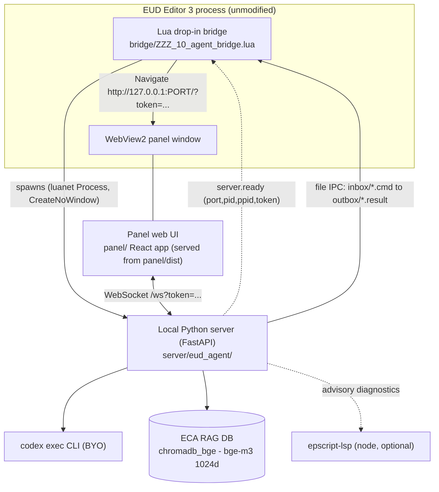
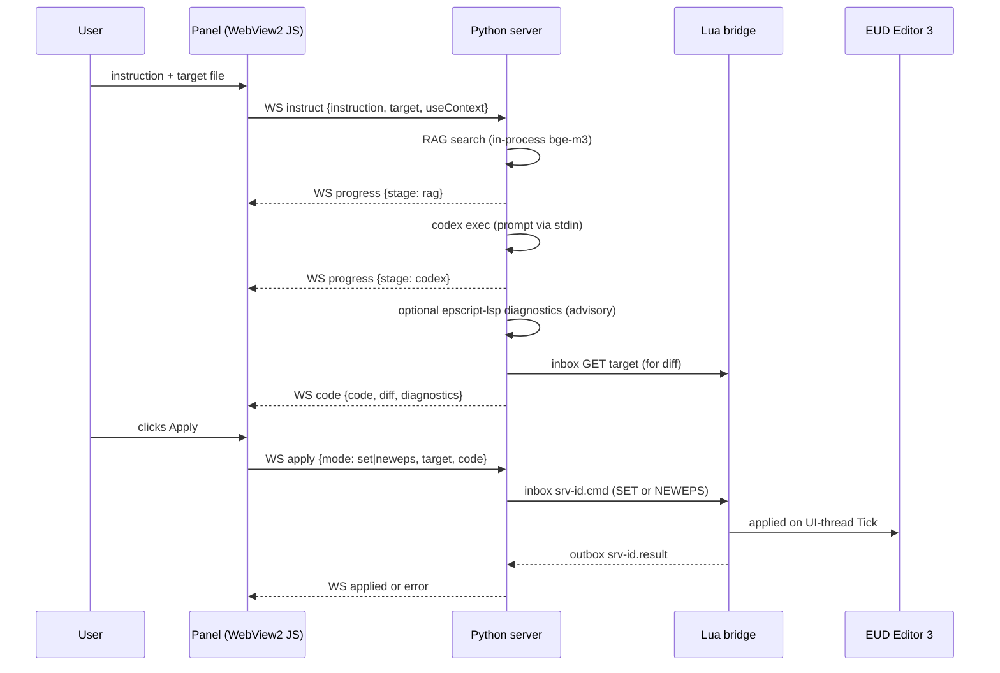
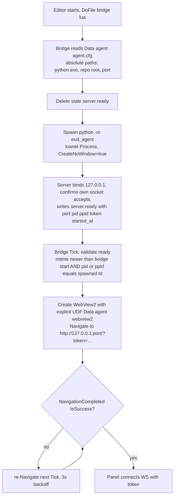

# eud-agent Architecture

External AI agent for EUD Editor 3 (StarCraft EUD map editor, VB.NET+WPF, .NET 4.8, Windows-only, third-party repo — **never modified**). The agent turns natural-language instructions into epScript (eps) code and applies it to the editor. All integration is drop-in: Lua files copied into the editor's data folder plus an external Python process. Verified groundwork (2026-06-04, editor v0.19.6.0): file-IPC bridge v6, WebView2 hosting from luanet, codex runner draft, ECA RAG DB (bge-m3).

## Component diagram



Dependency direction: `panel -> server -> bridge -> editor`. The bridge never calls the server (except spawning it); the server never touches editor objects directly; the panel only speaks WebSocket to the server. Heavy work (LLM, RAG, orchestration, diffing) lives in Python; Lua stays a thin tool-call layer.

## Runtime flow (instruct then apply)



## Boot and lifecycle



- **agent.cfg** (written by `scripts/install_dropin.ps1` into the editor's `Data\agent\`): JSON `{"python_exe": "<abs path>", "repo_root": "<abs path>", "port": 8765}`. The drop-in lua cannot know repo/venv locations any other way.
- **server.ready** (written by the server only after a background thread confirms the socket accepts connections): JSON `{"port": <int>, "pid": <int>, "ppid": <int>, "token": "<uuid>", "started_at": "<ISO8601>"}`. Atomic write (temp file + rename). Deleted on graceful shutdown; the bridge also deletes any pre-existing file at init. `ppid` exists because the venv launcher (`server\.venv\Scripts\python.exe`) re-execs the base interpreter as a child: the bridge holds the LAUNCHER pid, so ownership validation accepts when the spawned Id matches `pid` OR `ppid` (EUD-037, found live in the editor E2E).
- **Port policy**: bind the configured port (default 8765); if taken, bind port 0 (OS-assigned ephemeral). `server.ready` is the single source of truth for the actual port.
- **Heartbeat / server shutdown**: the bridge writes `Data\agent\heartbeat.txt` (ISO timestamp) on **every** Tick, unconditionally, before the `IsCompilng` early-return. The server checks it every 15s and self-terminates after 60s staleness. This is the only shutdown path; the editor never kills the server.
- **Re-arm**: the editor closes auxiliary windows on project create/switch (verified trap). The bridge tracks the panel window handle and recreates the WebView2 window every Tick while "project open AND window not alive" (never rely on pjData==nil rearm alone). The Python server stays up across recreations.
- **Single-instance assumption**: one editor instance per machine is supported. A second instance is out of scope (documented limitation).

## File IPC protocol (server to bridge)

Transport: `Data\agent\inbox\<name>.cmd` is processed on the 1s `DispatcherTimer.Tick` (UI thread), reply goes to `Data\agent\outbox\<name>.result`. The bridge deletes the `.cmd` after processing; **the reader (server) deletes the `.result` after consuming it** and clears stale inbox/outbox files at startup. All files are UTF-8 **without BOM**. Naming: the server writes `srv-<uuid8>.cmd`; the legacy headless runner writes `agent_<jobid>.cmd` — each consumer polls only its own basenames.

| Command | Args / body | Returns | Notes |
|---|---|---|---|
| PING | — | PONG time | liveness |
| STATUS | — | compiling / project / version | |
| LIST | — | one line per file: path TAB EFileType | **new**; walk of pj.TEData.PFIles, names+types only; empty (non-ERROR) result = zero files |
| DUMP | — | writes dump files + index to outbox | heavyweight; debugging only |
| GET path | — | file text | |
| SET path + body | body from 2nd line | OK / ERROR | memory-only; syncs open-tab editors; CUI/SCA/RawText only (GUI has no setter) |
| NEWEPS name + body | body from 2nd line | OK / ERROR: duplicate | **new**; root folder, EFileType.CUIEps fixed; duplicate name returns ERROR |
| GETDAT / SETDAT | dat, param, objId, value (pipe-separated) | value | unchanged from v6 |
| PANEL | — | OK | redefined: shows/refocuses the WebView2 panel (the v6 WPF control panel is removed) |
| BUILD | — | OK / ERROR | |
| LUA + body | lua chunk | result | hot-reload/debug channel; body read via .NET UTF-8 |

**Busy-editor handling**: during builds (pgData.IsCompilng) the bridge skips all inbox processing, so .result files are delayed. The server polls results with a 10s default timeout, extended to 180s when status.txt reports compiling=true, and emits progress {stage: waiting_build} so the panel shows why. On timeout the .cmd is left in place (it will apply after the build) and the panel gets an error message "editor busy".

## WebSocket protocol (panel to server)

Endpoint `ws://127.0.0.1:<port>/ws?token=<token>`; the server validates the token and the Origin header (`http://127.0.0.1:<port>`) at accept, else closes. Client to server:

- `instruct {instruction, target, useContext}` — run RAG then codex, return code
- `apply {mode: set|neweps, target, code}` — apply via bridge
- `status {}` — editor state; `list {}` — project file tree (LIST)

Server to client:

- `progress {stage: rag|rag_warmup|codex|lsp|waiting_build, detail}`
- `code {code, lang: eps, diff, diagnostics}` — diff is a unified diff (Python difflib) against the current target content for mode set; diagnostics is the advisory epscript-lsp result (empty if LSP unavailable)
- `applied {target}` and `error {message}`
- `status {compiling, project}` and `list {files: [{path, ftype, settable}]}`

## Repository layout

```
eud-agent/
+-- hivemind/                        # harness docs + tasks (this plan)
+-- bridge/ZZZ_10_agent_bridge.lua   # imported v6, extended (LIST/NEWEPS/lifecycle/WebView2)
+-- server/
|   +-- pyproject.toml               # uv-managed venv at server/.venv (uv.lock committed)
|   +-- eud_agent/                   # config, bridge_io, codex_client, rag, lsp_gate,
|   |                                # orchestrator, app (FastAPI), runner_cli, __main__
|   +-- tests/
+-- panel/                           # React app root (Vite+TS+Tailwind+shadcn/ui+AI Elements)
|   +-- package.json, vite.config.ts, tsconfig.json, index.html
|   +-- src/                         # app shell, ws client, state, panel components, monaco wiring
|   +-- components/                  # vendored shadcn/ui + ai-elements source
|   +-- dist/                        # build output — gitignored, served by the server
+-- vendor/webview2/                 # 3 SDK DLLs (Core, Wpf, Loader x64)
+-- scripts/                         # setup_env.ps1, install_dropin.ps1, dev_run.ps1
```

Runtime state lives in the **editor's** folder, not the repo: `<editor>\Data\agent\{inbox,outbox,jobs,agent.cfg,server.ready,heartbeat.txt,status.txt,webview2}`. The RAG DB stays in the ECA repo (`C:\Users\ifthe\proj\eud\ECA\chromadb_bge`) and is referenced by path — importing it here would re-introduce the LFS churn chromadb causes on tracked sqlite files.

## Key design decisions

- WebView2 embedded panel (not an external browser window) — verified hosting path via luanet; panel UI iterates as plain web files.
- File-based IPC only between server and bridge — KopiLua has no sockets/io.popen; this is a hard constraint, not a choice.
- LLM = codex exec (BYO, user's codex account); resolved via shutil.which to the npm .cmd shim; prompt passed via stdin (argv has a 32,767-char limit); --skip-git-repo-check always passed.
- RAG in-process with lazy load + background warmup; server.ready is written before the model finishes loading (panel availability is not gated on RAG).

> Decision: see [[decisions/01_rag-in-process]] — alternatives evaluated, not pursued.

- NEWEPS duplicate filename returns ERROR.

> Decision: see [[decisions/02_neweps-duplicate-error]] — alternatives evaluated, not pursued.

- Panel = React + Vercel AI Elements (vendored source, zero runtime CDN) built with Vite to `panel/dist/` (never committed; release-packaged later via GitHub Releases). Monaco editor is the edit surface; the diff tab renders the server-side unified diff. epscript-lsp stays a server-side advisory diagnostics gate only.

> Decision: see [[decisions/03_react-panel-rebuild]], [[decisions/04_dist-release-distribution]], [[decisions/05_monaco-editor-adoption]].
