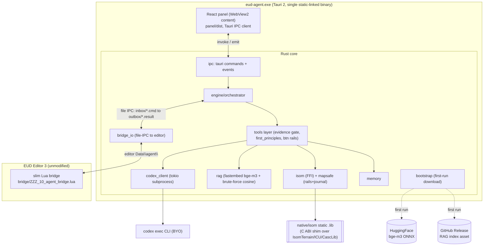
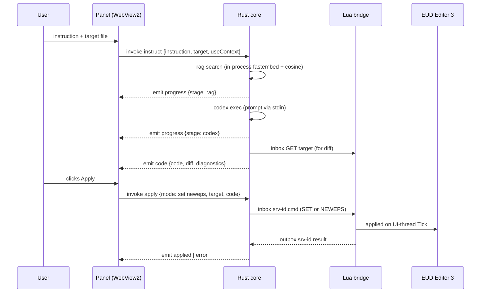
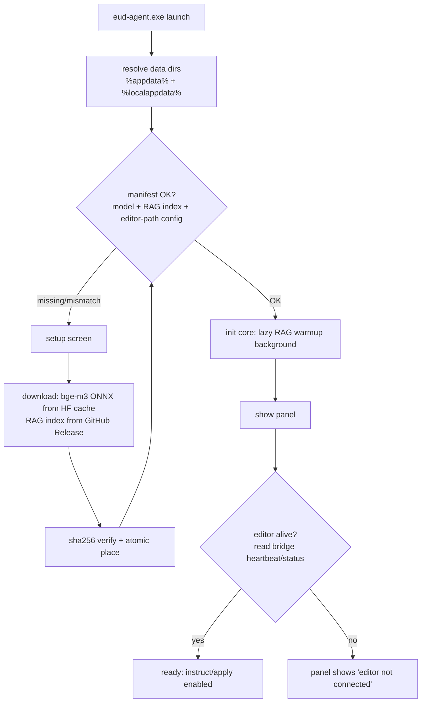

# eud-agent Architecture (v2 — Tauri + Rust)

External AI agent for EUD Editor 3 (StarCraft EUD map editor, VB.NET+WPF, .NET 4.8,
Windows-only, third-party — **never modified**). The agent turns natural-language
instructions into epScript (eps) code and applies it to the editor.

**v2 supersedes the POC topology.** The POC was a drop-in Lua bridge that spawned an
external Python FastAPI server and hosted the panel via WebView2 *inside* the editor.
v2 is a **single standalone Tauri 2 desktop app**: the whole backend is rewritten in
Rust and runs in-process, the UI is its own window, and the editor keeps only a thin
file-IPC Lua bridge. The C++ map engine (isom-poc) is vendored into this repo and
statically linked via FFI.

> Decision: see [[decisions/08_tauri-rust-rewrite]], [[decisions/09_cpp-static-lib-ffi]],
> [[decisions/10_rag-bruteforce-fastembed]], [[decisions/11_panel-tauri-ipc]],
> [[decisions/12_bootstrap-download-distribution]] — alternatives evaluated, not pursued.

## Component diagram



Dependency direction: `panel -> core -> {isom .lib, editor bridge, codex, data dir}`.
The Lua bridge never calls the app (it no longer even spawns it); the C++ engine is a
pure library with no knowledge of the app; the panel only speaks Tauri IPC. Heavy work
(LLM, RAG, orchestration, map binary I/O) stays in Rust/C++; Lua stays a thin file-IPC
tool layer.

## Runtime flow (instruct then apply)



## Boot and first-run bootstrap



- **First run** installs into the data dirs; subsequent launches skip straight to init.
- **Lifecycle is now independent of the editor.** The app does not die when the editor
  closes; it shows "editor not connected" until the bridge heartbeat reappears. The
  POC's server-self-terminate-on-stale-heartbeat path is removed.
- **Editor liveness/build state is reversed**: the bridge writes `heartbeat.txt` and
  `status.txt`; the app *reads* them to know the editor is up and whether a build is in
  progress (busy-timeout extension on file-IPC).

## Data directory layout

Runtime state is split by size and ownership (Decision 12):

| Location | Contents | Who accesses |
|---|---|---|
| editor `Data\agent\` | `inbox/`, `outbox/`, `status.txt`, `heartbeat.txt` | bridge (writes/reads) + app (file-IPC) |
| `%appdata%\eud-agent\` | `config.json` (editor path, settings), `memory/`, `map_backups/`, `journal/` | app only |
| `%localappdata%\eud-agent\` | `models/` (bge-m3 ONNX), `rag/` (index), `logs/` | app only |

The bridge finds `Data\agent\` editor-relative (no absolute path baked into the .lua —
KopiLua reads source as Latin1, so a non-ASCII path literal would corrupt). The app
reads the editor path from `config.json` (UTF-8-safe) written at install time.

## File IPC protocol (app to bridge)

Unchanged transport from the POC v6 protocol: `Data\agent\inbox\<name>.cmd` processed on
the 1s UI-thread `DispatcherTimer.Tick`, reply to `outbox\<name>.result`. Files are
UTF-8 **without BOM**. The app writes `srv-<uuid8>.cmd` and polls only its own basenames;
it deletes each `.result` after consuming and clears stale inbox/outbox at startup.

Commands retained: PING, STATUS, LIST, GET, SET, NEWEPS, GETDAT/SETDAT, BUILD, LUA.
Removed: the WebView2/panel-hosting commands and server-spawn handshake (PANEL is gone;
the app is the panel). SET/NEWEPS remain memory-only and CUI/RawText-only.

## Repository layout (v2)

```
eud-agent/
├── hivemind/                       # harness docs + tasks
├── bridge/ZZZ_10_agent_bridge.lua  # slimmed: file-IPC tool layer only
├── src-tauri/                      # Tauri 2 Rust app
│   ├── Cargo.toml                  # workspace member
│   ├── tauri.conf.json             # bundle/resources/capabilities
│   ├── build.rs                    # links native/isom static lib
│   └── src/                        # ipc, engine, tools, codex_client, rag,
│                                   # isom (FFI wrapper), mapsafe, bridge_io,
│                                   # memory, config, bootstrap, chk
├── crates/
│   ├── isom-sys/                   # FFI bindings + build.rs (msbuild + link)
│   └── isom/                       # safe Rust wrapper over isom-sys
├── native/isom/                    # vendored isom-poc C++ + C ABI shim
├── panel/                          # React app (reused); Tauri IPC client
│   └── dist/                       # build output — bundled by Tauri (gitignored)
├── ci/                             # RAG index builder + committed corpus (ci/corpus/*.jsonl)
├── tools/scraper/                  # Node/TS Naver-Cafe scraper (local, cookie) -> corpus
└── scripts/                        # install_bridge.ps1, dev_run.ps1
```

The RAG corpus lives in-repo at `ci/corpus/*.jsonl` (scraped locally by `tools/scraper`, committed
in plain git — not LFS); the CI re-embeds it and publishes the static `rag-index.bin` as a GitHub
Release asset, never committed here (see [[decisions/15_in-house-rag-corpus]]; the chromadb-sqlite
churn caveat in rules.md applies only to the legacy chromadb, not the static `.bin`).

## Key design decisions (carry-over, still in force)

- SCA is fully defunct — never a settable/creatable type (CUI/RawText only).
- NEWEPS duplicate filename returns ERROR (Decision 02).
- Monaco is the edit surface; the diff tab renders the server-side unified diff
  (now produced in Rust). Agent text renders via AI Elements + Streamdown.
- Evidence gate + citations and the `[first principles]` system-prompt section are
  ported verbatim into the Rust tools/prompt layer (rules.md).
