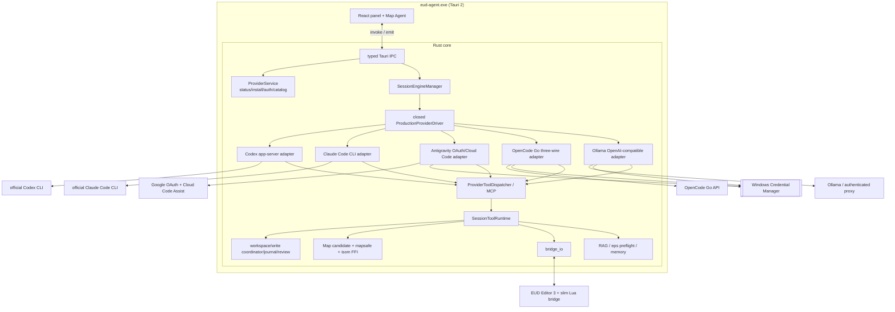
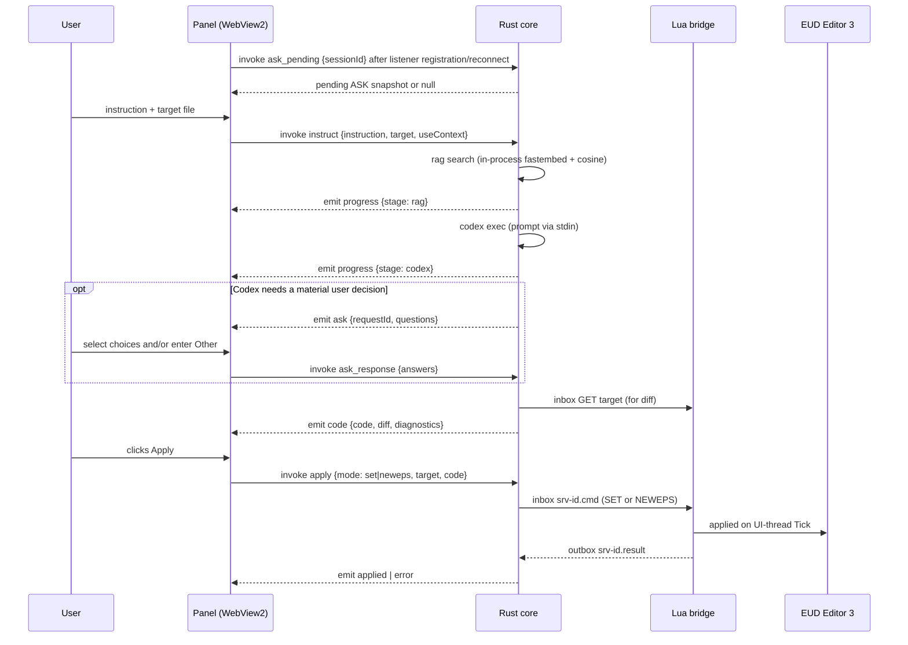
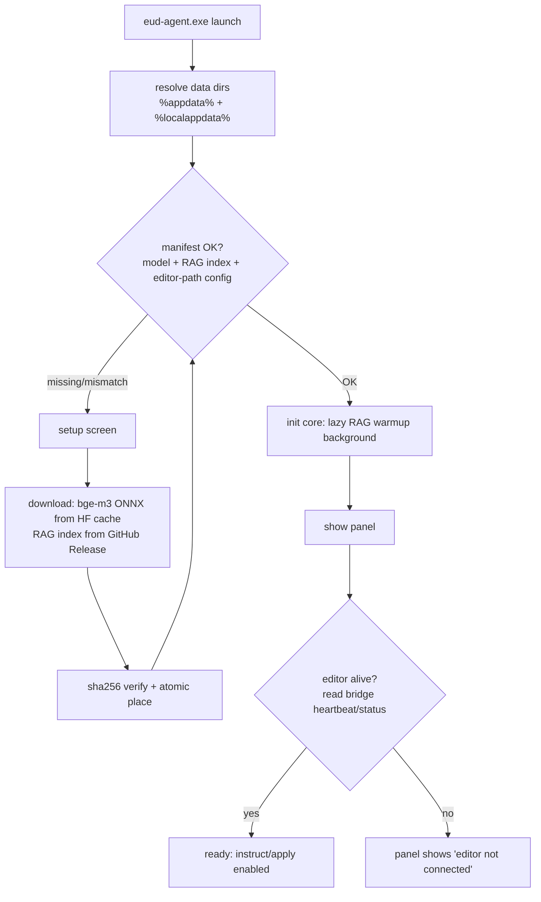

# eud-agent Architecture (v2 — Tauri + Rust)

External AI agent for EUD Editor 3 (StarCraft EUD map editor, VB.NET+WPF, .NET 4.8,
Windows-only, third-party — **never modified**). The agent turns natural-language
instructions into epScript (eps) code and applies it to the editor.

**v2 supersedes the POC topology.** The POC was a drop-in Lua bridge that spawned an
external Python FastAPI server and hosted the panel via WebView2 *inside* the editor.
v2 is a **single standalone Tauri 2 desktop app**: the whole backend is rewritten in
Rust and runs in-process, the UI is its own window, and the editor keeps only a thin
file-IPC Lua bridge. The C++ map engine (isom-poc) is vendored into this repo and
statically linked via FFI.

> Decision: see [[decisions/08_tauri-rust-rewrite]], [[decisions/09_cpp-static-lib-ffi]],
> [[decisions/10_rag-bruteforce-fastembed]], [[decisions/11_panel-tauri-ipc]],
> [[decisions/12_bootstrap-download-distribution]] — alternatives evaluated, not pursued.

## Component diagram


```mermaid
graph TD
    subgraph App["eud-agent.exe (Tauri 2)"]
        Panel["React panel + Map Agent"]
        subgraph Core["Rust core"]
            IPC["typed Tauri IPC"]
            Service["ProviderService<br/>status/install/auth/catalog"]
            Manager["SessionEngineManager"]
            Driver["closed ProductionProviderDriver"]
            Codex["Codex app-server adapter"]
            Claude["Claude Code CLI adapter"]
            AG["Antigravity OAuth/Cloud Code adapter"]
            Go["OpenCode Go three-wire adapter"]
            Ollama["Ollama OpenAI-compatible adapter"]
            Dispatch["ProviderToolDispatcher / MCP"]
            Runtime["SessionToolRuntime"]
            Work["workspace/write coordinator/journal/review"]
            Map["Map candidate + mapsafe + isom FFI"]
            Bio["bridge_io"]
            Rag["RAG / eps preflight / memory"]
        end
    end
    Cred[["Windows Credential Manager"]]
    CodexCLI["official Codex CLI"]
    ClaudeCLI["official Claude Code CLI"]
    Google["Google OAuth + Cloud Code Assist"]
    OpenCode["OpenCode Go API"]
    OllamaAPI["Ollama / authenticated proxy"]
    Editor["EUD Editor 3 + slim Lua bridge"]

    Panel <-- "invoke / emit" --> IPC
    IPC --> Service & Manager
    Manager --> Driver
    Driver --> Codex & Claude & AG & Go & Ollama
    Codex --> CodexCLI
    Claude --> ClaudeCLI
    AG --> Google
    Go --> OpenCode
    Ollama --> OllamaAPI
    AG & Go & Ollama --> Cred
    Codex & Claude --> Dispatch
    AG & Go & Ollama --> Dispatch
    Dispatch --> Runtime
    Runtime --> Work & Map & Bio & Rag
    Bio <--> Editor
```

Dependency direction is `panel -> Rust authority -> closed provider adapters`. Provider adapters
translate auth/catalog/turn/conversation/capability wire shapes only. Every model-visible EUD read,
mutation, ASK, build, Map draft, journal, review, rollback, and harness action returns through the
same `SessionToolRuntime`; no provider owns a filesystem/editor/shell authority.

Each persisted session contains an immutable typed `ProviderBinding` (provider, model, reasoning,
provider-specific base URL, conversation state). `SessionEngineManager` creates exactly one
exhaustive enum variant from that binding. Direct providers keep strict hash-verified transcript
generations under `%appdata%\\eud-agent\\provider-sessions\\<session-id>`; CLI providers keep only
their typed conversation id in the session record. Compiler and harness workers copy the source
binding rather than reading current defaults. Provider errors never select another enum variant
or model.

The optional epScript analyzer remains process-isolated and provider-neutral. The Lua bridge never
calls the app; the C++ engine remains a pure static library; the panel speaks only Tauri IPC.

## Runtime flow (instruct then apply)


```mermaid
sequenceDiagram
    participant U as User
    participant P as Panel (WebView2)
    participant C as Rust core
    participant L as Lua bridge
    participant E as EUD Editor 3
    P->>C: invoke ask_pending {sessionId} after listener registration/reconnect
    C-->>P: pending ASK snapshot or null
    U->>P: instruction + target file
    P->>C: invoke instruct {instruction, target, useContext}
    C->>C: rag search (in-process fastembed + cosine)
    C-->>P: emit progress {stage: rag}
    C->>C: codex exec (prompt via stdin)
    C-->>P: emit progress {stage: codex}
    opt Codex needs a material user decision
        C-->>P: emit ask {requestId, questions}
        U->>P: select choices and/or enter Other
        P->>C: invoke ask_response {answers}
    end
    C->>L: inbox GET target (for diff)
    C-->>P: emit code {code, diff, diagnostics}
    U->>P: clicks Apply
    P->>C: invoke apply {mode: set|neweps, target, code}
    C->>L: inbox srv-id.cmd (SET or NEWEPS)
    L->>E: applied on UI-thread Tick
    L-->>C: outbox srv-id.result
    C-->>P: emit applied | error
```

## Boot and first-run bootstrap


```mermaid
flowchart TD
    A[eud-agent.exe launch] --> B[resolve data dirs<br/>%appdata% + %localappdata%]
    B --> C{manifest OK?<br/>model + RAG index + editor-path config}
    C -- missing/mismatch --> S[setup screen]
    S --> D[download: bge-m3 ONNX from HF cache<br/>RAG index from GitHub Release]
    D --> V[sha256 verify + atomic place]
    V --> C
    C -- OK --> I[init core: lazy RAG warmup background]
    I --> P[show panel]
    P --> H{editor alive?<br/>read bridge heartbeat/status}
    H -- yes --> R[ready: instruct/apply enabled]
    H -- no --> W[panel shows 'editor not connected']
```

- **First run** installs into the data dirs; subsequent launches skip straight to init.
- **Lifecycle is now independent of the editor.** The app does not die when the editor
  closes; it shows "editor not connected" until the bridge heartbeat reappears. The
  POC's server-self-terminate-on-stale-heartbeat path is removed.
- **Editor liveness/build state is reversed**: the bridge writes `heartbeat.txt` and
  `status.txt`; the app *reads* them to know the editor is up and whether a build is in
  progress (busy-timeout extension on file-IPC).

## Data directory layout

Runtime state is split by size and ownership (Decision 12):

| Location | Contents | Who accesses |
|---|---|---|
| editor `Data\agent\` | `inbox/`, `outbox/`, `status.txt`, `heartbeat.txt` | bridge (writes/reads) + app (file-IPC) |
| `%appdata%\eud-agent\` | secret-free Config v2, sessions with immutable provider bindings, direct-provider transcript generations, memory/workspaces/maps/journal/harness | app; provider processes receive only their current session boundary |
| `%localappdata%\eud-agent\providers\` | Codex bin/home, Claude Code bin/config, Antigravity/OpenCode Go non-secret caches | app only; CLI credential files use protected current-user ACLs |
| Windows Credential Manager | OpenCode Go API key, optional Ollama proxy API key, and Antigravity access/refresh credential | Rust `ProviderSecretStore` only |

The bridge finds `Data\agent\` editor-relative (no absolute path baked into the .lua —
KopiLua reads source as Latin1, so a non-ASCII path literal would corrupt). The app
reads the editor path from `config.json` (UTF-8-safe) written at install time.


Runtime tests are an additive pre-review path after a successful authoritative build.
`trace_test_run` accepts one request-owned ad-hoc module. `trace_suite_run` takes one coherent
editor EPS snapshot, discovers logical `tests/**/*.tests.eps` paths, and runs all discovered files
or an exact selected list; one file is one persistent scenario. Permanent tests remain unimported
by the configured MainFile, while the isolated runner injects each source into its generated
harness.

For every case, the app copies the generated EDS inputs and source map into one local run, appends
a temporary epScript trace/test plugin, and builds a content-unique map in the user's StarCraft
Maps root. It refuses an existing StarCraft process and creates one owned 32-bit client suspended.
A bundled x86 helper validates the target image and neutralizes six fixed user32
foreground/focus/cursor entrypoints inside only that child before resume. The client launches
off-screen and minimized; LAN/UDP `CreateGame` and `Alt+O` then use HWND-targeted messages only.
No global input, arbitrary memory patch, game-function call, or foreground fallback is exposed.
A unique versioned ring buffer is read through `ReadProcessMemory`. Pass/fail/inconclusive plus
decoded events are written as JSON/JSONL logs; a compact `suite.json` links persistent case
results. The staged map and owned game process are removed, and the source map hash must remain
unchanged. Runtime results are diagnostic and do not block changeset review.

## Concurrent sessions and project workspaces

`SessionEngineManager` owns lazily created workers keyed by durable session id. Each worker has
its own state machine, exact `ProductionProviderDriver` variant, optional loopback MCP endpoint,
cancellation generation, request/preflight state, and immutable event sink. One worker mutex
serializes that session; read-only turns in different sessions/providers overlap.

Projects share one `ProjectWriteCoordinator`, but write registration is concurrent: declaring
write intent never waits behind another session's mutation or review. The coordinator keeps a
short project transaction mutex only around each shared editor/map/memory/build operation and
canonical accept/reject step. Session-local reasoning, workspace editing, and review remain
outside that critical section.

Each project identity hashes to a canonical accepted root:

`%appdata%\eud-agent\workspaces\<sha256>\`
CLI providers run from session roots:

`%appdata%\eud-agent\workspaces\.sessions\<sha256>\<session-id>\`

Before every foreground turn, canonical `specs/`, `plans/`, `decisions/`, and `worklog/`
documents are delta-synced into the session root and a coherent session-owned `source/`
EPSNAPSHOT is refreshed. Both read and implementation sandboxes keep those documents and
`source/**` read-only; implementation mutations travel only through eud-tools. The implementation
profile grants write access solely to `.tmp/**` for Code Mode runtime files.

Workspace accept compares each journal baseline with current canonical bytes. Unchanged targets
promote directly, non-overlapping text edits use a three-way merge, and overlapping edits return
an explicit `ConcurrentWriteConflict` without changing canonical bytes. Promotion and trusted
metadata persistence still roll back together on failure. Reject restores only the session root.

`specs/index.md` remains the canonical project-wiki entry point. `plan_approve` writes the exact
approved Markdown to canonical `plans/<request-id>.md` before implementation. Code/map changes
are reviewed first; a complete accept creates one durable post-acceptance harness job. Runtime-
affecting file/DAT/plugin/map changes wait for explicit user in-game confirmation. The user may
instead skip and terminate that job without generating documents or memory updates. Static
settings/MainFile/workspace changes proceed automatically. The background job receives accepted
journal entries and canonical documents inline, permits no tool calls, makes one
output-schema-constrained Codex turn, and stages exact `specs/`/`decisions/` edits plus a
server-generated `worklog/<source-request-id>.md` in a dedicated document workspace. Its
changeset is reviewed independently, failure keeps accepted code and exposes retry, and the main
session remains usable throughout.

The named Windows profiles `eud_workspace_read` and `eud_workspace_write` both use minimal
runtime reads, exact-root elevated sandboxing, and disabled network. Neither profile permits
foreground document writes. Unsupported or denied setup fails closed.

## Map Agent workbench and candidate documents

`map_agent_open` is an async Tauri command that creates one reusable `map-agent` WebView window
in the same process. It loads the dedicated `map-agent.html`/`map-main.tsx` entry; the main window
loads only `index.html`/`main.tsx`. This avoids query-string routing and prevents synchronous IPC
window creation from leaving WebView2 at `about:blank`. The second invocation shows and focuses
the existing window instead of creating another instance. The surface bootstraps only from the
current saved `OpenMapName`; its toolbar retains the saved source path, mtime, file SHA-256,
tileset, and dimensions. Terrain/object crops and palette thumbnails travel over binary Tauri IPC
and are rendered from the statically linked native engine.
The terrain palette opens on a paged grid of graphics-valid exact tiles from the current tileset;
each thumbnail enlarges one 32×32 tile with nearest-neighbor pixels, while semantic ISOM brushes
remain an explicit alternate mode. Space Platform thumbnail transparency is composited over the
installed star parallax instead of appearing as a missing image.
While the window remains open, an async lightweight source probe reads the bridge's cached
`project`/`openMapName` status snapshot and polls only path/mtime/size; it never writes a bridge
command. Metadata changes mark the current candidate stale without clearing or reloading the
workbench. Explicit bootstrap/reload confirms `OpenMapName` with a bounded three-second bridge
request when the editor is idle, then performs the fresh full hash/CHK load. The toolbar preserves
the stale session while creating the new Map session. Map events carry the parent candidate
revision key so stale/out-of-order output is discarded.

`SessionKind::Map` is persisted beside the backward-compatible default `SessionKind::Eps`.
Map workers have independent events, cancellation, conversation state, prompt, and MCP registry.
Their tools can inspect the connected map and mutate only a request-owned draft. Original-file
Apply and backup restore are deliberately absent from the model registry.

`MapRequestAuthority::calculate` is the one write-scope calculation used by candidate patches,
image conversion, per-batch verification, finalize, replay, and Apply verification. When the
current request has no target mention, all cells of the current candidate are writable for
terrain, units, buildings, doodads, sprites, and locations. Current-request targets narrow
coordinate writes to the union of their exact cells and layers; stored targets omitted from the
request do not narrow it. Persistent or mentioned protect masks remove their cells/layers in
both cases. Reference and anchor masks are read/comparison context only. Revision-bound exact
object/location mentions retain their fingerprint/id binding.

Saved selections also form a project-scoped region-stamp palette. Their canonical masks, labels,
roles, and selected layers persist in
`map_candidates/<project-id>/selection-palette.json`; every Map session for that saved map rebinds
the same definitions to its own visible candidate revision. Creating or updating a selection
upserts its palette entry, and deleting the selection removes the shared entry. A stamp mention
identifies this live selection but grants no write authority.

`map_stamp_preview` and `map_stamp_place` accept a strict source union. `candidateSelection`
resolves a saved selection against the visible candidate; `imported` resolves only an
`importedStamp` mention validated into the active request. Both paths use
`compile_stamp_placement`, which validates the source mask against source dimensions, the shifted
mask against destination dimensions, and exact source/destination tileset equality. Whole-map
dimensions may differ. Rust extracts exact MTXM/TILE and fully-contained selected-layer units,
buildings, doodads, sprites, and locations, then resolves placement to ordinary typed operation
batches. The model never receives paths, raw CHK, object records, or tile matrices. Exact stamping
never invokes ISOM; multiple destinations are bounded, in-map, and non-overlapping. Terrain is
expected overwrite, while destination object/location collisions require explicit merge, replace,
or cancel. Merge preserves destination objects; replace removes only fully-contained selected-layer
items and fails closed on boundary-crossing items. Direct palette placement and model placement use
the same request draft, authority, persistent-protect, native mapedit, verification, finalize, and
replay path.

`map_agent_import_open` creates or focuses one separate `map-import` WebView at
`/map-import.html`. The importer accepts only trusted-picker `.scx`/`.scm` files, streams at most
256 MiB into `%localappdata%\eud-agent\map_imports\blobs\<file-sha256>.map`, extracts and validates
the embedded `staredit\scenario.chk`, and never reads the original path again. Project metadata is
strict, atomic `map_candidates/<project-id>/import-palette.json`; it is separate from live
`selection-palette.json`. Imported snapshots bind file/CHK hashes, tileset, source dimensions,
canonical rows/bounds/cell count, and selected layers. Missing/corrupt blobs, stale snapshot hashes,
project/source switches, destination revision changes, tileset mismatch, bounds, authority,
collision, and location-slot failures reject before candidate mutation. `MapCanvas` and
`MapMinimap` share one injected render-source interface across candidate and importer surfaces.

PNG, JPEG, WebP, and the first GIF frame use one `MapImageService` conversion path. The server
checks encoded/decode/allocation caps, keeps one bounded normalized RGBA source per session,
resizes with preserved aspect ratio, then calls the ABI-v5 native CV5/VX4/VR4/WPE quantizer.
The native layer builds a cached graphics-valid SD representative-color palette, keeps the first
stable tile for duplicate RGB, alpha-composites against candidate terrain, and applies Bayer 8x8
ordered dithering with deterministic nearest-color ties. It returns packed MTXM values, preview
RGB, unique-tile count, and walkability/height change counts. Rust emits a bounded binary
JSON-header + PNG preview and a normal `TerrainBlit`; React and the model never parse tile assets
or provide paths, palettes, MTXM ids, or tile matrices.

Direct `map_agent_image_preview` is read-only. Trusted `map_agent_image_confirm` recomputes the
transform, checks the preview tile-grid digest and persistent protect conflicts, and creates
exactly one candidate revision. Map-request attachments are also exposed to vision as
`localImage` and bound in request order as `image-1`, `image-2`, etc.; `map_image_place` resolves
only those request-local refs and uses the same terrain authority/verifier. Image batches do not
seal the draft, so multiple photos and ordinary terrain patches may be interleaved.

Each Map session owns `%appdata%\eud-agent\map_candidates\<project-id>\<session-id>\`, while the
saved selection and imported palettes are shared at the project directory above those session
roots. The service materializes one immutable baseline snapshot and one current candidate SCX;
revision manifests retain typed operation batches, authority snapshots, verification reports,
candidate-local object UUIDs, non-authorizing imported provenance (import id, source file/CHK
hashes, snapshot hash, selection dimensions, layers), and non-authorizing image conversion
metadata (attachment SHA-256, source dimensions, placement, quantizer version, tile-grid SHA-256,
changed rows, walkability changes, and height changes). A request begins from the visible
candidate revision, iterates in
`drafts/<request-id>.tmp.scx`, and may finalize one verified pending revision. That revision is
published only after the complete model turn succeeds. Failed, cancelled, stale, or unfinalized
requests delete their draft and pending manifest without changing the visible candidate.

Replay uses only persisted typed operation batches. It never depends on imported blobs, original
external paths, attachment ids, or local attachment paths. Startup removes incomplete drafts,
unreferenced import staging/blobs, and unused candidate directories under their retention rules.

While a Map turn is running, successful scoped tool results from `map_draft_patch`,
`map_stamp_place`, `map_image_place`, and `map_draft_reset` advance a panel-owned preview
generation. When the user
is on the candidate view, canvas and minimap renders read the request-owned `MapView::Draft` by
the event's exact request id; object pages use the same request plus generation so locations and
hit-test overlays match the rendered draft without receiving committed candidate UUIDs. The
surface labels this state `수정 중 미리보기 · 미확정`, disables creating an object mention from
the preview, and discards late generation output. Original/diff views remain authoritative saved
views. Turn success replaces the preview with the published candidate; failure or cancellation
removes it and reveals the unchanged parent candidate. This path is read-only and never publishes
the draft or weakens candidate/source authority.

Only trusted commands from the `map-agent` window may Apply or undo. Apply replays and verifies
the complete revision chain, then enters `ProjectWriteCoordinator` and `CandidateMapSafe` for the
compiling guard, no-share lock probe, source-hash check, full backup, same-directory atomic
replacement, and post-write canonical/container verification. A flushed pending-Apply journal
closes the crash window before replacement: startup restores an uncommitted replacement or
recognizes the already-committed candidate state. Verification failure restores immediately;
explicit undo restores exact backup bytes through the same lock and atomic-replace rails.

## Main conversation resource mentions

The main EPS conversation surface carries one optional ordered `mentions: MentionInstance[]`
field through chat, plan feedback, panel-log persistence, session reload, edit, and rewind.
`MentionSnapshot` is a closed namespaced/versioned Rust union; the implemented variants are
`map.region` and `map.location`. The panel obtains every opaque snapshot through the bounded
trusted `mention_search` Tauri command and never derives resource authority from visible labels,
paths, coordinates, or natural-language text.

`MentionService` is an app-wide read-only service shared by session workers. It resolves the
current saved `OpenMapName` through `MapContextService`, reads project-scoped persistent
selections only through `CandidateStore`, and reads locations only from the saved CHK `MRGN`.
Region snapshots bind project id, source-file SHA-256, dimensions, selection id, and the complete
persistent-selection hash. Location snapshots bind project id, source-file SHA-256, exact MRGN id,
and the complete decoded-location fingerprint. Candidate-only Map Agent locations are therefore
absent until trusted Map-window Apply changes the saved source map.

Every instance is revalidated as one all-or-nothing batch immediately before an EPS Codex turn.
Duplicate instance ids, stale project/source/geometry records, unsupported kind/version/fields,
and the 16-instance cap fail before driver execution. Valid instances render one deterministic
compact `[resolved mentions]` JSON section outside and before `[user message]` on cold, resumed,
and plan-feedback turns. That context grants no tool permission and leaves evidence, plan,
write-lane, mutation-budget, MapSafe, journal, changeset, preflight, build, and rollback rails
unchanged. Map Agent's candidate-scoped `MapMentionSnapshot` and user-only original Apply remain
separate authority contracts.

## File IPC protocol (app to bridge)

Unchanged transport from the POC v6 protocol: `Data\agent\inbox\<name>.cmd` processed on
the 1s UI-thread `DispatcherTimer.Tick`, reply to `outbox\<name>.result`. Files are
UTF-8 **without BOM**. The app writes `srv-<uuid8>.cmd` and polls only its own basenames;
it deletes each `.result` after consuming and clears stale inbox/outbox at startup.

Commands retained: PING, STATUS, LIST, GET, SET, NEWEPS, GETDAT/SETDAT, BUILD, LUA,
and the additive `EPSNAPSHOT <uuid>` command. EPSNAPSHOT writes collision-safe ordinal
content plus a last-written base64-path manifest in one idle Tick for every settable text
object regardless of its stored filename suffix, while retaining readable legacy paths that
already end in `.eps`; unreadable files remain individual manifest rows. Heartbeat/status and
the compiling early-return still
precede all inbox work, so no project object is touched while compiling.
Removed: the WebView2/panel-hosting commands and server-spawn handshake (PANEL is gone;
the app is the panel). SET/NEWEPS remain memory-only and CUI/RawText-only.

## Agent epScript project architecture

The existing bridge `GETMAIN` command reads `pj.TEData.MainFile` by object identity and returns
its complete project-relative `/` path. `BridgeIo::get_main` owns the protocol interpretation:
an empty success or the expected no-project reply is `None`; transport, timeout, and unexpected
bridge errors remain failures. The read-only `project_status` tool combines the unchanged raw
`STATUS` reply with this value as `mainFile: string | null`. `list_files` remains the separate
authority for path, type, and settable metadata; neither command's wire format changes.

The `[eps project architecture]` guide is present in cold-start and resumed turns. It treats the
configured MainFile as the composition root regardless of name, places behavior with the module
that owns its state and invariants, permits new modules only for cohesive narrow responsibilities,
and keeps dependencies directional and acyclic. Local fixes stay in the existing owner; the
800-nonblank-line threshold is a cohesion review signal, not a split gate. Topology, MainFile,
dependency, or responsibility changes require a complete `structure` memory replacement, and
mutually dependent candidates still use one `eps_check` batch followed by mandatory `build_run`.

## Agent-only epScript preflight

`eps_check` overlays one complete candidate batch onto the request-local project mirror,
then asks the checksum-verified `vendor/epscript-lsp-agent/adapter.cjs` process for syntax,
import-graph, dependency, and reverse-dependent diagnostics. The adapter uses the pinned
upstream generated ANTLR parser for imports and returns 1-based, bounded diagnostics.
It is advisory and non-mutating: no journal entry, admission gate, changeset, or panel
state is created. Missing Node/resource, snapshot failure, crash, malformed framing, and
timeout return a successful stable `skipped` result; the normal write and mandatory
`build_run` path remains available and authoritative.

## Repository layout (v2)

```
eud-agent/
├── hivemind/                       # harness docs + tasks
├── bridge/ZZZ_10_agent_bridge.lua  # slimmed: file-IPC tool layer only
├── src-tauri/                      # Tauri 2 Rust app
│   ├── Cargo.toml                  # workspace member
│   ├── tauri.conf.json             # bundle/resources/capabilities
│   ├── build.rs                    # links native/isom static lib
│   └── src/                        # ipc, engine, tools, codex_client, rag,
│                                   # isom, mapsafe, bridge_io, eps_preflight,
│                                   # memory, config, bootstrap, chk
├── crates/
│   ├── isom-sys/                   # FFI bindings + build.rs (msbuild + link)
│   └── isom/                       # safe Rust wrapper over isom-sys
├── native/isom/                    # vendored isom-poc C++ + C ABI shim
├── panel/                          # React app (reused); Tauri IPC client
│   └── dist/                       # build output — bundled by Tauri (gitignored)
├── ci/                             # RAG index builder + committed corpus (ci/corpus/*.jsonl)
├── tools/
│   ├── epscript-lsp-agent/         # adapter source, exact npm lock, Node tests
│   └── scraper/                    # corpus refresh tooling
├── vendor/epscript-lsp-agent/      # generated bundle, checksum, MIT license, provenance
└── scripts/                        # bridge/dev scripts + deterministic adapter regeneration
```

The RAG corpus lives in-repo at `ci/corpus/*.jsonl` (refreshed locally from authenticated Naver
data and commit-pinned public repositories, then committed in plain git — not LFS); CI re-embeds it
and publishes the static `rag-index.bin` as a GitHub Release asset, never committed here (see
[[decisions/15_in-house-rag-corpus]]; the chromadb-sqlite
churn caveat in rules.md applies only to the legacy chromadb, not the static `.bin`).

## Key design decisions (carry-over, still in force)

- SCA is fully defunct — never a settable/creatable type (CUI/RawText only).
- NEWEPS duplicate filename returns ERROR (Decision 02).
- Monaco is the edit surface; the diff tab renders the server-side unified diff. Agent text renders
  via AI Elements + Streamdown; agent answers and plan cards enable bundled Mermaid SVG rendering.
- Evidence gate + citations and the `[first principles]` system-prompt section are
  ported verbatim into the Rust tools/prompt layer (rules.md).
