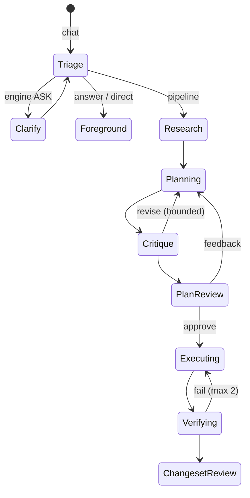
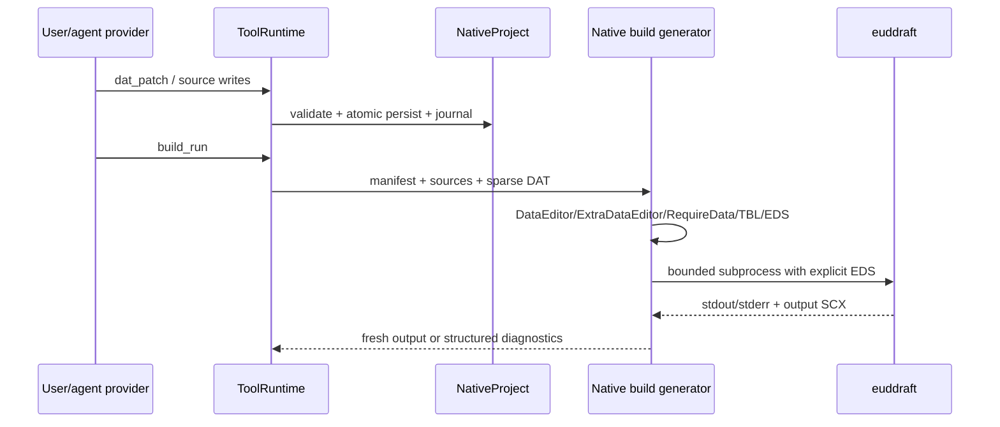

# Architecture

## System boundary

`eud-agent` is a standalone Windows Tauri 2 application for native EUD map authoring. It owns project state, epScript files, sparse DAT edits, build generation, review/rollback, map tooling, RAG, and five-provider agent orchestration.

EUD Editor 3 is not a runtime dependency. Its open-source data definitions are used only as a versioned compatibility contract for DAT generation and `.e3s` import/export.

```mermaid
graph TD
    Panel[React panel] -->|typed invoke/listen| IPC[Tauri IPC]
    IPC --> Engine[Rust agent engine]
    Engine --> Tools[SessionToolRuntime]
    Tools --> Native[NativeProjectManager]
    Native --> Manifest[project.eap]
    Native --> Sources[src/**/*.{eps,py} + src/**/*.py]
    Native --> Dat[dat/*.json]
    Tools --> Map[Map Agent / isom / CHK]
    Tools --> Journal[semantic journal]
    Engine --> Runtime[ProviderRuntime]
    Runtime --> Providers[Five transport adapters]
    Runtime --> Gate[Run-scoped tool gate]
    Gate --> Tools
    Engine --> Jobs[Isolated StructuredJobExecutor]
    Jobs --> Providers
    Engine --> Rag[in-process fastembed RAG]
    Native --> Build[deterministic EDS + plugins]
    Build --> Euddraft[euddraft subprocess]
    Euddraft --> Output[output SCX]
    Native --> Compat[independent NRBF E3S compatibility]
```

## Canonical project

The authority is one schema-v2 manifest, a confined EPS/Python tree, and five sparse JSON documents. Generated EDS/Python/binary files and E3S are outputs, never canonical state.

```text
project.eap
src/**/*.eps
dat/{standard,xdat,tbl,requirements,buttons}.json
maps/<source>.scx
build/
references/<name>.scx       # verified copies of maps opened in the Map Importer, never canonical
compat/editor-project.e3s   # only after E3S import
```

`NativeProject` validates paths before filesystem access, writes JSON atomically, hashes complete state for revisions, and updates MainFile when a source moves. Project open requires the source map and MainFile to exist.

The manifest itself uses `.eap` (EUD Agent Project); there is no separate launcher descriptor. New projects use `project.eap`, and a renamed sole `.eap` remains the persistence target. Only explicit opens migrate legacy `project.json`/`.eudproj` state after validation; passive status probes never migrate. Multiple `.eap` files or mixed old/new authorities fail closed. Historical map identities retain the root/legacy-filename hash so migration does not orphan existing map state.

## Runtime ownership

- `AppManaged`: shared data-directory state for Tauri commands.
- `NativeProjectManager`: configured project open/status/list/source/DAT/build facade.
- `ToolServices`: immutable process services; `SessionToolRuntime` owns request evidence, iteration
  progress, attachment bindings, and write registration.
- `ProjectWriteCoordinator`: serializes shared project transactions across sessions without
  treating generated build outputs as canonical mutations.
- `JournalStore`: durable semantic before/after records and reverse-order rollback through the native runtime.
- `WorkspaceManager`: durable project-local agent documents and trusted turn baselines; the provider CLI cwd is the native project root, so there is no session mirror.
- `MapSafe`: native build marker, Windows no-share probe, backup, isom mutation, verification, rollback.
- `CandidateStore`: per-session baseline snapshot, operation-manifest revisions, and the current
  candidate map. The saved source is the authority a session follows: `follow_source` runs at every
  open/state/request/apply boundary and, when the source hash moved, replays the session's revisions
  onto the new source with fresh verification, or marks `sourceDiverged` (candidate wins on Apply)
  when the new source rejects a revision on the visible chain. The Map panel polls the source mtime
  and reopens the session on change instead of asking for a new work item.
- Map window scenario properties ("맵 속성": title, description, 12 slots, 4 forces) are a
  UI-only request: `MapAgentService::properties_save` diffs the form against the current digest,
  emits `scenario.set`/`player.set`/`force.set` into a session work file, verifies it under a
  properties authority (the only authority allowed to change `SPRP/OWNR/IOWN/SIDE/FORC`), then
  runs the ordinary `MapSafe::apply` + `complete_apply`, so the source map changes immediately
  and the Map window's Undo restores the exact backup. It refuses while a candidate revision or
  request exists.
- "SCMDraft 2로 열기" is a main-window header action (`project_open_scmdraft`): it launches
  `config.scmdraft_path` on the project's source map, and when the executable is unset or gone
  it returns `unconfigured` so the panel opens 설정 → 컴파일 in place instead of showing a hint.
  The share-lock probe keeps refusing Map writes while SCMDraft holds the file.

No module reads an Editor heartbeat/status file, starts Editor, installs Lua, polls inbox/outbox, invokes BindingManager, or asks Editor to build.

## Provider execution ownership

`SessionEngineManager` constructs a session-bound `AgentEngine<R: RuntimeExecutor>` with `ProviderRuntime`. A fixed exhaustive factory selects `CodexAdapter`, `ProductionClaudeCodeAdapter`, `AntigravityAdapter`, `OpenCodeGoAdapter`, or `ProductionOllamaAdapter`; there is no legacy driver facade or dynamic plugin registry. OpenCode Go selects only its three declared Responses, Chat Completions, or Anthropic Messages wires from the persisted binding. The common runtime owns shared run, tool-gate, cancellation, checkpoint, and normalized-event rules; selection never creates provider or wire fallback.

`provider_runtime.rs` defines the request, identity, policy, normalized event and outcome contracts. Its private runtime modules own foreground lifecycle, direct model-step/tool-result iteration, the ordered text/reasoning/tool/signature block stream, deadlines, ASK-aware cancellation, event validation, workspace preparation, compaction, and checkpoint/recovery. The engine retains domain context, task-state provenance, approvals, review, and application-session persistence.

Adapters preserve native authentication, protocol and session controls without owning application storage writers, UI sinks, workspace services or unrestricted tools. Codex/Claude retain their official CLI internal loops. OpenCode Go retains its catalog-selected Chat Completions, Responses and Anthropic Messages wires; Antigravity retains Cloud Code/thought signatures; Ollama retains the exact saved endpoint/model binding.

For OpenCode Go, ordinary function descriptors on the Responses and Chat Completions wires explicitly use non-strict schemas so optional tool fields remain representable; structured-job result descriptors remain strict. A parsed protocol or incomplete-stream failure remains that error class rather than being overwritten by a synthetic transport-close event. For Codex, native `context_usage` is published only after a nonempty official `turn/started` ID and only when the usage event names that active turn; unmatched prior or stale usage is ignored before it reaches the strict session sink.

`RunPolicy.max_output_bytes` limits serialized normalized output in the common runtime. It is not an HTTP-body ceiling: OpenCode Go, Ollama, and Antigravity enforce their own 16 MiB raw-response limits, while Claude Code independently bounds raw stdout at 32 MiB in total and per JSONL line, and exempts echoed MCP `image` blocks (rendered maps) from its 64 KiB native tool-observation limit. Codex keeps its existing common-runtime checks. This separation admits harmless transport framing overhead but still rejects normalized semantic output beyond policy.

Direct batches and native MCP calls share a run-scoped tool gate over `SessionToolRuntime`. Each native endpoint/handler has a unique run URL and UUID identity, belongs to its creating run, and becomes invalid at shutdown. Native notifications are observations, not duplicate execution commands. Completed tools persist their journal/receipt independently of final-answer success; the receipt records each result verbatim up to 64 KiB and otherwise only its identity (an MCP image keeps `mimeType`/`width`/`height` with the PNG replaced by `dataBytes`/`dataSha256`; any other oversized result becomes `receiptOmitted`/`bytes`/`sha256`), so a long Map run of rendered candidates never exceeds the 64 MiB run-receipt bound. Cancellation blocks new admission while already-started operations settle; it never automatically replays or rolls back completed mutations.

Direct transcript generation/pointer validation and native ID/receipt recovery remain distinct. Only confirmed boundaries advance continuation/context state; late events must still match their immutable run/session identity. Unknown native state and corrupt direct state fail closed with review intact; an explicit reset starts fresh rather than silently adopting a receipt. A failed resume never blocks opening the session: the Map bootstrap returns `conversationResumeError`, the window opens with candidate/revision state intact, chat stays refused, and the panel's "대화 초기화" action (`map_agent_conversation_reset`) clears the receipt and starts a fresh native session. The Map window's per-message "수정" action (`map_agent_conversation_rewind`) rewinds the conversation to the rows before that message, anchored by the row's `requestId`, without touching the candidate map. Application metadata acknowledgement retires native recovery receipts. This does not claim crash-atomic external side effects or universal exactly-once execution.

`AgentEngine` also owns the provider-independent autonomous controller. An autonomous run contains
one durable request/journal and any number of soft-bounded foreground iterations. `RunOutcome`
distinguishes write transition from typed action, direct-round, context-pressure, and
provider-continuation boundaries. Direct adapters checkpoint their exact ordered transcript after
completed tool results; Codex and Claude accept only official native continuation receipts. The
engine persists each confirmed boundary, builds a minimal continuation from goal/task/blocker/build
state, and never copies stale project contents into the next prompt.

`SessionToolRuntime` also hosts two engine-injected executors, like the ask emitter: `delegate_read`
runs one read-only `DelegatedRunKind::Read` child through `DelegatedRunExecutor` and returns only its
schema result, and `map_task_request` records a durable `TeamTask` on the EPS session and submits an
ordinary Map request to a **fresh** team Map session (new provider thread, empty transcript, candidate
r0 on the saved source map) through the manager's team dispatcher; the parent's earlier team sessions
are retired with their candidates unless the Map window can still undo their Apply against the current
source. Both wait at most 240 seconds inside the tool call; the child's reads are never parent
evidence. A Map request that outlives the wait returns `running`; when it later settles, the
dispatcher's `team_continue` starts the EPS session's continuation turn itself (idle sessions only,
announced as `team_task.continuation`), so the handoff completes without a user message. The EPS
session then inspects the team candidate
(`map_task_diff`/`map_task_objects`/`map_task_render`) and applies it with `map_task_apply` through
the Map window's own apply path, replaces it with a corrected complete request (never a delta on the
candidate), or discards it; the user can do the same in the Map window and undo an apply from either.

`SessionToolRuntime` classifies tools on two axes: canonical write-workspace admission and shared
project transaction. `build_run` uses only the latter, so an EPS read foreground builds in place
while still excluding concurrent source/Map/sound operations for the native process lifetime.
Build no-progress uses bounded stable revision/diagnostic history. Search and Python dependency
preparation use input/result identity rather than request-lifetime attempt caps.

Autonomous lifecycle is durable session state, separate from live read/write activity. ASK, review,
pause, restart pause, safety stop, cancellation, failure, and completion remain explicit. Startup
never resumes. Explicit resume validates project identity/revision, pending review, and the exact
persisted/provider checkpoint; runtime-affecting completion requires a successful build for the
current canonical revision.

Compiler and harness requests use an independent `StructuredJobExecutor` with no main storage, workspace manager, tool authority or UI sink. It receives a fresh binding snapshot and a unique empty compiler input/cwd. Compiler requests use the common 60-second deadline and 8192-token cap; harness requests retain their 300-second deadline. Whole-result validation precedes revision/branch/provenance checks or harness staging/review. No model-name exceptions, prose JSON scraping, timeout inflation, partial-success conversion or automatic provider/model fallback is used.

See [agent core](features/05_agent-core.md), [sessions](features/sessions.md), the
[autonomous loop plan](features/autonomous-agent-loop-plan.md), and the
[runtime acceptance plan](features/provider-runtime-unification-plan.md). Implementation,
deterministic adapter evidence, actual service/UI acceptance, and environment limits have separate
verdicts in [verify.md](verify.md).

Historical checkpoints retain their recorded source/binary bindings: checkpoint 22's Windows draft-cleanup failure and checkpoint 33's compiler-cwd error 32 are not evidence for later source. The checkpoint-23 non-inheritable `rbN` Map reader mechanism, ordinary OpenCode `strict: false` descriptors, active-turn usage filtering, and independent raw/normalized-output bounds remain part of the implemented runtime.

## Staged request workflow

Every interactive EPS chat request is triaged before any foreground turn. The engine runs
isolated read-only delegated runs (`DelegatedRunExecutor` over a filtered `ToolProfile`, ending in
a schema-validated `submit_result`) for triage, research, planning, critique/architecture review,
and verification; the ordinary foreground turn remains the only executing context.


```mermaid
stateDiagram-v2
    [*] --> Triage: chat
    Triage --> Clarify: engine ASK
    Clarify --> Triage
    Triage --> Foreground: answer / direct
    Triage --> Research: pipeline
    Research --> Planning
    Planning --> Critique
    Critique --> Planning: revise (bounded)
    Critique --> PlanReview
    PlanReview --> Planning: feedback
    PlanReview --> Executing: approve
    Executing --> Verifying
    Verifying --> Executing: fail (max 2)
    Verifying --> ChangesetReview
```

`WorkflowState` is persisted on the session at every transition and projected to the panel as the
`workflow` event; plan review survives reconnect and restart, in-flight stage jobs become
`Interrupted` at startup and resume or restart only explicitly. Research, plan revisions, and
verification verdicts are engine-rendered files under `.eud-agent/workspace/{research,plans,verify}`;
the approved plan file instructs the executing turn and the verifier judges the changeset and
build evidence against its acceptance criteria. The default plan depth is planner + one critic
round; the app-wide "더 똑똑한 계획" setting runs planner → architect → critic up to three times.
A `[project map]` section (source listing, entrypoints, plugins, DAT override counts, accepted spec
index) is delivered through the context cursor like memory, so an unchanged tree costs nothing per
turn. See [staged workflow plan](features/staged-workflow-plan.md) and the scenario set.

## Current verification boundary

Checkpoint41 binds source `078F460095E965AEB7B3E7FE04F8FACF494DD9D23917FD78458F78F8C78C330D` to immutable test executable `0C161936695EEEA3CEA91A2B677FCF3AA5FDC28B607906F77106EA96BE44E84A`. The permanent long-Windows-path Map selector passes, `isom` passes 12 with 7 existing environment ignores, and an unchanged full default-parallel repeat passes `749/0/30`, including main and doc targets. Library check, strict `isom` and all-target/all-feature `eud-agent` Clippy, and full formatter pass. The first full41 run's existing Map finalize/revert Access-denied failure (`748/1/30`) remains a WATCH: the exact diagnostic and unchanged repeat pass do not attribute or causally fix it. Fresh panel36 TypeScript, 58-file/539-test Vitest, and production build remain product-equivalent and pass with the existing chunk advisory. The custom-protocol app build passes on checkpoint41 source and binds app SHA `C8CCB48B0ABBBFC93EB65626BB0668895BF2D0F22FBB979CF9216968F66B8DE2`.

Map admission validates the verbatim registry schema as Draft7, preserving strict malformed and original-Apply refusal. After numeric rendering passed, actual39 exposed a 271-character temporary-draft path failure; the controlled ordinary/extended-path probe isolated that boundary, and source41's shared Windows path correction passes the permanent long-path Map regression. Actual Map41 then completes candidate revision 1, trusted UI Apply, and exact undo to its baseline. Its two preceding `before` conflicts are retained; stale-fork validation did not run.

Actual app33 gives bounded native EPS evidence: read/compiler semantic delta, scoped edit with preflight/build, review reject and accept, and cancellation after `response_started` but before text/tool output all pass. App37 adds native ASK answer, separate ASK cancellation with an 8.08-second idle observation, and normal restart persistence of the 88-byte EPS source/hash and sessions with no active-request replay. Actual39 C18 independently overlaps Map status/analyze with an OpenCode Go/`glm-5.3` `project_status` read; both remain session-bound and complete. The OpenCode foreground answer succeeds, but its persisted compiler warning is `runtime_error` with cause and exact wire unverified. Checkpoint33's C07 error32 remains an unexplained intermittent watch despite later passes and removed temporary diagnostics. SQLite startup has not reproduced, which is not a causal fix. Independent QA41 confirms the post-Undo Map UI at r0 with no candidate and Apply/Undo disabled while retaining its final answer and failed/successful tool history. App41 then closes normally with no owned processes and baseline hashes preserved. Messages structured work still fails, Claude is logged out, Antigravity lacks an OAuth client, and Ollama service verification is policy-blocked before launch: no server, catalog, generation, or configuration change occurred, so model presence and compatibility remain unknown. Gameplay remains required for the harness.

## Build flow


```mermaid
sequenceDiagram
    participant U as User/agent provider
    participant T as ToolRuntime
    participant P as NativeProject
    participant G as Native build generator
    participant E as euddraft
    U->>T: dat_patch / source writes
    T->>P: validate + atomic persist + journal
    U->>T: build_run
    T->>G: manifest + sources + sparse DAT
    G->>G: DataEditor/ExtraDataEditor/RequireData/TBL/EDS
    G->>E: bounded subprocess with explicit EDS
    E-->>G: stdout/stderr + output SCX
    G-->>T: fresh output or structured diagnostics
```

A project-scoped marker is held during build. Success requires a fresh output file. Generator inputs are version-matched compatibility assets copied from Tauri resources to LocalAppData.

The runner writes the complete stdout/stderr to `build/euddraft/build.log`. The parser folds every Python traceback and every `warn_with_traceback` stack into one error or warning at its innermost project frame and reads epScript compile errors (`[Error N] Module "m" Line n : text`) as file/line errors; warnings never fail a build. Identical warnings merge with a `count`. The model's `build_run` observation carries `errors` (with `raw`), `warnings` (without stacks), `omittedErrors`/`omittedWarnings`, a bounded `outputExcerpt`, and `logPath`, never the raw streams (euddraft lists every null tile on one line); observation and `build_log_read` pages both stay under 40 KiB measured double-escaped, and `build_log_read` pages the log by line range or query with `nextLine` continuation.

## E3S boundary

The independent NRBF reader/writer parses object graphs as data. Import semantically projects CUI EPS/MainFile/settings/plugins and all supported DAT families; unsupported GUI/RawText or Classic-as-main structures fail explicitly. Export updates the retained graph, copies referenced map assets, embeds an exact native payload, reparses, and writes atomically.

Setup additionally migrates the local harness associated with the original full E3S path. Accepted documents, plan approvals, and memory/wiki are copied into the new project's `.eud-agent`; EPS/Map conversation copies remain in AppData under fresh IDs. Historical quoted keys are recognized. Missing, corrupt, unsafe, ambiguous, and conflicting optional items become stable `importIssues`, not a whole-import failure. Before activation the user must explicitly approve the current omission IDs; a changed issue requires renewed consent. Pending review rolls back healthy copies and clears generated destination contents without changing selection, recency, or originals. Only core import/destination failures or failed cleanup/rollback remain fatal. Conversation copies retain logs/settings without provider connections, pending reviews, context/task state, or map candidates. Jobs and generated mirrors are not migrated; E3S itself carries no harness.

New native projects do not need E3S. Legacy export requires an imported compatibility base; refusal is preferable to synthetic lossy output.

## Panel and setup

The panel is built into `panel/dist` and hosted by Tauri WebView2. Tauri listener registration and native project availability are separate states. Project loss gates authoring but does not disconnect transport.

Every ordinary startup first shows `ProjectLauncher`, even when the saved project and environment are valid. Recents are persisted newest-first by successful open, not by background status probes. An explicit successful open is required before session restoration, native project polling, or project-dependent bootstrap.

Associated `.eap` files contain the canonical manifest directly. Startup arguments and `tauri-plugin-single-instance` forwarding enter a native request queue; the panel subscribes before draining it. Busy/failed requests remain visible for explicit retry instead of changing an active project.

Environment setup after project selection:

1. open/create/import a native project from the launcher or a direct file request. "Create"
   starts from an existing SCX/SCM or from the blank-map wizard (`NewMapWizard`): tileset,
   64..256 size, initial ISOM terrain brush, title/description, map format, all 12 CHK player
   slots with type/race (force for P1..P8, like SCMDraft 2's player settings), 4 named forces with
   flags, start locations auto-placed as a packed top-left cluster, and a rendered preview before
   the project opens. Wizard text is encoded by `chk::encode_chk_text`: the new map has a legacy
   `STR ` table, so non-ASCII title/description/force names are CP949 (SCMDraft 2 and the system
   code page read them), with UTF-8 only as the unencodable fallback. The wizard needs the StarCraft install folder
   (`config.starcraft_path`, selectable in place and preferred over the default install folder)
   and generates `maps/<name>.scx` through `isom_map_new`, which saves via a same-directory
   temporary file and atomic promotion and re-opens the result before Rust re-reads the CHK;
2. automatically install the latest official euddraft release when no path is set, or select an existing euddraft folder/entrypoint;
3. verify/download managed RAG/model assets;
4. select and connect at least one supported AI provider.

The workspace header returns to the project launcher. Settings retains open/create/import/export and exposes euddraft path, managed version, explicit latest-release checking, and checksum-verified update under Compile. Native switch admission protects active work and invalidates idle workers on a root change; the panel clears project-scoped views and ignores late refresh results from the previous root.

One active project remains an intentional safety boundary: runtime services reload the shared `config.project_path`, and project memory/wiki/session ownership is not window-scoped. Removing the single-instance guard alone could redirect an existing operation to another project's files. Independent project windows require isolated project contexts and event/storage routing; this file-format cutover does not enable them.

## Data locations

- Roaming `%APPDATA%/eud-agent`: config, conversations, journals, runtime jobs, session workspaces/turn baselines, and preserved legacy harness sources.
- Local `%LOCALAPPDATA%/eud-agent`: model/RAG cache, native compatibility assets, audio tools, managed euddraft/uv distributions, content-addressed Python wheels/environments, temporary work.
- Project root: canonical authoring state, build outputs, and portable durable harness data under `.eud-agent/workspace`, `.eud-agent/state`, and `.eud-agent/memory` (including the wiki).

The local trusted workspace ID is initialized from the canonical root's SHA-256 identity and then retained across folder moves. Existing native AppData harnesses migrate only from validated project bindings; name-only memory with uncertain ownership is reported and left untouched. `.eud-agent/state/appdata-migration.json` records the one-time cutover, so reopening cannot resurrect deliberately deleted local files. Fresh create/E3S import marks its own cutover without attaching an unrelated same-name native store. Source files are never removed; local data takes precedence.

Every app-written text/JSON file is UTF-8 without BOM. Large/regenerable assets never live in Roaming.

## Verification authority

- Rust full suite for schemas, paths, journal, runtime, map tooling, source snapshots, NRBF, and generators.
- Panel Vitest suite plus TypeScript build.
- Real NRBF fixture: byte-exact parse/write, semantic import/export/import equality, and .NET BinaryFormatter deserialization.
- Real native generator → installed euddraft → fresh output SCX.
- Browser/Tauri surface verification for setup and project settings interactions.

## Direct Python runtime

`project.eap` stores ordered Python entrypoints, exact direct pins, and the deterministic complete wheel lock. Lease-free preparation resolves with managed uv, publishes a verified immutable environment, and runs a real frozen-euddraft probe. A bounded single-use token enters the normal short coordinator/journal/review transaction. Build validates the same lock digest and emits one EDS in bootstrap → plugins → DAT → Python entrypoints → EPS MainFile order, executed once by frozen `euddraft.exe` under a kill-on-close Windows Job Object.
