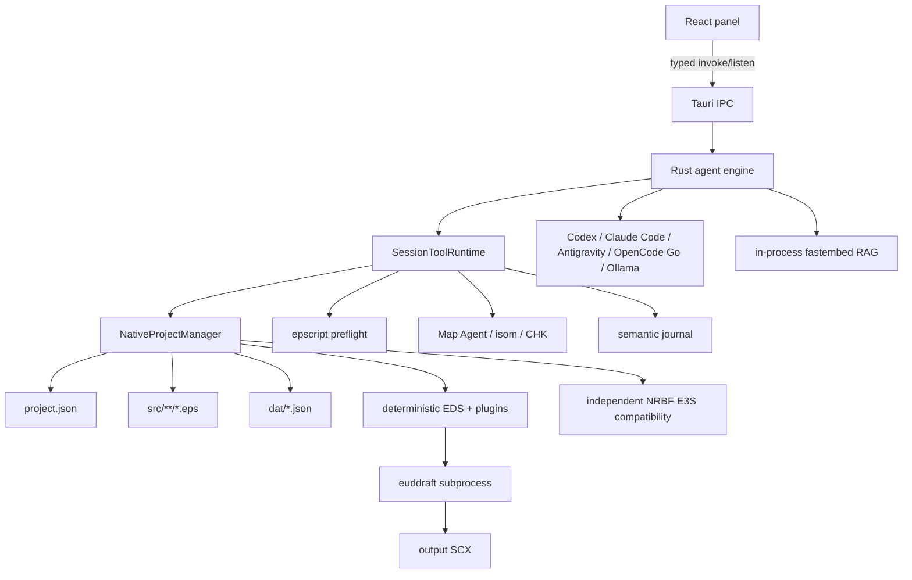
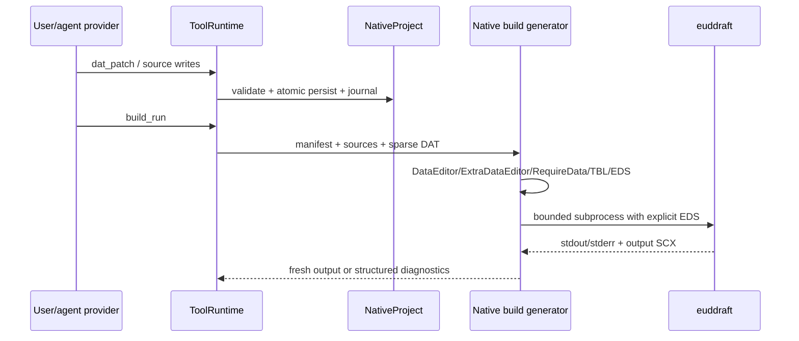

# Architecture

## System boundary

`eud-agent` is a standalone Windows Tauri 2 application for native EUD map authoring. It owns project state, epScript files, sparse DAT edits, build generation, review/rollback, map tooling, RAG, and five-provider agent orchestration.

EUD Editor 3 is not a runtime dependency. Its open-source data definitions are used only as a versioned compatibility contract for DAT generation and `.e3s` import/export.


```mermaid
graph TD
    Panel[React panel] -->|typed invoke/listen| IPC[Tauri IPC]
    IPC --> Engine[Rust agent engine]
    Engine --> Tools[SessionToolRuntime]
    Tools --> Native[NativeProjectManager]
    Native --> Manifest[project.json]
    Native --> Sources[src/**/*.eps]
    Native --> Dat[dat/*.json]
    Tools --> Preflight[epscript preflight]
    Tools --> Map[Map Agent / isom / CHK]
    Tools --> Journal[semantic journal]
    Engine --> Providers[Codex / Claude Code / Antigravity / OpenCode Go / Ollama]
    Engine --> Rag[in-process fastembed RAG]
    Native --> Build[deterministic EDS + plugins]
    Build --> Euddraft[euddraft subprocess]
    Euddraft --> Output[output SCX]
    Native --> Compat[independent NRBF E3S compatibility]
```

## Canonical project

The authority is one versioned manifest, a confined EPS tree, and five sparse JSON documents. Generated EDS/Python/binary files and E3S are outputs, never canonical state.

```text
project.json
src/**/*.eps
dat/{standard,xdat,tbl,requirements,buttons}.json
maps/<source>.scx
build/
compat/editor-project.e3s   # only after E3S import
```

`NativeProject` validates paths before filesystem access, writes JSON atomically, hashes complete state for revisions, and updates MainFile when a source moves. Project open requires the source map and MainFile to exist.

## Runtime ownership

- `AppManaged`: shared data-directory state for Tauri commands.
- `NativeProjectManager`: configured project open/status/list/source/DAT/build facade.
- `ToolServices`: immutable process services; `SessionToolRuntime` owns request evidence, plans, budgets, attachment bindings, and write registration.
- `ProjectWriteCoordinator`: serializes project mutations across sessions.
- `JournalStore`: durable semantic before/after records and reverse-order rollback through the native runtime.
- `WorkspaceManager`: durable agent workspace plus read-only source mirror.
- `EpsPreflight`: project snapshots and framed Node analyzer client.
- `MapSafe`: native build marker, Windows no-share probe, backup, isom mutation, verification, rollback.

No module reads an Editor heartbeat/status file, starts Editor, installs Lua, polls inbox/outbox, invokes BindingManager, or asks Editor to build.

## Build flow


```mermaid
sequenceDiagram
    participant U as User/agent provider
    participant T as ToolRuntime
    participant P as NativeProject
    participant G as Native build generator
    participant E as euddraft
    U->>T: dat_patch / source writes
    T->>P: validate + atomic persist + journal
    U->>T: build_run
    T->>G: manifest + sources + sparse DAT
    G->>G: DataEditor/ExtraDataEditor/RequireData/TBL/EDS
    G->>E: bounded subprocess with explicit EDS
    E-->>G: stdout/stderr + output SCX
    G-->>T: fresh output or structured diagnostics
```

A project-scoped marker is held during build. Success requires a fresh output file. Generator inputs are version-matched compatibility assets copied from Tauri resources to LocalAppData.

## E3S boundary

The independent NRBF reader/writer parses object graphs as data. Import semantically projects CUI EPS/MainFile/settings/plugins and all supported DAT families; unsupported GUI/RawText or Classic-as-main structures fail explicitly. Export updates the retained graph, copies referenced map assets, embeds an exact native payload, reparses, and writes atomically.

New native projects do not need E3S. Legacy export requires an imported compatibility base; refusal is preferable to synthetic lossy output.

## Panel and setup

The panel is built into `panel/dist` and hosted by Tauri WebView2. Tauri listener registration and native project availability are separate states. Project loss gates authoring but does not disconnect transport.

First-run order:

1. open/create/import a native project;
2. select `euddraft.exe` or `euddraft.py`;
3. verify/download managed RAG/model assets;
4. select and connect at least one supported AI provider.

Project management remains available in Settings after setup, including E3S export.

## Data locations

- Roaming `%APPDATA%/eud-agent`: config, sessions, memory, journals, accepted workspaces.
- Local `%LOCALAPPDATA%/eud-agent`: model/RAG cache, native compatibility assets, analyzer mirrors, audio tools, temporary work.
- Project root: canonical authoring state and build outputs.

Every app-written text/JSON file is UTF-8 without BOM. Large/regenerable assets never live in Roaming.

## Verification authority

- Rust full suite for schemas, paths, journal, runtime, map tooling, source snapshots, NRBF, and generators.
- Panel Vitest suite plus TypeScript build.
- Real NRBF fixture: byte-exact parse/write, semantic import/export/import equality, and .NET BinaryFormatter deserialization.
- Real native generator → installed euddraft → fresh output SCX.
- Browser/Tauri surface verification for setup and project settings interactions.
