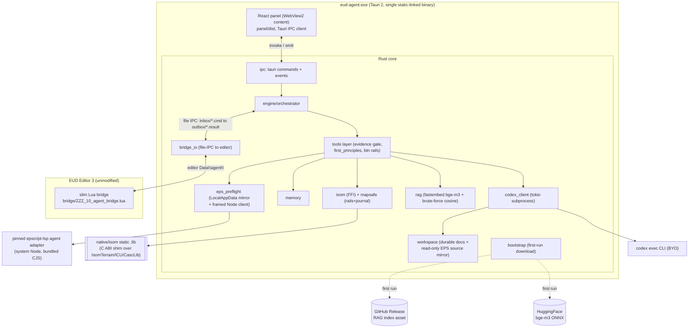
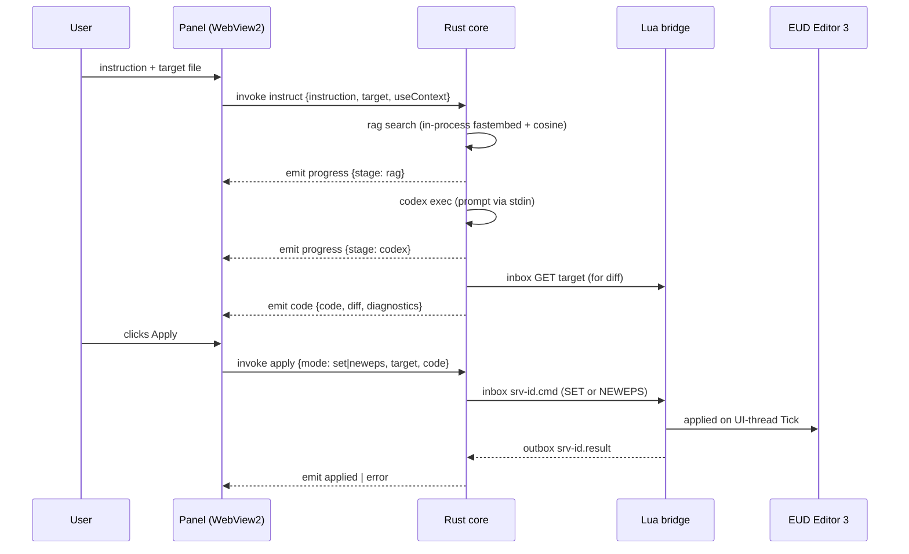
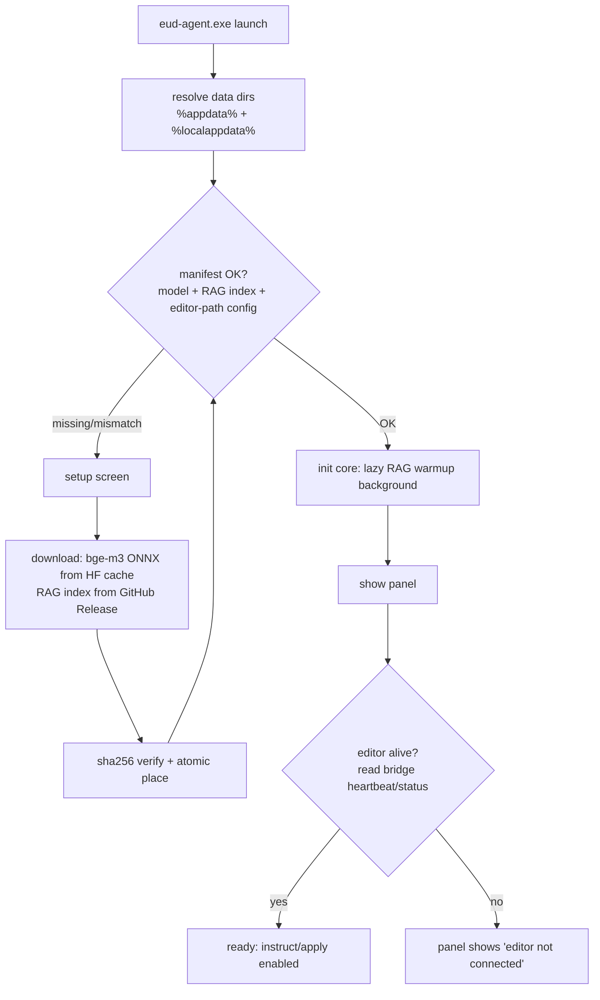

# eud-agent Architecture (v2 — Tauri + Rust)

External AI agent for EUD Editor 3 (StarCraft EUD map editor, VB.NET+WPF, .NET 4.8,
Windows-only, third-party — **never modified**). The agent turns natural-language
instructions into epScript (eps) code and applies it to the editor.

**v2 supersedes the POC topology.** The POC was a drop-in Lua bridge that spawned an
external Python FastAPI server and hosted the panel via WebView2 *inside* the editor.
v2 is a **single standalone Tauri 2 desktop app**: the whole backend is rewritten in
Rust and runs in-process, the UI is its own window, and the editor keeps only a thin
file-IPC Lua bridge. The C++ map engine (isom-poc) is vendored into this repo and
statically linked via FFI.

> Decision: see [[decisions/08_tauri-rust-rewrite]], [[decisions/09_cpp-static-lib-ffi]],
> [[decisions/10_rag-bruteforce-fastembed]], [[decisions/11_panel-tauri-ipc]],
> [[decisions/12_bootstrap-download-distribution]] — alternatives evaluated, not pursued.

## Component diagram


```mermaid
graph TD
    subgraph App["eud-agent.exe (Tauri 2, single static-linked binary)"]
        Panel["React panel (WebView2 content)<br/>panel/dist, Tauri IPC client"]
        subgraph Core["Rust core"]
            IPC["ipc: tauri commands + events"]
            Orch["engine/orchestrator"]
            Tools["tools layer (evidence gate,<br/>first_principles, btn rails)"]
            Codex["codex_client (tokio subprocess)"]
            Rag["rag (fastembed bge-m3 + brute-force cosine)"]
            Map["isom (FFI) + mapsafe (rails+journal)"]
            Bio["bridge_io (file-IPC to editor)"]
            Eps["eps_preflight (LocalAppData mirror<br/>+ framed Node client)"]
            Mem["memory"]
            Work["workspace (durable docs +<br/>read-only EPS source mirror)"]
            Boot["bootstrap (first-run download)"]
        end
    end
    Isom[["native/isom static .lib<br/>(C ABI shim over IsomTerrain/ICU/CascLib)"]]
    subgraph Editor["EUD Editor 3 (unmodified)"]
        Bridge["slim Lua bridge<br/>bridge/ZZZ_10_agent_bridge.lua"]
    end
    CodexCLI["codex exec CLI (BYO)"]
    HF[("HuggingFace<br/>bge-m3 ONNX")]
    GHR[("GitHub Release<br/>RAG index asset")]
    EpsAdapter["pinned epscript-lsp agent adapter<br/>(system Node, bundled CJS)"]

    Panel <-- "invoke / emit" --> IPC
    IPC --> Orch --> Tools
    Tools --> Codex & Rag & Map & Mem & Eps
    Codex --> CodexCLI & Work
    Map --> Isom
    Orch <-- "file IPC: inbox/*.cmd to outbox/*.result" --> Bio
    Bio <-- "editor Data\\agent\\" --> Bridge
    Eps --> EpsAdapter
    Boot -. "first run" .-> HF & GHR
```

Dependency direction: `panel -> core -> {isom .lib, editor bridge, codex, data dir}`.
The optional agent-only preflight adds
`Codex -> eud-tools -> ToolRuntime -> EpsPreflight -> bundled adapter`; it has no panel
or editor-LSP dependency. The Lua bridge never calls the app (it no longer even spawns
it); the C++ engine is a pure library with no knowledge of the app; the panel only
speaks Tauri IPC. Heavy work (LLM, RAG, orchestration, map binary I/O, analyzer process
containment) stays outside Lua; Lua remains a thin file-IPC tool layer.

## Runtime flow (instruct then apply)


```mermaid
sequenceDiagram
    participant U as User
    participant P as Panel (WebView2)
    participant C as Rust core
    participant L as Lua bridge
    participant E as EUD Editor 3
    U->>P: instruction + target file
    P->>C: invoke instruct {instruction, target, useContext}
    C->>C: rag search (in-process fastembed + cosine)
    C-->>P: emit progress {stage: rag}
    C->>C: codex exec (prompt via stdin)
    C-->>P: emit progress {stage: codex}
    C->>L: inbox GET target (for diff)
    C-->>P: emit code {code, diff, diagnostics}
    U->>P: clicks Apply
    P->>C: invoke apply {mode: set|neweps, target, code}
    C->>L: inbox srv-id.cmd (SET or NEWEPS)
    L->>E: applied on UI-thread Tick
    L-->>C: outbox srv-id.result
    C-->>P: emit applied | error
```

## Boot and first-run bootstrap


```mermaid
flowchart TD
    A[eud-agent.exe launch] --> B[resolve data dirs<br/>%appdata% + %localappdata%]
    B --> C{manifest OK?<br/>model + RAG index + editor-path config}
    C -- missing/mismatch --> S[setup screen]
    S --> D[download: bge-m3 ONNX from HF cache<br/>RAG index from GitHub Release]
    D --> V[sha256 verify + atomic place]
    V --> C
    C -- OK --> I[init core: lazy RAG warmup background]
    I --> P[show panel]
    P --> H{editor alive?<br/>read bridge heartbeat/status}
    H -- yes --> R[ready: instruct/apply enabled]
    H -- no --> W[panel shows 'editor not connected']
```

- **First run** installs into the data dirs; subsequent launches skip straight to init.
- **Lifecycle is now independent of the editor.** The app does not die when the editor
  closes; it shows "editor not connected" until the bridge heartbeat reappears. The
  POC's server-self-terminate-on-stale-heartbeat path is removed.
- **Editor liveness/build state is reversed**: the bridge writes `heartbeat.txt` and
  `status.txt`; the app *reads* them to know the editor is up and whether a build is in
  progress (busy-timeout extension on file-IPC).

## Data directory layout

Runtime state is split by size and ownership (Decision 12):

| Location | Contents | Who accesses |
|---|---|---|
| editor `Data\agent\` | `inbox/`, `outbox/`, `status.txt`, `heartbeat.txt` | bridge (writes/reads) + app (file-IPC) |
| `%appdata%\eud-agent\` | `config.json` (editor path, settings), `memory/`, durable `workspaces/`, `map_backups/`, `journal/`, `sessions/` | app; Codex can access only its current project workspace through the strict sandbox |
| `%localappdata%\eud-agent\` | `models/`, `rag/`, `bin/` (Codex CLI + Code Mode host + Windows sandbox setup helper), `logs/`, session-owned `attachments/`, regenerable `lsp_workspaces/` mirrors | app only |

The bridge finds `Data\agent\` editor-relative (no absolute path baked into the .lua —
KopiLua reads source as Latin1, so a non-ASCII path literal would corrupt). The app
reads the editor path from `config.json` (UTF-8-safe) written at install time.

## Concurrent sessions and project workspaces

`SessionEngineManager` owns lazily created workers keyed by durable session id. Each worker has
its own agent state machine, Codex app-server client/event stream, loopback MCP endpoint,
cancellation generation, request/preflight state, and immutable session event sink. A worker
mutex serializes only that session's commands, so read-only turns in different sessions overlap.

Projects share one `ProjectWriteCoordinator`, but write registration is concurrent: declaring
write intent never waits behind another session's mutation or review. The coordinator keeps a
short project transaction mutex only around each shared editor/map/memory/build operation and
canonical accept/reject step. Session-local reasoning, workspace editing, and review remain
outside that critical section.

Each project identity hashes to a canonical accepted root:

`%appdata%\eud-agent\workspaces\<sha256>\`

Codex runs from session roots:

`%appdata%\eud-agent\workspaces\.sessions\<sha256>\<session-id>\`

Before a read turn, canonical `specs/`, `plans/`, `decisions/`, and `worklog/` documents are
delta-synced into the session root and a coherent session-owned `source/` EPSNAPSHOT is refreshed.
The read sandbox makes the root read-only. Before write mode, the root is rebased again, targets
must be re-read, a trusted baseline is captured outside the Codex cwd, and the write sandbox
enables documents while keeping `source/**` read-only.

Workspace accept compares each journal baseline with current canonical bytes. Unchanged targets
promote directly, non-overlapping text edits use a three-way merge, and overlapping edits return
an explicit `ConcurrentWriteConflict` without changing canonical bytes. Promotion and trusted
metadata persistence still roll back together on failure. Reject restores only the session root.

`specs/index.md` remains the canonical project-wiki entry point. `plan_approve` writes the exact
approved Markdown to canonical `plans/<request-id>.md` only after lease grant and before the
execution baseline. It is synced to the session root, immutable, and survives implementation
rejection. Approved execution still requires a linked non-empty topic spec and verified linked
worklog, with at most two focused repair turns.

The named Windows profiles `eud_workspace_read` and `eud_workspace_write` both use minimal
runtime reads, exact-root elevated sandboxing, and disabled network. The write profile grants
only the current session root and keeps `source/**` read-only. Unsupported or denied setup fails
closed.

## File IPC protocol (app to bridge)

Unchanged transport from the POC v6 protocol: `Data\agent\inbox\<name>.cmd` processed on
the 1s UI-thread `DispatcherTimer.Tick`, reply to `outbox\<name>.result`. Files are
UTF-8 **without BOM**. The app writes `srv-<uuid8>.cmd` and polls only its own basenames;
it deletes each `.result` after consuming and clears stale inbox/outbox at startup.

Commands retained: PING, STATUS, LIST, GET, SET, NEWEPS, GETDAT/SETDAT, BUILD, LUA,
and the additive `EPSNAPSHOT <uuid>` command. EPSNAPSHOT writes collision-safe ordinal
`.eps` files plus a last-written base64-path manifest in one idle Tick; unreadable files
remain individual manifest rows. Heartbeat/status and the compiling early-return still
precede all inbox work, so no project object is touched while compiling.
Removed: the WebView2/panel-hosting commands and server-spawn handshake (PANEL is gone;
the app is the panel). SET/NEWEPS remain memory-only and CUI/RawText-only.

## Agent epScript project architecture

The existing bridge `GETMAIN` command reads `pj.TEData.MainFile` by object identity and returns
its complete project-relative `/` path. `BridgeIo::get_main` owns the protocol interpretation:
an empty success or the expected no-project reply is `None`; transport, timeout, and unexpected
bridge errors remain failures. The read-only `project_status` tool combines the unchanged raw
`STATUS` reply with this value as `mainFile: string | null`. `list_files` remains the separate
authority for path, type, and settable metadata; neither command's wire format changes.

The `[eps project architecture]` guide is present in cold-start and resumed turns. It treats the
configured MainFile as the composition root regardless of name, places behavior with the module
that owns its state and invariants, permits new modules only for cohesive narrow responsibilities,
and keeps dependencies directional and acyclic. Local fixes stay in the existing owner; the
800-nonblank-line threshold is a cohesion review signal, not a split gate. Topology, MainFile,
dependency, or responsibility changes require a complete `structure` memory replacement, and
mutually dependent candidates still use one `eps_check` batch followed by mandatory `build_run`.

## Agent-only epScript preflight

`eps_check` overlays one complete candidate batch onto the request-local project mirror,
then asks the checksum-verified `vendor/epscript-lsp-agent/adapter.cjs` process for syntax,
import-graph, dependency, and reverse-dependent diagnostics. The adapter uses the pinned
upstream generated ANTLR parser for imports and returns 1-based, bounded diagnostics.
It is advisory and non-mutating: no journal entry, admission gate, changeset, or panel
state is created. Missing Node/resource, snapshot failure, crash, malformed framing, and
timeout return a successful stable `skipped` result; the normal write and mandatory
`build_run` path remains available and authoritative.

## Repository layout (v2)

```
eud-agent/
├── hivemind/                       # harness docs + tasks
├── bridge/ZZZ_10_agent_bridge.lua  # slimmed: file-IPC tool layer only
├── src-tauri/                      # Tauri 2 Rust app
│   ├── Cargo.toml                  # workspace member
│   ├── tauri.conf.json             # bundle/resources/capabilities
│   ├── build.rs                    # links native/isom static lib
│   └── src/                        # ipc, engine, tools, codex_client, rag,
│                                   # isom, mapsafe, bridge_io, eps_preflight,
│                                   # memory, config, bootstrap, chk
├── crates/
│   ├── isom-sys/                   # FFI bindings + build.rs (msbuild + link)
│   └── isom/                       # safe Rust wrapper over isom-sys
├── native/isom/                    # vendored isom-poc C++ + C ABI shim
├── panel/                          # React app (reused); Tauri IPC client
│   └── dist/                       # build output — bundled by Tauri (gitignored)
├── ci/                             # RAG index builder + committed corpus (ci/corpus/*.jsonl)
├── tools/
│   ├── epscript-lsp-agent/         # adapter source, exact npm lock, Node tests
│   └── scraper/                    # corpus refresh tooling
├── vendor/epscript-lsp-agent/      # generated bundle, checksum, MIT license, provenance
└── scripts/                        # bridge/dev scripts + deterministic adapter regeneration
```

The RAG corpus lives in-repo at `ci/corpus/*.jsonl` (refreshed locally from authenticated Naver
data and commit-pinned public repositories, then committed in plain git — not LFS); CI re-embeds it
and publishes the static `rag-index.bin` as a GitHub Release asset, never committed here (see
[[decisions/15_in-house-rag-corpus]]; the chromadb-sqlite
churn caveat in rules.md applies only to the legacy chromadb, not the static `.bin`).

## Key design decisions (carry-over, still in force)

- SCA is fully defunct — never a settable/creatable type (CUI/RawText only).
- NEWEPS duplicate filename returns ERROR (Decision 02).
- Monaco is the edit surface; the diff tab renders the server-side unified diff
  (now produced in Rust). Agent text renders via AI Elements + Streamdown.
- Evidence gate + citations and the `[first principles]` system-prompt section are
  ported verbatim into the Rust tools/prompt layer (rules.md).
