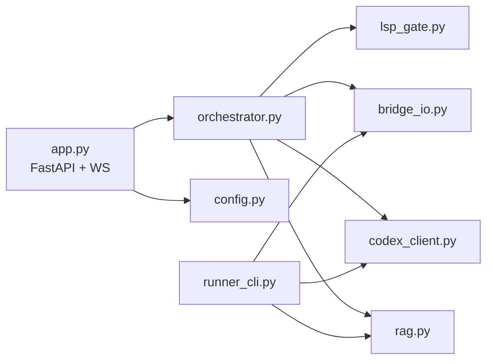

# Python Server (local FastAPI, resident)

The brain of the agent: serves the panel, orchestrates RAG -> codex -> diff -> apply, and is the only writer on the server side of the file IPC. Spawned by the bridge; self-terminates on heartbeat staleness. Module layout under `server/eud_agent/`:

## config.py

Resolution order: CLI args > env vars > `agent.cfg` (located via `EUD_DATA_DIR` env or the cfg sibling convention) > defaults. Keys: `data_dir` (editor `Data\agent`), `port` (default 8765), `codex_cmd` (default: `shutil.which("codex")` resolution at startup — fail fast if absent), `rag_db` (default `C:\Users\ifthe\proj\eud\ECA\chromadb_bge`), `repo_root`. Generates the session `token` (uuid4). `--selfcheck` mode validates every prerequisite (see verify.md smoke) without loading the model.

## bridge_io.py

- `send(command_text) -> result_text`: write `inbox\srv-<uuid8>.cmd` (UTF-8 no BOM), poll `outbox\srv-<uuid8>.result` (0.2s interval); on read, delete the `.result`. Timeout 10s; while `status.txt` reports `compiling=true` extend to 180s and invoke an `on_busy` callback (orchestrator forwards `waiting_build` to the panel). On timeout: leave the `.cmd`, raise `BridgeBusy`.
- Helpers: `ping() status() list_files() get(path) set(path, code) neweps(name, code)`. `list_files` parses `path\tEFileType` lines into `{path, ftype, settable}` (settable = ftype in CUI/SCA/RawText).
- `cleanup_stale()` at startup: delete leftover `srv-*.cmd` / `srv-*.result`.

## codex_client.py

- Startup resolution: `shutil.which("codex")` -> the `.cmd` shim absolute path; `CODEX_CMD` env overrides. No resolution -> startup error in selfcheck, runtime error event otherwise.
- Invocation: `asyncio.create_subprocess_exec(resolved, "exec", "--skip-git-repo-check", stdin=PIPE, stdout=PIPE, stderr=PIPE, cwd=repo_root)`; write the full prompt to stdin and close (never argv — 32,767-char limit; closing stdin prevents the EOF-wait hang). Timeout 600s.
- Output handling: extract fenced code blocks from stdout; multiple blocks join with blank lines; **no fences -> raise CodexNoCode with the first 500 chars of raw output** (never apply unfenced noise — codex exec stdout includes session banners/token counts).
- System prompt: imported from the verified runner (eps conventions: player loops, variable declarations, code-only output) + RAG context section.

## rag.py

In-process bge-m3 search (Decision 01). `SentenceTransformer("BAAI/bge-m3")` + `chromadb.PersistentClient(rag_db)` collection `eud_docs_bge`, opened read-only-by-convention (the DB lives outside the repo; churn is harmless there). Lazy singleton: first call loads; a background warmup thread starts at server boot and reports `rag_warmup` progress until ready. `search(query, k=5) -> [{title, url, distance, text}]`. GPU if CUDA torch present, else CPU. Never blocks `server.ready`.

> Decision: see [[decisions/01_rag-in-process]] — alternatives evaluated, not pursued.

## lsp_gate.py (advisory, optional)

If `node` resolves AND `@eps-server/server` is installed (under `server/node_modules` or global), spawn the LSP over stdio, `initialize` -> `didOpen` with the generated code -> collect `publishDiagnostics` (2s budget) -> shutdown. Map to `[{line, severity, message}]`. Any failure (missing node, package, timeout) returns `[]` and a `progress {stage: lsp, detail: skipped}` — diagnostics never block apply.

## orchestrator.py

Async state machine per instruct request: `rag (optional) -> codex -> lsp -> diff -> done`, emitting WS events at each transition. For a `set` target it fetches current content via `bridge_io.get` and produces a unified diff (`difflib.unified_diff`). Apply requests route to `set`/`neweps` with busy/timeout translation to WS events. One in-flight instruct at a time (second request -> error "busy").

## app.py / __main__.py

- FastAPI: `GET /` -> `panel/index.html`, `/static` mount -> `panel/`, `GET /healthz`, `WS /ws` (token query param + Origin check at accept; close 4403 otherwise).
- Startup: bind `127.0.0.1` on cfg port (fall back to port 0); background thread connects to its own socket until accept succeeds, then atomically writes `server.ready {port, pid, token, started_at}`; starts RAG warmup thread and the heartbeat watcher (check every 15s; `heartbeat.txt` older than 60s -> graceful shutdown, delete `server.ready`).
- `python -m eud_agent` runs the server; `--selfcheck` runs config validation and exits.

## runner_cli.py

Headless retention of the verified runner: `--once/--mock/--no-context`, jobs queue (`jobs\*.json` -> `inbox\agent_<id>.cmd`), now calling the shared `rag.py`/`codex_client.py`/`bridge_io.py` modules. Used for codex/RAG testing without the panel.

## Edge cases

- codex absent: selfcheck fails with install hint; instruct returns error event.
- RAG DB path missing: selfcheck fails; instruct degrades to no-context (with a progress note) rather than failing.
- Panel disconnects mid-instruct: orchestrator completes and discards events (no crash); next connect gets a fresh status.
- Two WS clients: allowed (same token); events broadcast.

## Implementation

- `server/pyproject.toml` — pinned deps (see tech-stack.md), uv venv
- `server/eud_agent/config.py` / `bridge_io.py` / `codex_client.py` / `rag.py` / `lsp_gate.py` / `orchestrator.py` / `app.py` / `runner_cli.py` / `__main__.py`
- `server/tests/` — pytest suite (fake bridge dir, mock codex, stubbed model)
- external: ECA `chromadb_bge` (read-only path), HF cache bge-m3 weights, codex `.cmd` shim, optional `@eps-server/server`
- [BOUND 2026-06-04 from EUD-008-cddc] `server/eud_agent/runner_legacy.py` — verified ECA codex-runner draft imported unchanged as a read-only reference; its logic is absorbed into runner_cli.py later
- [BOUND 2026-06-04 from EUD-009-6aed] `server/eud_agent/__init__.py` — package marker (empty); enables editable install so python -m eud_agent resolves from repo root
