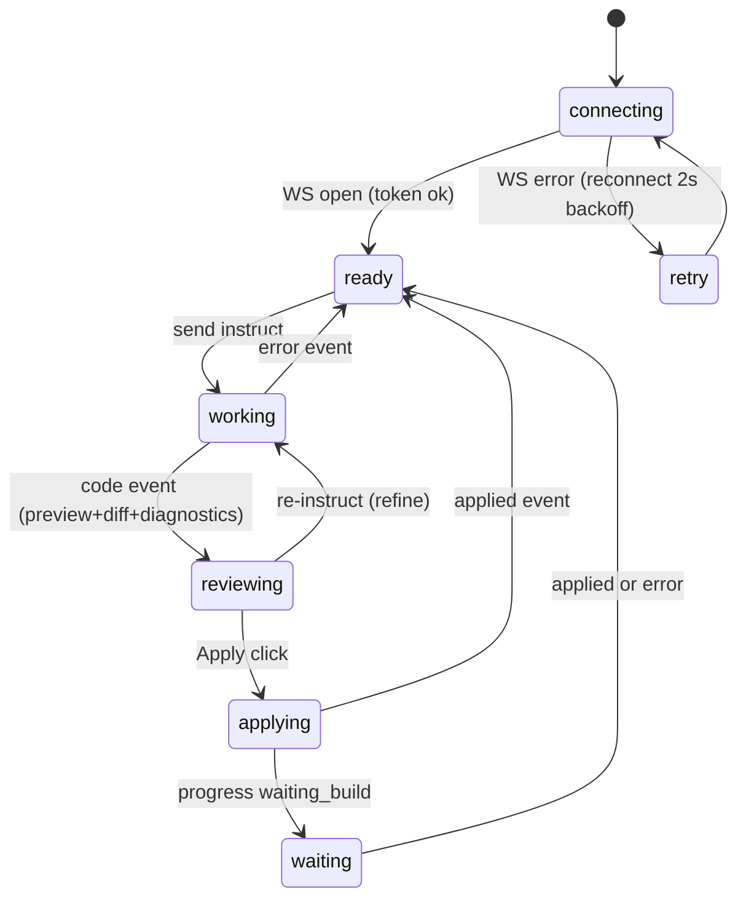

# Agent Panel (WebView2 web UI)

The user-facing surface inside the editor: a chat-style instruction box, live progress, file picker, code preview with diff, and apply controls. Served by the local server (`GET /` + `/static`); hosted in the editor by the bridge's WebView2 window. Plain HTML/JS/CSS — no framework, no build step, no CDN.

## UI layout

```
+--------------------------------------------+
| EUD Agent            [project name] [status]|
+--------------------------------------------+
| chat / event log (instructions, progress,  |
| errors, applied confirmations)             |
+--------------------------------------------+
| target: [file dropdown v] [refresh] [new]  |
| code preview / unified diff (read-only)    |
|   [preview | diff | edit] tab toggle       |
|   (edit = plain textarea)                  |
| diagnostics strip (advisory, dismissible)  |
| [Apply SET] [Apply NEWEPS]   [Cancel]      |
+--------------------------------------------+
| instruction input [textarea]      [Send]   |
+--------------------------------------------+
```

## Flow / state machine



## Behaviors

- **Connection**: read `token` from `location.search`; open `ws://<location.host>/ws?token=...`. Auto-reconnect with 2s backoff; show connection state in the header. On reconnect, re-request `status` and `list`.
- **Target picker**: populated from `list` (path + ftype); non-settable types (GUI) are shown disabled with a tooltip "read-only file type". "New file" mode switches Apply to NEWEPS with a filename input (validation: non-empty, no path separators).
- **Instruct**: sends `instruct {instruction, target, useContext}`; `useContext` checkbox (default on) toggles RAG. Progress events render as log lines (rag / rag_warmup / codex / lsp / waiting_build with spinner).
- **Review**: `code` event fills the preview. Tabs: preview (escaped `<pre>`, lang label), diff (server-provided unified diff rendered with +/- line coloring — only for SET targets), edit (textarea seeded with the code; edits are what gets applied). Diagnostics list renders below (advisory styling, never blocks Apply).
- **Apply**: sends `apply` with the current (possibly textarea-edited) code. Disabled while `applying`. `applied` event appends a confirmation with the target name; `error` shows inline with the message (e.g. duplicate NEWEPS name, editor busy).
- **Korean throughout**: UI labels in Korean; all content is UTF-8 end-to-end (no u8 issues — content arrives via HTTP/WS, not lua literals).

## Edge cases

- Server restarts (bridge respawn): WS drops -> reconnect loop recovers without user action.
- No project open: `list` returns error -> picker shows "open a project"; instruct disabled.
- RAG warming up: instruct allowed; progress shows rag_warmup until ready (server queues the search).
- Oversized code (>1MB): preview truncates display with a notice; apply still sends full text.

## Implementation

- `panel/index.html` — layout + templates
- `panel/app.js` — WS client, state machine, renderers (log, diff, diagnostics)
- `panel/style.css` — dark theme matching the editor
- external: served by `server/eud_agent/app.py`; hosted by `bridge/ZZZ_10_agent_bridge.lua` WebView2 window
