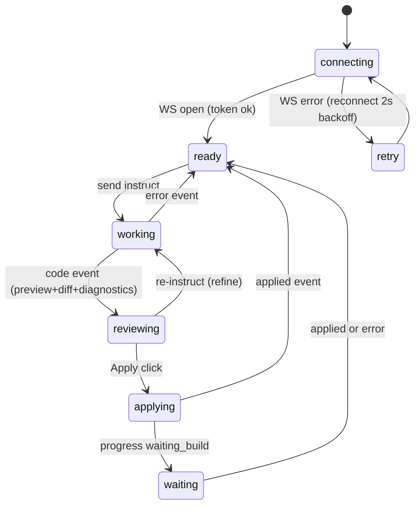

# Agent Panel (React, WebView2 web UI)

The user-facing surface inside the editor: an AI-chat-style conversation surface, live progress, file picker, code review (preview / server-diff / Monaco edit), and apply controls. Built with Vite + React + TypeScript + Tailwind + shadcn/ui primitives; served by the local server from the BUILT output `panel/dist/` (GET / + assets); hosted in the editor by the bridge's WebView2 window (Chromium 148). Zero runtime CDN — every byte ships from the local server.

> Decision: see [[decisions/03_react-panel-rebuild]] — alternatives evaluated, not pursued.
> Decision: see [[decisions/04_dist-release-distribution]] — dist never committed; release packaging is a later phase.
> Decision: see [[decisions/05_monaco-editor-adoption]] — Monaco for the edit tab; diff stays server-supplied unified diff.

> EVOLUTION NOTE (2026-06-04, EUD-034/035): Vercel AI Elements components were initially vendored per Decision 03, then REPLACED during the EUD-034 dependency pruning with custom lightweight components (the streamdown/shiki markdown pipeline inflated the eager entry to 5.58 MB; the custom composition brought it to 265 kB / 84.6 kB gzip). shadcn/ui primitives remain the component base. `panel/components/ai-elements/` no longer exists (guarded absent by the contract test); the vanilla panel files were deleted in EUD-035 (git history retains them).

## Toolchain / layout

- `panel/` is the Vite app root: `package.json`, `vite.config.ts`, `tsconfig.json`, `index.html` (Vite template), `src/`, `components/ui/` (shadcn vendored source), `dist/` (build output — gitignored, never committed; `node_modules/` gitignored).
- Stack: React 19 + TypeScript, Vite, Tailwind v4 (CSS-variables mode via `@tailwindcss/vite`), shadcn/ui vendored under `panel/components/ui/` (`components.json` aliases keep future `npx shadcn add` working). `@/` path alias: `@/components/ui/*` → vendored components; everything else → `src/`.
- Monaco: `monaco-editor` npm package + `@monaco-editor/react`, bound to the npm bundle via `loader.config({ monaco })` in `src/editor/monaco.ts` with 5 `?worker` Vite imports; lazy-split (`React.lazy` MonacoEditor wrapper) so the eager entry stays small. The wrapper's DEFAULT CDN loader is forbidden (rules.md; CDN injection path verified unreachable — EUD-031 review).
- Dev flow: `npm --prefix panel run build` on the dev machine → server serves `panel/dist/` (selfcheck requires `dist/index.html` + `dist/assets/`; failure message carries the build command). Release packaging/updater: later phase, GitHub Releases.

## UI layout

```
+----------------------------------------------------+
| EUD 에이전트            [project name]  [conn state] |
+----------------------------------------------------+
| ConversationLog: instructions, progress entries     |
|   (spinner on the active stage incl. waiting_build),|
|   errors, applied confirmations — store-capped 500  |
+----------------------------------------------------+
| target: [listbox] [refresh] [new-file toggle]       |
| [NEWEPS filename input + inline validation]         |
| ReviewTabs: [미리보기 | 변경 | 편집]                  |
|   preview = escaped <pre> + lang label (1 MiB       |
|             UTF-16-consistent truncation + notice)  |
|   diff    = server unified diff, +/- line coloring  |
|   edit    = lazy Monaco (buffer = apply source)     |
| DiagnosticsStrip (advisory, dismissible)            |
| ApplyBar: [적용 (SET)] [새 파일로 적용 (NEWEPS)] [취소] |
+----------------------------------------------------+
| InstructionBox: textarea + [컨텍스트 사용] + [전송]    |
+----------------------------------------------------+
```

## Flow / state machine (unchanged from the verified vanilla panel)



## Behaviors (live-verified against the real server, EUD-034)

- **Connection**: token from `location.search`; `ws://${location.host}/ws?token=...`; 2s-backoff auto-reconnect; ONE disconnect log entry per outage (was-open tracking); status+list re-requested on every open; NEVER branch on WS close codes (browsers surface the pre-accept 4403 as a 1006 handshake failure).
- **instruct.target contract**: ALWAYS the picker's selected settable file — in new-file mode too (the server GETs the target for the diff stage; new files are created only via apply mode=neweps). An empty-but-open project cannot instruct (no diff target); new-file APPLY stays available once a review exists.
- **Target picker**: accessible custom listbox (no Radix portal); settable=false (GUI) options disabled with tooltip "읽기 전용 파일 형식"; no-project → placeholder "프로젝트를 열어주세요" (triggered by the contractual `no project` bridge error literal), instruct disabled.
- **Review**: code {code, lang, diff, diagnostics} → preview/diff/edit; the Monaco buffer is the single source of truth for Apply; diff hidden in new-file mode; >1 MiB preview truncation measured AND sliced in UTF-16 code units with a notice (apply sends full text).
- **Diagnostics**: advisory strip, dismissible, structurally cannot block Apply.
- **Apply**: SET {mode:"set", target, code(Monaco buffer)}; NEWEPS {mode:"neweps", target:<validated filename>, code}; duplicate → server ERROR shown; buttons store-gated; applied → confirmation entry.
- **Korean labels throughout**; store preserves `status.compiling` for future surfacing.

## Edge cases (parity, live-verified)

- Server death: ONE disconnect log + crash-free retry loop; after a respawn the BRIDGE re-navigates to the fresh-token URL (panel-side reconnect alone cannot — new token).
- RAG warming up: rag_warmup progress until ready.
- Empty-but-open project: SET path gated; NEWEPS apply available post-review.
- Reconnect during applying/waiting: state resets to ready (no stuck state).

## Verification contract

- `server/tests/test_panel_static.py` (15 checks): package.json deps (react/vite/tailwindcss/monaco), dev/build/preview scripts, src/ present, shadcn ui vendored, `panel/components/ai-elements/` ABSENT (regression guard), vanilla `panel/app.js`/`panel/style.css` DELETED (guards), dist+node_modules gitignored, no-BOM, no external origins in the template AND in built dist/index.html (skip-aware when dist absent).
- Runtime verification: real browser against the real server + fake-bridge IPC responder (orchestrator-driven; EUD-034 report) — connect/list/instruct/RAG/codex/diff/Monaco/apply-SET-roundtrip/NEWEPS validation+duplicate+fresh/reconnect/heartbeat-self-termination.
- `npm --prefix panel run build` exits 0 — the panel stage in verify.md.

## Implementation

- `panel/package.json` / `vite.config.ts` / `tsconfig*.json` / `vitest.config.ts` — toolchain (runtime deps: @monaco-editor/react, class-variance-authority, clsx, lucide-react, monaco-editor, radix-ui, react, react-dom, tailwind-merge)
- `panel/src/main.tsx` / `App.tsx` — app shell (client↔store↔components wiring)
- `panel/src/ws/protocol.ts` / `client.ts` — typed WS protocol + reconnecting client
- `panel/src/state/store.ts` — state machine + log cap + gating
- `panel/src/lib/truncate.ts` / `diff.ts` — preview truncation + diff line classification
- `panel/src/lib/progress.ts` — pure progress→label mapping (`progressLabel(stage, detail)`); reflects `rag_warmup` detail started/done/error so completion is shown (EUD-041)
- `panel/src/components/` — Header, ConversationLog, TargetPicker, InstructionBox, ReviewTabs, MonacoEditor (lazy), DiagnosticsStrip, ApplyBar
- `panel/src/editor/monaco.ts` — local-bundle Monaco loader config + workers
- `panel/components/ui/` — vendored shadcn/ui source
- external: served by `server/eud_agent/app.py` from `panel/dist/`; hosted by `bridge/ZZZ_10_agent_bridge.lua` WebView2 window
