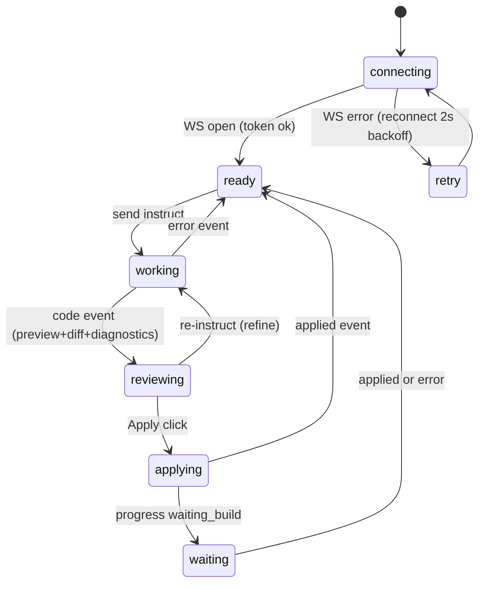

# Agent Panel (React + Vercel AI Elements, WebView2 web UI)

The user-facing surface inside the editor: an AI-chat-native conversation surface, live progress, file picker, code review (preview / server-diff / Monaco edit), and apply controls. Built with Vite + React + TypeScript + Tailwind + shadcn/ui + Vercel AI Elements; served by the local server from the BUILT output `panel/dist/` (GET / + assets); hosted in the editor by the bridge's WebView2 window (Chromium 148). Zero runtime CDN — every byte ships from the local server.

> Decision: see [[decisions/03_react-panel-rebuild]] — alternatives evaluated, not pursued.
> Decision: see [[decisions/04_dist-release-distribution]] — dist never committed; release packaging is a later phase.
> Decision: see [[decisions/05_monaco-editor-adoption]] — Monaco for the edit tab; diff stays server-supplied unified diff.

## Toolchain / layout

- `panel/` is the Vite app root: `package.json`, `vite.config.ts`, `tsconfig.json`, `index.html` (Vite template), `src/`, `components/` (shadcn + ai-elements vendored source), `dist/` (build output — gitignored, never committed; `node_modules/` gitignored).
- Stack: React 19 + TypeScript, Vite, Tailwind v4 (CSS-variables mode via `@tailwindcss/vite`), shadcn/ui initialized for Vite, Vercel AI Elements components vendored shadcn-style into the repo (`npx ai-elements@latest` / shadcn registry — components are SOURCE in our tree, customizable, no runtime registry/CDN dependency). `@/` path alias per shadcn convention.
- Monaco: `monaco-editor` npm package + `@monaco-editor/react`, configured with `loader.config({ monaco })` against the npm bundle and explicit Vite worker wiring. The wrapper's DEFAULT CDN loader is forbidden (rules.md).
- AI Elements components are presentational here: the Vercel AI SDK `useChat` transport does NOT fit the custom WS protocol; a thin adapter drives the components from our own WS state. Expected components: `Conversation`/`Message` (chat log), `PromptInput` (instruction box), `CodeBlock` (read-only preview with eps label), plus shadcn primitives (Select, Tabs, Checkbox, Button, Alert).
- Dev flow: `npm run build` on the dev machine → server serves `panel/dist/`. (`npm run dev` Vite server is for component work only; the integrated path is always the built dist.) Release packaging/updater: later phase, GitHub Releases.

## UI layout

```
+----------------------------------------------------+
| EUD Agent              [project name]  [conn state] |
+----------------------------------------------------+
| Conversation (AI Elements):                         |
|   user instructions, progress lines (spinner on     |
|   active stage), errors, applied confirmations      |
|   — capped at 500 entries (oldest dropped)          |
+----------------------------------------------------+
| target: [file Select v] [refresh] [new-file toggle] |
| [neweps filename input + inline error] (new mode)   |
| code review area:                                   |
|   [preview | diff | edit] Tabs                      |
|   preview = CodeBlock (read-only, lang label)       |
|   diff    = server unified diff, +/- line coloring  |
|   edit    = Monaco editor (eps as plaintext)        |
| diagnostics strip (advisory, dismissible)           |
| [Apply SET] [Apply NEWEPS] [Cancel]                 |
+----------------------------------------------------+
| PromptInput: instruction + [useContext] + [Send]    |
+----------------------------------------------------+
```

## Flow / state machine (unchanged from the verified vanilla panel)



## Behaviors (feature parity with the verified vanilla panel + advisory fixes)

- **Connection**: token from `location.search` (URLSearchParams); `ws://${location.host}/ws?token=...`. Auto-reconnect with 2s backoff; connection state in the header. On (re)connect re-request `status` and `list`. FIX (vanilla advisory): the retry handler must set the state flag in `onerror` (or track was-open) so an outage logs ONE disconnect line, not one per 2s cycle.
- **Event log**: capped at 500 entries — drop oldest (vanilla advisory fix). Unknown WS message types append a log line and never throw.
- **Target picker**: from `list {files:[{path,ftype,settable}]}`; non-settable (GUI) options disabled with tooltip "읽기 전용 파일 형식". List error / no project → placeholder "프로젝트를 열어주세요", instruct disabled. FIX (vanilla advisory): an open-but-empty project (zero files) also disables Send for SET mode (no valid target), while new-file mode stays available.
- **Instruct**: `instruct {instruction, target, useContext}`; useContext checkbox default ON. Send disabled while working/applying/waiting. Progress stages rag / rag_warmup / codex / lsp / waiting_build render as conversation entries with a spinner on the active stage.
- **Review**: `code {code, lang, diff, diagnostics}` → preview tab (CodeBlock, escaped, lang label; display truncated at 1 MiB measured AND sliced in the same UTF-16 code-unit metric — vanilla advisory fix — with a notice; Apply always sends full text), diff tab (server-supplied unified diff rendered with per-line +/- coloring; hidden in new-file mode), edit tab (Monaco seeded with the code — the Monaco buffer is the single source of truth for Apply).
- **Diagnostics**: advisory strip below the review area; dismissible; NEVER blocks Apply.
- **Apply**: SET → `apply {mode:"set", target, code}`; NEWEPS → `apply {mode:"neweps", target:<filename>, code}` with filename validation (non-empty after trim; no `/` or `\`). Buttons disabled while applying; `applied {target}` → confirmation entry; `error {message}` → inline (new-file mode) + conversation entry. waiting_build → waiting state with spinner.
- **Korean labels throughout**; all content UTF-8 end-to-end.

## Edge cases (parity)

- Server restart (bridge respawn): WS drops → reconnect loop recovers without user action.
- RAG warming up: instruct allowed; rag_warmup progress until ready.
- Oversized code (>1 MiB): preview truncates display with a notice; apply sends full text.
- Panel reconnect during applying: state resets to ready on reconnect (a lost applied confirmation is acceptable; no stuck state).

## Verification contract

- `server/tests/test_panel_static.py` (revised for React): asserts `panel/package.json` exists with the committed stack (react, vite, tailwindcss, monaco-editor present; NO dependency fetched from a CDN at runtime — no http(s) URLs in built `dist/index.html` script/link tags when dist exists), `panel/src/` structure present, vendored ai-elements components present, `panel/dist/` is gitignored. Checks that need a build (dist content scan) SKIP with a note when `panel/dist/` is absent.
- Runtime verification: real browser against a mock WS server (orchestrator-driven), covering connect/list/instruct/progress/code/diff/Monaco-edit/apply/NEWEPS-validation/duplicate-error/reconnect — same checklist that validated the vanilla panel.
- `npm run build` exits 0 — the panel stage in verify.md.

## Implementation

- `panel/package.json` / `vite.config.ts` / `tsconfig.json` — toolchain (pins re-grounded after scaffold)
- `panel/src/main.tsx` / `panel/src/App.tsx` — app shell
- `panel/src/ws/client.ts` — WS protocol client (typed messages, reconnect, log cap) — adapter between the protocol and React state
- `panel/src/state/` — panel state machine (connecting/ready/working/reviewing/applying/waiting/retry)
- `panel/src/components/` — panel-specific components (picker, review tabs, diagnostics, apply bar)
- `panel/components/ai-elements/` — vendored Vercel AI Elements source
- `panel/components/ui/` — vendored shadcn/ui primitives
- `panel/src/editor/monaco.ts` — local-bundle Monaco loader config + workers
- external: served by `server/eud_agent/app.py` from `panel/dist/`; hosted by `bridge/ZZZ_10_agent_bridge.lua` WebView2 window
