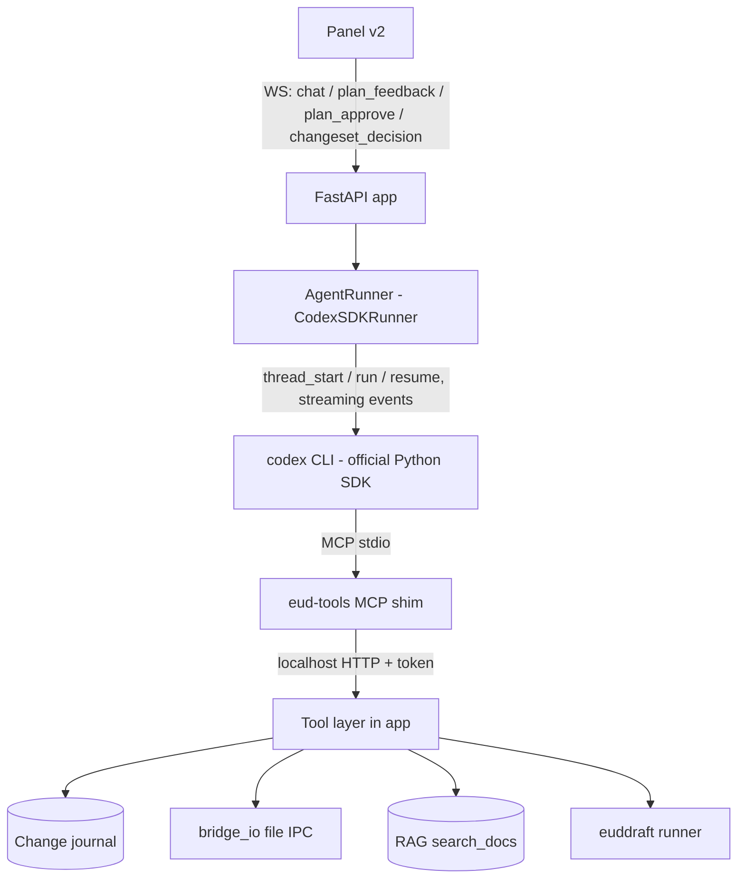

# Agent Core (server: codex SDK runner + eud-tools MCP + journal)

The v2 brain: replaces the v1 single-shot instruct flow (RAG → one codex exec → code event → manual apply) with an agentic loop where codex autonomously calls editor tools in real time. The server stays the policy layer: tool validation, change journal, budgets, plan gating, rollback.

## Engine (single path)

- **Official Codex Python SDK** (openai/codex `sdk/python`): `Codex`/`AsyncCodex`, `thread_start()`, `thread.run(prompt)` → TurnResult; streaming JSONL events forwarded to the panel as `agent_event`s. BYO account unchanged; the SDK spawns the same codex binary (resolve via `shutil.which` family rules still apply to any direct spawn).
- **Conversation continuity (binding — EUD-064, user bug report 2026-06-05)**: the FIRST `chat` of a session starts the codex thread (system prompt as `base_instructions`); EVERY subsequent `chat` RESUMES the same thread (`thread_resume`) so codex retains its own message + tool-call history. A `chat`-per-`thread_start` flow (what v2 initially shipped) is a defect: the agent forgets the previous message. `reset{}` (and a WS reconnect) drops the retained thread id so the next chat starts a fresh conversation. Resumed chats PREPEND refreshed `[project state]` + `[reference context]` (RAG for the new question) to the turn text — `base_instructions` exist only on the first thread.
- **Spike-first**: the first task proves install name, thread lifecycle, MCP server attachment (per-thread config injection vs `codex mcp add`), streaming, and Windows behavior before anything builds on it.
- **eud-tools MCP server**: codex attaches a stdio shim (`python -m eud_agent.mcp_shim`) that forwards JSON-RPC to the running FastAPI server over `127.0.0.1` with the `server.ready` token. All tool logic, validation, journaling, and budget live in the FastAPI process — the shim is dumb transport.
- No LangChain/LangGraph: the outer flow is a small deterministic state machine (`idle → triage → answer | apply | plan_review* → executing → changeset_review → idle`) driven by WS events. Revisit only if v3 needs multi-agent graphs.

## Tools (registry)

Read: `project_status`, `list_files`, `read_file`, `dat_get`, `xdat_get`, `tbl_get`, `req_get`, `btn_get`, `settings_get`, `plugins_list`, `build_errors`, `search_docs` (RAG top-k over the ECA store).
Write (journaled): `dat_set`, `xdat_set`, `tbl_set`, `req_set`, `btn_set`, `dat_reset`, `file_create`, `file_write`, `file_rename`, `file_delete`, `file_move`, `mkdir`, `set_main`, `settings_set`, `plugin_add`, `plugin_edit`, `plugin_remove`, `plugin_move`, `build_run`.
Flow: `propose_plan(markdown)` — ends the turn for user review (see below).

Every tool validates args server-side (numeric ranges, index bounds, type whitelists, FileType guards) BEFORE the bridge call — the bridge's ERROR is the second line of defense, not the first.

## Request scoping across a continuous thread (EUD-064)

- Each `chat` still mints a fresh `request_id` — the journal/changeset scope, the mutation gate, and the action budget all stay PER-REQUEST. Only the codex THREAD persists across chats.
- The shim env `EUD_REQUEST_ID` is pinned at thread creation and goes STALE once the second chat resumes the thread. The server therefore resolves the live request id at tool-call time: the tool endpoint stamps the engine's CURRENT request id onto every call from an active panel session, ignoring the shim-supplied id (which remains only a fallback for the legacy headless runner / no-session calls).
- A `reset{}` arriving in `changeset_review` finalizes the prior request first (undecided items default-accept + archive), exactly like a new `chat`.

## Triage and plan gating (mechanical, not advisory)

- The system prompt instructs: answer-only requests use no write tools; small edits (≤2 mutations) may apply directly; larger work must `propose_plan` first.
- Enforcement: the tool layer counts mutations per request. The 3rd mutating call WITHOUT an approved plan returns a tool error directing codex to `propose_plan`. After `plan_approve`, the mutation gate lifts for that request.
- `propose_plan` ends the codex turn; the panel renders the plan; `plan_feedback{text}` resumes the thread with the feedback (iterate, re-propose); `plan_approve{}` resumes with the approval instruction.
- Budgets: **30 tool actions per request** (31st rejected; agent told to wrap up; panel asked whether to continue with a fresh budget) and **3 build self-fix attempts** (build_run → errors → fixes → retry counts as one attempt).

## Change journal and rollback

- Every write tool snapshots BEFORE mutating: dat/xdat/tbl/req/btn → old value (+ `was_default` flag); file_write → old content; file_create/mkdir → created marker; file_delete → full content + position; file_rename/move → old path; set_main → old main path; settings/plugins → old value/Texts/index.
- Entries: `{id, seq, tool, target, before, after, ts}` accumulated per request; persisted as JSON to `<data-dir>/journal/<request-id>.json` (UTF-8 no BOM) so a server crash cannot strand un-reviewable changes.
- On turn completion the server emits `changeset{request_id, items[]}` (dat items grouped per objId with property/old/new; file items with kind created|modified|deleted and server-side unified diff for modified).
- `changeset_decision{reject, ids|all}` → inverse ops via the bridge in reverse seq order (dat_set old / RESETDAT when was_default / file_write old / DELFILE created / NEWFILE+content for deleted / RENAME back / SETMAIN old / SETSET old / PLUG inverse). `accept` → journal archived. Mixed per-item decisions supported; un-decided items default to accepted on next request (journal archived with a note).
- Editor-side risk: the user can save/build between apply and reject — rollback still applies inverse values (memory-only model, same as any edit); the panel warns that reject after a manual save still requires a re-save by the user.

## Build error retrieval and self-fix

1. `build_run` → bridge BUILD (SCArchive forced off, preflight paths) → poll `status.txt` compiling until false (timeout 300s).
2. Errors: bridge `BUILDERR` (macro.macroErrorList). If the build failed with no macro errors, the server re-runs `euddraft.exe <eds>` directly (paths from bridge `EDSPATH`, euddraft path from `settings_get program euddraft`) with captured stdout/stderr — explicit stdin per codex rules — and parses with the editor's documented BuildErrorHandling regex formats.
3. Parsed errors are returned via `build_errors` so codex can self-fix (≤3 attempts), after which the changeset is presented with the failure noted.

## WS protocol v2

Client→server: `chat{text}`, `plan_feedback{text}`, `plan_approve{}`, `changeset_decision{accept|reject, ids|all}`, `cancel{}`, `reset{}` (drop the retained codex thread — next chat starts a fresh conversation; EUD-064), `status{}`, `list{}` (kept for header).
Server→client: `agent_event{kind, detail}` (streamed: thinking/tool_call/tool_result/turn_done; **`reasoning`** carries a reasoning-text delta in `detail` — `item/reasoning/summaryTextDelta` + `item/reasoning/textDelta`; **`delta`** carries an answer-text delta in `detail` — EUD-063), `answer{text}`, `plan{markdown, revision}`, `changeset{request_id, items[]}`, `rollback_result{ids, ok}`, `error{message}`, `status{...}`, `progress{stage,...}` (kept: rag_warmup etc.).
v1 `instruct`/`apply`/`code`/`applied` messages are REMOVED (panel v2 replaces the flow; no compat shim).

## Verification contract

- Unit tests: tool validation (bounds/whitelists/guards), journal inverse-op correctness per tool kind (property-based on snapshot→rollback round-trips against a fake bridge), mutation gate (3rd write without plan → error), budgets, euddraft output parser fixtures.
- Integration: fake-bridge IPC responder + real WS client driving chat→changeset→reject-single→verify inverse .cmd sequence (pattern proven in EUD-034).
- Spike artifact: a transcript proving codex SDK thread + eud-tools MCP round-trip on Windows.

## Implementation

- `server/eud_agent/agent_runner.py` — AgentRunner interface + CodexSDKRunner
- `server/eud_agent/mcp_shim.py` — stdio MCP server shim (spawned by codex)
- `server/eud_agent/tools.py` — registry, validation, mutation gate, budgets
- `server/eud_agent/journal.py` — snapshots, persistence, inverse ops
- `server/eud_agent/edd_runner.py` — euddraft direct runner + error regexes
- `server/eud_agent/app.py` — WS v2 message routing; `orchestrator.py` v1 flow retired
- `server/tests/test_tools.py` / `test_journal.py` / `test_agent_flow.py` / `test_edd_runner.py`
- external: official Codex Python SDK; `mcp` Python package (server side of the shim)
- [BOUND 2026-06-05 from EUD-053-f3ac] `server/spikes/spike_codex_sdk.py` + `server/spikes/dummy_mcp_tool.py` — EUD-053 spike artifacts proving codex SDK thread lifecycle + per-thread MCP attachment (config injection) + tool round-trip on Windows; run manually only (spends real codex tokens)
