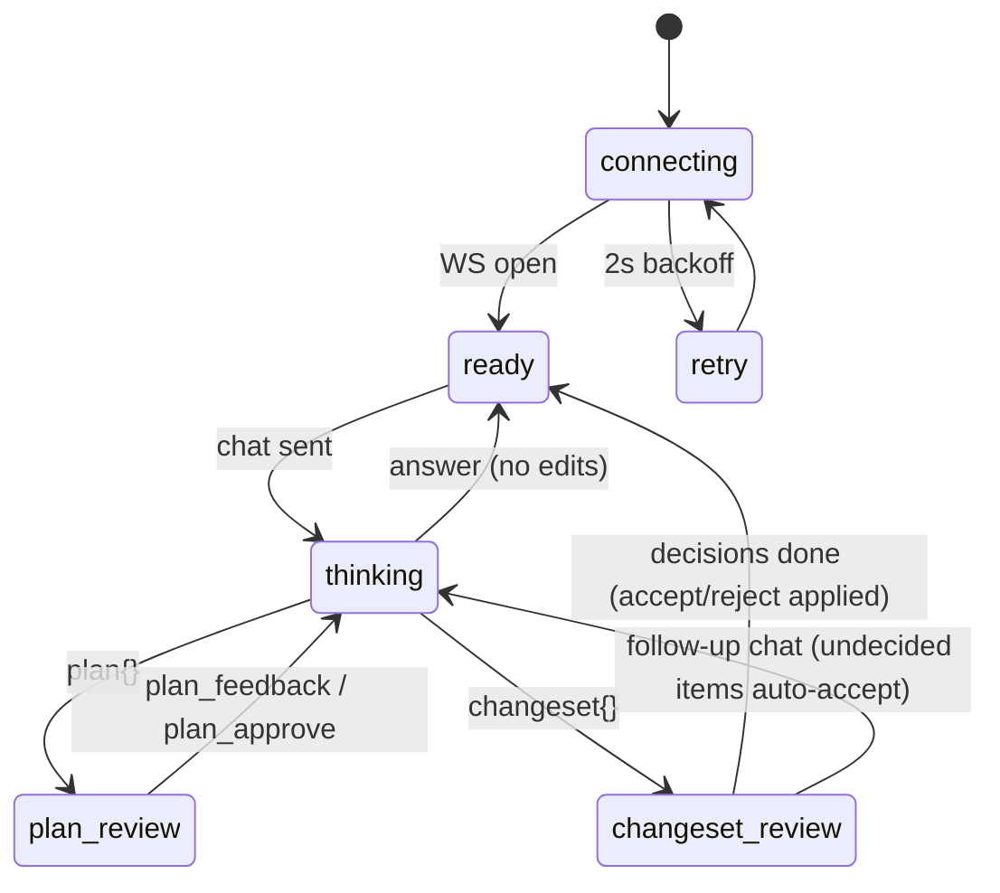

# Changeset Review Panel (panel v2: chat-first, plan + accept/reject)

Replaces the v1 target-picker/apply-bar flow ENTIRELY (user decision: full replacement — the agent chooses files/targets itself). The panel becomes a chat-first surface with three review affordances: streamed agent progress, plan review with feedback iteration, and an apply-then-review changeset with per-item and bulk accept/reject.

**UI foundation (user decision 2026-06-05 — supersedes the earlier "dep pruning / no streamdown" carry-forward)**: the surface is built on vendored **Vercel AI Elements** components — mandatory: `Message`, `PromptInput`, `Plan` (plan approval), `Reasoning`; adopted alongside: `Conversation` (auto-scroll container), `Response` (message body), `Tool` (tool-call rows), `Loader`. Vendored SOURCE under `panel/components/ai-elements/` (fetched at dev time, committed — never a runtime CDN). ALL agent-authored markdown renders through **Streamdown** (streaming-safe markdown, npm-bundled) so text renders live as deltas arrive. See [[decisions/06_ai-elements-streamdown-adoption]].

## UI layout

```
+----------------------------------------------------+
| EUD 에이전트   [project]  [conn: 연결중|연결됨|재연결] |
|                [RAG: 로드중 nn초|준비됨|불가]          |
+----------------------------------------------------+
| Conversation (auto-scroll):                          |
|   user Message bubbles                               |
|   Reasoning block (dim, collapsible — auto-open      |
|     while streaming, collapses on finish)            |
|   Tool rows (tool calls by name, live)               |
|   agent Message · Response (Streamdown, streams      |
|     PROMINENTLY as delta text arrives)               |
|   plan cards · changeset cards (inline, history)     |
+----------------------------------------------------+
| [Plan (ai-elements) - when plan{} active]            |
|   Streamdown render · 피드백 입력 · [수정요청] [승인]  |
+----------------------------------------------------+
| [ChangesetView - when changeset{} active]           |
|   Data: unit [76] 마린                               |
|     · HP  40 → 80          [✓ accept] [✗ reject]    |
|     · Gas 0 → 25           [✓] [✗]                  |
|   Files:                                            |
|     · +created teleport.eps (preview)   [✓] [✗]     |
|     · ~modified main.eps (unified diff) [✓] [✗]     |
|     · -deleted old.eps                  [✓] [✗]     |
|   Settings/Plugins/Main: old → new rows  [✓] [✗]    |
|   [전체 적용 유지] [전체 되돌리기]                      |
+----------------------------------------------------+
| PromptInput: textarea + [전송] · [새 대화]            |
+----------------------------------------------------+
```

## State machine



Reconnect during thinking resets to ready with a notice (server cancels the thread turn); the last changeset stays reviewable (journal is server-persisted).

## Behaviors

- **Send gating v2**: `connected && hasProject && !busy` — the settable-target requirement is GONE (the agent creates files itself). No-project keeps the v1 placeholder behavior.
- **Status visibility** (user request 2026-06-05): header shows connection state transitions (연결 중 → 연결됨 → 재연결 중) and RAG model state with elapsed seconds while loading (`rag_warmup` started ts → done), reusing `progressLabel`.
- **Agent stream (EUD-063 contract)**: per-turn `agent_event`s drive three surfaces — (1) `reasoning` deltas accumulate into the **Reasoning** component: dim/secondary, GPT-style, auto-open while streaming, collapses when the answer starts; (2) `delta` answer text streams into a PROMINENT (foreground) agent **Message/Response** via Streamdown; (3) `tool_call`/`tool_result` render as **Tool** rows showing the tool name (도구 호출 n건 summary retained). Raw internal kind identifiers (`delta`, `answer`, `token_usage`, `turn_done`, `item_started`, `item_completed`, `event`) MUST NEVER appear as literal UI text. All per-turn surfaces reset when a new turn starts.
- **Answer prominence**: agent answers are the most visible text in the log (foreground Message bubbles, Streamdown-rendered); system/progress/info rows stay muted. (Inverts the original v2 styling where answers were muted.)
- **Plan review**: ai-elements **Plan** component; plan markdown renders via Streamdown (replaces the EUD-060 hand-rolled line renderer); 피드백 textarea sends `plan_feedback` (stays in plan_review, next `plan{revision+1}` replaces card); 승인 sends `plan_approve`.
- **New conversation**: a [새 대화] control sends `reset{}` (server drops the codex thread per features/05 EUD-064) and clears the client log/plan/changeset state. Disabled while a turn is in flight.
- **Changeset review**: restyled with ai-elements primitives; renders `changeset.items[]` grouped: dat per objId (unit name resolved server-side) with property/old→new; files by kind (created → content preview, modified → server unified diff with +/- coloring (unchanged rule: no Monaco DiffEditor), deleted → name); settings/plugins/main as old→new rows. Each item has accept/reject; bulk buttons map to `changeset_decision{all}`. Reject responses (`rollback_result`) flip the row to 되돌림 state; failures surface inline. The `lib/changeset.ts` id-shape helpers (`itemKey`/`itemIds`) remain the single source of dat-group identity.
- **Diff/preview limits**: reuse v1 truncation (1 MiB UTF-16-consistent) for previews/diffs.
- **Diagnostics**: epscript-lsp advisory strip retained for files the agent wrote (server includes diagnostics per modified/created eps in the changeset item).
- **Removed**: TargetPicker, ApplyBar, ReviewTabs as apply-source, NEWEPS filename input, `canSendSet/canSendNewEps` gating, Monaco edit-buffer-as-apply-source. Monaco remains only as a lazy read-only viewer for file previews/diffs if needed by ChangesetView.
- Korean labels throughout; log cap 500 retained.

## Verification contract

- vitest unit suites: state machine transitions (incl. reconnect mid-thinking and changeset persistence), changeset grouping/rendering logic, plan revision replacement, decision dispatch payloads, status header (elapsed-time formatting), reasoning/answer-delta accumulation + reset-per-turn, and a no-raw-kind-leak test (a noise-kind event sequence must not surface literal kind strings).
- `npm --prefix panel run build` exits 0; static contract test updated (target-picker/apply-bar components ABSENT guards replacing the v1 presence checks); the built-dist external-origin scan stays green with Streamdown (all highlighter/math assets npm-bundled — no runtime CDN).
- Live E2E: the three v2 acceptance scenarios (see plan) drive this UI in the editor.

## Implementation

- `panel/src/ws/protocol.ts` / `client.ts` — WS v2 message types (v1 instruct/apply removed; + `reset{}`, `reasoning`/`delta` agent_event kinds)
- `panel/src/state/store.ts` — state machine v2 + changeset/plan state
- `panel/src/components/` — InstructionBox→PromptInput wrapper, AgentStream (Reasoning+Tool+streamed Response), PlanView (Plan component), ChangesetView, Header (status visibility), ConversationLog (Conversation+Message)
- `panel/components/ai-elements/` — vendored AI Elements source (Conversation, Message, Response, PromptInput, Plan, Reasoning, Tool, Loader)
- `panel/src/lib/progress.ts` — extended labels (elapsed time)
- `panel/src/lib/changeset.ts` — dat-group id-shape helpers (itemKey/itemIds) shared by view + store
- removed: `TargetPicker.tsx`, `ApplyBar.tsx`, ReviewTabs apply wiring
- external: `streamdown` (npm, bundled — real-time markdown); served by `server/eud_agent/app.py`; protocol per [[features/05_agent-core|05_agent-core]] `05_agent-core.md`
