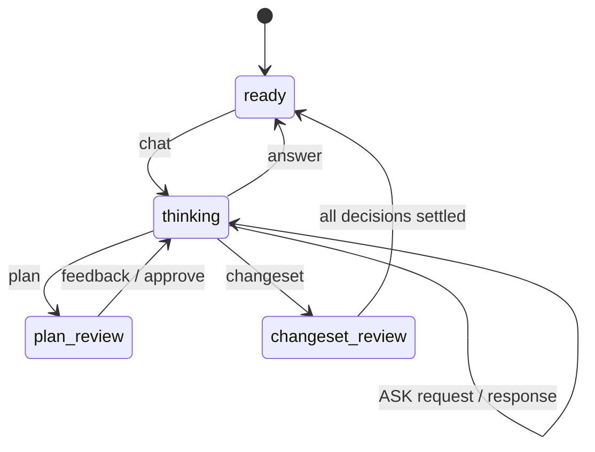

# Changeset Review Panel (panel v2: chat-first, plan + accept/reject)

Replaces the v1 target-picker/apply-bar flow ENTIRELY (user decision: full replacement — the agent chooses files/targets itself). The panel becomes a chat-first surface with three review affordances: streamed agent progress, plan review with feedback iteration, and an apply-then-review changeset with per-item and bulk accept/reject.

**UI foundation (user decision 2026-06-05 — supersedes the earlier "dep pruning / no streamdown" carry-forward)**: the surface is built on vendored **Vercel AI Elements** components — mandatory: `Message`, `PromptInput`, `Plan` (plan approval), `Reasoning`; adopted alongside: `Conversation` (auto-scroll container), `Response` (message body), `Tool` (tool-call rows), `Loader`. Vendored SOURCE under `panel/components/ai-elements/` (fetched at dev time, committed — never a runtime CDN). ALL agent-authored markdown renders through **Streamdown** (streaming-safe markdown, npm-bundled) so text renders live as deltas arrive. Agent answers and plan cards enable the bundled `@streamdown/mermaid` plugin; project/workspace Markdown retains its existing renderer scope. See [[decisions/06_ai-elements-streamdown-adoption]].

## UI layout

```text
+-------------------+--------------------------------+----------------------+
| SessionSidebar    | selected session               | ProjectSidebar       |
| + 새 세션          | Header + conversation          | DAT wiki / memory /  |
| current project   | ASK + plan + changeset + input | workspace tabs       |
| read / write wait  |                                |                      |
| write / review     |                                |                      |
+-------------------+--------------------------------+----------------------+
```

The left sidebar is primary conversation navigation; selection is independent from the session
currently running. The center is keyed by selected session id and owns all session decisions.
The right sidebar is project-scoped contextual data. At narrow widths the left collapses to a
rail and the right becomes an overlay, preserving the center chat width.

## Conversation and project-write state

Each `PanelStore` keeps its existing conversation phase:


```mermaid
stateDiagram-v2
    [*] --> ready
    ready --> thinking: chat
    thinking --> ready: answer
    thinking --> thinking: ASK request / response
    thinking --> plan_review: plan
    plan_review --> thinking: feedback / approve
    thinking --> changeset_review: changeset
    changeset_review --> ready: all decisions settled
```

Backend `session_activity` is orthogonal:

```text
idle | running_read | waiting_input | running_write | review | error
```

Chats are invoked immediately and different rows may be `running_read` together. Only declared
project writes queue. A changeset review keeps the project write lease and blocks later writers,
while ready sessions remain usable for read-only turns. Reconnect restores a pending review before
new writers.

## Behaviors

- **Send gating v2**: `connected && hasProject && !busy` — the settable-target requirement is GONE (the agent creates files itself). No-project keeps the v1 placeholder behavior.
- **Attachments**: the PromptInput accepts up to 5 files through the picker,
  drag-and-drop, or pasted clipboard images. PNG/JPEG/WebP/GIF files (≤10 MiB)
  are sent to Codex as `localImage` inputs; UTF-8 text/code files (≤512 KiB
  combined per turn) are delimited into the user text. Unsupported binaries are
  rejected. A message may contain attachments without text. Selected files render
  as removable chips (generated image thumbnail + name + size), and the same
  attachment cards persist in user-message history. Files cross Tauri IPC as a raw
  `Uint8Array`, are stored under LocalAppData by opaque UUID, bound to the active
  session on send, and deleted with that session. `chat` and `plan_feedback` carry
  only the staged attachment ids. The Tauri window sets `dragDropEnabled=false` so
  WebView2 delivers normal HTML5 file-drop events on Windows instead of consuming
  them in Tauri's native handler.
- **Codex model controls**: the PromptInput footer contains compact model + reasoning selectors populated from the authenticated app-server `model/list` catalog. Changing the model selects that model's advertised default effort; changing either control persists the coherent pair and applies it to the next turn. Selects lock while loading/saving or while a turn is in flight, and a failed catalog load leaves an inline retry control.
- **Per-session context usage**: the core maps Codex app-server
  `thread/tokenUsage/updated` to a typed, immutable-session `context_usage` event and persists the
  latest snapshot outside the panel log. The PromptInput footer uses the AI Elements `Context`
  hover card: `last.totalTokens / modelContextWindow` drives the visible percentage, while the
  body shows cumulative input, cached-input, output, and reasoning counts. A missing context
  window hides the trigger, rewind clears stale usage, and API-cost estimation is omitted.
- **Compaction + large context**: an exact attachment-free `/compact` bypasses normal chat/plan
  feedback routing, disables the input while the session-scoped native command runs, and appends
  Korean start/success/error status rows without adding the slash command as a user message. The
  same command is available in Map Agent conversations. The general Settings dialog adds a
  keyboard-accessible Codex category listing the authenticated model catalog; every row has an
  immediate-save 1M switch, current-model text badge, loading state, and explicit explanation of
  the 1,000,000 window, 900,000 auto-compaction threshold, and default-window fallback. Native
  automatic compaction start/completion and one-time clamped-override fallback warnings render as
  user-facing progress rows; raw `contextCompaction` item names never render.
- **Status visibility** (user request 2026-06-05): header shows connection state transitions (연결 중 → 연결됨 → 재연결 중) and RAG model state with elapsed seconds while loading (`rag_warmup` started ts → done), reusing `progressLabel`.
- **User-attention notifications**: the Header gear opens an extensible general Settings dialog.
  Its Notifications category persists independent sound/OS-notification switches for ordinary
  agent-turn completion, ASK response requests, plan approval, and changeset review in
  `config.json`; all eight switches default on. ASK emits its configured notification once per
  request. A transition from active read/write work to idle or error emits the ordinary turn
  notification; transitions into plan/changeset review use only their dedicated notification, so
  one turn never produces a generic-plus-review duplicate. The same ASK and completion behavior
  applies to main and Map Agent sessions. While the owning panel document lacks focus, the backend
  also sends a silent WinRT toast under the registered `eud-agent` AppUserModelID with the bundled
  app icon, so sound and OS delivery remain independent. Clicking the toast selects the immutable
  main-session id or focuses its matching Map Agent window. Repeated delivery of the same ASK,
  plan revision, or changeset request is deduplicated. The dialog also provides a native-sound
  preview.
- **Agent stream (EUD-063 contract; EUD-068/069 amendments)**: per-turn `agent_event`s drive three surfaces — (1) `reasoning` deltas accumulate into the **Reasoning** component: dim/secondary, GPT-style, auto-open while streaming, collapses when the answer starts; (2) `delta` answer text streams into a PROMINENT (foreground) agent **Message/Response** via Streamdown; (3) `tool_call`/`tool_result` render as **Tool** rows showing the tool name (도구 호출 n건 summary retained) PLUS the call arguments (요청) and result text (결과) from `agent_event.data` inside the expandable card; a non-"completed" status renders a 실패 badge (EUD-068). Raw internal kind identifiers (`delta`, `answer`, `token_usage`, `turn_done`, `item_started`, `item_completed`, `event`) MUST NEVER appear as literal UI text. All per-turn surfaces reset when a new turn starts.
- **File tool payloads**: expanded `read_file` / `file_write` rows replace raw JSON with the
  filename and syntax-highlighted content. Expanded `file_edit` rows replace raw JSON with the
  filename, a 수정 tag, and the ordered `old_text` / `new_text` replacements as colored `-` / `+`
  diff hunks. A core-truncated `file_edit` argument falls back to raw JSON rather than presenting
  an incomplete edit list as the requested mutation.
- **Inline stream placement (EUD-069 — layout-crush fix)**: the live agent stream (Reasoning block + Tool rows + streamed answer bubble) renders INLINE at the END of the Conversation scroll area — NEVER as a fixed band between the log and the input (an unbounded band has no min-height escape and crushes the log/plan card; measured live: log 0px, plan 33px, 승인 button off-viewport). When a turn ends (answer/plan/changeset/error), the tool rows ARCHIVE into the log as a compact entry carrying the rows (`LogEntry.tools` → 도구 호출 n건 — name×k summary + expandable Tool cards) and the live buffer clears.
- **Structured ASK**: the `ask` MCP tool may pause one running turn for up to four related questions. A multi-question request renders a top tab for each question and only one accessible question panel at a time; answered state survives tab changes, completed tabs are marked, and any prior answer remains editable before submission. Single-choice, multi-choice, and always-available direct input keep their existing semantics. The card validates that every question has an answer, sends `ask_response{sessionId,requestId,answers}`, and resolves the original tool call so Codex continues the same turn. `waiting_input` is backend-authoritative session activity, shown in the sidebar/header so an unselected blocked session remains discoverable; normal turn cancellation also cancels the pending ASK.
- **Persistent turn status + stop**: while `phase === "thinking"`, a compact status bar stays
  attached to the bottom PromptInput instead of scrolling away. It derives the current label
  from the live turn and exposes `작업 중단`. Cancel names the selected `sessionId`; it interrupts
  only that turn or removes only that session's waiting write ticket.
- **Edit history**: each idle user bubble exposes `수정`. Editing removes that message and every
  later panel row, restores its text/attachments, and calls
  `conversation_rewind{sessionId,panelLog}`. Rewind is disabled for running-read,
  waiting-write, running-write, and review rows. Already-applied editor/map changes are not
  rolled back by chat-history editing.
- **Long-chat virtualization**: `ConversationLog` uses `@tanstack/react-virtual` with measured
  variable-height rows and overscan; only viewport-near message/activity rows stay mounted.
  The virtual height remains inside `use-stick-to-bottom`, preserving stream autoscroll and
  the existing scroll-to-bottom control without retaining all 500 capped rows in the DOM.
- **Decision progress (EUD-070)**: while a `changeset_decision` awaits its `rollback_result`, ChangesetView shows a spinner notice (결정 처리 중…) — a rollback replays inverse ops over the 1s-tick file IPC, so the wait is visible, not just silently-disabled buttons.
- **Answer prominence + Mermaid**: agent answers are the most visible text in the log (foreground Message bubbles, Streamdown-rendered). Both live and archived agent answers render fenced `mermaid` blocks as interactive bundled SVG diagrams; system/progress/info rows stay muted.
- **Plan review (EUD-074 — user decision 2026-06-05)**: ai-elements **Plan** component; plan markdown renders via Streamdown static mode with the same fenced-Mermaid support as agent answers. The embedded feedback textarea and the [수정요청] button are REMOVED: **the MAIN prompt input is the feedback channel** — during plan_review it stays ENABLED with a guidance placeholder, and a send routes to `plan_feedback{text}` (App routes by phase; the panel stays in plan_review until the next `plan{revision+1}` replaces the card). [승인] on the plan card sends `plan_approve`. `plan_review` is therefore NOT a send-gated busy phase (only `thinking` is).
  Plan expansion is UI-only state owned by each `SessionSlot`: switching session tabs preserves a
  manually collapsed plan, while a genuinely newer revision opens automatically. Clicking [승인]
  immediately collapses the approved revision while its execution turn runs; the accessible Plan
  trigger can reopen it manually. Only the plan body scrolls; the approval/guidance row stays
  outside that scroll region at the review panel's bottom.
  While expanded, the review panel's top edge is an accessible horizontal separator: pointer/touch
  dragging resizes the panel vertically, Up/Down adjust it by one step, Home/End select its bounds,
  and double-click restores the default. The bounded pixel height persists in local storage across
  sessions and window reloads; viewport-height changes clamp it so the conversation and main input
  remain reachable. A collapsed plan returns to its compact natural height and hides the separator.
- **New session**: the permanent left `SessionSidebar` creates an unsaved draft tab. Its first
  message calls `session_create`, replaces the draft id with the Rust id, and invokes `chat`
  immediately.
- **Multi-active state**: every row owns a `PanelStore` and backend-owned
  `idle|running_read|waiting_input|running_write|review|error` activity. Labels are `분석 중`,
  `응답 필요`, `변경 중`, and `검토 필요`. Conversation events route only by required immutable
  `sessionId`; project events fan out to every row. Sidebar selection never calls backend
  activation and never changes execution ownership.
- **Changeset review**: grouped DAT/file/settings/plugin/main/workspace entries retain the
  project write lease until all decisions complete. Partial decisions and rollback failures keep
  the row in review. A successful complete decision releases the lease and the next writer
  resumes automatically. The review header and its collapse trigger stay above the item-list
  scroll region, and the bulk accept/reject actions stay below it; only changeset items scroll.
  Expansion is UI-only state owned by each `SessionSlot`.
- **Workspace explorer / project wiki**: the right project sidebar's Files tab opens the
  viewer-only workspace explorer. `workspace_list` refreshes the EPS source mirror and
  returns durable documents plus `source/`; selecting a file calls confined
  `workspace_read`. `specs/` sorts first, `specs/index.md` is the default wiki home, and
  Markdown renders in Streamdown static mode. Existing relative Markdown links that resolve
  to listed workspace files are rewritten to a reserved safe HTTPS target and intercepted
  as in-explorer navigation; external links retain the normal safe browser path.
  Source/non-Markdown text uses a read-only code block. Documents carry “검토 대상 문서”,
  accepted revisions carry “확정됨 · rN”, approved plan snapshots carry
  “승인된 계획 · rN”, and generated EPS files carry “읽기 전용 소스”.
- **Workspace changeset items**: turn-end filesystem create/modify/delete entries render as
  category `workspace`, with a distinct Workspace title badge and server unified diff. They
  use the existing per-item/bulk accept/reject controls; reject restores the trusted
  pre-turn snapshot without an editor connection.
- **Diff/preview limits**: reuse v1 truncation (1 MiB UTF-16-consistent) for previews/diffs.
- **Diagnostics**: epscript-lsp advisory strip retained for files the agent wrote (server includes diagnostics per modified/created eps in the changeset item).
- **Removed**: TargetPicker, ApplyBar, ReviewTabs as apply-source, NEWEPS filename input, `canSendSet/canSendNewEps` gating, Monaco edit-buffer-as-apply-source. Monaco remains only as a lazy read-only viewer for file previews/diffs if needed by ChangesetView.
- Korean labels throughout; log cap 500 retained.

## Verification contract

- App integration tests prove A/B `chat` promises overlap, interleaved events update only the
  addressed `PanelStore`, review does not block another writer, and an acceptance conflict is
  logged as failure rather than success.
- Sidebar tests pin `분석 중`, `변경 중`, review, splitter keyboard sizing, collapsed rail, and
  long-name clipping. App tests also pin plan-collapse preservation across session switches.
- PlanView/ChangesetView tests pin controlled collapse and the fixed header/footer layout
  boundaries around their scrollable bodies. PlanView additionally pins splitter orientation,
  keyboard sizing, pointer resizing, and persisted height.
- Full Vitest, TypeScript, and production build remain required.
- Settings/App integration tests pin all event-specific switches, immediate persistence,
  native-sound preview, foreground OS-toast suppression, one notification per new ASK/plan/
  changeset request, and generic completion only for active-to-idle/error transitions. Mock-Tauri
  browser smoke verifies the dialog, IPC payloads, review-transition deduplication, and zero
  horizontal overflow.
- Mock-Tauri browser smoke observes simultaneous active-write and review rows at 1280 px and
  960 px with no horizontal overflow.
- Browser smoke submits a mixed single/multi/direct ASK response, verifies the exact `ask_response`
  payload and zero horizontal overflow, then verifies real Mermaid SVG rendering in archived
  answers and plan review (no raw code-block fallback).

## Implementation

- `panel/src/App.tsx` — immediate per-session invocation, immutable event routing, backend activity
  handling, pending ASK response, pending-review reconnect.
- `panel/src/lib/protocol.ts` / `ipc.ts` — required conversation `sessionId`, `ask` /
  `ask_response`, and `session_activity`.
- `panel/src/state/store.ts` — independent conversation and pending-ASK state per row.
- `panel/src/components/AskCard.tsx` — accessible related-question form with single, multi, and
  direct inputs.
- `panel/src/components/SessionSidebar.tsx` — backend activity labels, waiting cancellation,
  clipping, collapse, and splitter behavior.
- `panel/src/components/{AgentAnswer,ConversationLog,PlanView}.tsx` plus the vendored
  `DiagramResponse` — scoped Mermaid rendering for AI answers and plans.
- App/component tests cover ASK routing/submission and Mermaid plugin wiring.
