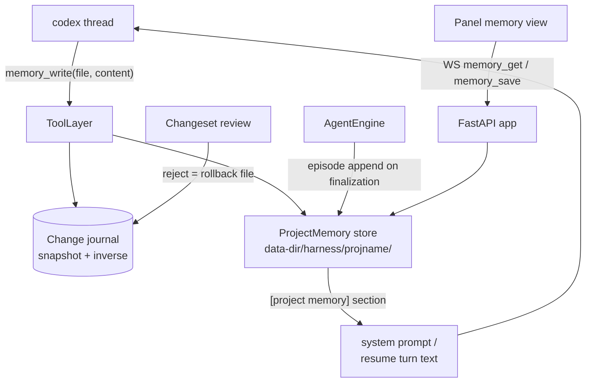
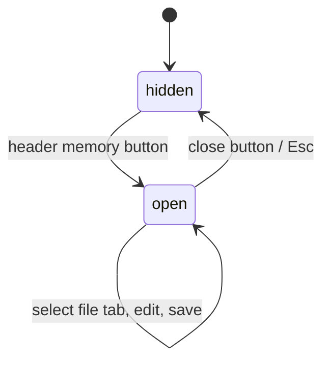

# Project Memory (per-map-project codex memory harness)

Codex forgets the user's map project between requests: every chat re-derives file roles,
resource allocation (switches/death counters/locations), and conventions from scratch — and
can generate code that collides with allocations it cannot see. This feature gives codex a
per-map-project memory store that it updates **autonomously via an MCP tool** during normal
work, that is **injected into every prompt**, and that the user can **review (changeset) and
edit (panel)**.

> Decision: see [[decisions/07_project-memory-mcp-tool]] — alternatives evaluated, not pursued.



## Storage layout

`<data-dir>/harness/<sanitized-project-name>/` (sibling of `journal/`, created on demand):

| File | Writer | Content |
|---|---|---|
| `resources.md` | codex (`memory_write`) + panel | Resource ledger: switch/death-counter/location/EUD-address allocations. Highest-value file — prevents collision code. |
| `structure.md` | codex + panel | One-line role summary per project file ("stats.eps: RPG stat system"). |
| `conventions.md` | codex + panel | Naming and trigger-pattern conventions observed in the user's code. |
| `lessons.md` | codex + panel | Corrections/feedback: the fact + why + how to apply next time. |
| `episodes.jsonl` | server only | Append-only request history (see Episodes). Never injected raw — rendered compactly. |
| `meta.json` | server only | `{"version": 1, "list_hash": "<sha256 of LIST reply>", "list_hash_ts": "<ISO8601>"}` for staleness detection. |

- Project name comes from bridge STATUS via `parse_status()` (`engine.py`). Sanitization:
  replace characters invalid in Windows file names (`<>:"/\|?*`, control chars) with `_`,
  strip trailing dots/spaces. Empty project name → memory disabled for the session
  (no injection, `memory_write` returns a `ToolError` explaining no project is open).
- All files UTF-8 **without BOM**, atomic writes (temp + replace) — same rules as journal.
- Markdown files are created empty on first write; absent file reads as empty string.
- Name collisions between different projects sharing one name are an accepted limitation
  (single-instance, single-user topology); composite keys are out of scope.

## MCP tool: `memory_write`

`ToolSpec("memory_write", "write", ...)` in `tools.py`:

- Parameters: `file` (string, enum `resources|structure|conventions|lessons`), `content`
  (string — the **full replacement content** of that file).
- Full-file replace semantics: codex sees the current content in the prompt every turn, so it
  rewrites the file faithfully; the journal inverse is trivially "write old content back".
- Validation (first line of defense, before any disk write): `file` in the enum; `content`
  size ≤ 8,192 bytes UTF-8 — over-budget returns `ToolError` telling codex to condense.
- **Journaled**: snapshot before = `{content: <old or "">, existed: <bool>}`; record after
  write. Inverse op: restore old content, or delete the file when `existed=false`.
- **Changeset item**: kind `memory`, target `memory/<file>`, with a server-side unified diff
  (old → new) so the user reviews memory changes exactly like file edits. Reject → rollback.
- **Plan-gate exempt**: `memory_write` does NOT count toward the 3-mutation plan gate
  (recording a fact must never force `propose_plan`). It DOES count toward the 30-action
  budget like any other tool call.
- No `memory_read` tool: the memory is already injected into every turn's context.

## Prompt injection

A `[project memory]` section, built by the ProjectMemory store and placed **between
`[first principles]` and `[reference context]`** (project-specific truth outranks generic
RAG examples; never-do rules outrank both):

- `build_system_prompt()` (first chat) gains the section.
- `_resume_turn_text()` (resumed chats) includes a refreshed copy alongside the refreshed
  `[project state]` + `[reference context]` — memory changes between chats.
- Section body, in order: `resources.md`, `structure.md`, `conventions.md`, `lessons.md`
  (each under a `## <name>` heading, empty files omitted), then `## recent episodes` —
  the last 10 episodes rendered one line each (`<ts> <kind> <instruction-head> -> <decision>`),
  with rejected/partial decisions explicitly marked so codex treats them as corrections.
- Staleness annotation: when `meta.json`'s `list_hash` differs from the sha256 of the current
  LIST reply, the `structure.md` heading carries the suffix
  `(may be outdated — project files changed since last memory update)`. The hash is refreshed
  whenever `memory_write` targets `structure`.
- Instruction block (part of the section, static text): tells codex to record durable facts
  only — resource allocations, file roles, conventions, user corrections — via `memory_write`,
  and never transient or code-derivable detail.
- Size guard: the rendered section is capped at 40,000 characters; per-file write caps make
  reaching it unlikely, but on overflow the episodes list is dropped first, then `lessons.md`
  is truncated tail-first, and a `memory section truncated` marker is appended.
- When the project name is empty or the harness dir is unreadable, the section renders as
  `[project memory]\n(no project memory)` — best-effort, never blocks the turn (same
  degradation contract as RAG).

## Episodes (server-written, zero token cost)

`AgentEngine` appends one JSONL line to `episodes.jsonl` at each request finalization point:

- changeset decided (`_on_changeset_decision`): decision `accepted` / `rejected` / `partial`.
- default-accept on next chat (`_finalize_prior_request` path): decision `defaulted`.
- answer-only turn end (no journal entries): decision `answer`.

Line shape:

```json
{"ts": "<ISO8601>", "request_id": "...", "instruction": "<first 200 chars of the chat text>",
 "kind": "answer|changeset", "tools": ["dat_set", "file_write"], "files": ["stats.eps"],
 "decision": "answer|accepted|rejected|partial|defaulted"}
```

`tools` is the distinct journaled tool list; `files` the distinct file targets. Episodes are
recorded only when a project name is known. Append failures are logged and swallowed
(memory must never break the request flow).

## WS protocol additions

Client → server:

- `memory_get {}` — returns the current project's memory files + recent episodes.
- `memory_save {file, content}` — panel edit; `file` in the same enum, same 8 KB cap;
  writes directly (no journal — the user editing their own memory is not an agent mutation).

Server → client:

- `memory {project, files: {resources, structure, conventions, lessons}, episodes: [...]}`
  (episodes: last 50, newest first).
- `memory_saved {file}` on successful save; `error {message}` otherwise (no project open,
  oversize content, unknown file).

## Panel: memory view



- A header toggle button (lucide `BookText` icon, next to the existing status pills) opens
  the memory view; it overlays the conversation column like PlanView/ChangesetView do.
- On open the panel sends `memory_get` and renders four file tabs (resources / structure /
  conventions / lessons) plus a read-only episodes list.
- The edit surface is the existing Monaco wiring (`panel/src/editor/monaco.ts`, language
  `markdown`) — Decision 05 makes Monaco the panel's edit surface; Save sends `memory_save`,
  a `memory_saved` reply clears the dirty flag.
- Changeset items of kind `memory` render in ChangesetView with the same diff styling as
  modified files, labeled `memory/<file>`.

## Edge cases

- No project open (STATUS project empty): `memory_get` returns `error`; `memory_write`
  returns `ToolError`; injection renders `(no project memory)`.
- Project switch mid-session: the engine resolves the project name per turn (STATUS is
  already fetched for `[project state]`), so memory follows the newly opened project on the
  next chat; the panel refreshes the view on the next `memory_get`.
- Concurrent panel save vs agent turn: last-writer-wins at the file level (atomic replace);
  the journal snapshot taken at `memory_write` time still guarantees a consistent rollback.
- Rollback after the user manually edited the same memory file in the panel: inverse op
  restores the pre-tool content, discarding the manual edit — same memory-only semantics as
  editor rollback; the existing rollback warning copy covers it.
- `episodes.jsonl` growth: unbounded on disk (cheap text), bounded in prompt (last 10) and
  in WS payload (last 50). Compaction is out of scope.

## Out of scope (deliberate)

- Memory compaction via a dedicated codex call (revisit when the 8 KB caps start binding).
- Initial whole-project survey (memory builds incrementally; a survey button can come later).
- Composite project keys for name collisions.
- `memory_read` tool, per-key/section patch operations, cross-project shared memory.

## Verification contract

- Unit: store round-trips (sanitize, atomic write, empty/absent files, meta hash), section
  rendering (order, staleness suffix, truncation order, no-project degradation), tool
  validation (enum, size cap, no-project error), journal snapshot/inverse round-trip for
  `memory_write` (existed and not-existed cases), plan-gate exemption (3 memory_writes do
  not trip the gate), episode append on each finalization path.
- Integration: fake-bridge WS test driving chat → memory_write → changeset with a `memory`
  item → reject → file content restored; `memory_get`/`memory_save` round-trip.
- Panel: store reducer tests for the new messages; MemoryView component test (tabs, dirty
  flag, save dispatch).

## Implementation

- `server/eud_agent/memory.py` — NEW: ProjectMemory store (paths, sanitize, atomic IO,
  episodes append, meta hash, `[project memory]` section renderer)
- `server/eud_agent/tools.py` — `memory_write` ToolSpec + handler + plan-gate exemption
- `server/eud_agent/journal.py` — memory snapshot/inverse, changeset item kind `memory`
- `server/eud_agent/engine.py` — section injection (first + resumed turns), episode recording
  at finalization points
- `server/eud_agent/app.py` — `memory_get` / `memory_save` WS handlers
- `panel/src/ws/protocol.ts` — new client/server message types
- `panel/src/state/store.ts` — memory view state + reducers
- `panel/src/components/MemoryView.tsx` — NEW: tabs + Monaco edit + episodes list
- `panel/src/App.tsx` — header toggle + view wiring
- `server/tests/test_memory.py` — NEW: store/render/episode tests
- `server/tests/test_tools.py`, `server/tests/test_journal.py`, `server/tests/test_app.py`,
  `server/tests/test_integration_ws.py` — extended
