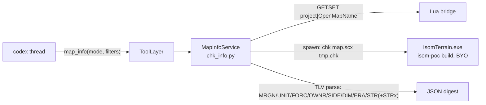

# Map Info (SCMD2-authored map data as an agent READ tool)

Codex cannot see the map the project is built on: locations, unit placement,
forces/teams, and player slots are authored in SCMDraft 2 and live only inside
the `.scx` file — the editor holds nothing but the `OpenMapName`/`SaveMapName`
path strings (features/04 settings surface), so no bridge command can return
them. This feature gives codex a `map_info` READ tool that digests the
**connected source map** (`OpenMapName`) from disk, so generated epScript can
reference real location names, start positions, and team layouts instead of
guessing.

## Architecture decision (feasibility review 2026-06-06, option B)

- **Editor memory is a dead end**: EUD Editor 3 reads `OpenMapName` only at
  build time; `pjData` exposes no parsed CHK objects to Lua. The map FILE is
  the only source.
- **Extraction stays in the verified C++ CLI, parsing stays in Python**: the
  server spawns `IsomTerrain.exe chk <map.scx> <tmp.chk>` (the isom-poc command
  that already handles MPQ + protected maps) and parses the raw CHK in
  `server/eud_agent/chk_info.py`. Zero C++ changes; pytest covers the parser
  with synthesized CHK bytes; heavy work lives in Python (architecture.md
  dependency direction). The isom-poc contract ("the CLI is called as a
  subprocess by ../eud-agent") already sanctions this integration.
- **Advisory shape (epscript-lsp policy)**: a missing/unconfigured exe degrades
  ONLY `map_info` (clear ToolError at call time); boot, selfcheck, and every
  other flow are untouched.

## CHK parsing contract (`chk_info.py`)

- TLV walk follows StarCraft's SIGNED-size seek (negative-size protection jumps
  terminate via an iteration cap; a size past EOF clamps to the remaining
  bytes). Duplicate `UNIT` sections STACK; every other section last-wins.
- Sections digested: `DIM `/`ERA ` (size, tileset), `OWNR`/`SIDE` (slot
  controllers, races), `FORC` (teams; legally-short section zero-padded; flag
  bits randomStartLocation/allies/alliedVictory/sharedVision), `MRGN`
  (locations: 1-based trigger ids, pixel + tile rects, names; index 63 flagged
  `anywhere`; all-zero entries skipped; swapped bounds flagged
  `inverted: "x"|"y"|"xy"` — 음수 로케이션, features/09), `UNIT` (36-byte entries: type, owner
  label `P1..P12 (neutral)`, pixel + tile coords, hp/shield/energy %,
  resources; start locations = type 214), `STR `/`STRx` (1-based ids; `STRx`
  wins when both exist).
- String decode is total: utf-8 → cp949 → latin-1/replace (Korean maps are
  usually cp949; hangul cp949 bytes are almost never valid utf-8).
- Unit type names come from `data/unit_names.json` — vendored
  `Sc::Unit::defaultDisplayNames` 0-227 (isom-poc `Sc.cpp`), the SAME canonical
  spelling the isom-poc grid `unit` directive uses. Unknown ids render `ID:<n>`.
- Force membership lists only ACTIVE slots (controller ∈ computer/human/rescue)
  — inactive slots default to force byte 0 and would misreport team 1.

## MCP tool: `map_info`

`ToolSpec("map_info", "read", ...)` in `tools.py`, routed (memory_write
precedent) to the injected `MapInfoService`:

- Parameters (all optional): `mode` enum `summary|locations|units|players`
  (default `summary`); `owner` (`P1..P12|neutral`) and `unitType` (numeric id
  or case-insensitive name substring) filter the `units` mode.
- `summary` returns aggregates only (active players, forces, start locations,
  location count + names, `unitsByOwner` type counts) — never the raw unit
  list. `units` mode caps the list at 200 entries with a `truncated` marker +
  filter hint (use-map UNIT sections run to thousands; the reply must stay
  context-sized).
- Every reply carries `map.path` and `map.savedAt` (file mtime): the digest is
  the LAST-SAVED disk state — unsaved SCMDraft edits are invisible, and the
  timestamp lets codex/user judge staleness.
- READ semantics: counts one action; no mutation counter, no plan gate, no
  journal. Validation first (bad `mode` rejects BEFORE the service runs and
  counts nothing). `MapInfoError`/`BridgeError` surface as ToolError (codex-
  correctable), never a transport crash.

## Configuration

`Config.isomterrain_cmd`: env `ISOMTERRAIN_CMD` > agent.cfg `isomterrain_cmd` >
built-in default (the isom-poc build artifact
`...\isom-poc\IsomTerrain\x64\ReleaseUS\IsomTerrain.exe`). NOT a selfcheck
failure (advisory prerequisite). The spawn obeys the rules.md subprocess rules:
absolute exe path, explicit `stdin=DEVNULL`, captured output decoded
utf-8/replace, `cwd` set, 60s wall-clock timeout; the temp CHK lives in a
`TemporaryDirectory` and is deleted with it.

## Verification

`server/tests/test_chk_info.py` (headless; CHK bytes synthesized in-test, fake
spawn + fake bridge): TLV walk guards, duplicate resolution, every decoder
(incl. cp949 location names and short-FORC padding), mode slicing + filters +
truncation cap, each distinct service error, and the tool-layer routing
(registered READ tool, service-absent ToolError, validate-before-run,
action-count accounting). Live E2E (user-assisted): with a real map project
open, `map_info` returns the SCMDraft-authored locations/units/teams.

## Out of scope (later phases)

- Terrain grid (`extract`) and walkability (`walkmap`) exposure — same service
  pattern when needed.
- `SaveMapName` (built output) digestion, THG2 sprites, TRIG triggers.
- Watching the map file for changes; the tool re-reads on every call.
