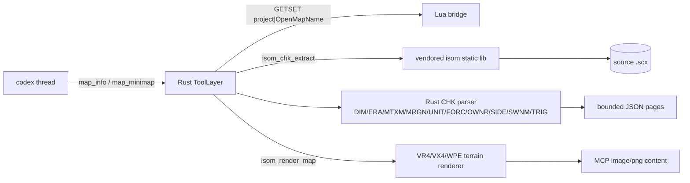

# Map Info (SCMD2-authored map data as an agent READ tool)

Codex cannot see the map the project is built on: locations, unit placement,
forces/teams, and player slots are authored in SCMDraft 2 and live only inside
the `.scx` file — the editor holds nothing but the `OpenMapName`/`SaveMapName`
path strings (features/04 settings surface), so no bridge command can return
them. This feature gives codex a `map_info` READ tool that digests the
**connected source map** (`OpenMapName`) from disk, so generated epScript can
reference real location names, start positions, and team layouts instead of
guessing.

```mermaid
graph LR
    Codex[codex thread] -- "map_info / map_minimap" --> Tools[Rust ToolLayer]
    Tools -- "GETSET project|OpenMapName" --> Bridge[Lua bridge]
    Tools -- "isom_chk_extract" --> FFI[vendored isom static lib]
    FFI --> Map[(source .scx)]
    Tools --> Parse[Rust CHK parser<br/>DIM/ERA/MTXM/MRGN/UNIT/FORC/OWNR/SIDE/SWNM/TRIG]
    Tools -- "isom_render_map" --> Render[VR4/VX4/WPE terrain renderer]
    Parse --> Reply[bounded JSON pages]
    Render --> PNG[MCP image/png content]
```

## Architecture decision

- **Editor memory is a dead end**: EUD Editor 3 reads `OpenMapName` only at
  build time; `pjData` exposes no parsed CHK objects to Lua. The map FILE remains
  the source of truth.
- The app resolves `OpenMapName`, extracts CHK bytes through the statically linked
  `isom_chk_extract`, and parses them in Rust (`src-tauri/src/chk.rs`). No sidecar,
  Python process, or unbounded raw dump is involved.
- Terrain rendering reuses the verified native VR4/VX4/WPE renderer through
  `isom_render_map`; Rust converts its 24-bpp BMP to bounded PNG and applies
  player-colored unit markers.
- Every result identifies the last-saved source path and mtime. Unsaved SCMDraft
  edits are intentionally invisible.

## CHK parsing contract (`src-tauri/src/chk.rs`)

- TLV walk follows StarCraft's SIGNED-size seek with the existing iteration and EOF
  guards. Duplicate `UNIT` sections stack; other sections are last-wins.
- Existing data remains: `DIM `/`ERA ` header, `OWNR`/`SIDE` players, `FORC`
  teams, `MRGN` locations, `UNIT` placements, and `STR `/`STRx` strings.
- `MTXM` is decoded as the bounded `DIM.width * DIM.height` tile grid. Terrain
  queries return tile coordinates, raw tile value, CV5 group (`value / 16`), and
  variant (`value % 16`) without returning an unbounded whole-map payload.
- `UNIT` exposes the complete 36-byte placement state: class/relation ids and
  flags, owner/type/position, valid-field masks, hp/shield/energy, resources,
  hangar count, and cloak/burrow/transit/hallucination/invincibility state.
- `SWNM` supplies all 256 switch-name slots. `TRIG` walks 2,400-byte triggers and
  reports every Switch condition and Set Switch action with 1-based trigger/slot,
  operation, raw unknown operation, and disabled state.
- String decode remains total: UTF-8 → cp949 → latin-1/replace. Unit type names
  remain the vendored canonical 0-227 list.

## MCP tool: `map_info`

`map_info` is READ-only and accepts:

- `mode`: `summary|terrain|locations|units|players|switches`.
- `owner` and `unitType` filters for units.
- `switch` numeric id or case-insensitive name substring.
- `x/y/width/height` tile rectangle for terrain.
- `offset/limit` bounded paging. Defaults/maxima: terrain 256/1024, units
  200/200, switch usages 100/200, locations 255/255.

`summary` returns aggregates only: header, terrain tile/group counts, players,
forces, start locations, location names, unit counts by owner/type, and
named/used switch counts. Large raw arrays appear only in their paged modes.
Validation happens before action accounting; errors are correctable ToolErrors.

## MCP tool: `map_minimap`

- Parameters: `maxSize` 128-2048 (default 512), `showUnits` (default true), and
  optional `starcraftPath`.
- StarCraft data lookup: explicit argument; otherwise `STARCRAFT_PATH`, standard
  install path, then the EUD Editor root.
- Native output is decoded, aspect-fit resized without upscaling, optionally
  overlaid with P1-P12 colors, PNG-encoded, and returned as a real MCP image
  content block plus compact metadata. Base64 never appears in the text block.
- READ-only: no map backup, journal, mutation count, or plan gate.

## Verification

- `chk::tests`: MTXM bounds, complete UNIT decode, SWNM names, TRIG condition/action
  usage decode, existing section/string/location/player contracts.
- `tools::tests`: summary/filter/rectangle/page behavior, 205-unit second page,
  switch-name filtering/usages, BMP orientation/resize/unit overlay/PNG signature,
  and switch-write handoff.
- `mcp::tests`: minimap result becomes metadata text + `image/png` content without
  leaking base64 into text.
- Real ignored smokes: native copy/rename/re-extract + installed-map terrain render,
  and the full MapSafe/native/journal switch path with exact post-name verification.

## Out of scope

- Built `SaveMapName` digestion, THG2 doodad/sprite placement, and map-file watching.
- Walkability/elevation semantic lookup from VF4 as structured JSON; the current
  terrain contract exposes exact MTXM tile/group/variant data and visual pixels.
