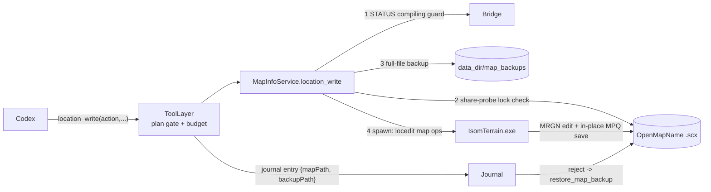

# Location Write (agent-driven MRGN edits on the source map)

`map_info` (features/08) lets codex SEE the connected map; this feature lets it
CHANGE the map's locations — the one map asset trigger work constantly needs
more of. `location_write` edits the **source map** (`OpenMapName`) in place, so
an added location is real: SCMDraft shows it after reopen, the editor build
includes it, and epScript can reference it by name.

User decision (2026-06-06 clarify): route ③ (write the source .scx), full CRUD
(add/set/rename/delete), maximum safety rails (backup + plan approval + lock
check).



## CLI: `IsomTerrain.exe locedit <map.scx> <ops.txt>` (isom-poc)

Added in `MapGenCli.cpp` (the only upstream-permitted file; zero MappingCoreLib
changes). Ops file: pipe-separated lines, coordinates in PIXELS, names as raw
bytes passed straight into the string pool:

```
add|<left>|<top>|<right>|<bottom>|<name>
set|<id>|<left>|<top>|<right>|<bottom>
rename|<id>|<name>
del|<id>
```

Hard invariants (each one verified in the smoke run):

- **Ids are NEVER renumbered**: save is called with
  `autoDefragmentLocations=false` — the default `true` would compact MRGN slots
  and silently re-point every existing trigger reference. `lockAnywhere=true`.
- **#64 (Anywhere) is protected** from set/rename/del.
- **All-or-nothing**: any bad op (out-of-range id, empty slot, no free slot,
  parse error) aborts BEFORE save — the map on disk is untouched.
- `del` uses `deleteLocation(id, deleteOnlyIfUnused=true)` and verifies the
  slot is blanked: a location referenced by the map's OWN (vanilla TRIG)
  triggers is refused, not corrupted.
- `add` fills the first blank slot (1-based; `addLocation`); a full table is a
  clear error.

## MCP tool: `location_write`

`ToolSpec("location_write", "write", ...)` — a REAL write: plan-gated (3rd
mutation without an approved plan → `propose_plan`), action-budgeted, and
journaled. Routed (memory_write precedent) to the injected `MapInfoService`:

- Params: `action` enum `add|set|rename|delete` (required); `name` (add/
  rename); `locationId` (set/rename/delete); `tileLeft/tileTop/tileRight/
  tileBottom` (add/set, TILE units — converted to px in the service; sub-tile
  precision of an existing location is overwritten at tile granularity);
  `invertX`/`invertY` (add/set, optional booleans).
- **음수(Inverted) locations** (corpus grounding: edac/126985 + edac/76715):
  an inverted location's bounds are SWAPPED (left>right and/or top>bottom) —
  Bring then matches only when the location sits fully INSIDE the unit's
  collision box, the community-standard precision-detection technique
  (1px-movement, 피탄판정, bunker containment). SCMDraft authors these with
  its native Invert X/Y buttons; `invertX`/`invertY` store the identical
  bytes. The caller supplies a NORMAL rect (validation stays meaningful);
  the service swaps the px bounds per axis afterwards. `set` writes exactly
  the bounds given — re-pass the flags when moving an inverted location.
  `map_info` flags such locations with `inverted: "x"|"y"|"xy"`. The
  standard runtime pattern stays in epScript: MoveLocation onto the unit +
  Bring (an inverted location LARGER than the unit never matches).
- Validation ladder: tool handler (enum + per-action required fields) →
  service (rect sanity, name charset `|`/newline ban, id ≥ 1) → locedit CLI
  (range/Anywhere/empty-slot/in-use) — three independent lines of defense.
- Returns `{ok, action, locationId (assigned id for add), mapPath, backupPath,
  locations[] (post-edit digest — codex sees the applied state immediately)}`.

## Safety rails (service, in order)

1. **Compiling guard**: bridge STATUS `compiling=true` → refuse (writing the
   map mid-build races the editor's read).
2. **Lock probe**: `CreateFileW` with `dwShareMode=0` — SCMDraft (or anything)
   holding the map open → ERROR_SHARING_VIOLATION → refuse with "close
   SCMDraft and retry". Injectable for tests; non-Windows reads unlocked.
3. **Full-file backup** to `<data_dir>/map_backups/<map>.<timestamp>.bak`
   BEFORE the spawn — snapshot-before-mutate holds even though this write
   bypasses the generic `journal.snapshot` path.
4. **Name encoding follows the map**: `detect_str_encoding` — `STRx` → utf-8;
   any existing non-utf-8 string → cp949; ambiguous/ASCII-only → cp949 (this
   machine's SCMDraft locale). ASCII names skip the extra chk extraction.

## Prompt guidance

`engine.build_system_prompt` injects a `[map locations]` section (after
`[first principles]`, before project memory): check-then-create (map_info →
location_write add → reference by name), stable ids / #64 Anywhere, the
inverted-location precision pattern (≤ unit size, MoveLocation + Bring), and
prefer-reuse-over-duplicates. This pins the workflow instead of relying on
tool descriptions alone.

## Journal / changeset integration

- The tool layer records `before={mapPath, backupPath}` / `after={action,
  name, locationId}` after a successful edit; `_target_for` renders
  `location:<action> <name|#id>`, category `map` (flat changeset item).
- Rollback (`journal._rollback_location` → `chk_info.restore_map_backup`):
  copy the backup bytes over the map via temp + `os.replace`, refusing while
  the map is locked. Restoring one entry rolls back to BEFORE that edit;
  rollback runs reverse-seq, so "reject all" lands on the original map.

## Verification

- Headless (test_chk_info.py): ops-line rendering (tile→px, cp949 names),
  every refusal rail, CLI-failure surfacing, backup creation/restore, tool
  registration/gate/journal/rollback — fake spawn + fake bridge.
- Headless with the REAL exe (run 2026-06-06): hill_demo.scx copy — add
  "공격지점" → set → rename → second add → delete → restore_map_backup; the
  digest after every step matched, ids stayed stable, Anywhere untouched.
- User-assisted E2E remaining: open an edited map in SCMDraft 2 and visually
  confirm the location + Korean name rendering.

## player_setup (EUD-089 — same rails, playeredit CLI)

A eudplib build fails with "연결맵에 조건에 맞는 플레이어가 없습니다: 플레이어
종류 Human" when the connected map has no HUMAN slot with a start location —
`EUDLoopPlayer("Human")` reads the CHK's OWNR + start-location units. The
`player_setup` tool closes that gap through the SAME service/rails/journal
path as `location_write`:

- CLI: `IsomTerrain.exe playeredit <map.scx> <ops.txt>` (MapGenCli.cpp, same
  all-or-nothing + in-place save, `autoDefragmentLocations=false` retained so
  a player edit can never renumber locations as a side effect). Ops (slots
  0-based, px coords): `start|slot|xc|yc` (move the slot's start-location
  unit 214, or add one), `delstart|slot`, `controller|slot|<name>` (OWNR+IOWN
  via `setSlotType`, names `human|computer|rescuable|neutral|inactive|closed`).
- Tool params: `action` enum `start|delstart|controller` + `player` (1-based
  1-8 = P1..P8, matching the digest labels) required; `tileX`/`tileY` (start;
  the service converts to the TILE-CENTER px like the editor); `controller`
  enum (controller action).
- Returns `{ok, action, player, mapPath, backupPath, players[],
  startLocations[]}` (post-edit re-digest).
- Journal: same backup-pointer entry (`_rollback_location` restores the
  bytes); changeset summaries "P1 controller = human in demo.scx" / "P1 start
  location placed at tile (4,8) in demo.scx"; target `player:<action> P<n>`.
- Prompt: `[map locations]` carries the Human-player requirement +
  check-then-fix workflow (`map_info(mode=players)` → `player_setup`); the
  `[build]` section routes the "no matching player" build failure here.
- Verified with the REAL exe (2026-06-06): test.scx copy — controller human
  (P1/P2) + computer (P5), start add/move/delstart, bad-slot/missing-start
  refusals pre-save, digest round-trip after every step.

## Out of scope

- General unit/terrain/force writes (same playeredit pattern when wanted).
- Auto-expanding an original-SC 64-slot MRGN to 255 (`addLocation` errors
  clearly; expansion changes the map version — a separate decision).
- Multi-op batching per tool call (one op = one journal entry = one reviewable
  changeset item).
