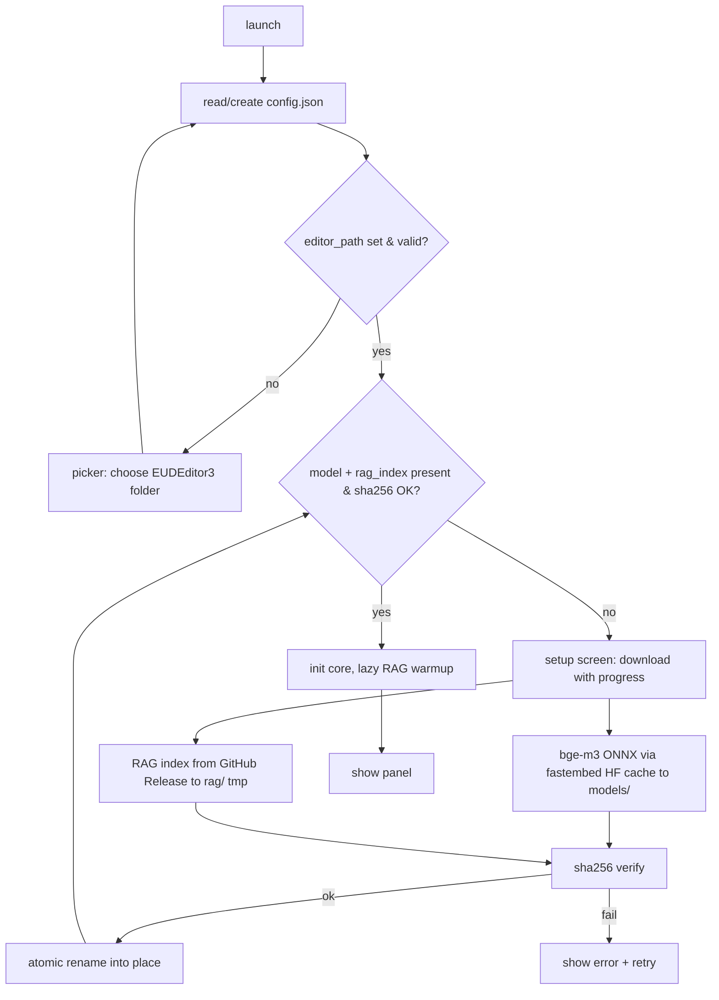

# Feature 10: Tauri shell + first-run bootstrap

The standalone Tauri 2 app shell: window, data-dir resolution, first-run download of the
model + RAG index, and the editor-path config. Replaces the POC's editor-hosted WebView2
and server-spawn lifecycle.

> Decision: see [[decisions/08_tauri-rust-rewrite]] and
> [[decisions/12_bootstrap-download-distribution]].

## Data directories
Resolve via Tauri path API:
- `app_data_dir()` -> `%appdata%\eud-agent\` : `config.json`, `memory/`, `map_backups/`,
  `journal/`.
- `app_local_data_dir()` -> `%localappdata%\eud-agent\` : `models/`, `rag/`, `logs/`.
- editor IPC dir: `<editor_path>\Data\agent\` (from `config.json`).
Create missing dirs at startup. Never put the model in Roaming.

## config.json
```json
{
  "editor_path": "C:\\...\\EUDEditor3",
  "codex_cmd": null,
  "model": { "name": "BAAI/bge-m3", "sha256": "<onnx hash>", "version": "1" },
  "rag_index": { "url": "<github release asset>", "sha256": "<hash>", "version": "1" }
}
```
Written UTF-8 (no BOM). `editor_path` is captured on first run via a `tauri-plugin-dialog`
folder picker (validated: `Data\Lua\TriggerEditor` must exist under it).

## First-run flow


## Bootstrap rules
- Every asset sha256-verified against `config.json`/a bundled manifest before use.
- Atomic placement: download to `*.tmp`, verify, then `os::rename` over the final path.
- Missing/corrupt -> re-download; NEVER leave a half-written asset in place.
- Download progress emitted to the panel as `progress {stage: bootstrap, detail, pct}`.
- The model is fetched through fastembed's HF cache (cache dir = `models/`); the RAG index
  is a direct `reqwest` GET of the Release asset.

## Edge cases
- Offline on first run: setup screen shows a clear "network required for first-run
  install" message; retains partial-but-verified assets, resumes on next launch.
- WebView2 runtime missing: detect and link the user to the Evergreen installer.
- Disk full mid-download: surfaced as a bootstrap error; tmp file cleaned.

## Implementation
- `src-tauri/src/config.rs` — config.json load/save, editor-path validation
- `src-tauri/src/bootstrap.rs` — manifest check, downloads, sha256, atomic place, progress
- `src-tauri/src/main.rs` — Tauri builder, window, dir resolution, init ordering
- `src-tauri/tauri.conf.json` — bundle, capabilities (shell/dialog/fs), window config
- `panel/src/setup/` — first-run setup + download-progress UI
- external: `tauri-plugin-dialog`, `reqwest`, `sha2`, `fastembed` (HF cache dir)
