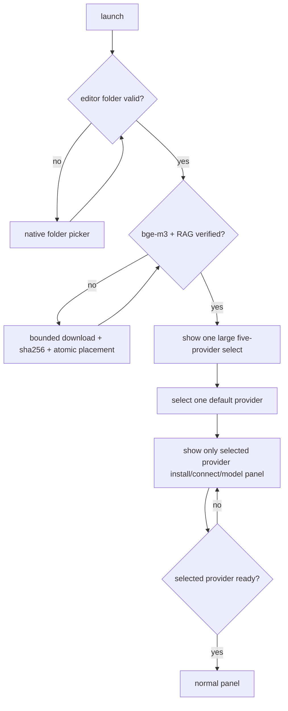

# Feature 10: Tauri shell + first-run bootstrap

The standalone Tauri 2 app shell: window, data-dir resolution, first-run download of the
model + RAG index, and the editor-path config. Replaces the POC's editor-hosted WebView2
and server-spawn lifecycle.

> Decision: see [[decisions/08_tauri-rust-rewrite]] and
> [[decisions/12_bootstrap-download-distribution]].

## Data directories and Config v2

- `%appdata%\\eud-agent`: secret-free config, sessions, direct transcripts, workspaces/journal.
- `%localappdata%\\eud-agent\\providers`: app-owned Codex and Claude binaries/profiles plus
  non-secret direct-provider caches.
- Windows Credential Manager: Antigravity OAuth and OpenCode Go API key.

```json
{
  "schema_version": 2,
  "editor_path": "C:\\...\\EUDEditor3",
  "default_provider": "codex",
  "providers": {
    "codex": {
      "executableOverride": null,
      "defaultModel": "gpt-5.5-codex",
      "defaultReasoning": { "level": "high" },
      "largeContextModels": []
    },
    "claudeCode": {},
    "antigravity": {},
    "opencodeGo": {}
  }
}
```

Config is atomic UTF-8 without BOM and contains no credential. Existing Codex-only fields migrate
once into `providers.codex`; an empty fresh object keeps `default_provider = null`.

## Four-step first-run flow


```mermaid
flowchart TD
    A[launch] --> B{editor folder valid?}
    B -- no --> C[native folder picker] --> B
    B -- yes --> D{bge-m3 + RAG verified?}
    D -- no --> E[bounded download + sha256 + atomic placement] --> D
    D -- yes --> F[show one large five-provider select]
    F --> G[select one default provider]
    G --> H[show only selected provider install/connect/model panel]
    H --> I{selected provider ready?}
    I -- no --> H
    I -- yes --> J[normal panel]
```

Only the selected provider participates in `setupRequired`; optional provider failure never blocks
entry. Provider binaries are not part of the model/RAG asset bootstrap.

## Bootstrap rules
- Every asset sha256-verified against `config.json`/a bundled manifest before use.
- Atomic placement: download to `*.tmp`, verify, then `os::rename` over the final path.
- Missing/corrupt -> re-download; NEVER leave a half-written asset in place.
- Download progress emitted to the panel as `progress {stage: bootstrap, detail, pct}`.
- The model is fetched through fastembed's HF cache (cache dir = `models/`); the RAG index
  is a direct `reqwest` GET of the Release asset.
- Codex install keeps the same-tag CLI/Code Mode host/Windows sandbox helper digest contract under
  `%localappdata%\\eud-agent\\providers\\codex\\bin`.
- Claude Code install downloads only `downloads.claude.ai/claude-code-releases`, checks the
  manifest platform SHA-256 and Windows Authenticode signer `Anthropic, PBC`, then atomically
  publishes the binary. No remote PowerShell/npm/WinGet command is executed.
- Antigravity/OpenCode Go have no executable install. Their OAuth/API-key controls are provider
  service actions and never gate an unselected provider. A pending provider login exposes an exact
  attempt-bound cancel action; closing the browser never leaves the panel irreversibly waiting.

## Edge cases
- Offline on first run: setup screen shows a clear "network required for first-run
  install" message; retains partial-but-verified assets, resumes on next launch.
- WebView2 runtime missing: detect and link the user to the Evergreen installer.
- Disk full mid-download: surfaced as a bootstrap error; tmp file cleaned.

## Implementation
- `src-tauri/src/config.rs` — config.json load/save, editor-path validation
- `src-tauri/src/bootstrap.rs` — manifest check, downloads, sha256, atomic place, progress
- `src-tauri/src/main.rs` — Tauri builder, window, dir resolution, init ordering
- `src-tauri/tauri.conf.json` — bundle, capabilities (shell/dialog/fs), window config
- `panel/src/setup/` — first-run setup + download-progress UI
- external: `tauri-plugin-dialog`, `reqwest`, `sha2`, `fastembed` (HF cache dir)
- [BOUND 2026-06-08 from EUD-098-fe34] `src-tauri/src/lib.rs` — Tauri 2 builder + shell/dialog plugin registration; app entry (`run()`), reused by main.rs shim
- [BOUND 2026-06-08 from EUD-098-fe34] `src-tauri/build.rs` — runs `tauri_build::build()` (codegen + config validation at compile time)
- [BOUND 2026-06-08 from EUD-098-fe34] `src-tauri/capabilities/default.json` — main-window capability granting core/shell/dialog plugin permissions
- [BOUND 2026-06-10 from EUD-120-ecca] `panel/src/setup/bootstrap.ts` — pure bootstrapView(pct, detail) mapping the {stage,pct,detail} bootstrap progress payload to setup-screen view state (phase/label/pct)
- [BOUND 2026-06-10 from EUD-120-ecca] `panel/src/setup/SetupScreen.tsx` — first-run setup overlay (determinate/indeterminate progressbar + error mode with reload retry); rendered by App while bootstrap active
- [BOUND 2026-06-11 from EUD-132-0829] `src-tauri/src/setup.rs` — manifest check (`setup_status`: editor-path + assets), `setup_pick_editor_path` (native picker -> validate -> save_config), `bootstrap_run` (panel-driven download/retry; resolves the RAG spec from the published `rag-index.manifest.json`), `should_auto_bootstrap`/`run_bootstrap` (auto re-download on later launches; readiness never gated)
- [BOUND 2026-06-11 from EUD-132-0829] `panel/src/setup/SetupScreen.tsx` — gained the editor-folder pick step (shown while editor path missing/invalid; maps the `invalid_editor_folder` code to Korean text); retry now re-invokes `bootstrap_run` instead of reloading
- [BOUND 2026-06-11 from EUD-132-0829] `src-tauri/src/ipc.rs` — empty `config.json` editor path fails commands with "editor path not configured" (setup signal), distinct from the stale-heartbeat "editor not connected"
