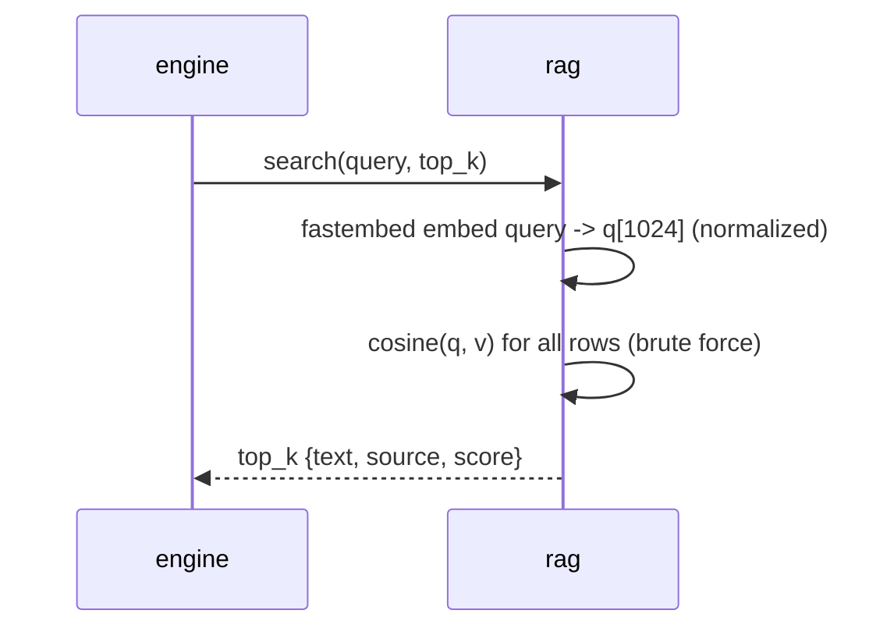

# Feature 12: RAG in Rust (fastembed bge-m3 + brute-force cosine)

Replaces `rag.py` (sentence-transformers + chromadb) with an in-process Rust path:
fastembed embeds the query, an in-memory brute-force cosine scan ranks a prebuilt index.

> Decision: see [[decisions/10_rag-bruteforce-fastembed]].

## Embedding parity (do this FIRST — gating spike)
The corpus index and the runtime query MUST share an embedding space, or retrieval breaks.
- Build the index by re-embedding the ECA corpus with the SAME fastembed bge-m3 pipeline
  used at query time — NOT a raw export of chromadb vectors.
- Validate: for a fixed query set, top-k (k=5) from the Rust path matches the Python
  `sentence-transformers` baseline within tolerance (e.g. >=4/5 overlap and rank
  correlation). Record the chosen fastembed model variant + normalization in the spec.
- bge-m3 emits dense/sparse/ColBERT; use the **dense** 1024d vector. Confirm L2
  normalization matches the baseline (cosine == dot on normalized vectors).

### Parity result (EUD-107, measured 2026-06-08)

- **Chosen variant**: fastembed `Bgem3Model::BGEM3Q` (int8 ONNX, `gpahal/bge-m3-onnx-int8`),
  **dense** 1024d. The dense output is **NOT pre-normalized** — the query/index path MUST
  L2-normalize it (cosine == dot). Baseline: Python `sentence-transformers`
  `SentenceTransformer("BAAI/bge-m3", normalize_embeddings=True)` (ECA `rag_query.py --bge`).
- **Method**: `ci/gen_rag_parity_fixture.py` re-embeds a deterministic 167-doc subset of the
  ECA corpus + 10 fixed Korean queries → `src-tauri/tests/fixtures/rag_parity.json`; the
  `#[ignore]` test `rag::parity` (run: `cargo test -p eud-agent rag::parity -- --ignored`)
  re-embeds the SAME texts with fastembed and compares per-query top-5.
- **Result**: **set parity CONFIRMED** — 9/10 queries ≥4/5 top-5 overlap, mean 3.90/5 (only
  q1 at 3/5, a 5th-rank miss). The retrieval SET (what feeds the LLM context) matches the
  full-precision baseline.
- **Caveat (int8 finding)**: rank ORDER *within* the top-5 drifts (order-agreement 0–4/5);
  the int8 model recovers nearly the same set but reshuffles it. The parity test asserts the
  set overlap and only REPORTS order agreement (the "matching order" criterion is relaxed to
  measured-not-asserted — see the EUD-107 report). **Decision**: int8 is acceptable for RAG
  retrieval (the top-k set is the contract); if exact rank order ever matters downstream,
  re-evaluate full precision. **The CI index builder MUST use this same BGEM3Q int8 variant +
  L2 normalization** so the at-rest index and the runtime query share the embedding space.

## Index format (at-rest, downloaded from GitHub Release)
A read-only self-contained binary blob (`rag/rag-index.bin`, `bootstrap::RAG_INDEX_FILENAME`)
built in CI and parsed with std only — **no `rusqlite`/sqlite dependency** (the index is
loaded fully into RAM and brute-force scanned, so a queryable container buys nothing; EUD-109
decision). Little-endian layout:
```
magic b"ERAG" [4] | version u32 = 1 | count u32 |
  count records: id u64 | vector EMBED_DIM(1024) * f32 (4096 bytes) |
  text_len u32 + text utf8 | source_len u32 + source utf8
```
4,974 rows (~20MB). Loaded fully into memory at warmup into `Vec<IndexEntry { id, vector:
[f32;1024], text, source }>`. `source` carries the `[reference context]` link header used by
the evidence gate. `load_index` rejects bad magic/version, truncation, non-utf8, or a
non-`EMBED_DIM` vector as a typed `RagError::Index` (never panics).

## Query path

- Lazy load + background warmup; readiness NEVER gates app start (emit `rag_warmup`).
- Korean-query handling preserved from v1 (search_docs guidance).
- Zero-hit / empty index degrades to empty results (engine prompt builder stays robust;
  evidence gate lifts on zero hits).

## CI index builder
`ci/build_rag_index.*` re-embeds the ECA corpus (read-only input) with fastembed bge-m3 and
writes `rag-index.bin` (the exact `ERAG`/v1 layout above, so the at-rest index and the
runtime query share the embedding space) + a sha256; published as a versioned GitHub Release
asset. The ECA repo and its chromadb are never modified or imported.

## Edge cases
- Model still warming when a query arrives -> await warmup or return `rag_warmup` progress,
  never block the UI thread.
- Index version mismatch vs config -> bootstrap re-downloads (feature 10).

## Implementation
- `src-tauri/src/rag.rs` — fastembed init, warmup, in-memory cosine search; `.bin`
  `write_index`/`load_index` (`ERAG`/v1, std-only); `Rag::{new,from_index_file,warmup,
  rank,search}` (EUD-109)
- `ci/build_rag_index.rs` (or script) — corpus re-embed + `.bin` (`ERAG`/v1) writer + sha256
- `src-tauri/src/rag.rs` `#[cfg(test)] mod parity` — `#[ignore]` parity test vs Python baseline fixtures
- external: `fastembed` (bge-m3 ONNX + HF cache), `ort` (transitive) — **no `rusqlite`**
