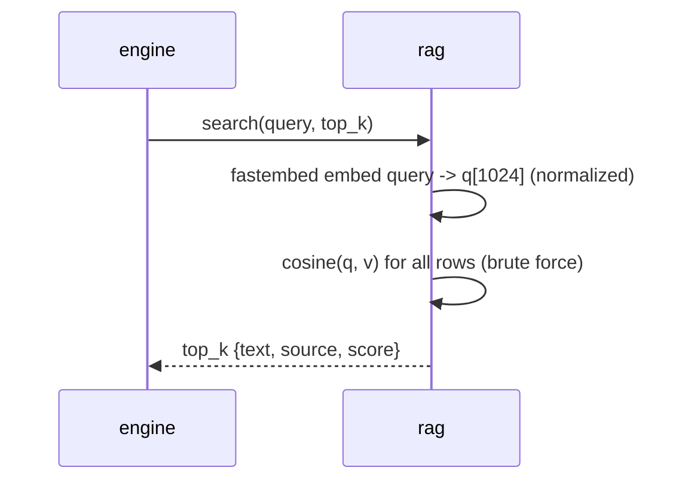

# Feature 12: RAG in Rust (fastembed bge-m3 + brute-force cosine)

Replaces `rag.py` (sentence-transformers + chromadb) with an in-process Rust path:
fastembed embeds the query, an in-memory brute-force cosine scan ranks a prebuilt index.

> Decision: see [[decisions/10_rag-bruteforce-fastembed]].

## Embedding parity (do this FIRST — gating spike)
The corpus index and the runtime query MUST share an embedding space, or retrieval breaks.
- Build the index by re-embedding the ECA corpus with the SAME fastembed bge-m3 pipeline
  used at query time — NOT a raw export of chromadb vectors.
- Validate: for a fixed query set, top-k (k=5) from the Rust path matches the Python
  `sentence-transformers` baseline within tolerance (e.g. >=4/5 overlap and rank
  correlation). Record the chosen fastembed model variant + normalization in the spec.
- bge-m3 emits dense/sparse/ColBERT; use the **dense** 1024d vector. Confirm L2
  normalization matches the baseline (cosine == dot on normalized vectors).

## Index format (at-rest, downloaded from GitHub Release)
A read-only sqlite (`rag/index.sqlite`, rusqlite) built in CI:
```
docs(id INTEGER PK, text TEXT, source TEXT, meta JSON, vector BLOB /* 1024 f32 LE */)
```
4,974 rows (~20MB). Loaded fully into memory at warmup into `Vec<(id, [f32;1024], text,
source)>`. `source` carries the `[reference context]` link header used by the evidence gate.

## Query path

- Lazy load + background warmup; readiness NEVER gates app start (emit `rag_warmup`).
- Korean-query handling preserved from v1 (search_docs guidance).
- Zero-hit / empty index degrades to empty results (engine prompt builder stays robust;
  evidence gate lifts on zero hits).

## CI index builder
`ci/build_rag_index.*` re-embeds the ECA corpus (read-only input) with fastembed bge-m3 and
writes `index.sqlite` + a sha256; published as a versioned GitHub Release asset. The ECA
repo and its chromadb are never modified or imported.

## Edge cases
- Model still warming when a query arrives -> await warmup or return `rag_warmup` progress,
  never block the UI thread.
- Index version mismatch vs config -> bootstrap re-downloads (feature 10).

## Implementation
- `src-tauri/src/rag.rs` — fastembed init, warmup, in-memory cosine search
- `ci/build_rag_index.rs` (or script) — corpus re-embed + sqlite writer + sha256
- `src-tauri/tests/rag_parity.rs` — `#[ignore]` parity test vs Python baseline fixtures
- external: `fastembed` (bge-m3 ONNX + HF cache), `rusqlite`, `ort` (transitive)
