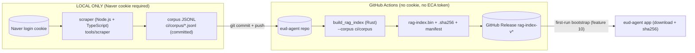

# Feature 16: In-house RAG corpus pipeline (scrape -> corpus -> CI embed -> Release)

eud-agent owns the full RAG data pipeline. The corpus that the index embeds no longer lives in the
separate ECA repo; it is scraped, committed, embedded, and released entirely from this repo.

> Decision: see [[decisions/15_in-house-rag-corpus]] — supersedes the ECA-coupling aspect of
> [[decisions/10_rag-bruteforce-fastembed]] (the `.bin` format + Release distribution are unchanged).

## Pipeline

## Scraper (NEW — Node.js + TypeScript, LOCAL ONLY)
- Location: `tools/scraper/` (its own `package.json` + `tsconfig.json`, separate from `panel/`).
  TypeScript ~5.9 (matches the panel convention). Run with `tsx`/`node`; not part of any runtime
  bundle, not invoked by CI.
- Auth: a Naver login **cookie** supplied via env/file (NEVER committed); the scraper fails fast with
  guidance if the cookie is missing or expired.
- Scrapes the EUD/eps Naver Cafe boards into corpus rows; also carries the eud-book + articles
  sources. Output is JSONL matching the schema `build_rag_index` already parses
  (`ci/build_rag_index.rs` `JsonlRow`): `{ "title": string, "content": string, "url"?: string,
  "source": string }`, one object per line, UTF-8.
- Emits the three corpus files into `ci/corpus/` (`articles.jsonl`, `eud_book.jsonl`,
  `cafebook.jsonl`) — overwriting in place so the diff is a content diff.
- Polite scraping: throttle/delay between requests, resumable, and idempotent re-runs.

## Corpus (in-repo, committed, NOT LFS)
- `ci/corpus/*.jsonl` is the source of truth, replacing the ECA repo. Plain-text JSONL → normal git
  (diffs/compresses fine). NOT Git LFS (LFS is for the chromadb sqlite that we do not use).
- The legacy `ECA/chromadb_bge/chroma.sqlite3` is v1 and unused by v2 — out of scope, not imported.

## Embed (CI, unchanged format, ECA coupling removed)
- `ci/build_rag_index` reads the in-repo corpus (default path `ci/corpus`); the `--eca` flag is
  replaced/repurposed by a `--corpus <dir>` flag (default `ci/corpus`). It still produces
  `rag-index.bin` + `rag-index.bin.sha256` + `rag-index.manifest.json` (fastembed bge-m3 brute-force
  index — feature 12). No cookie, no ECA token required.
- `.github/workflows/build-rag-index.yml`: the "Checkout ECA corpus" step and
  `vars.ECA_REPO`/`secrets.ECA_TOKEN` are removed; the builder runs against the checked-out repo's
  `ci/corpus`. Triggers: `workflow_dispatch`, `rag-index-v*` tag push (existing), and optionally a
  push touching `ci/corpus/**`.

## Distribution (UNCHANGED)
- The `.bin` is published as a GitHub Release asset; first-run bootstrap (feature 10) downloads it by
  URL + sha256 from the manifest. Consumer side is untouched.

## Edge cases
- Missing/expired cookie -> scraper exits non-zero with a clear "refresh Naver cookie" message; never
  writes a partial corpus file (write to `*.tmp` then atomic rename).
- Empty/short corpus -> the embed step should refuse to publish a near-empty index (sanity threshold).
- Re-scrape determinism: stable ordering (by board/post id) so commits are minimal content diffs.

## Implementation
- `tools/scraper/` — Node/TS Naver-Cafe scraper (package.json, tsconfig.json, src/*.ts); local only.
- `ci/corpus/articles.jsonl`, `ci/corpus/eud_book.jsonl`, `ci/corpus/cafebook.jsonl` — committed corpus.
- `ci/build_rag_index.rs` — `--corpus <dir>` (default `ci/corpus`); ECA default removed.
- `.github/workflows/build-rag-index.yml` — ECA checkout + ECA_REPO/ECA_TOKEN removed; embeds in-repo corpus.
- harness: `rules.md`, `architecture.md`, `tech-stack.md`, `features/12_rust-rag-fastembed.md` aligned to the in-repo corpus (Decision 15).
- external (scraper, pinned at impl time): a Node HTTP client + HTML parser + cookie handling (e.g. undici/got + cheerio) — bound to tech-stack.md when added.
