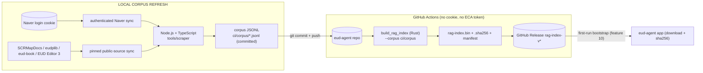

# Feature 16: In-house RAG corpus pipeline (scrape -> corpus -> CI embed -> Release)

eud-agent owns the full RAG data pipeline. The corpus that the index embeds no longer lives in the
separate ECA repo; it is scraped, committed, embedded, and released entirely from this repo.

> Decision: see [[decisions/15_in-house-rag-corpus]] — supersedes the ECA-coupling aspect of
> [[decisions/10_rag-bruteforce-fastembed]] (the `.bin` format + Release distribution are unchanged).

## Pipeline

```mermaid
flowchart LR
    subgraph Local["LOCAL CORPUS REFRESH"]
        Cookie[(Naver login cookie)] --> Naver["authenticated Naver sync"]
        Upstream["SCRMapDocs / eudplib / eud-book / EUD Editor 3"] --> Public["pinned public-source sync"]
        Naver --> Scraper["Node.js + TypeScript<br/>tools/scraper"]
        Public --> Scraper
        Scraper --> Corpus["corpus JSONL<br/>ci/corpus/*.jsonl (committed)"]
    end
    Corpus -- "git commit + push" --> Repo[(eud-agent repo)]
    subgraph CI["GitHub Actions (no cookie, no ECA token)"]
        Repo --> Build["build_rag_index (Rust)<br/>--corpus ci/corpus"]
        Build --> Bin["rag-index.bin + .sha256 + manifest"]
        Bin --> Release[(GitHub Release rag-index-v*)]
    end
    Release -- "first-run bootstrap (feature 10)" --> App["eud-agent app (download + sha256)"]
```

## Scraper (Node.js + TypeScript, LOCAL)
- Location: `tools/scraper/` (its own `package.json` + `tsconfig.json`, separate from `panel/`).
  TypeScript ~5.9 (matches the panel convention). Run with `tsx`/`node`; not part of any runtime
  bundle and not invoked by CI.
- `npm run scrape`: authenticated Naver board/article API refresh. A Naver login **cookie** is
  supplied via env/file (NEVER committed); the scraper fails fast with guidance if the cookie is
  missing or rejected.
- `npm run sync-public`: no-secret shallow snapshot of SCRMapDocs, eudplib, eud-book, EUD
  Editor 3, and selected eudtools originals. Every row records an immutable upstream commit and
  a commit-pinned source URL; project version, language, path, and scope are retained where applicable.
- `npm run sync-public -- --only=eudtools`: refresh only the six allowlisted wiki pages and
  three repository reference files into two corpora, preserving the other seven inputs.
  The repository commit is `e9729dc12cc30e575a83940ef380570d4819b5b2`; the wiki commit is
  `fba67326938424c005f6cbd94e8b9b385ad4e00c`. Bare Git snapshots support Windows-invalid wiki
  filenames. Rows and notices retain attribution and user-confirmed permission without
  inventing an upstream license. Bodies retain legacy/unverified compatibility caveats,
  non-epScript code labels, image context, and experimental warnings.
- Outputs UTF-8 JSONL matching `ci/build_rag_index.rs` `JsonlRow`: required `title`, `content`, and
  `source`; optional `id`, `url`, and `comments`. Public rows add provenance metadata ignored by
  the runtime parser.
- The fixed index inputs are `articles.jsonl`, `cafebook.jsonl`, `eud_book.jsonl`,
  `scrmapdocs_en.jsonl`, `eudplib_api.jsonl`, `eudplib_examples.jsonl`,
  `eud_editor_schema.jsonl`, `eudtools_wiki.jsonl`, and `eudtools_reference.jsonl`.
- Naver requests are throttled and incremental; public snapshots are deterministically ordered and
  replaced atomically.

## Corpus (in-repo, committed, NOT LFS)
- `ci/corpus/*.jsonl` is the source of truth, replacing the ECA repo. Plain-text JSONL → normal git
  (diffs/compresses fine). NOT Git LFS (LFS is for the chromadb sqlite that we do not use).
- The legacy `ECA/chromadb_bge/chroma.sqlite3` is v1 and unused by v2 — out of scope, not imported.

## Embed (CI, unchanged format, ECA coupling removed)
- `ci/build_rag_index` reads the in-repo corpus (default path `ci/corpus`); the `--eca` flag is
  replaced by a `--corpus <dir>` flag (default `ci/corpus`). It produces `rag-index.bin` and
  `rag-index.bin.sha256`; the workflow generates `rag-index.manifest.json` from that digest
  (fastembed bge-m3 brute-force index — feature 12). No cookie, no ECA token required.
- `.github/workflows/build-rag-index.yml`: the "Checkout ECA corpus" step and
  `vars.ECA_REPO`/`secrets.ECA_TOKEN` are removed; the builder runs against the checked-out repo's
  `ci/corpus`. Triggers: `workflow_dispatch`, `rag-index-v*` tag push (existing), and optionally a
  push touching `ci/corpus/**`.

## Distribution
- The binary layout remains v2. The selected eudtools corpus targets release generation
  `rag-index-v4`; `REQUIRED_RAG_INDEX_VERSION = "4"` makes healthy v3 installations fetch the v4
  manifest and replace their index through the existing sha256-verified atomic path.
  A local rebuild does not upload, tag, or publish the release.

## Edge cases
- Missing/expired cookie -> scraper exits non-zero with a clear "refresh Naver cookie" message; never
  writes a partial corpus file (write to `*.tmp` then atomic rename).
- Empty/short corpus -> the embed step should refuse to publish a near-empty index (sanity threshold).
- Re-scrape determinism: stable ordering (by board/post id) so commits are minimal content diffs.

## Implementation
- `tools/scraper/` — authenticated Naver API refresh plus commit-pinned public repository
  extraction; local only.
- `ci/corpus/*.jsonl` — nine fixed builder inputs plus `THIRD_PARTY_NOTICES.txt`.
- `ci/build_rag_index.rs` — fixed input allowlist, source-tier derivation, and
  `--corpus <dir>` (default `ci/corpus`).
- `.github/workflows/build-rag-index.yml` — embeds the checked-in corpus without ECA credentials.
- harness: `rules.md`, `architecture.md`, `tech-stack.md`, `features/12_rust-rag-fastembed.md`
  aligned to the in-repo corpus (Decision 15).
- external: `undici` HTTP/fetch client, `cheerio` HTML parsing, and local `git` for pinned shallow
  public snapshots.
