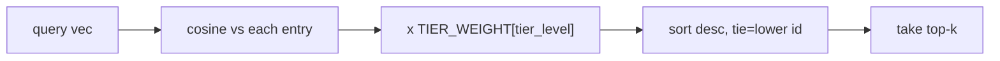

# Feature 17: RAG Knowledge Tiering (L1 resident idioms + L2 source-tier weighting)

> Decision: see [[decisions/18_rag-tier-encoding]] — alternatives evaluated, not pursued.

## Purpose

Two complementary levels of knowledge governance over the existing RAG/system-prompt stack:

- **L1 (resident positive anchor):** a compact eps-idiom cheat-sheet that ALWAYS sits in the
  system prompt, search-independent, so the model never falls back to SCMDraft classic
  triggers or hallucinates eps syntax when retrieval misses. Today `[epscript]` only carries
  the *prohibition* ("never write classic triggers"); the *positive* "write eps like this"
  anchor is missing and left to RAG.
- **L2 (source-trust weighting):** the corpus is ~87% unverified (incl. 1000 Q&A-post chunks
  that may contain wrong/unsolved code), yet `rank()` uses cosine alone, so a wrong Q&A post
  can outrank the official manual. Attach a per-chunk source tier and fold it into ranking.

The existing priority order is unchanged: **[first principles] (L0) > L1 idioms > [reference
context] (L2)**. L0 always outranks everything.

## L1 — resident eps idioms

A new constant `EPS_IDIOMS` (target 800–1500 tokens, "full" budget) added to
`src-tauri/src/engine.rs`, emitted by `build_system_prompt` and `resume_turn_text` AFTER the
`[first principles]` section and BEFORE `[reference context]`. It is positive, example-bearing
eps patterns for the 10–12 most-miscoded constructs:

- entry functions (`onPluginStart` / `before`/`afterTriggerExec`), no PreserveTrigger
- `$U(unit)` / `$L(location)` constant mapping
- death-counter read/set idiom (and the L0 rule: back counters with never-dying unit ids)
- `CreateUnit` / `Bring` with inverted locations
- EPD read with masking (`MemoryXEPD(epd + 0x64/4, …, 0xFFFF)`)
- `setcurpl`/`getcurpl` restore idiom
- loop with a guaranteed break (never `while(true)`)
- production-token button skill (edit the unit's OWN button set in place)

This is distinct from the crash-avoidance idioms already at the tail of `first_principles.md`:
L1 = "the correct eps way to do X", L0 = "never do Y". Where they overlap, L1 cross-references
the L0 item number rather than restating the prohibition.

## L2 — v2 index format, tiers, and weighted ranking

### Source → tier mapping (4 levels)

| Source files | Tier label | `tier_level` (u8) | role |
|---|---|---|---|
| `eud_book.jsonl`, `cafebook.jsonl`, `scrmapdocs_en.jsonl`, `eudplib_api.jsonl`, `eudplib_examples.jsonl`, `eud_editor_schema.jsonl` | primary reference | 3 | verified manuals, APIs, examples, and editor schema |
| `board_강좌팁`, `board_연구칼럼` | lecture/research | 2 | curated write-ups |
| `board_유틸리티툴`, `board_Lua자료실`, `user_*` | general | 1 | general posts |
| `board_질문답변` | Q&A | 0 | questions; may contain wrong/unsolved code |

The mapping keys off `JsonlRow.source` (the original per-board filename), available only at
build time. `tier_level` is the stable signal stored in the index; the multiplier lives in code.

### v2 binary format (entry layout)

```
header:  magic "ERAG" | version u32 = 2 | count u32
entry:   id u64 | vector f32 x EMBED_DIM(1024) | tier_level u8 | text(len u32 + bytes) | source(len u32 + bytes)
```

The format is defined in BOTH `ci/build_rag_index.rs` (write) and `src-tauri/src/rag.rs`
(write+load) — keep them byte-identical; a differential serialization test guards parity.
v1 (no `tier_level`) is rejected by the runtime loader once v2 ships; migration produces v2.

### Weighted ranking

`rank()` becomes `score = cosine(query, entry) × TIER_WEIGHT[entry.tier_level]`, where
`TIER_WEIGHT` is a 4-element code constant chosen so tier nudges, never dominates, the cosine
signal (bge-m3 cosines cluster ~0.3–0.9; weights live in a narrow band near 1.0, e.g.
`[1.00, 1.05, 1.10, 1.15]` — exact values tuned by measurement and pinned with a test). Tie-break
stays lower-`id`. Top-k clamp (`MAX_TOP_K = 10`) unchanged.



## Migration (no re-embedding)

The v1 `bin`'s `source` field is `[title](url)` and does NOT carry the original board filename,
so tier cannot be recovered from the bin alone. Migration re-joins by id:

```mermaid
flowchart TD
    V1[v1 rag-index.bin] -->|read vectors+text+source by id| J{join on id = fnv1a64(chunk_key)}
    CORPUS[ci/corpus/*.jsonl] -->|re-parse: derive id + tier_level, NO embedding| J
    J --> V2[v2 rag-index.bin with tier_level]
```

- Embedding vectors are copied byte-for-byte from v1 — DEFAULT_BATCH_SIZE=16 and the EUD-107
  embedding space are preserved (rules.md "Learned rules"; full rebuild only on model change).
- A test proves every v2 vector is byte-identical to its v1 source vector.
- Any v1 id with no corpus match (or vice versa) is a hard error — migration is all-or-nothing.

## Bootstrap + CI republish

- `src-tauri/src/bootstrap.rs`: the persisted index loader requires binary layout v2; the
  distribution contract now requires release generation v3 so healthy v2 installations refresh.
- `.github/workflows/build-rag-index.yml`: the canonical CPU builder emits binary layout v2 from
  the seven-source corpus and publishes a manifest with version `3`. UTF-8 without BOM throughout;
  the runner remains `ubuntu-latest`.
- Published under `rag-index-v3`: `rag-index.bin`, `.sha256`, `rag-index.manifest.json`.

## GPU differential-test track (separate, gated)

GPU ONNX embedding is investigated ONLY to speed FUTURE re-embeds; it is NOT on the L1/L2
critical path and NOT wired into CI (the `ubuntu-latest` runner has no GPU).

- A local-only differential test embeds a fixed corpus subset on CPU EP and (if available) on
  GPU/CUDA EP, recording pairwise cosine into a fixture.
- Acceptance gate: GPU-built vectors are adoptable for a CPU-query runtime ONLY if pairwise
  cosine is effectively 1.0 (e.g. > 0.9999). The runtime query is CPU-embedded, so any space
  mismatch degrades search. If the gate fails, the documented conclusion is "GPU build not
  adopted; CPU build remains canonical."
- `Bgem3InitOptions` does not currently expose EP selection; enabling CUDA requires the ort
  `cuda` feature on the `ci` builder. This investigation must not alter the canonical CPU path.

## Implementation

- `src-tauri/src/engine.rs` — `EPS_IDIOMS` constant + placement in `build_system_prompt` / `resume_turn_text`
- `src-tauri/src/rag.rs` — `IndexEntry.tier_level`, v2 write/load (MAGIC unchanged, VERSION=2), `TIER_WEIGHT`, weighted `rank()`
- `ci/build_rag_index.rs` — `source`→`tier_level` derivation, v2 write
- `ci/` migration binary (e.g. `migrate_rag_index.rs`) — v1 bin + corpus → v2 bin, vector-preservation test
- `src-tauri/src/bootstrap.rs` — persisted index loader still requires binary layout v2; release
  generation v3 forces installed v2 corpus assets to refresh through the manifest/sha256 path
- `.github/workflows/build-rag-index.yml` — canonical CPU build published as `rag-index-v3`
- `ci/` GPU differential-test fixture + test (local-only, gated)
- external: `fastembed 5.15` (BGEM3Q), `sha2` (manifest digest)
- [BOUND 2026-06-12 from EUD-159-22ba; advanced to release generation v3] `src-tauri/src/setup.rs` — `run_bootstrap_inner` re-fetches the release manifest when the pinned `rag_index.version` differs from `REQUIRED_RAG_INDEX_VERSION`, so stale v1/v2 installations upgrade to v3
