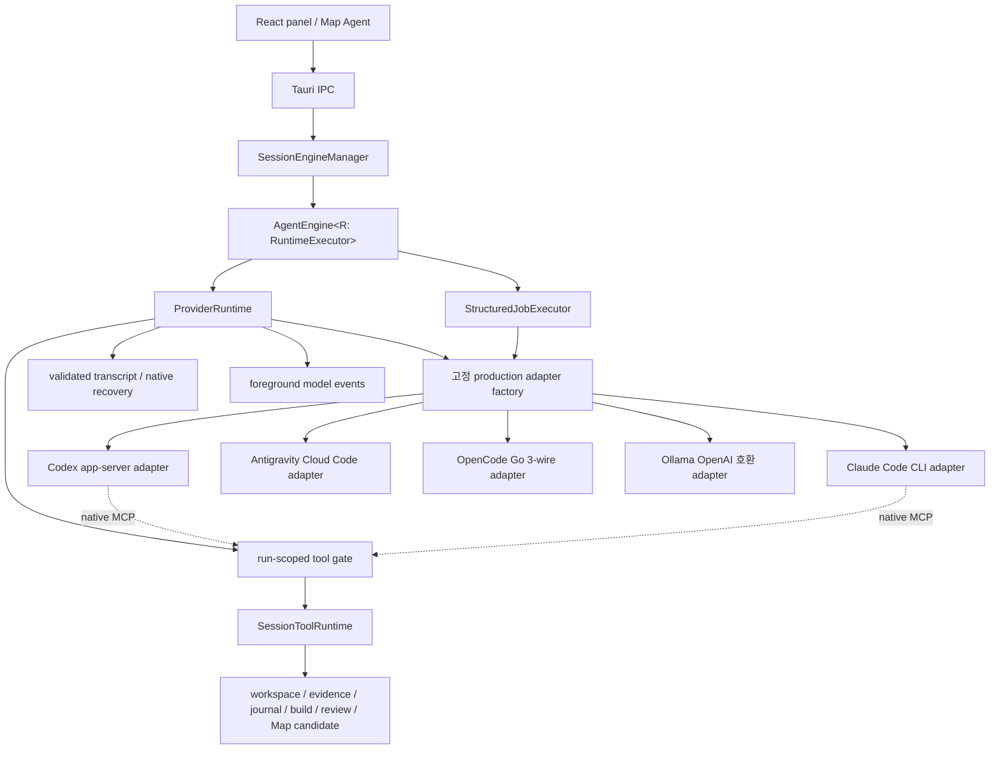

# Five-Provider Agent Runtime — Authoritative Implementation Plan

Status: provider/auth integration retained. Checkpoint41 source/build gates pass, with the first full41 Map finalize/revert OS5 failure retained as a non-causal WATCH and an unchanged full repeat passing. Actual33 verifies scoped EPS read/compiler/write/review/cancel behavior; actual37 adds ASK/restart passes; actual39 adds read-only C18 overlap; actual41 completes candidate/Apply/undo and independent post-Undo QA, but not stale-fork validation. The source41 shared long-path Map correction is selector-green. Ollama service verification is policy-blocked before launch, leaving catalog/model presence and compatibility unknown. Gameplay-backed harness, Messages, blocked providers, and remaining provider compatibility prevent an all-provider or whole-UI completion claim. Current execution authority: [provider-runtime-unification-plan.md](provider-runtime-unification-plan.md).

## 1. 목표

`eud-agent`의 Codex 전용 실행 경계를 일반화해 다음 다섯 AI 제공자를 동등한 세션 제공자로 지원한다.

1. `codex` — 기존 공식 Codex CLI app-server와 ChatGPT/API-key 인증
2. `claude-code` — 공식 Claude Code CLI와 Pro/Max/Team/Enterprise 구독 인증
3. `antigravity` — OMP의 `google-antigravity`와 같은 Google OAuth + Cloud Code Assist 경로
4. `opencode-go` — OpenCode Go API key와 공식 다중 wire API
5. `ollama` — 사용자 지정 Ollama OpenAI 호환 base URL과 직접 입력 model id

사용자는 최초 부트스트랩에서 기본 제공자를 선택하고 선택한 제공자만 반드시 설치·인증한다. 나머지 제공자는 같은 화면에서 선택적으로 연결할 수 있고, 정상 화면 진입 후에는 설정 다이얼로그에서 설치, 인증, 가져오기, 로그아웃, 기본 제공자, 모델, thinking/reasoning을 관리한다.

세션은 첫 요청을 수락할 때 제공자를 고정한다. 설정에서 기본 제공자를 변경해도 기존 EPS/Map 세션, 실행 중인 턴, review, harness job의 제공자는 바뀌지 않는다.

이 기능은 OMP/OpenCode를 런타임으로 포함하지 않는다. Rust 코어가 provider/auth/wire/tool loop를 직접 소유한다. 외부 프로젝트 구현은 프로토콜 근거로만 참고한다.

## 2. 확정 결정

다음 결정은 구현 중 재해석하지 않는다.

1. **정확히 다섯 제공자**: stable provider id는 `codex`, `claude-code`, `antigravity`, `opencode-go`, `ollama`다.
2. **Claude 의미**: Anthropic API-key provider가 아니라 공식 Claude Code CLI의 구독 로그인을 사용한다.
3. **Antigravity 의미**: 공식 Gemini Interactions managed-agent가 아니라 OMP식 Google OAuth/Cloud Code Assist 경로를 사용한다.
4. **부트스트랩 gate**: 사용자가 선택한 기본 제공자 하나만 `setup_required`의 제공자 gate가 된다. 다른 네 제공자는 선택적으로 연결한다.
5. **세션 고정**: 한 세션의 provider id는 첫 요청 이후 변경할 수 없다. 다른 제공자를 사용하려면 새 세션을 만든다.
6. **통합 설정**: 설정 다이얼로그는 기본 제공자, 설치 상태, 로그인 상태, API key/OAuth, 자격 증명 가져오기, 로그아웃, 모델, thinking/reasoning을 provider별로 제공한다.
7. **격리 후 가져오기**: Codex와 Claude Code는 eud-agent 전용 credential/config root를 사용한다. 기존 개인 CLI 로그인은 명시적 사용자 동작으로 credential만 복사하며, 설정, hooks, plugins, MCP, instructions, sessions는 가져오지 않는다.
8. **직접 구현**: OpenCode Go, Antigravity, Ollama의 HTTP/OAuth/wire adapter는 Rust로 구현한다. OMP SDK, OMP RPC, OpenCode server, 동적 third-party proxy를 실행하지 않는다.
9. **기존 권한 유지**: 모델은 제공자와 무관하게 기존 `SessionToolRuntime`, write coordinator, journal, changeset review, evidence gate, build rail을 통해서만 EUD 프로젝트를 읽고 쓴다.
10. **무음 fallback 금지**: 인증 실패, quota, overload, 모델 제거, provider 장애가 다른 provider/model로의 자동 전송을 일으켜서는 안 된다.
11. **provider별 capability**: 모든 제공자에 존재하지 않는 web search, 1M context, vision, native compaction, reasoning level을 가짜로 평준화하지 않는다. UI와 engine이 capability를 명시적으로 반영한다.
12. **main/Map 공통**: 다섯 제공자는 메인 EPS 세션과 Map Agent 세션 모두에서 작동해야 한다.

## 3. 최초 provider 도입 전 문제와 기반 (역사적 맥락)

### 3.1 전환 전 Codex 결합

최초 계획 작성 시 구현은 다음 경계에서 Codex를 제품 자체와 동일시했다. 이 목록의 과거 타입·생성 경로는 현재 실행 API가 아니다. 현재 구조는 §7을 따른다.

- `src-tauri/src/setup.rs`는 `codex login status`를 정상 화면 진입 gate로 사용한다.
- `src-tauri/src/config.rs`는 `codex_cmd`, `codex_model`, `codex_reasoning_effort`, `codex_large_context_models`를 최상위 설정으로 저장한다.
- `src-tauri/src/codex_auth.rs`는 install/login/status를 Codex 전용 Tauri command로 노출한다.
- `src-tauri/src/codex_client.rs`는 app-server JSON-RPC, model catalog, thread start/resume, MCP, streaming, usage, compaction을 소유한다.
- `src-tauri/src/engine.rs`의 추상화 이름과 입출력은 `CodexDriver`, `CodexTurnInput`, `CodexTurnResult`, `ProductionCodexDriver`다.
- `src-tauri/src/session.rs`는 provider 정보 없이 단일 `thread_id`만 저장한다.
- background harness는 새 `ProductionCodexDriver`를 직접 생성한다.
- panel IPC와 `CodexPromptControls`, `SettingsDialog`, `SetupScreen`, Map Agent model control이 Codex catalog shape를 직접 사용한다.

`CODEX_CMD`를 다른 executable로 바꾸는 것은 provider abstraction이 아니다. 당시 backend는 Codex app-server method/event shape를 요구했으므로 Claude/OpenCode/Antigravity CLI 또는 endpoint를 대입할 수 없다.

### 3.2 재사용할 기존 권한

다음은 provider와 분리되어 있으므로 그대로 유지한다.

- `SessionToolRuntime`
- `tool_registry()`, `mcp_tool_descriptors()`, `map_mcp_tool_descriptors()`
- `project_status`, `list_files`, `read_file`, `source_search`
- `file_create`, `file_write`, `file_edit`, `file_rename`
- `search_docs`, `docs_get`, `build_run`
- Map read/write/draft 도구
- automatic mutation-to-write transition, `ask`
- evidence/action/build-fix budget
- `WorkspaceManager`, strict session workspace, baseline recorder
- journal, write coordinator, review, rollback
- instruction epoch, task state, harness, memory/wiki
- per-session serialization과 cross-session read overlap

따라서 새 provider가 임의 filesystem/edit/shell 구현을 소유할 이유가 없다. 모든 provider는 같은 Rust tool descriptor와 executor를 사용한다.

### 3.3 외부 프로토콜 근거

- OpenCode Go는 다른 agent 사용을 공식 허용하고 `/responses`, `/chat/completions`, `/messages`, `/models`를 공개한다.
- Codex custom provider는 Responses wire만 지원하므로 OpenCode Go 전체 모델을 기존 Codex CLI 설정으로 우회할 수 없다.
- Claude Code는 `-p`, `stream-json`, `--resume`, `--json-schema`, `--mcp-config`, `--strict-mcp-config`, `--tools ""`, `CLAUDE_CONFIG_DIR`를 공식 지원한다.
- Claude Code `--bare`는 subscription OAuth/keychain credential을 읽지 않으므로 이 기능에서 사용하지 않는다.
- OMP의 Antigravity 구현은 Google OAuth와 `daily-cloudcode-pa.googleapis.com/v1internal:*` Cloud Code Assist endpoint를 사용한다. 이는 기술적 근거지만 공개 안정 API 계약은 아니다.

## 4. 범위

### 4.1 포함

- 다섯 provider의 strict Rust enum과 공통 capability/model/status 계약
- 기존 Codex app-server native 기능을 보존하고 공통 runtime/adapter 경계로 이동
- Claude Code CLI 설치, 전용 profile, 구독 OAuth, import, status, stream, resume, cancel, compact, structured output, MCP 연결
- Antigravity Google OAuth state/loopback callback, token refresh, Cloud Code Assist onboarding/catalog/inference, Gemini-style streaming/tool loop
- OpenCode Go API key, live model list, 세 wire adapter, streaming/tool loop
- Ollama OpenAI 호환 base URL, 직접 model id, 선택적 proxy API key, chat streaming/tool/structured loop
- provider-neutral tool dispatch, ASK wait, request write transition, cancellation, context usage
- provider-neutral structured compiler/harness turn
- provider별 model/thinking capability와 설정
- 부트스트랩 provider 선택 및 선택 provider gate
- 설정 다이얼로그의 다섯 provider 관리
- 새 세션 provider binding 및 legacy Codex session migration
- 메인 EPS와 Map Agent surface의 provider/model 표시
- provider별 fixture tests, fake CLI/server integration tests, live smoke matrix
- architecture/rules/tech-stack/verify/features/README 갱신

### 4.2 제외

- OMP, OpenCode server, Claude Agent SDK sidecar를 앱 프로세스로 포함하거나 실행하는 것
- OpenRouter, Anthropic API key, Gemini API key 등 고정 다섯 제공자 밖의 추가 provider
- provider plugin API, dynamic shared library, runtime script provider
- 기존 세션에서 provider를 전환하거나 transcript를 다른 provider로 재전송하는 것
- quota 소진 시 다른 provider/model로 fallback하는 것
- provider credential을 `config.json`, session JSON, panel log, journal, crash log에 저장하는 것
- 공식 Gemini Interactions `antigravity-preview-*` managed agent
- provider별 차이를 숨기는 가짜 1M context, 가짜 reasoning level, 가짜 token usage
- 선택하지 않은 provider의 설치·로그인을 최초 실행 완료 조건으로 만드는 것

## 5. 용어와 stable ids

- **Provider**: 인증, 모델 catalog 또는 직접 model id, transport와 capability를 제공하는 다섯 고정 backend 중 하나. 앱 conversation persistence와 실행 정책은 공통 runtime이 소유하며 native session 자체는 공식 CLI가 관리한다.
- **Provider binding**: 한 세션에 고정된 provider/model/thinking/conversation state.
- **Default provider**: 새 세션이 첫 요청을 수락할 때 복사하는 전역 기본값.
- **Provider profile**: app-owned executable/config/credential root. 개인 CLI root와 분리된다.
- **Ambient credential**: 사용자의 `%USERPROFILE%\.codex` 또는 `%USERPROFILE%\.claude`에 이미 존재하는 개인 CLI 로그인.
- **Import**: ambient credential 파일의 허용된 credential payload만 app profile에 복사하는 명시적 작업.
- **Wire adapter**: provider request/stream/tool/usage shape와 공통 model event 사이의 변환기.
- **Direct provider**: Rust가 HTTP와 tool loop를 소유하는 `antigravity`, `opencode-go`, 또는 `ollama`.
- **CLI provider**: 공식 agent CLI가 provider loop를 소유하는 `codex` 또는 `claude-code`.

Stable ids:

```rust
#[derive(Debug, Clone, Copy, PartialEq, Eq, Serialize, Deserialize)]
#[serde(rename_all = "kebab-case")]
pub enum ProviderId {
    Codex,
    ClaudeCode,
    Antigravity,
    OpencodeGo,
    Ollama,
}
```

UI label은 각각 `Codex`, `Claude Code`, `Antigravity`, `OpenCode Go`, `Ollama`다. 저장/IPC/로그의 권위는 label이 아니라 enum이다.

## 6. 필수 불변식

1. Fresh install은 provider 선택 전까지 정상 화면에 진입할 수 없다.
2. 선택 provider가 ready가 아니면 `setup_required == true`다.
3. 선택하지 않은 provider가 미설치/미인증이어도 setup 완료를 막지 않는다.
4. legacy config의 기본 provider는 migration 시 `codex`가 된다. fresh config에 암묵적 Codex default를 넣어 provider 선택 단계를 건너뛰어서는 안 된다.
5. provider binding은 첫 요청 admission과 session persist가 하나의 transaction으로 확정한다.
6. 확정된 session provider id는 rename, reload, rewind, compaction, model change, plan feedback, harness retry로 바뀌지 않는다.
7. 설정의 default provider/model 변경은 기존 session binding을 변경하지 않는다.
8. 한 session 안에서는 같은 provider의 model만 선택할 수 있다. provider 전환은 새 session에서만 가능하다.
9. background task-state compiler와 harness job은 source session의 provider/model snapshot을 사용한다.
10. job retry는 생성 당시 provider/model을 유지한다. 현재 global default를 다시 읽지 않는다.
11. provider 장애는 다른 provider에 prompt, source, attachments, tool result를 보내지 않는다.
12. 모든 model-visible project mutation은 기존 Rust tool admission, write registration, 짧은 project transaction, journal, changeset, review를 통과한다.
13. Direct provider는 임의 path, shell, editor IPC, CHK bytes를 받지 않는다.
14. Claude Code built-in tools는 `--tools ""`로 제거한다. `eud-tools` MCP만 model-visible이어야 한다.
15. Claude Code는 `CLAUDE_CONFIG_DIR` app profile과 app-owned session cwd만 사용한다. ambient `CLAUDE.md`, hooks, plugins, MCP, settings를 읽지 않는다.
16. Codex는 app-owned `CODEX_HOME`과 기존 strict Windows sandbox를 사용한다.
17. credential import는 source를 변경하거나 source profile에 logout을 실행하지 않는다.
18. import/logout/status error에 token, email, project id, raw OAuth response를 포함하지 않는다.
19. API key/access token/refresh token은 panel state에 submit 완료 후 남지 않고 Rust log/event/error에 나타나지 않는다.
20. provider/model capability를 turn 전에 검증한다. vision이 없는 model에 image를 텍스트로 가장해 전송하지 않는다.
21. model catalog가 제거한 configured model을 다른 model로 자동 교체하지 않는다. 사용자 선택이 필요하다.
22. OpenCode Go의 model id를 문자열 패턴으로 wire protocol에 추측 매핑하지 않는다.
23. structured output은 Rust JSON Schema validation을 통과해야 한다. prose에서 JSON substring을 찾아 성공시키지 않는다.
24. ASK 사용자 대기 시간은 provider active-time timeout에서 제외한다.
25. cancellation은 현재 provider turn만 중단하고 journaled reviewable writes를 삭제하지 않는다.
26. setup/settings/prompt/map UI는 raw provider error code를 사용자에게 그대로 렌더링하지 않는다.
27. Antigravity login은 build-time OAuth override가 없어도 열려야 한다. 실제 endpoint/protocol 실패는 명시적으로 표시하고 다른 provider로 fallback하지 않는다.

## 7. 현재 실행 구조

이 절과 §10·§16은 공통 런타임 전환 이후의 현재 구조다. 최초 provider 도입 시의 드라이버 계획은 대체됐으며, 구현 단계와 C01–C18의 최종 판정은 [공통 실행 런타임 전환 계획](provider-runtime-unification-plan.md)이 소유한다.



### 7.1 고정 adapter factory

`provider_runtime/factory.rs::production_adapter`는 검증된 session/job binding으로 다섯 `ProviderId`를 exhaustive match한다. 동적 plugin registry나 문자열 dispatch를 추가하지 않는다. `ProviderService`는 설치·인증·catalog·settings를 별도로 소유하며 임시 conversation worker를 만들지 않는다.

### 7.2 실행과 전송의 경계

`AgentEngine<R: RuntimeExecutor>`는 요청·context·승인·review·task provenance를 소유하고 `ProviderRuntime`에 foreground/structured/reset/seed/compact 실행을 요청한다. 런타임은 run 수명, active deadline, 도구 admission, workspace 준비, 모델 이벤트, checkpoint와 recovery를 소유한다. 직접 HTTP의 model step → tool result 반복도 공통층에 있다.

`ProviderAdapter`는 credential/profile 접근, wire encoding/decoding, capability 제약, native process/session 제어만 소유한다. 앱 저장소 writer, UI sink, workspace manager, 범위 없는 tool runtime을 전달하지 않는다. Codex/Claude의 공식 native 내부 루프는 유지한다.

Compiler와 harness는 독립 `StructuredJobExecutor`를 사용한다. 이 실행기는 adapter와 cancellation receiver만 갖고 본 대화의 store/workspace/UI/tool authority를 갖지 않는다. 기존 foreground 실행의 revision/persistence/workspace 값을 임시 변경하는 경로는 없다.

Compiler는 매 실행마다 비어 있는 고유 input/cwd를 받고 60초/8192-token 정책을 사용한다. Harness는 별도 300초 deadline을 유지한다. Direct adapter는 text/reasoning/tool/signature block의 순서를 보존하고, native adapter는 공식 인증·내부 loop·session 제어를 유지한다. MCP endpoint와 handler는 run에 묶인 고유 URL/UUID를 사용하며, 도구 완료 receipt/journal은 답변 성공과 별도로 내구화한다. Unknown native receipt는 resume을 막고 명시적 reset만 새 continuation을 시작한다.

2026-09-12 final-19 evidence: source SHA-256 `E87CBE71073107CD79A2E620E160DFE42E11C676FB2603EAEBE344E7D850E9A0`, test executable SHA-256 `6E81FE1C8B04CDFEE2C6E43DC9E72D58E6761F001B946241192FB7E541D6CB43`; all five repository gates, strict Clippy, and scoped formatter checks passed. The embedded debug app and five native-domain contracts also passed; the Codex lifecycle passed. Antigravity was blocked by an unconfigured OAuth client, OpenCode's three live rows failed under investigation, and actual native UI/Ollama acceptance remained open.

Checkpoint 20 observed Responses/`gpt-5.6-luna` HTTP 400 at `tools[2].parameters`; Chat Completions/`kimi-k3` completed tools, resume, and structured work with the existing budgets; Anthropic Messages/`qwen3.8-flash` completed tools/resume but returned HTTP 500 before SSE for structured work, with no established leaf cause. Checkpoint 21 then captured the native usage correlation RED and three OpenCode REDs for ordinary optional-schema rejection and protocol classification. The source correction makes ordinary Responses/Chat tool definitions explicitly non-strict, preserves strict structured definitions, preserves parsed protocol/incomplete errors, and filters Codex usage by the authoritative active native turn ID. Checkpoint 22 source `1308`/`E0763CEEA9A1D1FFBFC842A91F942E693DF171F84DD55AD4A1C5B136963FAF8E` retains its historical `726 passed; 1 failed; 30 ignored` Map cleanup result; the holder was not captured. Checkpoint 23 establishes the non-inheritable `rbN` reader mechanism (`rb`=32, `rbN`=0). Checkpoint 24 establishes HTTP RED23→GREEN24 for all three OpenCode wires and both direct adapters: raw limits are independent 16 MiB transport ceilings, while `RunPolicy.max_output_bytes` applies to serialized normalized output. Claude uses independent 32 MiB stdout and 1 MiB JSONL-line bounds; corrected numeric witnesses led to four qualified REDs before the Claude fix. Checkpoint 25 source `1312`/`DBAEEA1566AD3EE7B9373B801862E4D0B9DDEDE7531AC1E8B2F43CD3F58D28F1`, immutable binary `BE27F9CBD6366C45C264DFAA16A68B5130935BCA5218AF578641CB0781899CCA`, passes all five repository gates, strict Clippy, and formatter; the format-only manifest `4285974FE0054B6E6008BFE00F9951BBC719A8B46282EBA5E5989015E06BF652` differs only by `lib.rs` module order. The debug app and all five native-domain contracts pass with original fixtures unchanged. Actual Codex completes its lifecycle in 45.19s. Actual OpenCode Responses/`gpt-5.6-luna` and Chat/`kimi-k3` complete tools/resume/structured work; Messages/`qwen3.8-flash` completes tools/resume then fails structured transport. A one-shot diagnostic observed HTTP 500/75 bytes/no SSE, supporting but not retroactively attributing a service-rejection hypothesis. Native UI passes project/session setup, four EPS tools, compiler semantic delta `0→1`, follow-up, and cancellation; a new-session EPS write fails before response start on isolated SQLite initialization, and Map schema reporting is opaque after bad `filter.tileId` rejection. Checkpoint 26's test-only source `39FBA5DA612343EFA8CE6870658AB29CEB980F58BCC96D0F2A18D880AF2B0D19` and binary `5368D687A394AE4C8B3D83BD230DD50F7C1B4B544855D7222CAB2C274830FEB5` isolate that open Map event contract: its standalone native-visible filter arm accepts the captured invalid `tileId` call, although the complete validator refuses it. Checkpoint 27 applies the generic complete `anyOf`-arm correction: source `80E9A7C63A1172BA27D3B435F62CE7CB5E1A5F82666CA001D5AABA88FE2AED34` and immutable binary `69B2811D3A84957F82484D3796FF914165EFF7ED5679BFD4E50E07A2209D4714` pass four exact Map schema/dispatch/publication selectors (`1 passed; 0 failed; 766 filtered` each) and the unfiltered Rust suite (`737 passed; 0 failed; 30 ignored` in 140.81s). This is a qualified RED26→GREEN27 Map contract result only: native rendering, Map/UI27, and the SQLite startup probe remain pending, and no fresh application or broader gate conclusion is implied. No retry/reset/global lock was introduced. Ollama is resource-blocked, Claude is logged out, and Antigravity lacks its OAuth client. Harness/review/build/Map Apply/mixed/restart UI flows and actual Messages recovery remain open. No fallback, budget, deadline, or production sink relaxation was introduced. This status does not change the authoritative A–G/C01–C18 checklist or claim all-provider completion.

Checkpoint28 replaces only the currently superseded deterministic/UI status: frozen source `3E686C91EB900996CE735DE8A58D09FBA3D39F6715A7CEA375F09122DAA23CAD` passes Rust `737/0/30`, library check, all-target/all-feature strict Clippy, and formatter. The panel source/dist is unchanged, so its checkpoint25 58-file/539-test evidence is reused rather than rerun. In the native app, exact OpenCode Go/`glm-5.3` binding completes two foreground reads and an answer, while the compiler exceeds its local 16 KiB normalized-output limit and preserves a warning; Chat is inferred, without a retained exact route witness. Actual Map palette query verifies the corrected `filter.id` call, but C12 EPS write fails for missing native baseline plus a redundant write-transition terminal error, reopening phase C. The independent Map draft-patch/compaction explanation is provisional and no enum correction is attributed. Probe3 after normal app PID54196 closure does not reproduce SQLite initialization failure across S1/O1/O2/Q1 and does not resolve the historical actual25 failure. Review28 quality/security/context scoped audits pass, goal and QA fail, and overall completion remains false. Checkpoint29 baseline-fixture failure is not a qualified RED; its Map enum causal claim is withdrawn. Checkpoint30 remains test-only in progress with no fix/gate conclusion. Existing Messages failure, Claude/Antigravity/Ollama limits, and unverified review/Apply/restart/mixed-provider paths remain unchanged.

Current supersession: checkpoint41 source `078F460095E965AEB7B3E7FE04F8FACF494DD9D23917FD78458F78F8C78C330D` and immutable binary `0C161936695EEEA3CEA91A2B677FCF3AA5FDC28B607906F77106EA96BE44E84A` bind the long-path Map selector GREEN, `isom` `12/0/7`, full-repeat Rust `749/0/30` including main/doc targets, library check, strict Clippy, and formatter. The first unchanged full41 `748/1/30` Map finalize/revert Access-denied result remains a WATCH; its exact diagnostic and repeat do not establish a cause. Panel36 TypeScript, 58-file/539-test, and production build remain product-equivalent; app41 SHA `C8CCB48B0ABBBFC93EB65626BB0668895BF2D0F22FBB979CF9216968F66B8DE2` builds successfully. Actual33 establishes scoped EPS read/compiler/write/build/reject/accept and active-response-before-output cancellation. Actual37 passes native ASK answer/cancel and restart persistence. Actual39 passes read-only C18 Map/OpenCode overlap; OpenCode foreground succeeds but its compiler `runtime_error` cause and exact wire are unknown. Actual41 preserves two expected-before conflicts, then finalizes a candidate, applies its trusted UI change, and restores the exact source baseline through undo; stale-fork validation is not run. Source41's shared Windows long-path correction follows the numeric Draft7 Map admission fix and is not a model-specific workaround. Messages structured recovery, Claude login, Antigravity OAuth access, Ollama resource qualification, gameplay-backed harness, fresh reviews, and cleanup remain open.

Final external-status boundary: independent QA41 passes the post-Undo Map surface at r0 with no candidate, disabled Apply/Undo, and retained history; app41 closes normally with recorded baseline hashes preserved. Ollama `serve` is policy-rejected before launch, with no retry or alternate route. Its server/catalog/model presence, generation, configuration, and compatibility remain unknown. The 12-entry and separate eight-entry cleanup attempts are policy holds with zero removal; final review remains pending.

## 8. 공통 provider/domain model

### 8.1 Capability

```rust
pub struct ModelCapabilities {
    pub vision: bool,
    pub tool_calls: bool,
    pub strict_structured_output: bool,
    pub reasoning_levels: Vec<ReasoningLevel>,
    pub native_compaction: bool,
    pub context_window: Option<u64>,
    pub hosted_web_search: bool,
}
```

`ProviderModel`은 stable provider id, provider-native model id, display name, description, default flag, capability를 가진다. capability가 알려지지 않은 model은 안전한 최소값으로 노출하거나 숨긴다. vision/tool support를 낙관적으로 추측하지 않는다.

### 8.2 Provider status

```rust
pub enum ProviderAvailability {
    Ready,
    NeedsInstall,
    NeedsAuthentication,
    NeedsCredential,
    Degraded,
    Unavailable,
}

pub struct ProviderStatus {
    pub provider: ProviderId,
    pub availability: ProviderAvailability,
    pub selected_as_default: bool,
    pub can_install: bool,
    pub can_import: bool,
    pub experimental: bool,
    pub detail_code: Option<ProviderStatusCode>,
}
```

`ready` 의미:

- Codex: app profile로 `codex login status` 성공
- Claude Code: executable valid + app profile로 `claude auth status --json` 성공
- Antigravity: refreshable credential + authenticated `loadCodeAssist` 성공
- OpenCode Go: secret 존재 + supported model catalog fetch 성공. `/models`가 credential을 검증하지 않는 경우 `configured`만 증명하며 첫 inference 401을 정확히 auth failure로 처리한다.
- Ollama: 정규화된 base URL의 `/v1/models`가 OpenAI 호환 list shape로 응답. API key는 선택 사항이며 401일 때만 credential 필요 상태로 전환한다.

### 8.3 Session binding

```rust
pub struct ProviderBinding {
    pub provider: ProviderId,
    pub model: String,
    pub reasoning: Option<ReasoningSelection>,
    pub base_url: Option<String>,
    pub conversation: ProviderConversationState,
}

pub enum ProviderConversationState {
    Codex { thread_id: Option<String> },
    ClaudeCode { session_id: Option<String> },
    Antigravity { transcript_revision: u64 },
    OpencodeGo { transcript_revision: u64 },
    Ollama { transcript_revision: u64 },
}
```

Variant와 provider가 불일치하면 load가 실패한다. generic string map이나 provider-owned arbitrary JSON을 session authority로 저장하지 않는다.

## 9. Provider별 실행 계약

### 9.1 Codex

기존 `CodexAppServerClient`와 production turn behavior를 유지한다.

변경 사항:

- 모든 Codex process에 app-owned `CODEX_HOME`을 명시한다.
- app-owned profile config는 `cli_auth_credentials_store = "file"`을 강제하고 current-user-only ACL을 검증한다.
- model catalog, 1M override, hosted live web search, read/write Windows sandbox, Code Mode helper 계약은 Codex variant에만 남긴다.
- `codex_large_context_models`는 Codex provider settings 내부로 이동한다.
- generic progress stage는 provider/model identity를 별도 typed field로 전달하고 raw `codex` stage에 의존하지 않는다.
- existing `thread_id`는 `ProviderConversationState::Codex`로 migration한다.

Codex install은 현재 GitHub release digest + CLI/Code Mode host/sandbox helper same-tag 검증을 보존한다.

### 9.2 Claude Code

#### 9.2.1 설치

- selected/optional install 동작에서만 Claude Code를 설치한다.
- ambient PATH보다 app-managed binary를 우선한다.
- official `downloads.claude.ai/claude-code-releases` Windows binary만 허용한다.
- release `manifest.json`의 platform checksum을 검증한다.
- Windows Authenticode `WinVerifyTrust`가 성공하고 signer가 Anthropic publisher인지 검증한다.
- download는 fixed-size/timeout/HTTPS host allowlist를 적용하고 temp + atomic rename으로 배치한다.
- 원격 `install.ps1 | iex`, WinGet shell execution, npm global install을 backend에서 실행하지 않는다.
- app-managed binary 자동 업데이트는 끄고 app updater가 검증된 버전을 교체한다.

#### 9.2.2 인증과 profile

모든 Claude process는 다음을 사용한다.

```text
CLAUDE_CONFIG_DIR=%LOCALAPPDATA%\eud-agent\providers\claude-code\config
```

앱은 browser login을 위해 app profile로 interactive `claude auth login` 또는 지원되는 공식 login command를 시작하고 bounded status polling을 수행한다. 인증 확인은 `claude auth status --json` exit code와 strict JSON을 사용한다.

`--bare`와 `CLAUDE_CODE_SIMPLE`은 subscription OAuth를 읽지 않으므로 사용하지 않는다.

#### 9.2.3 turn process

각 foreground turn은 app-owned session cwd에서 공식 CLI print mode로 실행한다.

```text
claude -p
  --output-format stream-json
  --verbose
  --include-partial-messages
  --mcp-config <request-owned exact config>
  --strict-mcp-config
  --tools ""
  --allowedTools "mcp__eud-tools__*"
  --permission-mode dontAsk
  --disable-slash-commands
  --no-chrome
  [--resume <binding.session_id>]
```

Claude CLI는 machine-readable model discovery command를 제공하지 않지만, app profile의
`.credentials.json`에 저장된 같은 구독 OAuth access token은 Anthropic Models API
(`GET https://api.anthropic.com/v1/models`, `Authorization: Bearer` +
`anthropic-beta: oauth-2025-04-20`)에서 그대로 받아들여진다. catalog는 이 응답의
`id`/`display_name`/`max_input_tokens`/`capabilities`(effort 단계, image_input,
structured_outputs)를 그대로 매핑하고 alias나 하드코딩 목록을 만들지 않는다. 첫 항목은 항상
`provider-default`이며, token 부재·HTTP 실패·schema 변경 시 catalog는 그 한 항목으로
degrade한다. token은 요청 동안만 메모리에 있고 로그·저장·UI에 노출되지 않는다.

CLI는 turn이 실행되는 동안에만 access token을 갱신하므로, 유휴 profile은 turn 사이에 만료된
token만 남긴다(access token 수명은 수 시간, refresh token은 수십 일). catalog 요청은 만료·5분
내 만료 예정 token을 CLI와 같은 public client id·`POST https://platform.claude.com/v1/oauth/token`
(`grant_type=refresh_token`, 저장된 `scopes`)으로 직접 갱신하고, 회전된 pair를
`.credentials.json`에 atomic write-back하여 CLI의 다음 turn도 계속 동작하게 한다. 갱신은 CLI의
`proper-lockfile` 규약(`.oauth_refresh.lock` → `.credentials.json.lock` 디렉터리, 60초 stale)을
그대로 따르며 lock 획득 후 파일을 다시 읽어 sibling 프로세스가 이미 갱신했으면 네트워크 없이
채택한다. write-back은 갱신에 사용한 refresh token이 디스크에 그대로 있을 때만 수행하고, 서비스는
profile lock을 read+refresh 동안 잡아 동시 logout이 되살아나지 않게 한다. `invalid_grant`·401은
`provider_not_authenticated`, refresh token 만료는 `provider_auth_expired`로 끝나며 저장된 파일은
변경하지 않는다. 이 경우에도 catalog는 `provider-default` 한 항목으로 degrade한다.
`provider-default` 선택은 `--model`/`--effort`를 전달하지 않아 현재 계정·배포에 맞는 모델
선택을 Claude Code에 위임하고, catalog model 선택은 foreground/structured turn에
`--model <id>`와(선택 시) `--effort <level>`을 그대로 전달한다. compaction/prepare는 session
model만 전달한다. Models API 목록은 조직 catalog이므로 구독 플랜에서 Claude Code가 거부하는
모델은 turn 시작 시 CLI 오류로 표면화되며 catalog가 이를 사전 보장하지 않는다.

- run-owned MCP config에는 생성 run만을 위한 고유 `eud-tools` loopback URL 하나만 있다. 이전 run의 handler/URL은 새 도구 권한을 얻지 못한다.
- `--tools ""`는 built-in Bash/PowerShell/Read/Edit/Write/Search/Agent tool을 model context에서 제거하지만 MCP tool에는 영향을 주지 않는다.
- app profile과 session cwd에 ambient project configuration이 없음을 시작 전 검증한다.
- first turn result의 `session_id`를 persist하고 이후 `--resume`으로 재개한다.
- stdout은 line-bounded strict JSONL parser로 읽고 text/reasoning/tool/usage/result를 generic event로 변환한다.
- stderr는 bounded tail만 보관하며 credential과 raw body를 redaction한다.
- cancellation은 graceful interrupt 후 bounded process-tree termination을 사용한다.
- CLI가 unexpected exit하면 turn을 replay하지 않는다. 마지막 저장 ID는 보존하되 remote continuation이 불명확하면 runtime이 확인 없는 재개를 거부한다.

#### 9.2.4 structured output와 compaction

- tools-disabled compiler/harness turn은 `--tools ""`, MCP 없음, `--json-schema <schema>`, `--output-format json`, `--no-session-persistence`를 사용한다.
- Rust가 `structured_output`을 같은 schema로 다시 검증한다.
- `/compact`는 Claude Code의 supported compact command를 준비된 `--resume` session에 실행한다. runtime이 성공 경계를 확인한 뒤 engine이 context delivery cursor를 갱신한다.
- CLI version이 required structured/stream/capability behavior를 지원하지 않으면 provider status는 `Degraded`가 아니라 `Unavailable`이다.

#### 9.2.5 attachments

- text/code attachment는 기존 bounded inline context를 사용한다.
- image는 Claude stream-json의 official image content block으로 전송한다.
- model capability가 vision을 지원하지 않으면 process spawn 전에 stable error로 거절한다.
- image path 문자열만 prompt에 삽입해 Claude built-in file tool에 의존하지 않는다.

### 9.3 Antigravity

#### 9.3.1 OAuth compatibility identity

일반 build와 release build 모두 배포 소유 Antigravity desktop OAuth identity를
`EUD_ANTIGRAVITY_OAUTH_CLIENT_ID`와 `EUD_ANTIGRAVITY_OAUTH_CLIENT_SECRET`으로 compile time에
주입한다. OAuth client credential을 소스나 Git 이력에 커밋하지 않는다. 둘 중 하나라도 없으면
provider는 `provider_oauth_client_unconfigured`로 `Unavailable`이며 로그인 browser를 열지 않는다.

OAuth identity는 authorization client일 뿐이며 사용자 access/refresh token은 계속
eud-agent의 Windows Credential Manager namespace에만 저장한다. Cloud Code Assist
endpoint가 계정을 거부하거나 protocol이 변경되면 해당 오류를 명시적으로 반환한다.
공식 Gemini API로 몰래 대체하거나 다른 provider로 fallback하지 않는다.

#### 9.3.2 OAuth

- 등록된 desktop client와 동일한 Authorization Code form 및 cryptographic state를 사용한다. 호환되지 않는 PKCE variant를 추가하지 않는다.
- callback은 `127.0.0.1:51121`을 먼저 bind하고 충돌 시 ephemeral port로 fallback한다.
- system browser를 열고 exact redirect/state/code를 검증한다.
- token exchange, Cloud Code onboarding, credential 저장이 모두 성공한 뒤에만 browser에 완료를 응답한다.
- access token, refresh token, expiry, granted scope metadata는 `ProviderSecretStore`에 저장한다.
- refresh는 single-flight다. 동시에 여러 session이 401을 만나도 refresh request는 하나만 실행한다.
- `cloud-platform`, user profile, Cloud Code Assist에 필요한 scope 외에는 요청하지 않는다.
- login 취소/timeout은 callback 대기와 후속 HTTP를 중단하며 credential을 남기지 않는다.

#### 9.3.3 Cloud Code Assist onboarding

OMP가 입증한 동작을 Rust에서 독립 구현한다.

```text
loadCodeAssist
  -> current/paid/allowed tier 및 project 확인
  -> 필요한 경우 onboardUser
  -> operation bounded polling
  -> project 재조회
```

- response는 strict typed serde structs와 size caps로 검증한다.
- onboarding/catalog/inference request는 모두 captured `antigravity/hub` compatibility User-Agent를 사용한다.
- `loadCodeAssist`가 paid tier 없이 project를 반환하면 해당 project로 한 번 더 조회한 뒤 tier/onboarding을 판정한다.
- project id와 tier는 model-visible prompt에 넣지 않는다.
- OAuth token exchange, Cloud Code 401, account ineligible, onboarding operation error를 서로 다른 stable status code로 변환한다.
- provider status probe가 inference를 발생시키지 않는다.

#### 9.3.4 model과 turn

- `fetchAvailableModels`는 `{}` body와 captured Antigravity User-Agent로 조회하며 모델 권위의 유일한 source다.
- response의 non-internal valid entry를 provider 순서 그대로 노출한다. id, display name,
  supportsImages, supportsThinking, thinkingBudget, maxTokens, maxOutputTokens,
  apiProvider/modelProvider를 live response에서 읽는다.
- 세션은 선택한 raw provider id를 그대로 고정하고 turn 직전에 catalog를 다시 조회해 존재와
  capability를 검증한다.
- request는 선택한 exact id와 provider가 현재 반환한 thinking budget/output limit만 사용한다.
- eud-agent는 Antigravity model name/id allowlist, family collapse, suffix routing,
  reasoning tier 표, fixed output profile, model enum, denylist를 소유하지 않는다.
- Google/Gemini content, thought, function call, function response, usage, finish reason을 generic direct-provider event로 변환한다.
- request metadata와 User-Agent는 Antigravity 호환 protocol identity를 사용한다.
- model step과 tool-result 반복은 §10의 공통 runtime과 run-scoped tool gate가 소유한다.
- conversation history는 runtime이 app-owned normalized transcript에 publish한다.
- 401은 한 번 refresh 후 동일 HTTP request만 재시도할 수 있다. 완성되지 않은 turn 전체를 새 conversation으로 replay하지 않는다.
- unpublished protocol schema drift는 fail closed하며 raw payload를 panel에 노출하지 않는다.

#### 9.3.5 제품 표시

Settings/Setup은 Google OAuth · Cloud Code Assist와 일반 로그인 상태/action을 표시한다.
unpublished protocol 고지는 로그인 panel을 차지하거나 action을 숨기는 blocking warning으로
렌더링하지 않는다. `Error:`/IPC wrapper 안의 stable code를 먼저 정규화하며 token exchange,
Cloud Code unauthorized, account ineligible, onboarding, credential store, protocol 오류를 각각
복구 문구로 표시한다. 알 수 없는 Antigravity 오류도 generic fallback으로 축약하지 않는다.

### 9.4 OpenCode Go

#### 9.4.1 인증과 catalog

- 사용자는 OpenCode Go API key를 password field로 입력한다.
- `/responses`와 `/chat/completions`에는 `Authorization: Bearer`로, Anthropic 호환
  `/messages`에는 `x-api-key`로 key를 전달하며 config/session/log에 쓰지 않는다.
- `/zen/go/v1/models`가 현재 계정의 live id와 순서를 제공한다.
- OpenCode가 실제 runtime catalog에 사용하는 `https://models.dev/api.json`의
  `opencode-go` entry가 display name, description, model/provider npm, vision/tool/structured,
  context/output metadata를 제공한다. metadata는 5분 bounded cache 후 재조회한다.
- 두 provider-owned source를 exact id로 join하며 어느 한쪽에 없는 model은 추측하지 않는다.
- configured model이 live catalog에서 사라지면 새 turn 전에 선택을 요구한다.

#### 9.4.2 세 wire adapter

```rust
enum OpenCodeGoWire {
    Responses,
    ChatCompletions,
    AnthropicMessages,
}
```

각 model의 effective `provider.npm`(model override → provider default)을 wire로 변환한다.

- `@ai-sdk/openai` → `/responses`
- `@ai-sdk/openai-compatible` → `/chat/completions`
- `@ai-sdk/anthropic` → `/messages`
- 세 inference endpoint의 최초 request와 이후 공통 runtime model step은 모두 adapter의 안정적인
  conversation id를 `x-opencode-session`으로 전달한다. request나 round마다 새 id를 만들지
  않으며 catalog probe를 conversation id로 취급하지 않는다.

model id prefix/suffix, display name, `owned_by`로 wire를 추측하지 않는다. 새로운 npm dialect는
adapter가 지원되기 전까지 숨긴다.

#### 9.4.3 direct tool loop

- 세 adapter는 공통 normalized assistant delta/tool call/usage/finish event를 만든다.
- tool result는 원래 wire의 required role/content shape로 되돌린다.
- mutating tool은 provider가 여러 call을 한 response에 병렬로 반환해도 순서대로 실행한다.
- read-only call 병렬화는 첫 구현에 포함하지 않는다. 순서 실행으로 budget, ASK, cancellation, journal 관찰성을 유지한다.
- rate limit metadata가 있으면 bounded retry-after를 progress로 표시하되 다른 model/provider로 fallback하지 않는다.

#### 9.4.4 privacy

machine-readable provider metadata에 privacy가 없으므로 UI에 retention/training을 표시하지
않는다. 공식 문서의 현재 표를 앱에 복사하거나 “0일 보존”으로 추정하지 않는다.

### 9.5 Ollama

- 기본 base URL은 `http://localhost:11434/v1`이며 사용자가 원격 URL을 직접 저장할 수 있다.
- plain HTTP는 `localhost`와 loopback IP에만 허용한다. 원격 host는 HTTPS가 필수이며
  URL userinfo/query/fragment/control character는 거부한다.
- `/v1/models`는 endpoint와 선택적 Bearer key의 연결 상태만 검증하며 UI model catalog로
  사용하지 않는다. 모델 id는 사용자가 직접 입력한다.
- 세션 생성 시 정규화된 base URL을 `ProviderBinding`에 복사한다. 이후 전역 URL 변경은
  기존 EPS/Map 세션, compiler, harness retry의 endpoint를 바꾸지 않는다.
- `/v1/chat/completions` streaming, function tools, base64 vision, `reasoning_effort`,
  `response_format.json_schema`, usage를 OpenAI 호환 shape로만 전송·파싱한다.
- 일반 tool-capable turn은 output schema를 요구하지 않고 `response_format`을 생략한다.
  `response_format.json_schema`는 tool을 금지한 structured compiler/harness turn에만 붙인다.
- Ollama가 endpoint 차원에서 광고하는 기능을 선택 model이 지원하지 않으면 stable
  capability/model 오류로 중단하고 다른 provider/model로 fallback하지 않는다.
- 선택적 proxy API key는 Windows Credential Manager에만 저장하고 config/session/panel에
  노출하지 않는다.

## 10. 공통 실행·이벤트·도구 계약

### 10.1 입력과 결과

`RunIdentity`는 session/run/request 또는 job/target/cancellation generation을 고정한다. `BindingSnapshot`은 provider/model/reasoning/base URL/capability와 continuation을 고정한다. `ForegroundRequest`와 `StructuredJobRequest`는 별도 입력이며, `RunPolicy`가 active deadline·출력 크기·tool round·종료 정리 한계를 소유한다.

`AdapterEvent`는 생성 run의 정체성과 ordered text/reasoning/tool/usage/continuation 의미를 보존한다. 응답 경계와 최종 `RunOutcome`을 구분한다. 결과는 완료, 구조화 결과, 취소, 실패, write transition으로 나뉜다. 중간 도구 요청이나 write transition을 답변 성공으로 표시하지 않는다.

### 10.2 모델 이벤트

Foreground 모델 콘텐츠와 usage는 공통 runtime에서 해당 세션으로만 발행한다. 상위 엔진의 domain workflow 이벤트는 기존 경계를 유지한다. Structured job의 reasoning/answer/usage는 본 대화로 발행하지 않는다. job 상태나 task-state warning은 의도된 domain 결과로 별도 표시한다.

오류 프레임, 비정상 CLI 종료, 잘린 출력, 불완전한 종료 경계는 앞서 나온 텍스트를 성공으로 바꾸지 않는다. reasoning은 답변으로 대체하지 않으며 서명·encrypted continuation을 다른 provider로 보내지 않는다.

### 10.3 실행 범위 도구 게이트

Direct batch와 native MCP 요청은 `provider_tool_loop`의 동일한 run-scoped admission을 통과한다. descriptor와 도구 의미의 권위는 기존 registry와 `SessionToolRuntime`에 있다.

- 완성된 인자만 strict schema로 검증한다. 중복 ID, unknown tool, 잘못된 call shape(빈/초장문 id, 빈/초장문 이름, 비객체 인자), 무단 호출, 잘못된 실행 수명은 fatal admission으로 run을 중단한다. 스키마 불일치는 모델이 스스로 정정할 수 있는 recoverable usage completion이다: 해당 호출은 실행하지 않고 상세 usage 오류(`Usage: <tool>(<required>). arguments do not match the documented input schema: <필드 경로별 상세>`)를 durable completion으로 기록해 모델에 반송하며, run은 `max_tool_rounds` 예산 안에서 계속된다. 레지스트리 스키마 자체가 컴파일되지 않는 경우는 우리 결함이므로 fatal로 남는다.
- 같은 response의 도구는 순서대로 실행한다.
- `ask`는 session/request/run에 결합된 대기를 사용한다.
- read run의 첫 mutation 호출은 실행하지 않고 내부 write registration을 만든 뒤 같은
  conversation을 write mode로 재개한다. 모델-facing write-intent 도구는 노출하지 않는다.
- evidence, mutation budget, write registration, project transaction, journal, build, review와 Map candidate 권위는 기존 서비스에 남는다.
- 정상적인 도구 실행 실패와 모델 인자의 스키마 불일치는 모델에 실패 결과로 돌려줄 수 있지만 transport/protocol 오류(잘린 스트림, 경계 위반, 중복 ID, stale run)를 정상 도구 결과로 감추지 않는다.
- native MCP handler/endpoint는 생성 run에 결합한다. native tool 알림은 관찰 정보이며 재실행하지 않는다.

완료 도구의 journal·receipt·checkpoint는 최종 답변 성공과 별도로 보존한다. 취소는 새 admission을 닫고 transport를 정리하지만 이미 시작한 blocking 작업의 완료 기록은 버리지 않는다. 완료 도구의 자동 재실행이나 자동 rollback은 없다.

### 10.4 ASK와 종료

사용자 ASK 대기는 provider active-time deadline에서 제외한다. 취소·세션 닫기·transport 종료 시 대기는 한 번만 해제한다. 종료 run의 늦은 모델 이벤트는 차단하며, in-flight 도구가 정리되기 전에 새 요청이 그 결과를 인수하지 못한다. 같은 세션 직렬화와 서로 다른 세션 overlap을 유지한다.

### 10.5 Structured output

Codex schema turn, Claude `--json-schema`, Antigravity schema/result function, OpenCode Go wire별 native schema/required result function, Ollama JSON schema는 하나의 전체 결과 계약으로 수렴한다. required result function은 응답 wire일 뿐 EUD 도구가 아니다.

`StructuredJobExecutor`는 fresh conversation, empty history/tools, MCP 없음, isolated cwd/input을 사용한다. 정확히 하나의 전체 결과를 Rust schema와 기존 domain validator로 검증한다. 금지 도구, 중복 제출, 잘린 JSON, unsupported capability는 실패하며 prose에서 JSON을 찾아내거나 다른 model로 보내지 않는다.

Compiler는 60초와 요청 output budget 8192를 유지한다. 지원 wire에서는 알려진 model limit과 최솟값을 적용한다. Harness는 기존 300초와 별도 출력 계약을 유지한다. CLI가 제공하지 않는 token flag는 만들지 않는다.

### 10.6 저장·재개·Compaction

Direct provider는 기존 generation/pointer 저장을 유지한다. matching committed head가 뒤처진 metadata를 복구할 수 있지만 손상 hash, 없는 generation, provider/branch 불일치, 앞선 metadata는 빈 대화로 초기화하지 않는다. 미완성 assistant/tool entry를 재생하지 않되 완료된 도구 증거는 보존한다.

Codex/Claude native session과 ID는 유지한다. runtime은 확인된 continuation만 채택하고 앱 metadata 저장 acknowledgement 뒤 receipt를 정리한다. Pending/Unknown 상태는 확인 없는 resume을 막고 review를 보존한다.

Native compaction 제어는 adapter에 남고, direct summary는 도구 없는 격리 실행을 사용한다. 성공이 확인된 뒤 runtime이 checkpoint/generation을 반영하고 engine이 context epoch/cursor를 갱신한다. rewind 전 branch의 늦은 compiler/harness 결과는 적용하지 않는다.

## 11. Credential와 profile 저장

### 11.1 DataDirs

```text
%LOCALAPPDATA%\eud-agent\providers\
  codex\
    bin\
    home\
  claude-code\
    bin\
    config\
  antigravity\
    cache\
  opencode-go\
    cache\
```

Direct provider secrets는 Windows Credential Manager의 eud-agent namespace에 저장한다. provider cache/config에는 token이나 key를 쓰지 않는다.

CLI provider가 요구하는 credential file은 app-owned root에만 저장하고 current-user ACL을 검증한다.

### 11.2 Codex import

Source candidate:

```text
%USERPROFILE%\.codex\auth.json
```

Import contract:

1. backend가 canonical fixed source path만 검사한다.
2. regular file, no reparse point, size cap, strict JSON shape를 검증한다.
3. user confirmation 이후 temp file에 copy한다.
4. current-user-only ACL과 atomic rename을 적용한다.
5. app-owned `CODEX_HOME`으로 `codex login status`를 실행한다.
6. 실패하면 app copy를 rollback한다.
7. source 파일/CLI login은 변경하지 않는다.

Ambient Codex가 OS keyring만 사용하는 경우 credential extraction을 시도하지 않는다. UI는 `가져오기 불가 · 앱에서 다시 로그인 필요`를 표시한다.

### 11.3 Claude import

Source candidate:

```text
%USERPROFILE%\.claude\.credentials.json
```

동일한 fixed-path/regular-file/size/schema/ACL/atomic/status 검증을 적용한다. `settings.json`, `.claude.json`, `projects/`, hooks, plugins, MCP, memory는 가져오지 않는다.

### 11.4 Logout

- provider별 logout은 app-owned credential만 제거한다.
- ambient CLI credential은 건드리지 않는다.
- active provider turn/harness가 있으면 logout을 거절하고 stable busy error를 반환한다.
- logout 후 session binding/history는 유지한다. 재로그인 후에도 runtime이 확인한 conversation id/transcript 경계에서만 resume한다.
- default provider가 logout되면 새 session send는 provider reconnect를 요구한다.

## 12. 부트스트랩 UX와 gate

### 12.1 단계

Setup screen은 다음 네 단계가 된다.

1. **에디터 폴더**
2. **에셋 다운로드** — bge-m3/RAG만 포함; provider binary와 분리
3. **AI 제공자 선택** — 다섯 id를 담은 하나의 큰 select에서 기본 provider 선택
4. **선택 제공자 연결** — 선택한 provider 하나의 install/import/login/API key/base URL/model만 표시

Provider 선택은 assets download 성공 후 표시한다. 기존 install은 migration된 `codex` 선택 상태로 provider 연결 단계에 들어간다.

### 12.2 Provider select와 선택 연결 panel

Setup은 다섯 provider 관리 card를 동시에 배치하지 않는다. 큰 provider select가 이름과 현재
상태를 한 줄씩 표시하고, 선택 후에는 해당 provider의 연결 panel 하나만 progressive
disclosure한다. 선택하지 않은 provider의 로그인/API key/error/warning은 DOM과 화면에
렌더링하지 않는다.

선택 연결 panel은 다음을 표시한다.

- display name과 `설치 필요`, `로그인 필요`, `API 키 필요`, `연결됨`, `사용 불가`
- 선택 provider에 해당하는 install/import/login/API key/logout action
- selected model과 지원되는 thinking/reasoning만
- Antigravity의 Google 로그인 action; build-time OAuth override 부재로 숨기거나 차단하지 않는다.
- Ollama의 base URL, 직접 model id, 선택적 proxy API key action
- 진행 중인 login은 attempt id에 결합된 `로그인 취소` action과 `로그인 대기 중…` 상태를 표시한다.

선택 provider가 ready이고 model이 정해지면 정상 화면으로 진입한다. 나머지 provider는
Settings의 `AI 제공자` category에서만 전체 관리한다.

### 12.3 Backend gate

```text
setup_required =
  !editor_valid
  || !assets_ready
  || default_provider.is_none()
  || !status(default_provider).is_ready()
```

Setup payload는 flat `codex_resolved/codex_authed`를 제거하고 typed provider array를 반환한다.

```ts
interface SetupMessage {
  type: "setup";
  editorPath: string;
  editorValid: boolean;
  assetsReady: boolean;
  defaultProvider?: ProviderId | null; // Rust omits None; null accepted for rolling compatibility
  providers: ProviderStatus[]; // detailCode may arrive as null from older binaries
  setupRequired: boolean;
  error?: SetupErrorCode | null;
}
```

Canonical Rust JSON omits `defaultProvider`, `error`, provider `detailCode`, model `privacy`, and
other absent optional view fields. Panel guards additionally accept `null` from older binaries.
`setup_status`의 nullable option 때문에 payload 전체를 unknown으로 버리거나 bootstrap/model
loading 상태에 고정해서는 안 된다.

### 12.4 비밀 입력

- API key input은 password type, autocomplete off, paste 허용이다.
- submit 후 React state와 DOM value를 즉시 비운다.
- backend response는 key echo/hash/suffix를 반환하지 않는다.
- OAuth URL은 trusted backend가 생성하고 browser를 연다. panel이 client id/scope/state를 조립하지 않는다.

## 13. 설정 다이얼로그와 대화 UI

### 13.1 Settings category

기존 `Codex` category를 `AI 제공자`로 clean cutover한다.

첫 화면:

- 정확히 다섯 provider를 요약 목록으로 표시
- provider별 연결 상태 badge와 현재 default provider 표시
- “기존 세션에는 적용되지 않음” 설명
- provider를 선택하면 같은 dialog에서 해당 provider 상세로 전환
- 선택하지 않은 provider의 상세 control은 렌더링하지 않음

선택 provider 상세:

- 목록으로 돌아가기 및 설정 완료 action
- 변경은 각 control의 기존 저장 action에서 즉시 반영
- 새 세션의 기본 provider select
- default provider가 ready가 아니면 저장 불가
- status 및 refresh
- install/import/connect/logout
- default model
- provider-supported thinking/reasoning/effort
- capability/retention 설명
- Codex 전용 1M context model opt-in
- Claude Code CLI version/channel
- Antigravity experimental warning
- OpenCode Go API key 교체
- Ollama base URL, 직접 model id, 선택적 proxy API key

### 13.2 Session prompt controls

`CodexPromptControls`를 `ProviderPromptControls`로 바꾼다.

- 현재 session provider badge는 read-only다.
- model control은 provider catalog만 표시하되 Ollama는 직접 model id 입력을 사용한다.
- model change는 같은 provider 안에서만 허용하고 session binding에 저장한다.
- reasoning selector는 selected model capability에 맞는 값만 표시한다.
- unsupported control은 숨기며 disabled fake option을 만들지 않는다.
- default model 설정 변경과 current session model 변경은 별도 IPC다.

Draft session은 아직 binding이 없으므로 현재 global default provider/model preview를 표시한다. 첫 send admission이 성공하면 binding이 고정된다.

### 13.3 Session list와 Map Agent

- session metadata에 provider badge를 추가한다.
- legacy row는 migration 후 Codex badge를 표시한다.
- Map session create도 current default를 binding한다.
- Map Agent model controls와 history dialog가 generic provider/model shape를 사용한다.
- main settings default 변경은 이미 열린 Map session에 영향을 주지 않는다.

## 14. Config와 durable session migration

### 14.1 Config v2

Secrets 없는 strict config:

```rust
pub struct Config {
    pub schema_version: u32,
    pub editor_path: String,
    pub default_provider: Option<ProviderId>,
    pub providers: ProviderSettings,
    pub notifications: NotificationSettings,
    pub model: AssetSpec,
    pub rag_index: AssetSpec,
}

pub struct ProviderSettings {
    pub codex: CodexProviderSettings,
    pub claude_code: ClaudeCodeProviderSettings,
    pub antigravity: AntigravityProviderSettings,
    pub opencode_go: OpenCodeGoProviderSettings,
    pub ollama: OllamaProviderSettings,
}
```

각 provider settings에는 executable override, default model, reasoning/default capability, Ollama base URL 같은 secret-free 선택만 있다. API key/token은 없다.

### 14.2 Config migration

Legacy fields:

```text
codex_cmd
codex_model
codex_reasoning_effort
codex_large_context_models
```

Migration은 한 번만 수행한다.

- existing config: `default_provider = codex`
- legacy fields를 `providers.codex`로 이동
- atomic save 성공 후 legacy fields 제거
- fresh `{}`: `default_provider = None`으로 provider selection을 요구
- migration failure는 원본 config를 유지하고 setup error를 표시

Runtime `Config`에 deprecated alias fields를 영구 유지하지 않는다. 별도 `RawConfigV1` decoder가 migration 경계에서만 사용된다.

### 14.3 Session schema

`SessionMeta`에 provider를 포함해 list에서 record를 열지 않고 badge/filter를 표시한다.

```rust
pub struct SessionMeta {
    // existing fields
    pub provider: ProviderId,
    pub model: String,
}

pub struct SessionRecord {
    pub meta: SessionMeta,
    pub provider_binding: ProviderBinding,
    // pending reviews, context, panel log, task state
}
```

Legacy `threadId` record는 다음으로 migration한다.

```text
provider = codex
provider_binding = Codex { thread_id: legacy.threadId }
model = migrated Codex default or explicit legacy session snapshot
```

현재 session record에 model snapshot이 없으므로 migration 시 global Codex model을 사용하고 `migrationModelInferred=true` 같은 영구 필드는 만들지 않는다. migration audit는 bounded local log에만 남긴다.

### 14.4 Direct transcript store

OpenCode Go, Antigravity, Ollama의 history는 공통 runtime이 소유하고 adapter에는 불변 요청으로 전달한다.

```text
%APPDATA%\eud-agent\provider-sessions\<session-id>\
  current.json
  generations\<revision>.json
```

- path는 validated session id에서만 파생한다.
- normalized user/assistant/reasoning/tool-call/tool-result/compaction entries를 strict schema로 저장한다.
- write는 atomic generation publish다.
- tool result와 images는 기존 output/attachment caps를 적용한다.
- record에는 revision/hash만 저장하고 arbitrary path를 저장하지 않는다.
- rewind/delete는 해당 session transcript generation만 정리한다.
- panel log를 model transcript authority로 재사용하지 않는다.

### 14.5 Context cursor

`ModelContextCursor.thread_id`를 provider-neutral conversation key로 바꾼다.

```rust
pub struct ModelContextCursor {
    pub provider: ProviderId,
    pub conversation_key: Option<String>,
    // epoch and section hashes
}
```

legacy thread id는 검증 후 Codex conversation key로 adopt한다. provider mismatch나 손상 continuation은 원본 기록과 review를 보존하며 명시적으로 거부한다. fresh conversation이나 condensed replay로 무음 복구하지 않는다.

## 15. IPC와 backend service

### 15.1 Commands

Codex-specific public commands를 generic command로 교체한다.

```text
provider_status_list
provider_install
provider_login_start
provider_login_status
provider_credential_import
provider_api_key_save
provider_logout
provider_catalog
provider_defaults_save
session_model_settings
session_model_settings_save
```

모든 command는 `provider: ProviderId`를 typed argument로 받고 exhaustive dispatch한다. Provider가 지원하지 않는 operation은 stable `unsupported_operation`을 반환한다.

### 15.2 ProviderService

`ProviderService`는 process-wide managed state다.

- install serialization per provider
- OAuth attempt ownership/cancellation
- direct credential store
- catalog cache/single-flight refresh
- busy session/job registry for logout protection
- provider status probes

Global mutex 하나로 network/install/status를 직렬화하지 않는다. provider별 lock을 사용하고 session turn lock과 분리한다.

### 15.3 Events

OAuth/install progress는 provider id와 attempt id를 포함한다. stale attempt event는 panel이 무시한다.

```ts
interface ProviderProgressEvent {
  provider: ProviderId;
  attemptId: string;
  stage: "install" | "login" | "catalog" | "refresh";
  percent?: number;
  detailCode?: string;
}
```

Raw URL, token endpoint body, CLI stdout 전체를 event로 보내지 않는다.

## 16. Foreground, compiler, harness, concurrency

### 16.1 Worker creation

`SessionEngineManager`는 session record의 binding을 읽어 `ProviderRuntime`과 고정 factory의 production adapter를 만든다. 새 draft의 첫 send는 config default를 읽고 binding을 먼저 persist한 뒤 worker를 만든다. 메인 EPS/Python과 Map worker가 같은 실행 경계를 사용한다.

### 16.2 Model change

- 동일 provider의 idle session에서만 가능
- active turn, ASK wait, pending plan feedback 중에는 거절
- provider conversation이 model switch를 지원하면 같은 conversation을 유지
- 지원하지 않으면 같은 provider 안에서 fresh conversation + condensed transcript를 사용하고 binding의 provider는 유지
- UI는 전환 전에 “새 모델 대화 시작” 여부를 provider capability로 표시

### 16.3 Task-state compiler

Foreground 성공 후 compiler는 source session binding과 기준 revision/branch를 담은 `StructuredJobRequest`를 독립 `StructuredJobExecutor`로 실행한다.

- fresh nonpersistent conversation
- no EUD tools
- strict output schema
- 기존 60초·크기 한계, Rust schema, returned/current revision·branch·provenance 검증
- 본 workspace 재바인딩 없이 준비한 isolated cwd
- foreground store/UI/tool authority 없음
- compiler failure가 foreground answer/changeset을 되돌리지 않음

### 16.4 Harness job

`HarnessJob` 생성 시 다음 snapshot을 저장한다.

```rust
pub struct HarnessProviderBinding {
    pub provider: ProviderId,
    pub model: String,
    pub reasoning: Option<ReasoningSelection>,
    pub base_url: Option<String>,
}
```

retry/restart/recovery는 이 snapshot으로 fresh `StructuredJobExecutor`를 만든다. 설정 default/model/base URL이 바뀌어도 job binding은 변하지 않는다. 기존 300초와 독립 출력 계약을 유지하며 검증된 delta만 기존 staging/review에 반영한다. Credential unavailable이면 job은 failed/retryable 상태가 되고 다른 provider로 실행하지 않는다.

### 16.5 Cancellation과 process recovery

- Codex: 기존 app-server interrupt
- Claude Code: stdin/control interrupt 또는 SIGINT, bounded process tree cleanup
- Direct provider: request cancellation token으로 HTTP stream abort
- 새 admission과 늦은 모델 이벤트는 닫지만, 이미 완료된 도구 결과·journal·receipt는 최종 답변 실패와 별도로 보존한다. 미완성 인자나 존재하지 않는 결과는 transcript에 만들어 넣지 않는다.
- journaled write는 기존 review/reject path에 남는다.
- unexpected transport exit는 자동 full-turn replay하지 않는다.
- unknown native continuation과 손상 receipt는 review를 보존하면서 명시적 복구를 요구한다. 빈 대화로 무음 reset하지 않는다.
- native compaction은 저장된 continuation의 준비/seed와 확인된 성공 경계 뒤에만 앱 state를 갱신한다.

### 16.6 Session overlap

- 같은 session command는 기존처럼 serialized
- 서로 다른 session의 read turn은 provider가 달라도 overlap 가능
- direct provider catalog/token refresh single-flight는 inference turn을 global queue로 만들지 않음
- write coordinator는 concurrent request registration을 유지하고 공유 변경 동안만 짧은 project transaction을 직렬화한다. review가 다른 세션의 전체 실행을 막지 않는다.

## 17. 오류, 보안, privacy

### 17.1 Stable error taxonomy

```text
provider_not_installed
provider_not_authenticated
provider_oauth_exchange_failed
provider_cloud_code_unauthorized
provider_account_ineligible
provider_onboarding_required
provider_auth_expired
provider_credential_missing
provider_credential_store_unavailable
provider_import_unavailable
provider_catalog_unavailable
provider_model_unavailable
provider_capability_unsupported
provider_rate_limited
provider_quota_exhausted
provider_protocol_changed
provider_transport_closed
provider_structured_output_invalid
provider_busy
provider_cancelled
```

Provider raw message는 bounded diagnostic log에 redaction 후 저장할 수 있지만 panel copy는 stable code mapping을 사용한다.

### 17.2 Prompt와 tool data

- provider마다 동일한 first-principles/evidence/current-task/context assembly를 받는다.
- provider adapter가 prompt 정책을 자체로 줄이거나 변형하지 않는다.
- attachment/resource mention authority는 기존 backend validation 후에만 전송한다.
- direct HTTP request/response body logging은 기본 금지다.
- credential-shaped values는 stderr/error/event에서 redaction한다.

### 17.3 Claude subprocess boundary

Claude Code native Windows sandbox는 제공되지 않지만 model-visible built-in tool을 모두 제거한다. Claude process 자체는 app-owned cwd/config와 loopback MCP만 사용한다.

- `--tools ""`
- strict MCP config
- no browser integration
- no slash commands
- no ambient config import
- provider process가 project/editor 원본 path를 argument로 받지 않음

이 경계가 검증되지 않으면 Claude provider를 ready로 표시하지 않는다.

### 17.4 Antigravity risk

- unpublished endpoint를 experimental로 표시
- protocol drift fixture와 live canary 필요
- Google OAuth/restriction failure를 generic network error로 숨기지 않음
- 공식 API로 무음 대체하지 않음

### 17.5 OpenCode Go retention

Settings/model picker는 model별 알려진 retention/training 정책을 표시한다. 정책이 바뀌거나 알 수 없으면 `정책 확인 필요`로 표시한다.

## 18. 파일별 변경 지도

### 18.1 새 Rust 파일

- `src-tauri/src/provider.rs` — enums, model/capability/status/binding
- `src-tauri/src/provider_runtime.rs` 및 private modules — RuntimeExecutor, run/request/policy/event 계약, fixed factory, foreground/structured/compaction/recovery
- `src-tauri/src/codex_adapter.rs` — 공식 app-server의 ProviderAdapter 경계
- `src-tauri/src/ollama.rs` 및 private modules — 저장된 endpoint/model의 OpenAI 호환 adapter
- `src-tauri/src/provider_service.rs` — install/auth/catalog/default operations and locks
- `src-tauri/src/provider_secrets.rs` — Windows Credential Manager + CLI credential import rails
- `src-tauri/src/provider_transcript.rs` — direct-provider normalized transcript generations
- `src-tauri/src/provider_tool_loop.rs` — run-scoped admission, ordered tool dispatch, ASK, durable receipts와 structured result validation
- `src-tauri/src/claude_auth.rs` — Claude install/login/status/import/logout
- `src-tauri/src/claude_client.rs` — CLI args/env/stream-json/resume/structured/compact
- `src-tauri/src/antigravity_auth.rs` — desktop OAuth/token/onboarding/status/cancellation
- `src-tauri/src/antigravity_client.rs` — catalog/inference stream adapter
- `src-tauri/src/opencode_go.rs` — catalog + three wire adapters

작은 순수 helper는 해당 owner 파일에 둔다. adapter마다 중복 HTTP client/retry/parser framework를 만들지 않는다.

### 18.2 기존 Rust 파일

- `config.rs` — Config v2, provider dirs/settings/migration
- `setup.rs` — provider selection/status gate
- `bootstrap.rs` — provider-specific optional CLI installers; model/RAG bootstrap 분리
- `codex_auth.rs` — generic service 뒤 Codex implementation, app-owned CODEX_HOME
- `codex_client.rs` — Codex transport 내부화; public generic types 제거
- `engine.rs` — AgentEngine<RuntimeExecutor>, provider binding, domain events/model settings, isolated compiler/harness caller와 persistence acknowledgement
- `session.rs` — provider/model metadata, binding migration, transcript cleanup
- `context_state.rs` — provider-neutral conversation cursor
- `harness.rs` — provider binding snapshot
- `mcp.rs` — run-bound endpoint/handler, gate admission, native notification correlation과 ASK integration
- `tool_exec.rs` — direct-provider dispatcher-compatible outcome boundary
- `attachment.rs` — provider-neutral image payload
- `ipc.rs` — provider commands/settings/status/events
- `lib.rs` — modules, managed ProviderService, generic invoke handlers
- `workspace.rs` — Codex wording 제거; provider-neutral session workspace contract

### 18.3 Panel

- 새 `panel/src/providers/types.ts`
- 새 `panel/src/providers/providerCopy.ts`
- 새 `panel/src/components/ProviderCard.tsx`
- `SetupScreen.tsx` — four-step provider selection/connection
- `SettingsDialog.tsx` — `AI 제공자` category and full management
- `CodexPromptControls.tsx` -> `ProviderPromptControls.tsx`
- `InstructionBox.tsx` — pinned provider/session model controls
- `SessionSidebar.tsx` — provider badge
- `App.tsx` — generic provider actions/status polling/default binding
- `lib/ipc.ts`, `lib/protocol.ts` — strict provider contracts
- Map Agent model/history components — generic provider controls/badge
- corresponding focused tests and Mock-Tauri fixtures

### 18.4 Packaging/scripts/docs

- `src-tauri/Cargo.toml` — OAuth/secret-store/Windows signature dependencies only as required
- `tauri.conf.json`/release resources — provider executables or release metadata if bundled
- `scripts/check_prereqs.ps1`, `scripts/dev_run.ps1`, `scripts/release.ps1` — no unconditional Codex requirement; selected/provider test helpers
- `README.md`, `README.ko.md`
- `hivemind/docs/architecture.md`
- `hivemind/docs/rules.md`
- `hivemind/docs/tech-stack.md`
- `hivemind/docs/verify.md`
- `hivemind/docs/features/05_agent-core.md`
- `hivemind/docs/features/sessions.md`
- bootstrap/settings feature docs

## 19. 최초 provider 도입 순서 (역사적 계획)

아래는 최초 provider 도입의 단계 기록이며 현재 실행 구조를 재도입하는 지시가 아니다. 드라이버 전환 단계는 §7의 공통 runtime 구조로 대체됐다. 현재 실행 작업·잔여 결함·최종 판정은 [공통 런타임 계획](provider-runtime-unification-plan.md)의 A–G/C01–C18과 [verify.md](../verify.md)를 따른다.

### 단계 A — Domain과 migration

1. ProviderId/capability/model/status/binding strict types 추가
2. Config v2와 legacy Codex config migration
3. Session provider/model/binding schema와 legacy thread migration
4. Context cursor와 harness provider snapshot 일반화
5. migration/fail-closed tests

### 단계 B — Generic engine cutover

1. `AgentDriver`/generic input/result/event로 rename 및 callsite migration
2. closed `ProductionProviderDriver` 도입
3. 기존 Codex variant가 기존 tests/behavior를 그대로 통과
4. provider-neutral model settings/session binding IPC
5. Codex wording/progress/setup public contract 제거

이 단계에서 Codex는 계속 완전히 동작해야 하며 deprecated alias command/type를 남기지 않는다.

### 단계 C — Provider service와 credentials

1. provider dirs, install/status locks, secret store
2. Codex app profile + explicit ambient import
3. Claude verified installer + app profile + explicit import
4. generic provider commands/events
5. logout busy rails와 redaction tests

### 단계 D — Bootstrap/Settings UI

1. Setup payload를 typed provider list로 변경
2. four-step SetupScreen과 selected-only gate
3. ProviderCard와 provider action state machine
4. Settings `AI 제공자` category
5. default provider/default model save
6. session provider badge/generic prompt controls
7. Map Agent generic controls

### 단계 E — Claude Code driver

1. exact args/env/MCP profile builder
2. fake Claude executable fixture
3. stream-json parser/event mapping
4. session id/resume/cancel/compact
5. image/usage/structured output
6. live subscription login + read/write/ASK/resume smoke

### 단계 F — Direct provider core

1. normalized transcript store
2. ProviderToolDispatcher와 direct tool loop
3. ASK/request-write transition/cancellation
4. structured-result required tool
5. compaction generations
6. protocol fixture harness

### 단계 G — OpenCode Go

1. API key storage/catalog
2. Responses adapter
3. Chat Completions adapter
4. Anthropic Messages adapter
5. model transport/capability/retention descriptors
6. three-wire fake server and live model smoke

### 단계 H — Antigravity

1. OAuth client prerequisite 확인
2. registered desktop login/state/callback/cancel/refresh
3. loadCodeAssist/onboard operation
4. authenticated catalog
5. Gemini/Cloud Code stream/tool adapter
6. experimental UI/status
7. live OAuth/read/write/ASK/resume smoke

### 단계 I — Background and recovery parity

1. task-state compiler per provider
2. harness snapshot/retry per provider
3. restart/resume/rewind/compaction per provider
4. auth expiry/reconnect without provider switch
5. concurrent mixed-provider sessions

### 단계 J — Cleanup and documentation

1. obsolete Codex-only public types/commands/UI 제거
2. docs/rules/architecture/tech-stack/verify 갱신
3. package resources/licenses/provenance 갱신
4. full focused verification + live matrix

## 20. 테스트 계약

Tests는 source text나 단순 wiring이 아니라 observable contract와 plausible failure를 방어한다.

### 20.1 Rust domain/migration

- 다섯 provider enum serde round-trip과 unknown rejection
- fresh config는 provider selection 필요
- legacy config는 Codex default/settings로 정확히 이동
- legacy session thread id는 Codex binding으로 이동
- provider/conversation variant mismatch 거절
- session first-send binding atomicity
- default 변경이 existing session/job에 영향 없음
- rewind/delete가 addressed transcript만 정리

### 20.2 Credential/security

- fixed source 외 import 거절
- symlink/reparse/oversized/corrupt credential 거절
- atomic import rollback
- ambient source byte invariance
- Codex/Claude settings/plugins/MCP/session 미복사
- OS-keyring-only Codex import unavailable behavior
- token/key redaction in every error/event/log path
- logout busy rejection and app-only deletion

### 20.3 Bootstrap/provider service

- selected provider만 setup gate
- optional broken provider가 setup을 막지 않음
- no provider selected gate
- selected provider logout 후 gate/new-send behavior
- per-provider concurrent install/login serialization
- stale OAuth attempt event suppression
- Claude checksum/Authenticode failure install refusal

### 20.4 Codex regression

- existing app-server protocol fixtures
- live web search config
- strict read/write sandbox
- model catalog/1M override
- confirmed thread resume/compaction/cancel, unknown/corrupt state의 review 보존과 무음 replay 거부
- app-owned CODEX_HOME and no ambient instructions

### 20.5 Claude fake CLI

Fake executable가 args/env/stdin/stdout/stderr를 기록하고 다음 fixture를 생성한다.

- first stream + session id
- resumed stream
- text/reasoning partial deltas
- MCP tool call/result
- usage/result
- invalid/oversized JSONL
- stderr + nonzero exit
- auth status states
- structured output success/failure
- cancellation receipt/hung process cleanup

Assertions:

- `CLAUDE_CONFIG_DIR` exact app root
- `--tools ""`, strict MCP, no chrome, no slash commands
- ambient config path 미접근
- provider session id persistence
- built-in tool이 `system/init` tool list에 없음

### 20.6 OpenCode Go wire fixtures

각 wire마다 다음을 검증한다.

- request system/user/image/tool schema
- streaming text/reasoning/tool args assembly
- multiple tool calls ordering
- tool error/result round trip
- usage/context normalization
- malformed SSE/JSON refusal
- 401, 429 retry-after, quota, 5xx, disconnect
- catalog removal/no silent fallback
- model catalog metadata -> exact wire mapping; model-name pattern 예외 없음

### 20.7 Antigravity fixtures

- registered request form/state/callback validation
- denied/cancelled OAuth leaves no secret and persisted failure never renders browser success
- refresh single-flight
- captured Antigravity User-Agent와 loadCodeAssist project follow-up
- onboard pending/success/error/timeout
- token exchange/Cloud Code 401/account-ineligible/onboarding distinct recovery
- arbitrary future live model id/display/capability/order passthrough
- internal entry filtering and malformed metadata bounds
- request uses only selected live id/thinking budget/output limit
- content/thought/function/usage streaming
- 401 one refresh and no full-turn replay
- unpublished endpoint error maps to stable provider status

### 20.8 Generic engine/tool/harness

공통 runtime 계약과 실제 production adapter의 로컬 HTTP/CLI 상대편 fixture를 구분해 실행한다. 완성된 fake 답변만 반환하는 driver로 codec·도구·수명 경계의 검증을 대신하지 않는다. 일곱 wire/native 대상의 C01–C18 증거와 실제 서비스/UI 결과를 별도 기록한다.

- read turn
- automatic first-mutation write transition
- evidence-required mutation
- ASK wait/resume/cancel
- journaled changeset/review
- build 30-second completion contract
- tools-disabled compiler rejects tool call
- harness provider/model snapshot and retry
- compaction cursor reset
- interrupted turn does not advance delivery cursor
- mixed-provider session overlap
- no cross-provider fallback

### 20.9 Panel

Focused Vitest:

- Setup four steps, one large provider select, and selected-provider-only connection panel
- unselected provider login/API key/warning omission
- Settings provider card install/import/login/API key/logout states
- submitted API key field clearing
- Antigravity warning appears only when selected in Setup
- default provider save and existing-session immutability copy
- session provider badge
- generic model/reasoning controls
- unsupported capability omission
- removed model selection error
- Settings dialog full provider management
- Map Agent provider controls/history
- Korean IME/chat/ASK/review regressions
- zero raw provider error identifiers

## 21. 실제 smoke matrix

Automated fixture 통과 후 실제 계정/서비스로 검증한다.

### 21.1 Fresh bootstrap

격리된 app data로 네 번 실행한다.

| 선택 provider | 필수 확인 |
|---|---|
| Codex | install/login/model 선택 후 정상 진입 |
| Claude Code | verified install/subscription login/model 선택 후 정상 진입 |
| Antigravity | experimental warning/OAuth/onboarding/catalog 후 정상 진입 |
| OpenCode Go | API key/catalog/model 선택 후 정상 진입 |

각 실행에서 다른 provider 세 개는 미연결이어도 진입 가능해야 한다.

### 21.2 Provider별 main EPS

각 provider에서 같은 saved project로 다음을 수행한다.

1. read-only architecture 질문
2. `search_docs`와 `read_file`
3. structured ASK
4. write intent 전환
5. `file_edit` 또는 `file_write`
6. `build_run`
7. changeset accept/reject
8. app restart 후 session resume
9. `/compact`
10. active turn cancel

원본/editor/review 권한은 provider마다 동일해야 한다.

### 21.3 Provider별 Map Agent

각 provider에서:

1. candidate open
2. map info/minimap
3. read-only plan
4. request-owned draft mutation
5. verified candidate preview
6. model turn failure 시 pending draft 폐기
7. trusted Apply는 여전히 toolbar에만 존재
8. session restart/resume

### 21.4 Background

각 provider에서 accepted code change 후:

- task-state compiler 성공
- harness structured delta review
- retry가 같은 provider/model 사용
- credential logout 상태에서 retryable failure
- 재로그인 후 같은 job retry 성공

### 21.5 Mixed concurrency

- Codex read session + OpenCode Go read session overlap
- Claude Map read + Antigravity EPS read overlap
- 같은 project의 두 write request는 provider가 달라도 write coordinator가 직렬화
- provider A logout/catalog refresh가 provider B turn을 막지 않음

## 22. 최종 acceptance criteria

구현 완료는 다음이 모두 참일 때만 선언한다.

1. Fresh bootstrap이 다섯 provider를 표시하고 하나를 기본으로 선택하도록 요구한다.
2. 선택 provider만 install/auth gate가 되며 다른 네 provider는 선택 사항이다.
3. 설정 다이얼로그에서 다섯 provider의 install/auth/import/logout/default model/reasoning과 Ollama base URL을 관리할 수 있다.
4. Codex와 Claude Code는 app-owned profile을 사용하며 ambient login을 명시적으로 가져올 수 있다.
5. 가져오기가 ambient settings/hooks/plugins/MCP/sessions를 복사하지 않는다.
6. Codex 기존 app-server/sandbox/1M/web-search behavior가 회귀하지 않는다.
7. Claude Code subscription OAuth가 official CLI로 동작하고, 모델/effort 선택은 CLI
   provider default에 위임되며 built-in tools가 model-visible하지 않다.
8. OpenCode Go의 live `/models`와 models.dev metadata가 임의의 미래 id를 세 wire adapter로 동적 route한다.
9. Antigravity가 기본 번들 OAuth identity 또는 배포 override로 Google 로그인을 열고 Cloud Code Assist에 연결한다.
10. 다섯 provider가 동일한 Rust EUD tool/write/review authority를 사용한다.
11. 메인 EPS와 Map Agent에서 다섯 provider가 read/write/ASK/cancel/resume을 완료한다.
12. session provider가 첫 요청 후 고정되고 settings 변경으로 바뀌지 않는다.
13. 같은 provider 내 model 선택은 session에 저장되고 capability가 UI/engine에서 검증된다.
14. task-state compiler와 harness가 source session의 provider/model을 사용한다.
15. provider failure/quota/logout가 다른 provider/model fallback을 일으키지 않는다.
16. direct provider transcript가 crash-safe하고 compaction/rewind/delete와 일치한다.
17. credentials가 config/session/panel/journal/log에 나타나지 않는다.
18. structured output은 다섯 provider 모두 Rust schema validation을 통과한다.
19. legacy config/session이 Codex binding으로 lossless migration된다.
20. focused Rust/panel tests, production panel build, Rust build, provider별 live smoke matrix가 통과한다.

## 23. 완료 후 영구 규칙

구현과 live acceptance 후 다음을 `rules.md`와 architecture 문서에 승격한다.

- Provider id는 closed enum이며 exactly five다.
- Session provider는 immutable하다.
- Global provider settings는 새 session default일 뿐 existing session authority가 아니다.
- No silent cross-provider/model fallback.
- Model project access는 Rust eud-tools authority만 사용한다.
- CLI provider는 app-owned credential/config root를 사용한다.
- Direct provider secrets는 config/session/log에 저장하지 않는다.
- Provider-specific capabilities are explicit; no guessed parity.
- Harness/compiler inherit source session provider/model.
- Antigravity login stays available without a build-time OAuth override; unpublished endpoint failures remain explicit.

## 24. 외부 근거

- OpenCode Go API/model/privacy: https://dev.opencode.ai/docs/go/
- OpenCode Go “any agent” statement: https://dev.opencode.ai/go
- Codex configuration/provider/auth: https://learn.chatgpt.com/docs/config-file/config-reference
- Claude Code headless/stream/structured output: https://code.claude.com/docs/en/headless
- Claude Code CLI flags: https://code.claude.com/docs/en/cli-reference
- Claude Code authentication/profile storage: https://code.claude.com/docs/en/authentication
- Claude Code setup/binary integrity: https://code.claude.com/docs/en/setup
- OMP provider architecture reference only: https://github.com/can1357/oh-my-pi/blob/main/docs/adding-a-provider.md
- OMP Antigravity protocol evidence only: https://github.com/can1357/oh-my-pi/blob/main/packages/ai/src/registry/oauth/google-antigravity.ts
