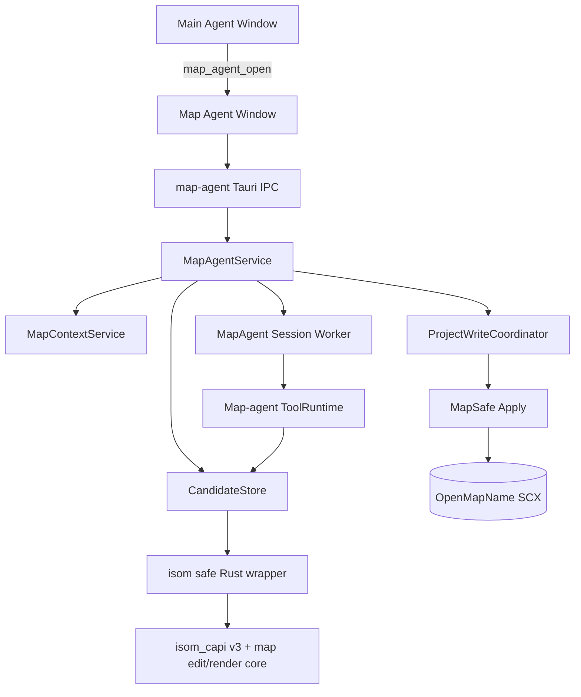

# Map Agent Workbench — Implementation Plan

Status: implemented; historical workbench plan. Current behavior authority is `architecture.md`, `rules.md`, `verify.md`, and the implemented image-terrain plan.

## 1. 목표

현재 EUD 프로젝트에 연결된 저장 원본 SCX를 SCMDraft와 유사한 작업면에서 읽고, 사용자가 선택 영역과 팔레트 항목을 구조화된 멘션으로 에이전트에 전달하며, 에이전트가 원본과 분리된 후보 맵을 반복 수정한 뒤 사용자가 최종 후보 전체를 원본에 원자적으로 적용할 수 있게 한다.

Map Agent Workbench는 기존 채팅 화면에 추가되는 패널이 아니다. 동일한 `eud-agent.exe`와 Rust 코어를 공유하지만 별도의 Tauri 창, 별도의 map-agent 세션, 별도의 후보 상태를 소유한다.

완료 상태는 다음 전체 흐름이다.

```text
기존 eud-agent에서 Map Agent 창 열기
  → 연결된 OpenMapName의 저장 SCX 로드
  → 실제 지형·유닛·건물·두다드·스프라이트·로케이션 표시
  → 격자 영역/개체/팔레트 항목을 프롬프트 멘션으로 추가
  → 에이전트가 요청별 임시 draft에서 생성·렌더·검증
  → 성공한 draft를 후보 rN으로 승격
  → 같은 후보에 후속 지시 반복
  → 원본/후보/diff 시각 검토
  → 사용자 Apply
  → 원본 hash·빌드·파일 잠금·백업 재검사
  → 후보 전체를 원본에 원자 적용
  → 적용 후 재추출·검증·저널 기록
```

## 2. 확정 결정

다음 결정은 구현 중 재해석하지 않는다.

1. **창 구조**: 별도 실행 파일이 아니라 동일한 `eud-agent.exe`의 두 번째 Tauri 창이다.
2. **맵 원본**: 현재 EUD 프로젝트의 저장된 `OpenMapName`만 연다. 임의 파일 선택기는 제공하지 않는다.
3. **저장 상태**: SCMDraft나 다른 편집기의 미저장 메모리 상태는 보지 않는다. 창에는 “저장된 SCX 기준”과 source mtime/hash를 항상 표시한다.
4. **후보 방식**: 원본을 즉시 수정하지 않는다. 후보를 먼저 만들고 시각 검토한 후 사용자가 Apply한다.
5. **후보 수명**: 후속 대화는 직전 후보를 기준으로 새 후보 리비전을 만든다.
6. **선택 형상**: 사각형과 격자 기반 자유 마스크를 지원한다. 자유 마스크는 실제 선택 셀 집합이며 오목한 영역, 구멍, 분리된 영역을 표현한다.
7. **영역 권한**: target이 없으면 현재 candidate 전체의 지원 레이어가 기본 범위이고, 현재 요청의 target은 exact 셀·레이어로 범위를 좁힌다. protect는 항상 우선하며 자연어·reference·anchor는 범위를 확대하지 못한다.
8. **팔레트 역할**: 팔레트는 수동 배치 도구가 아니라 프롬프트 멘션 도구다.
9. **지형 팔레트**: 현재 맵 타일셋의 graphics-valid exact tile을 개별 타일 그리드로 기본 제공하고 의미 지형 ISOM brush는 별도 보기로 제공한다.
10. **팔레트 설정**: 항목 클릭 시 즉시 멘션을 만들고, 멘션 칩의 선택 설정에서 owner/count/state 등을 추가한다.
11. **쓰기 레이어**: terrain, units, buildings, doodads, sprites, locations를 지원한다.
12. **추가 범위 제외**: fog, player controller, force, trigger, briefing, switch, tech/upgrade, sound는 Map Agent의 쓰기 범위가 아니다.
13. **적용 단위**: 여러 레이어가 변경되어도 후보 전체를 하나의 맵 트랜잭션으로 모두 적용하거나 모두 폐기한다. 레이어별·개체별 부분 적용은 제공하지 않는다.
14. **적용 권한**: 모델은 원본 Apply를 호출할 수 없다. Apply는 Map Agent 창의 신뢰된 사용자 동작만 수행한다.
15. **런타임 형태**: `terrain-cli.exe`를 subprocess나 번들 sidecar로 추가하지 않는다. 검증된 POC 알고리즘을 기존 정적 native/isom 계층에 통합한다.

## 3. 범위

### 3.1 포함

- 동일 앱 프로세스의 Map Agent 보조 창 생성·복구·focus
- 현재 프로젝트의 `OpenMapName` 해석 및 저장 SCX 상태 표시
- SCMDraft형 pan/zoom/grid/layer 작업면
- 실제 terrain, unit/building, doodad, sprite 정적 렌더
- location 경계·이름 오버레이
- 개체 hit testing, 겹친 개체 순환 선택, map-to-prompt instance mention
- 사각형 선택과 격자 자유 마스크
- 선택 새로 만들기/추가/빼기/반전/해제
- target/reference/protect/anchor 역할
- 영역별 layer capability
- 의미 지형 및 정확한 tile palette
- unit/building/doodad/sprite/location palette
- type mention과 candidate object instance mention
- mention qualifier 편집
- map-agent 전용 대화와 스트리밍 도구 상태
- 요청별 draft, 후보 revision, 후보 revert/discard
- baseline/candidate/diff 보기
- 후보 diff/verification 요약
- 전체 후보 원자 적용 및 적용 취소용 backup/journal
- app restart 후 미적용 후보 복구
- source 외부 변경 감지와 stale candidate 차단

### 3.2 제외

- 기존 main agent 창 안에 맵 작업면 삽입
- 별도 `map-agent.exe`
- 임의 SCX 파일 선택·편집
- SCMDraft 프로세스의 미저장 상태 또는 selection 동기화
- 사용자의 palette brush 직접 배치
- fog/MASK 쓰기
- player controller, start-location setup, force 쓰기
- trigger, briefing, switch, tech/upgrade, sound 쓰기
- 맵 tileset 전체 변환
- 서로 다른 tileset의 혼합
- 후보 일부만 선택 적용
- 원본 변경 자동 병합
- 모델의 원본 Apply
- SCMDraft의 모든 애니메이션과 편집 속성 UI 복제

## 4. 현재 기반과 격차

### 4.1 재사용할 현재 기능

- `hivemind/docs/features/08_map-info-tool.md`
  - 연결된 `OpenMapName` 해석
  - CHK 추출
  - DIM/ERA/MTXM/MRGN/UNIT/FORC/OWNR/SIDE/SWNM/TRIG digest
  - terrain rectangle query
  - 실제 terrain minimap 렌더
- `hivemind/docs/features/09_location-write-tool.md`
  - compiling guard
  - no-share file lock probe
  - full-file backup
  - location ID 안정성
  - `#64 Anywhere` 보호
  - journal/rollback
- `hivemind/docs/features/13_isom-ffi.md`
  - 정적 `isom_capi.lib`
  - C ABI exception/fault containment
  - safe Rust wrapper
  - native terrain render
- `src-tauri/src/write_coordinator.rs`
  - project-scoped mutation serialization
- `src-tauri/src/engine.rs`, `session.rs`
  - session-bound Codex thread와 이벤트
- `panel/src/components/InstructionBox.tsx`
  - prompt input, draft chip에 적용 가능한 상호작용 패턴
- `map-test` terrain POC
  - exact tile catalog와 graphics validation
  - CV5/VF4 metadata query
  - set/rect/blit patch
  - crop render, diff, analyze
  - deterministic tile validation과 round-trip 증거

### 4.2 새로 필요한 기능

terrain POC 통과가 곧 전체 Map Agent 완료를 의미하지 않는다. 다음은 새 작업이다.

- 기존 SCX를 보존하면서 terrain뿐 아니라 UNIT/DD2/THG2/MRGN을 함께 편집하는 batch writer
- candidate document/revision store
- per-request draft/finalize 프로토콜
- actual unit/building/sprite GRP 정적 렌더와 player color
- doodad overlay 렌더
- palette thumbnail 생성
- interactive canvas와 object spatial index
- grid mask 편집기
- typed map mentions
- map-agent 전용 system prompt/tool allowlist
- visual diff 및 layer permission enforcement
- trusted user-only atomic Apply

## 5. UX 계약

### 5.1 창 수명

- main agent에 `맵 에이전트 열기` 버튼을 추가한다.
- Rust command `map_agent_open`은 기존 `map-agent` window가 있으면 새로 만들지 않고 focus한다.
- 창은 같은 frontend bundle을 사용하되 window label 또는 app URL query로 `MapAgentApp`을 선택한다.
- Map Agent 창은 현재 연결 프로젝트가 없거나 `OpenMapName`이 없으면 편집기를 렌더하지 않고 원인과 main window로 돌아갈 동작을 보여준다.
- project identity/OpenMapName이 바뀌면 기존 후보를 다른 맵에 적용하지 않는다. 미적용 후보가 있으면 새 프로젝트 로드 전에 discard 확인을 요구한다.

### 5.2 레이아웃

```text
Top command bar
  source map / tileset / size / saved mtime / baseline hash
  original | candidate | diff
  candidate revision
  discard | apply | undo last apply

Left palette
  terrain | buildings | units | doodads | sprites | locations
  exact-tile grid, semantic-brush alternate mode, search, recent entries

Center canvas
  terrain base
  doodad/sprite layer
  unit/building layer
  location/grid/selection/diff overlays

Right agent panel
  conversation
  candidate progress/result
  prompt mention tray
  qualifier editor
  input/cancel

Bottom status
  cursor tile/pixel position
  zoom
  selected cell/object counts
  candidate diff summary
  validation state
```

- 중앙 map canvas가 주 작업면이다.
- 좌우 sidebar는 resizable/collapsible하되 map canvas의 최소 작업 폭을 침범하지 않는다.
- 1280×800에서 수평 document overflow가 없어야 한다.
- icon-only control은 `aria-label`과 최소 44px hit area를 갖는다.
- selection 역할은 색상뿐 아니라 라벨, outline pattern, icon으로 구분한다.
- 모든 drag 기능은 보이는 mode control과 좌표/행-span 편집 대안을 제공한다.
- select/checkbox/button 등 일반 form control은 프로젝트의 shadcn/ui primitive를 사용한다.

### 5.3 선택 조작

```text
Drag                 새 rectangle selection, threshold 통과 즉시 실시간 preview
Click                새 selection을 만들지 않음
Click outside        active selection clear
Ctrl + Drag          새 wildcard/free mask
Shift + Drag         rectangle union
Ctrl + Shift + Drag  free-mask union
Subtract mode + Drag mask subtraction
Esc                  active selection clear
```

별도의 보이는 control:

```text
Shape: rectangle | free mask
Operation: replace | add | subtract | invert | clear
```

자유 마스크는 pointer path를 tile grid로 rasterize한다. pointer sampling 누락으로 셀이 끊기지 않도록 연속 sample 사이를 grid line algorithm으로 연결한다. 닫힌 outline은 cell-center even/odd fill로 내부를 채우고, 열린 stroke는 지나간 셀 자체를 선택한다. 최종 truth는 polygon이 아니라 selected-cell mask다.

### 5.4 선택 후 floating toolbar

선택 완료 후 bounds 상단의 화면 내 위치에 표시한다.

- auto label (`영역 A`, `영역 B`, ...)
- rename
- 역할: target/reference/protect/anchor
- allowed layers: terrain/units/buildings/doodads/sprites/locations
- selected bounds `(가로) × (세로) = selected cell 총합`
- prompt에 추가
- `선택 타겟 생성`/삭제
- floating toolbar drag handle 또는 방향키로 화면 안에서 자유 이동

규칙:

- `target`: 현재 요청에 포함되면 지정 셀·layer로 기본 전체 candidate 범위를 축소
- `reference`: agent read/comparison context이며 쓰기 범위를 확대·축소하지 않음
- `protect`: 후보 session 전체에 지속되는 셀·layer 강제 금지 mask
- `anchor`: 위치·방향 read context이며 쓰기 범위를 확대·축소하지 않음
- target/reference/anchor는 message에 포함된 snapshot만 해당 요청에 활성화한다.
- protect는 label이 존재하는 동안 모든 후보 요청에 자동 적용하고 prompt에서 누락돼도 우회할 수 없다.

### 5.5 팔레트

#### Terrain

- 현재 ERA의 graphics-valid exact tile을 tile ID, CV5 group, variant 단위의 개별 그리드로 기본 제공한다.
- exact tile thumbnail은 32×32 타일 하나를 nearest-neighbor로 확대하며 Space Platform의 투명 픽셀은 설치 자산의 star parallax 위에 합성한다.
- 별도 의미 지형 보기에서는 ISOM brush name/terrain type과 실제 preview thumbnail, elevation/buildability/walkability 요약을 제공한다.
- 다른 tileset 항목은 로드하지 않는다.
- 모델용 `map_palette_query`는 browse API가 아니다. 비어 있지 않은 name `query` 또는 typed
  `filter`가 필요하고, 최대 256개 이하의 전체 결과만 한 번에 반환한다. `offset`/`limit`은
  노출하지 않으며 더 넓은 결과는 조건 구체화 오류로 닫는다.
- native `eud-map-catalog/1.filter`는 kind별 exact AND 조건을 pagination 전에 적용한다.
  exact tile은 ID/terrain type/CV5 group/variant/graphics validity/walkability/height/
  buildability/ramp/view를, 나머지 palette 종류는 각 entry에 존재하는 ID와 placement/
  graphics/visibility/dimension metadata를 사용한다. 지원하지 않는 kind-field 조합은
  무시하지 않고 오류로 닫는다.
- 사용자용 `map_agent_catalog`은 빈 검색과 `offset`/`limit`을 유지하여 palette browse를
  계속 지원한다.

#### Units/Buildings

- CHK에서는 UNIT이지만 palette와 layer permission에서는 units/buildings로 분류한다.
- units.dat 기반 분류와 canonical name을 사용한다.
- type mention 생성 후 qualifier에서 owner, count, facing, hp/shield/energy, resource, invincible 등 지원 속성을 편집한다.
- 지정하지 않은 qualifier는 모델이 임의 default로 숨기지 않고 request interpretation에 남긴다. materially different한 owner/count가 없으면 agent가 질문한다.

#### Doodads/Sprites

- 현재 tileset에서 유효한 doodad만 노출한다.
- doodad가 terrain footprint와 THG2 overlay를 함께 바꾸면 두 layer permission을 모두 요구한다.
- sprite palette는 sprite ID/name/static thumbnail을 제공한다.

#### Locations

- 기존 location은 map click 또는 palette search로 instance mention한다.
- `새 로케이션` type mention은 name과 bounds/selection 관계 qualifier를 갖는다.
- `#64 Anywhere`는 read mention만 가능하며 mutation qualifier를 비활성화한다.

### 5.6 Mention 상호작용

- palette `+`는 즉시 type mention chip을 만든다.
- canvas 개체 `프롬프트에 추가`는 candidate-revision-bound instance mention을 만든다.
- chip click은 qualifier/details popover를 연다.
- chip focus/hover는 canvas selection/object를 강조하고 필요 시 `맵에서 찾기`로 pan한다.
- prompt에서 chip 제거는 underlying saved region/protect label을 자동 삭제하지 않는다.
- message history는 display label뿐 아니라 exact mention snapshot을 보존한다.
- deleted/changed candidate object에 묶인 instance mention은 조용히 다른 개체로 재매핑하지 않고 stale로 표시한다.

### 5.7 후보 검토

- `원본`, `후보`, `차이`를 한 control에서 전환한다.
- diff mode는 terrain changed cells, added/removed/moved objects, changed locations를 layer별로 표시한다.
- 후보 summary는 최소 다음을 보여준다.
  - terrain cell count/bounds
  - unit/building add/delete/move/change counts
  - doodad/sprite counts
  - location changes
  - target mask 밖 변경 수
  - protected mask 변경 수
  - unsupported section changes
  - validation status
- 후보 Apply는 validation pass와 non-stale baseline에서만 활성화한다.

## 6. 핵심 데이터 모델

### 6.1 MapRevision

```rust
struct MapRevision {
    project_id: String,
    source_path: PathBuf,
    file_sha256: String,
    chk_sha256: String,
    mtime_ns: u128,
    tileset: Tileset,
    width: u16,
    height: u16,
}
```

`file_sha256`가 original Apply의 concurrency authority다. mtime은 UI와 빠른 stale probe에 사용하되 동일 mtime을 신뢰하지 않는다.

### 6.2 SelectionMask

```rust
enum SelectionRole { Target, Reference, Protect, Anchor }
enum MapLayer { Terrain, Units, Buildings, Doodads, Sprites, Locations }

struct RowSpan {
    y: u16,
    spans: Vec<(u16, u16)>, // [left, rightExclusive), sorted, merged
}

struct SelectionMask {
    id: String,
    label: String,
    source_revision: String,
    role: SelectionRole,
    layers: BTreeSet<MapLayer>,
    bounds: TileRect,
    selected_cells: u32,
    rows: Vec<RowSpan>,
}
```

Invariants:

- spans는 정렬·비중첩·비인접 canonical form이다.
- 모든 span은 DIM bounds 안이다.
- `selected_cells`는 spans 합과 일치한다.
- empty mask는 저장·mention할 수 없다.
- source revision이 다르면 자동 좌표 재사용하지 않는다.

### 6.3 MapMention

```rust
enum MapMention {
    Region { selection_id: String, snapshot_hash: String },
    Object { object_ref: MapObjectRef, role: ObjectMentionRole },
    Palette { entry: PaletteRef, qualifiers: MentionQualifiers },
    Location { location_id: u16, revision: String },
}
```

- user text는 display token만 가진다.
- trusted IPC payload가 exact mention objects를 별도 전송한다.
- agent prompt는 compact description과 stable mention IDs만 받고 상세 대량 데이터는 read tool로 조회한다.

### 6.4 CandidateSession

```rust
struct CandidateSession {
    session_id: String,
    baseline: MapRevision,
    baseline_snapshot: PathBuf,
    current_revision: u32,
    current_map: PathBuf,
    revisions: Vec<CandidateRevision>,
    selections: BTreeMap<String, SelectionMask>,
    persistent_protections: BTreeSet<String>,
}

struct CandidateRevision {
    revision: u32,
    parent: u32,
    request_id: String,
    operation_manifest: PathBuf,
    map_sha256: String,
    diff: MapDiff,
    verification: VerificationReport,
}
```

저장 위치:

```text
%appdata%\eud-agent\map_candidates\<project-id>\<map-session-id>\
  state.json
  baseline.scx
  current.scx
  revisions\r0001.json
  revisions\r0002.json
  drafts\<request-id>.scx.tmp
```

- baseline snapshot은 한 번만 저장한다.
- revision은 deterministic operation manifest를 저장한다.
- current SCX만 materialize한다.
- 과거 revision으로 revert할 때 baseline에서 manifest를 순서대로 replay한다.
- Apply/discard 전 app crash가 발생해도 `state.json`과 current hash가 맞으면 복구한다.
- 불완전 draft는 startup에서 삭제한다.

### 6.5 요청별 Draft

한 agent turn 안의 시행착오를 사용자-visible 후보 revision 여러 개로 만들지 않는다.

```text
visible candidate rN
  → request-local draft copy
  → agent candidate_patch / render / analyze 반복
  → candidate_finalize
  → verification pass
  → visible candidate rN+1
```

- cancel/error/finalize 누락 시 draft만 삭제하고 visible candidate는 바뀌지 않는다.
- 하나의 user request는 최대 하나의 visible candidate revision을 만든다.
- finalize는 parent candidate hash가 request 시작 시점과 동일할 때만 성공한다.

### 6.6 MapEditBatch

native boundary에 전달하는 versioned UTF-8 JSON batch다. map text bytes는 hex/base64로 명시하여 cp949/UTF-8을 JSON parser가 재인코딩하지 않게 한다.

```json
{
  "schema": "eud-map-edit/1",
  "expected": {
    "inputFileSha256": "...",
    "tileset": "jungle",
    "width": 128,
    "height": 128
  },
  "operations": [
    {"op": "terrain.set", "x": 10, "y": 20, "before": 304, "after": 368},
    {"op": "unit.add", "typeId": 125, "owner": 5, "x": 1024, "y": 768},
    {"op": "doodad.add", "doodadId": 17, "x": 40, "y": 32},
    {"op": "sprite.add", "spriteId": 90, "owner": 11, "x": 1300, "y": 740},
    {"op": "location.rename", "locationId": 17, "nameBytesHex": "..."}
  ]
}
```

지원 operation families:

- `terrain.set`, `terrain.rect`, `terrain.blit`, `terrain.isom_brush`
- `unit.add`, `unit.set`, `unit.delete`, `unit.move`
- `doodad.add`, `doodad.set`, `doodad.delete`, `doodad.move`
- `sprite.add`, `sprite.set`, `sprite.delete`, `sprite.move`
- `location.add`, `location.set`, `location.rename`, `location.delete`

각 mutation은 가능한 경우 expected-before fingerprint/value를 포함한다. batch 전체를 먼저 parse/validate하고, input을 한 번 load하고, 모든 op를 memory에서 적용한 뒤 output path에 한 번 save한다. 실패 시 output을 만들지 않는다.

## 7. 목표 아키텍처



Dependency direction:

```text
MapAgentApp
  → typed map IPC
  → MapAgentService
  → {MapContextService, CandidateStore, MapAgentSession, MapSafe}
  → crates/isom
  → native/isom
```

Panel은 SCX path나 candidate storage path를 직접 읽지 않는다. Codex sandbox도 candidate 파일에 직접 접근하지 않는다. 모든 read/write는 typed tool을 거친다.

## 8. Tauri multi-window와 frontend entry

### 8.1 창 생성

- `src-tauri/src/map_agent.rs`에 `map_agent_open` command를 둔다.
- `WebviewWindowBuilder`로 stable label `map-agent`를 생성한다.
- 이미 존재하면 show/focus한다.
- 동일 `panel/dist`를 사용하고 `index.html?surface=map-agent` 또는 window label로 entry를 선택한다.
- `src-tauri/capabilities/default.json`은 main window만 유지하고, `map-agent.json` capability를 별도로 추가해 필요한 core/dialog 권한만 부여한다. shell/process/updater 권한은 Map Agent 창에 불필요하면 부여하지 않는다.
- 창 기본 크기는 map canvas가 실제로 사용 가능한 desktop 크기로 정하고, 최소 크기 아래에서는 sidebars가 overlay/collapse된다.

### 8.2 React 분리

`panel/src/main.tsx`는 surface를 판별해 다음 중 하나만 mount한다.

```text
App             main window
MapAgentApp     map-agent window
```

main App의 session/sidebar/store를 Map Agent에 조건부로 섞지 않는다. 공통으로 재사용할 것은 message, reasoning, tool row, button, input 같은 presentational component와 IPC base뿐이다.

신규 frontend 영역:

```text
panel/src/map/
  MapAgentApp.tsx
  MapWorkbench.tsx
  MapCanvas.tsx
  MapToolbar.tsx
  MapPalette.tsx
  MapAgentPanel.tsx
  SelectionToolbar.tsx
  CandidateControls.tsx
  MentionTray.tsx
  QualifierEditor.tsx
  mapStore.ts
  mapProtocol.ts
  selectionMask.ts
  canvasTransform.ts
  spatialIndex.ts
```

### 8.3 Canvas

- Canvas 2D를 기본으로 사용한다. React DOM node를 tile/object마다 만들지 않는다.
- base terrain/object render는 native/Rust가 생성한 binary PNG crop을 Blob URL로 전달한다. base64나 JSON integer array를 사용하지 않는다.
- viewport pan/zoom은 client transform으로 즉시 처리한다.
- zoom으로 source resolution이 부족해지면 viewport crop을 비동기 요청하고 `(candidateHash, crop, scale, layerSet)` key로 cache한다.
- selection/location/diff overlay는 별도 canvas layer에서 그린다.
- object hit testing은 rendered pixel color가 아니라 CHK digest의 spatial index를 사용한다.
- pointer move 고빈도 처리는 한 animation frame에 한 번으로 coalesce한다.

## 9. Native engine 통합

### 9.1 POC 코드 이관 원칙

`map-test/terrain-cli.exe`는 runtime dependency가 아니다. 다음만 native library로 이관한다.

- `src/starcraft.cpp`의 CV5/VX4/VR4/WPE/VF4 load, tile record, graphics validation, crop render, diff/analyze 알고리즘
- `src/patch.cpp`의 ordered/bounded set/rect/blit 의미
- `src/json.cpp/.hpp`의 strict JSON parser/serializer가 C++ map-edit batch에 필요한 경우
- `src/terrain.cpp/.hpp`의 canonical tile-grid 로직 중 직접 SCX edit에 필요한 부분

다음은 이관하지 않는다.

- `src/main.cpp` CLI parser
- stdout/stderr envelope
- `rawgen`의 새 `MapFile` 생성 경로
- `build` artifact directory orchestration
- standalone executable project/runtime

POC의 `/MT` executable 설정을 가져오지 않는다. 기존 `isom_capi.lib`의 `/MD` 정책과 build chain을 유지한다.

### 9.2 C ABI v5

현재 `ISOM_ABI_VERSION=5`이며 mapedit/render/catalog/digest와 packed image quantizer를 `crates/isom-sys`/`crates/isom` startup assert가 함께 검증한다.

추가 surface의 방향:

```c
int isom_mapedit(
    const char* input_map_path,
    const char* output_map_path,
    const uint8_t* batch_json,
    size_t batch_len,
    uint8_t** out_report_json,
    size_t* out_report_len);

int isom_render_region(
    const char* map_path,
    const char* starcraft_path,
    const uint8_t* request_json,
    size_t request_len,
    uint8_t** out_rgba,
    size_t* out_rgba_len,
    uint32_t* out_width,
    uint32_t* out_height);

int isom_catalog_query(
    const char* starcraft_path,
    const uint8_t* request_json,
    size_t request_len,
    uint8_t** out_json,
    size_t* out_json_len);
```

- C ABI에 STL, exception, Rust allocator를 노출하지 않는다.
- 모든 returned buffer는 `isom_free`로 해제한다.
- request/report는 schema version을 가진다.
- `isom_mapedit`은 input과 output을 분리하고 original in-place save를 하지 않는다.
- C++ exception과 SEH fault는 현재 shim 방식으로 status code로 변환한다.

### 9.3 Existing SCX preservation

`isom_mapedit`은 새 `MapFile(tileset,width,height)`를 만들지 않는다. 기존 map을 load하고 지정 layer만 수정한다.

Save invariants:

- `autoDefragmentLocations=false`
- `lockAnywhere=true`
- location IDs 유지
- `#64 Anywhere` 보호
- 기존 UNIT instance state 유지
- 관련 없는 DD2/THG2 유지
- MPQ extra assets 유지
- unsupported CHK semantics 유지

단순 byte equality만으로 preservation을 판정하지 않는다. MPQ save, section ordering, string-pool compaction은 semantic-equivalent output을 만들 수 있다. 검증기는 section별 canonical digest를 만들고 허용 effect만 비교한다.

### 9.4 Terrain edit

두 경로를 지원한다.

1. **Semantic ISOM brush**
   - existing `Terrain_::Tiles.brushes` name/index 사용
   - `placeIsomTerrain`/`updateTilesFromIsom` 경로 재사용
   - ISOM이 transition을 위해 target 밖을 바꿀 수 있으므로 결과 diff가 allowed mask를 벗어나면 candidate finalize를 거부한다.
2. **Exact tile patch**
   - POC set/rect/blit와 tile validation 사용
   - MTXM/TILE을 함께 기록
   - 그래픽 invalid tile 거부

지형 변경은 tileset/DIM을 변경하지 않는다.

### 9.5 Unit/building edit

- MappingCoreLib scenario API를 통해 기존 UNIT을 load/edit한다.
- building 분류는 units.dat metadata의 canonical predicate를 Rust/native 양쪽에서 동일 table로 사용한다.
- add/set/delete/move는 complete 36-byte placement state를 보존·검증한다.
- unspecified fields는 기존 개체 set에서 유지하고, add에서는 명시된 canonical editor default를 report에 기록한다.
- owner/type/position/valid-field/state bounds를 save 전에 검증한다.

### 9.6 Doodad/sprite edit

- doodad operation은 terrain footprint와 optional overlay effect를 하나의 semantic op로 다룬다.
- required terrain/sprite layer permission이 없으면 op를 거부한다.
- sprite operation은 THG2 flags/owner/type/position을 완전히 다룬다.
- disabled/draw-as-sprite semantics를 보존한다.

### 9.7 Location edit

- 기존 locedit invariants를 batch writer 안에서도 재사용한다.
- add/set/rename/delete 지원
- delete-only-if-unused
- name bytes는 map encoding에 맞춰 Rust가 준비하고 hex/base64 payload로 전달한다.
- MRGN과 필요한 STR/STRx effect를 report한다.

### 9.8 실제 개체 렌더

현재 POC의 unit marker는 Map Agent canvas 요구사항을 충족하지 않는다. native renderer를 확장한다.

- terrain: 기존 VR4/VX4/WPE path
- sprite/unit/building: units.dat → flingy/sprites/images DAT → GRP static editor frame
- player-color palette indices remap
- object position/GRP offset 반영
- draw order: terrain → terrain doodad overlay → sprites → units/buildings
- location, selection, labels, diff는 panel overlay로 유지
- animated iscript playback은 범위 밖이며, object를 식별할 수 있는 deterministic static frame/facing을 사용한다.
- palette thumbnail과 canvas object render는 동일 decoder/compositor를 사용해 시각 불일치를 막는다.

실제 unit/building/sprite 렌더는 POC에서 검증되지 않은 새 위험 항목이므로 golden fixture와 real-install smoke를 별도 gate로 둔다.

## 10. Rust 서비스

### 10.1 MapContextService

기존 map-info path를 확장한다.

책임:

- current `OpenMapName` resolve
- source path canonicalization/project containment
- `MapRevision` 계산
- CHK digest와 layer data cache
- crop/render/catalog native 호출
- object spatial index input 제공
- source stale watch/probe

read result는 항상 source path, file hash, mtime, candidate/source 구분을 포함한다.

### 10.2 CandidateStore

신규 `src-tauri/src/map_candidate.rs`.

책임:

- baseline snapshot
- request draft create/cancel
- typed operation append
- native mapedit 호출
- draft render/analyze
- finalize와 revision manifest
- revision replay/revert
- current candidate recovery
- candidate discard
- source hash stale marking

CandidateStore는 original source를 쓸 수 없다. source mutation API를 타입 수준에서 갖지 않는다.

### 10.3 MapVerificationService

candidate finalize와 Apply 직전에 동일 verifier를 실행한다.

검사:

- parseable SCX/CHK
- DIM/ERA unchanged
- MTXM/TILE valid/equal
- changed terrain cell subset of calculated request authority (no target = whole candidate; target = target union)
- changed object coordinates/footprints within authorized masks
- layer capability
- persistent protection masks
- reference/anchor unchanged
- unsupported section canonical digests
- location ID/reference invariants
- extra MPQ asset inventory/hash
- native report와 Rust re-digest 일치

### 10.4 MapSafe Apply

기존 `mapsafe.rs` rails를 확장하되 candidate generation과 Apply를 분리한다.

Apply:

1. user gesture에서만 command 진입
2. `ProjectWriteCoordinator` ticket 획득
3. STATUS compiling guard
4. source no-share lock probe
5. current source file SHA-256 == candidate baseline SHA-256
6. candidate current hash/state 확인
7. candidate full verification 재실행
8. timestamped full-file backup
9. source directory에 candidate bytes를 temporary file로 stage/flush
10. atomic replace
11. source 재추출·verification
12. journal entry와 backup pointer 기록
13. new baseline load
14. write lease release

명시적 Apply가 승인 행위이므로 main panel의 pending changeset review를 만들지 않는다. 대신 Map Agent에 `마지막 적용 취소`를 제공하며, 동일 lock/compiling/hash 확인 후 backup을 복원한다.

적용 후 검증 실패 시 backup을 즉시 복원하고 성공을 보고하지 않는다.

## 11. Map-agent 세션과 도구

### 11.1 Session kind

기존 persisted session schema에 backward-compatible `kind`를 추가한다.

```rust
enum SessionKind { Eps, Map }
```

- 기존 session record에 `kind`가 없으면 `Eps`로 읽는다.
- main window는 Eps sessions만 표시한다.
- Map Agent window는 현재 project의 Map session만 연다.
- Map session은 독립 Codex thread/event sink/cancellation/runtime을 소유한다.
- project memory와 model settings는 공유하되 map-specific candidate/selections는 Map session에만 속한다.

### 11.2 Prompt

Map agent system prompt는 다음을 고정한다.

- connected saved map과 candidate revision이 authority
- target이 없으면 현재 candidate 전체의 지원 레이어가 기본 write scope
- 현재 요청의 target selection은 exact 셀·layer로 좌표 write scope를 축소
- palette mention은 type/style reference일 뿐 위치 권한이 아님
- protect는 write 금지, reference/anchor는 read context이며 scope를 확대하지 않음
- candidate draft만 수정 가능
- original Apply tool 없음
- render/analyze/diff 후 finalize
- unsupported layer mutation 금지
- owner/count 등 materially ambiguous property는 질문
- 제공된 target 밖 transition이 필요하면 mask 확대를 요청하고 우회하지 않음

### 11.3 Tool allowlist

Read tools:

- `map_status`
- `map_selection_read`
- `map_objects_read`
- `map_render`
- `map_palette_query`
- `map_tile_info`
- `map_analyze`
- `map_candidate_diff`

Draft tools:

- `map_draft_begin`
- `map_draft_patch`
- `map_draft_render`
- `map_draft_analyze`
- `map_draft_reset`
- `map_candidate_finalize`

원본 Apply/backup restore는 MCP tool로 등록하지 않는다.

Rules:

- draft tool은 request-owned draft만 수정한다.
- request ID/candidate parent revision mismatch는 stable conflict error다.
- `map_candidate_finalize`가 성공하기 전에는 사용자-visible candidate/event를 갱신하지 않는다.
- candidate mutation은 live project write가 아니므로 project write lease를 잡지 않는다.
- candidate mutation은 일반 epScript plan gate와 changeset review를 사용하지 않는다. 사용자의 preview/Apply workflow가 별도 승인 경계다.

## 12. IPC 계약

### 12.1 Main → Map window

- `map_agent_open`
- window focus/close events
- global project/source change event

### 12.2 Map window commands

예상 command surface:

```text
map_agent_bootstrap
map_agent_session_load
map_agent_chat
map_agent_cancel
map_agent_render
map_agent_catalog
map_agent_selection_save
map_agent_selection_delete
map_agent_candidate_revert
map_agent_candidate_discard
map_agent_candidate_apply
map_agent_apply_undo
```

### 12.3 Chat payload

```ts
interface MapChatPayload {
  sessionId: string;
  text: string;
  attachments: string[];
  candidateRevision: number;
  mentions: MapMentionSnapshot[];
}
```

- text에 display token을 파싱해 authority를 만들지 않는다.
- mentions는 current map/candidate revision과 selection/object/palette fingerprint를 포함한다.
- backend가 모든 mention을 다시 resolve한 후 Codex input을 만든다.
- attachments는 app-owned staging ID만 전달하고 Map session에 bind한 뒤 기존 이미지/텍스트 attachment context로 resolve한다.

### 12.4 Events

```text
map_source_state
map_candidate_state
map_candidate_progress
map_candidate_finalized
map_candidate_stale
map_render_ready
map_apply_progress
map_apply_result
map_error
```

모든 session/candidate event는 immutable `sessionId`, map session event는 추가로 `candidateRevision`을 가진다. stale/out-of-order result는 panel state에 적용하지 않는다.

## 13. 동시성·안전·복구

### 13.1 Candidate와 project writes

- candidate generation은 AppData의 isolated files만 쓴다.
- main agent가 source map/location을 변경할 수 있으므로 candidate가 열린 동안 project write lease를 장기 보유하지 않는다.
- source path의 watcher/mtime은 조기 stale 표시용이다.
- Apply 시 full hash mismatch가 최종 authority이며 자동 merge는 없다.

### 13.2 같은 Map session 내 동시성

- 한 Map session의 chat은 직렬화한다.
- active request 동안 새 chat은 기존 cancel 또는 완료 후 가능하다.
- render/catalog read는 candidate revision key가 다르면 동시에 완료될 수 있으나 stale response를 무시한다.
- draft owner는 request ID 하나다.

### 13.3 Crash recovery

- draft는 temp suffix로 쓰고 finalize에서 manifest/state를 atomic rename한다.
- startup은 state/current/map hashes를 검증한다.
- orphan draft는 삭제한다.
- baseline source hash가 여전히 같으면 후보를 복구한다.
- source가 바뀌었으면 후보를 read-only stale 상태로 열고 Apply를 막는다. 사용자는 후보 diff를 볼 수 있지만 새 baseline으로 자동 replay하지 않는다.
- Apply staging 중 crash 대비 source-directory temporary와 backup을 startup cleanup/repair 대상에 포함한다.

### 13.4 Object identity

CHK object ordinal을 영구 ID로 신뢰하지 않는다.

- baseline object ref는 section kind + ordinal + semantic fingerprint + baseline hash를 갖는다.
- candidate operation manifest가 새 object에 candidate-local UUID를 부여한다.
- revision replay가 UUID mapping을 유지한다.
- native reparse 후 fingerprint/mapping이 모호하면 mention을 stale 처리하고 다른 개체로 추정 연결하지 않는다.

## 14. 구현 단계

모든 단계는 최종 범위의 일부다. 중간 단계에서 기능을 완료로 선언하지 않는다.

### 단계 A — 계약과 실제 fixture 고정

구현:

- MapRevision, SelectionMask, MapMention, CandidateRevision, MapEditBatch schema 확정
- rich SCX fixture 준비: terrain, units, buildings, doodads, sprites, named/used locations, triggers, extra MPQ asset 포함
- canonical section/object/asset digest 정의
- map-test terrain POC에서 이관할 코드와 버릴 CLI 코드 경계 확정

게이트:

- fixture의 모든 대상/비대상 layer digest가 재현 가능
- selection RLE canonicalization/property tests
- batch schema invalid/unknown field 거부
- unsupported-section allowlist가 명시적

### 단계 B — Native catalog와 composite renderer

구현:

- POC tile assets/catalog/crop render 이관
- semantic ISOM brush catalog
- exact tile catalog
- GRP/DAT static object renderer
- unit/building/doodad/sprite thumbnails
- region render C ABI와 safe Rust wrapper

게이트:

- terrain pixels가 기존 verified renderer와 동일
- sample unit/building/sprite golden output 안정
- player colors 구분
- doodad overlay 중복 없음
- crop/full render 좌표 일치
- real StarCraft install smoke에서 recognizable object 위치 일치

### 단계 C — Existing-map multi-layer writer

구현:

- versioned `isom_mapedit`
- terrain semantic/exact ops
- unit/building ops
- doodad/sprite ops
- location ops
- one-load/one-save/all-or-nothing report
- native output verification

게이트:

- invalid batch가 output을 만들지 않음
- each layer add/set/move/delete round-trip
- mixed batch one-save 성공
- non-target canonical digest 동일
- extra MPQ asset 동일
- location IDs/Anywhere/trigger references 보존
- rawgen/new-map path를 사용하지 않음

### 단계 D — Rust candidate document

구현:

- DataDirs map candidate path
- CandidateStore baseline/current/manifest
- draft begin/patch/reset/finalize
- deterministic replay/revert
- MapVerificationService
- restart recovery/stale state

게이트:

- failed/cancelled request가 current candidate를 변경하지 않음
- 한 request가 visible revision 하나만 생성
- replayed revision의 canonical digest가 original revision과 동일
- source hash 변경 시 Apply 차단
- orphan draft cleanup

### 단계 E — Map window와 read-only canvas

구현:

- `map_agent_open`
- Tauri map-agent capability
- surface-specific React entry
- connected map bootstrap
- top status/palette/canvas/agent layout
- pan/zoom/grid/layer toggles
- binary render crop/cache
- object/location overlays와 hit testing

게이트:

- second window focus/reuse
- OpenMapName 없음/bridge offline/error recovery
- original/candidate source label이 잘못 섞이지 않음
- 1280×800, 1920×1080에서 overflow 없음
- map coordinate ↔ screen coordinate round-trip
- overlapping object selection cycle

### 단계 F — Selection mask, mentions, palette

구현:

- rectangle/free mask rasterization
- replace/add/subtract/invert
- floating toolbar
- role/layer permissions
- persistent protect masks
- type/instance/region/location mentions
- qualifier editor
- semantic/exact palettes
- message snapshot/hover/focus/pan

게이트:

- concave/hole/disjoint masks 정확
- high-speed pointer path gap 없음
- keyboard/visible control parity
- mention IPC가 text parsing에 의존하지 않음
- stale instance mention 차단
- protect가 prompt에서 누락돼도 유지

### 단계 G — Map-agent session과 draft tools

구현:

- backward-compatible SessionKind
- map-only session UI/store/events
- map system prompt
- map tool allowlist
- draft iteration/render/analyze/finalize
- candidate revision conversation state
- AI Elements PromptInput 기반 composer, attachment picker/drop/paste, model/reasoning selector, session context usage

게이트:

- main Eps session과 Map session event/cancel isolation
- 모델이 original Apply surface를 볼 수 없음
- no-target terrain/unit/building/doodad/sprite/location mutation 성공
- 현재 요청 target 밖 native transition 즉시/finalize 검증 거부
- cancelled/failed turn candidate unchanged
- 후속 요청이 직전 candidate를 baseline으로 사용
- attachment-only 요청과 구조화 mention/attachment 동시 요청이 같은 Map session turn으로 전달됨
- `전송` action과 중단 action이 composer 내부에 유지되고 narrow agent panel에서 overflow 없음

### 단계 H — Diff, Apply, undo

구현:

- layer-aware candidate diff
- original/candidate/diff canvas mode
- candidate summary/validation UI
- trusted Apply command
- coordinator + MapSafe + same-directory atomic replace
- post-apply re-verification
- explicit Apply undo

게이트:

- mixed candidate 전체만 적용
- source stale/locked/compiling 거부
- apply failure original bytes 보존 또는 backup 복구
- post-apply source canonical digest == candidate
- undo가 exact previous source bytes 복원
- main writer와 concurrent apply가 coordinator로 직렬화

### 단계 I — 지속성, packaging, 전체 행동 검증

구현:

- candidate restart recovery UI
- map-agent window state persistence
- bundled native ABI/build updates
- architecture/rules/verify/feature docs 최종 갱신
- old/unused candidate cache cleanup policy

게이트:

- release build에 sidecar `terrain-cli.exe` 없음
- packaged map-agent window 권한 최소화
- clean install에서 native assets/catalog/render/edit 동작
- accepted end-to-end scenarios 전부 통과

## 15. 검증 계획

### 15.1 Native/Rust unit tests

- SelectionMask span normalization, union, subtraction, inversion, bounds
- pointer path rasterization property tests
- MapEditBatch strict schema and expected-before conflict
- every native operation family valid/invalid boundaries
- map load/save semantic preservation
- composite renderer frame/palette/player color
- candidate manifest atomicity and replay
- source stale, lock, compiling, backup, rollback
- session kind migration
- map tool authority/protection checks
- apply coordinator behavior

### 15.2 Panel tests

- main button opens/focuses map window command
- MapAgentApp surface routing
- canvas transform and hit testing
- drag modifier behavior
- floating toolbar role/layer controls
- mention chip creation/qualifier/edit/remove
- palette search/paging/advanced tiles
- candidate revision/revert/discard
- original/candidate/diff mode
- Apply disabled states and error recovery
- keyboard focus, aria labels, non-color state cues
- 1280×800 no overflow

### 15.3 기존 전체 검증

```text
cargo fmt --manifest-path src-tauri/Cargo.toml -- --check
cargo clippy --workspace --all-targets -- -D warnings
cargo test --workspace
cd panel && npx tsc -b --noEmit
cd panel && npx vitest run
cd panel && npm run build
cargo build --manifest-path src-tauri/Cargo.toml
cargo tauri build
```

### 15.4 신규 focused smoke

실제 설치 데이터와 복사 fixture에 대해:

1. Map Agent 창에서 connected map 로드
2. terrain/unit/building/doodad/sprite/location 실제 렌더 확인
3. Ctrl free mask와 layer permission 생성
4. semantic terrain + P5 bunker + doodad + location 요청으로 candidate 생성
5. 후속 요청으로 candidate r2 생성
6. original/candidate/diff 확인
7. target/protect 밖 변경 0 확인
8. Apply
9. CHK와 extra MPQ asset 재검증
10. Apply undo와 exact source-byte restore 확인
11. SCMDraft에서 edited map open/visual 확인
12. EUD Editor build가 기존 trigger/epScript 연결을 유지하는지 확인

### 15.5 Agent 품질 시나리오

모델 품질은 unit test 대신 고정 과제와 증거로 평가한다.

- 기존 절벽 스타일을 참고한 국소 지형 수정
- 자유 마스크 안에 비대칭 방 생성
- 보호 기지를 유지한 mixed terrain/building/doodad 배치
- existing object instance 이동/삭제
- named location 추가/변경
- 제공된 target 밖 transition이 필요한 요청에서만 확장 질문
- ambiguous owner/count에서 질문

각 과제 증거:

- user mentions
- operation manifest
- before/after crop
- layer diff
- verification report
- final SCX digest

## 16. 최종 합격 기준

1. Map Agent가 동일 앱의 별도 창으로 열린다.
2. 임의 파일이 아니라 current `OpenMapName`만 연다.
3. 저장된 원본 path/mtime/hash가 항상 보인다.
4. 실제 terrain/unit/building/doodad/sprite/location이 선택 가능한 형태로 표시된다.
5. rectangle과 자유 mask가 exact tile cells로 저장된다.
6. selection role과 allowed layers가 prompt mention에 구조화되어 전달된다.
7. palette type과 canvas instance mention이 구분된다.
8. 의미 terrain과 exact tile advanced palette가 현재 tileset에 한정된다.
9. qualifier가 owner/count/state를 보존한다.
10. protect mask는 prompt 누락으로 우회되지 않는다.
11. agent는 request draft만 수정하고 original Apply 권한이 없다.
12. 실패·cancel turn이 visible candidate를 변경하지 않는다.
13. 후속 turn이 직전 candidate를 기준으로 새 revision을 만든다.
14. candidate revert/discard가 원본을 변경하지 않는다.
15. diff가 모든 지원 layer의 변경을 설명한다.
16. no-target은 전체 candidate 지원 레이어를 허용하고, 현재 target 밖 또는 unauthorized layer 변경은 finalize되지 않는다.
17. unsupported map semantics와 extra MPQ assets가 보존된다.
18. location IDs와 `#64 Anywhere`, trigger references가 보존된다.
19. source hash가 바뀐 stale candidate는 적용되지 않는다.
20. Apply는 compiling/lock/hash/backup/verification/coordinator rails를 모두 통과해야 한다.
21. mixed-layer candidate는 전체가 원자 적용되거나 원본이 유지된다.
22. post-apply source가 candidate와 canonical-equivalent하다.
23. Apply undo가 backup의 exact 원본 bytes를 복원한다.
24. main Eps sessions와 Map session의 event/cancel/state가 격리된다.
25. release bundle에 `terrain-cli.exe` sidecar가 없다.
26. 실제 SCMDraft와 EUD Editor가 적용된 맵을 정상적으로 열고 빌드한다.

## 17. 예상 파일 영향

### 기존 파일

```text
src-tauri/tauri.conf.json
src-tauri/capabilities/default.json
src-tauri/src/lib.rs
src-tauri/src/engine.rs
src-tauri/src/session.rs
src-tauri/src/tool_exec.rs
src-tauri/src/tools.rs
src-tauri/src/ipc.rs
src-tauri/src/chk.rs
src-tauri/src/mapsafe.rs
src-tauri/src/journal.rs
src-tauri/src/config.rs
src-tauri/src/write_coordinator.rs
crates/isom-sys/src/lib.rs
crates/isom/src/lib.rs
native/isom/isom_capi.h
native/isom/isom_capi.cpp
native/isom/isom_capi.vcxproj
native/isom/IsomTerrain/MapGenCli.cpp
panel/src/main.tsx
panel/src/App.tsx
panel/src/lib/protocol.ts
panel/src/lib/ipc.ts
panel/src/index.css
```

### 신규 파일 영역

```text
src-tauri/capabilities/map-agent.json
src-tauri/src/map_agent.rs
src-tauri/src/map_candidate.rs
src-tauri/src/map_context.rs
src-tauri/src/map_verify.rs
native/isom/IsomTerrain/MapAgentCore.h
native/isom/IsomTerrain/MapAgentCore.cpp
native/isom/IsomTerrain/MapAgentRender.h
native/isom/IsomTerrain/MapAgentRender.cpp
panel/src/map/**
```

실제 구현 시 existing owner에 자연스럽게 들어가는 작은 타입까지 무조건 새 파일로 분리하지 않는다. 위 목록은 책임 경계이며 최종 파일 수 목표가 아니다.

## 18. 주요 위험과 대응

| 위험 | 대응 |
|---|---|
| POC는 terrain만 증명했고 full visual map edit는 미검증 | rich fixture와 layer별 native gate를 먼저 통과한 뒤 agent/UI mutation 연결 |
| 기존 SCX save가 unrelated data를 바꿈 | canonical section/object/asset digest와 allowlist verification |
| ISOM transition이 mask 밖을 변경 | draft 전체 diff 후 finalize 거부; 자동 clip 금지 |
| doodad가 terrain과 sprite를 동시에 변경 | semantic doodad op와 multi-layer permission 요구 |
| 실제 GRP object 렌더가 새 구현 | shared renderer, golden image, real-install visual smoke |
| 후보 중 source가 외부 변경 | 장기 lease 대신 Apply hash compare와 stale refusal |
| map object ordinal 재정렬 | revision-bound fingerprint + candidate-local UUID, ambiguous remap 금지 |
| 후보 리비전이 disk를 과다 사용 | baseline/current SCX만 materialize하고 revisions는 operation manifest로 저장 |
| map-agent 권한이 main 앱보다 넓어짐 | 별도 Tauri capability와 user-only Apply command |
| mixed-layer 부분 rollback이 순서를 깨뜨림 | candidate 전체 원자 Apply/undo만 허용 |
| 큰 맵 render/overlay가 WebView를 막음 | crop cache, binary IPC, Canvas 2D, spatial index, frame-coalesced pointer handling |

## 19. 완료 후 문서 정리

구현과 smoke가 모두 통과한 마지막 단계에서만 다음을 현재 동작에 맞게 갱신한다.

- `hivemind/docs/architecture.md`: second window, candidate service, map session
- `hivemind/docs/rules.md`: candidate-only model tools, user-only Apply, mask/layer invariants
- `hivemind/docs/verify.md`: focused native/panel/map-agent smoke commands
- `hivemind/docs/features/08_map-info-tool.md`: shared MapContext/render evolution
- `hivemind/docs/features/09_location-write-tool.md`: Map Agent candidate location path와 기존 direct tool 관계
- `hivemind/docs/features/13_isom-ffi.md`: ABI v5 mapedit/render/catalog/image-quantizer surface

이 계획 문서는 구현 완료 시 역사 계획으로 남기고, 실제 동작 계약은 위 feature/architecture/rules 문서가 authority가 된다.
