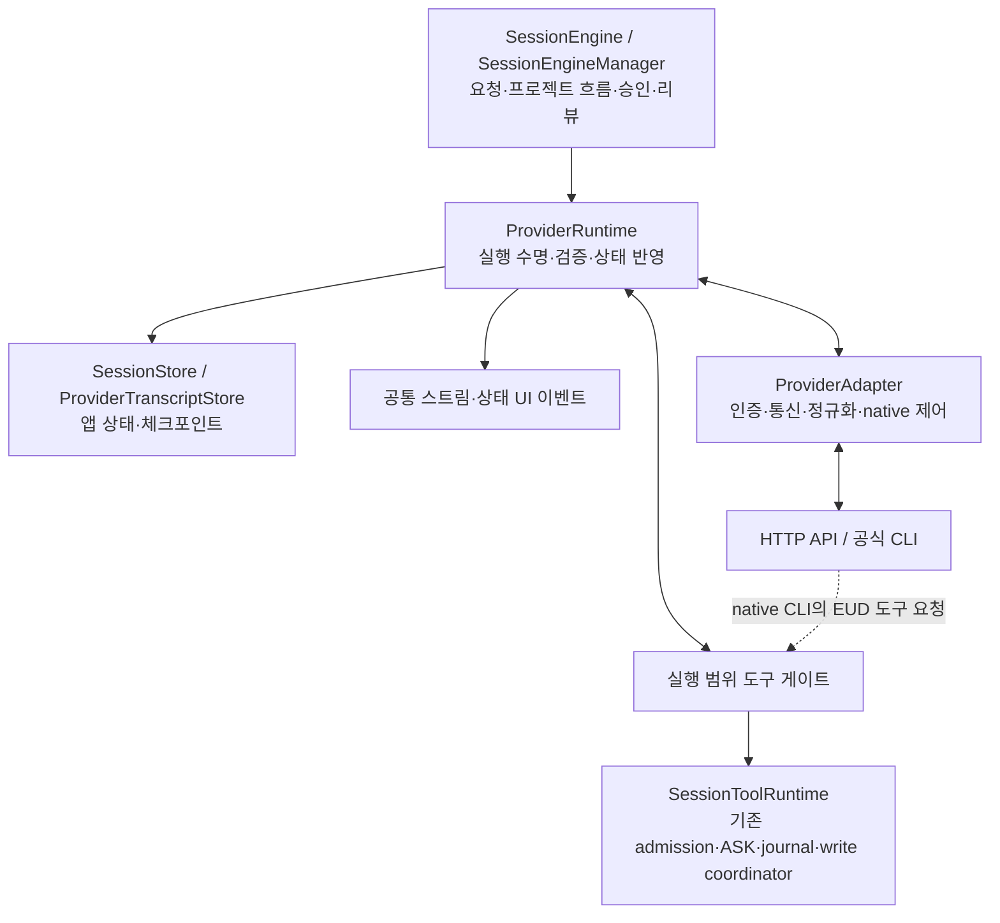

# 프로바이더 공통 실행 런타임 전환 작업 계획

상태: 구현 및 검증 진행 중. 이 문서는 전체 전환·호환성 검증 완료 보고가 아니다.

산출물 범위: 최초 계획의 기준과 완료 조건을 유지하며, 후속 구현 요청에 따라 소스 변경·호출자 전환·회귀 검증·실제 격리 실행·문서 갱신 결과를 체크박스와 증거로 추적한다.

## 1. 목적과 적용 기준

### 1.1 해결할 문제

현재는 다섯 프로바이더가 `AgentDriver`라는 공통 인터페이스를 구현하지만, 각 드라이버가 대화 상태, 저장, workspace 준비, UI 이벤트, 보조 요청의 수명을 함께 소유한다. 따라서 공통 엔진이 같은 성공·오류·취소를 관찰하더라도 드라이버 내부에 남는 상태가 달라질 수 있다.

목표는 **어댑터의 선의와 복구 코드에 의존하지 않고, 공통 실행 런타임이 제품 상태의 변경 권한과 종료 규칙을 소유하도록 전환하는 것**이다.

완료 후에는 새 프로바이더를 등록할 때 인증·통신·프로토콜 변환·지원 기능을 구현하고 동일한 계약 검증을 통과하면 된다. 대화 저장, 도구 권한, UI 발행, 취소 안전성을 프로바이더마다 다시 구현하지 않는다.

보장하는 것은 모델 답변의 동일성이나 모든 모델의 기능 지원이 아니다. 같은 종류의 결과·실패가 같은 제품 규칙으로 처리되고, 미지원 기능·잘못된 응답·시간초과가 대화 손상이나 작업 유실로 번지지 않는 것이다.

### 1.2 현재 코드에서 확인한 출발점

| 현재 경계 | 확인한 구조 | 전환 이유 |
|---|---|---|
| `engine.rs::AgentDriver` | `run_turn`, `compile_task_state`, 재개·초기화·압축이 mutable 드라이버에 결합 | 반환 타입의 통일만으로 상태 변경을 통제할 수 없음 |
| `engine.rs::ProductionProviderDriver` | 다섯 구현으로 위임하는 enum | 프로바이더 선택과 제품 실행 정책을 분리해야 함 |
| `opencode_go.rs::run_structured_turn` | 독립 HTTP 요청으로 컴파일러를 격리 | 안전한 방향이지만 다른 실행 경로에 공통으로 강제되지 않음 |
| Antigravity·Ollama의 `compile_task_state` | revision·persistence 상태 변경 후 `await`, 그 뒤 복구 | Future 폐기 시 복구 코드 실행을 보장하지 못함 |
| Claude Code의 구조화 요청 | 비영속 CLI 요청이지만 드라이버의 workspace 준비와 UI sink 사용 | 비영속 옵션과 앱 부수효과 격리는 별개임 |
| Codex의 상태 컴파일러 | 별도 app-server client와 이벤트 채널 사용 | native transport를 보존하면서 공통 실행 계약에 편입해야 함 |
| `provider_tool_loop.rs` | 공통 도구 dispatch와 구조화 결과 검증 제공 | 재사용하되 실행 수명·저장·UI 정책은 런타임이 소유해야 함 |
| `provider_transcript.rs` | direct provider의 원자적 generation/pointer 저장 | 저장 형식을 버리지 않고 호출 권한과 복구 규칙을 공통화해야 함 |
| `mcp.rs::EudToolHandler` | session runtime으로 직접 `ask`·`execute` 호출 | native CLI 도구도 현재 실행의 수명·권한에 묶여야 함 |
| `engine.rs::run_harness_job_inner` | 일반 드라이버 생성 후 workspace/persistence 옵션 변경 | 하네스도 독립 structured job 경로로 전환해야 함 |

기존 Kimi 실호출 성공은 해당 경로의 증거다. 기존 Fake 드라이버 테스트와 공통 모듈 테스트 통과를 모든 실제 어댑터의 취소·복구 안전성 증거로 사용하지 않는다.

### 1.3 기존 문서와의 관계

- [architecture.md](../architecture.md), [rules.md](../rules.md), [tech-stack.md](../tech-stack.md)의 제품·보안·권한 경계를 유지한다.
- [five-provider-agent-runtime-plan.md](five-provider-agent-runtime-plan.md)의 인증, 지원 프로바이더, native CLI 사용, capability, 무음 fallback 금지 계약을 유지한다. 실행 소유권과 검증 범위는 이 계획에 따라 구체화한다.
- 동시성은 [sessions.md](sessions.md)가 기준이다. 동시 write registration과 짧은 프로젝트별 transaction을 유지하며, review가 끝날 때까지 다른 세션을 막는 옛 FIFO lease 구조를 복원하지 않는다.
- 기존 계획의 미완성 assistant/tool entry 비공개 원칙은 유지한다. **이미 완료된 도구 실행의 내구성 기록까지 버리는 의미로 해석하지 않는다.**
- 기존 문서에 남은 과거 네 프로바이더 행렬은 현재 다섯 프로바이더 지원 범위를 축소하는 근거가 아니다. 이 계획의 검증 행렬에는 Ollama를 포함한다.

## 2. 범위와 비목표

### 포함

- Codex, Claude Code, Antigravity, OpenCode Go, Ollama의 공통 실행 경계.
- 메인 EPS/Python 세션과 Map Agent 세션.
- foreground, 상태 컴파일러, 하네스 생성·기존 retry, 재개, rewind, compaction, 취소.
- 정규화된 이벤트, 도구 admission, 실행 범위, 대화 체크포인트, UI 라우팅.
- 실제 어댑터를 사용하는 결정적 계약 테스트와 프로토콜·기능 조합별 실호출 검증.

### 제외

- 새 프로바이더 추가, 동적 플러그인 시스템, 외부 agent SDK/server 도입.
- 인증 체계·설치 UI의 재설계, credential 저장 위치 변경.
- 세션의 provider 변경, 장애 시 다른 provider/model로 자동 전송.
- 프로젝트 도구, canonical 파일, journal, review, Map Apply 권한의 재설계.
- 모든 프로바이더를 같은 HTTP API나 같은 native session 형식으로 변환하는 작업.
- 일반 재시도 시스템, 도구 병렬화, 새 telemetry·benchmark 시스템 추가.
- 문제를 감추기 위한 timeout 증가, JSON substring 추출, reasoning의 답변 대체, 특정 모델 이름 분기.

## 3. 목표 구조와 소유권



### 3.1 책임 분리

| 구성 요소 | 소유하는 책임 | 소유하지 않는 책임 |
|---|---|---|
| `SessionEngineManager` | 세션 worker, 실행 생성, provider busy 상태, 하네스 작업 라우팅 | 프로바이더별 wire 해석 |
| `SessionEngine` | 사용자 요청, context 조립, 승인·리뷰·되돌리기, 검증된 도메인 결과 반영 | 개별 provider stream loop |
| `ProviderRuntime` | run 수명, deadline, 도구 요청 중개, checkpoint, 모델 이벤트 검증, stream UI 발행 | provider별 인증·요청 JSON 구현 |
| `ProviderAdapter` | 인증·endpoint, request encoding, stream decoding, native client/process, 지원 기능과 재개 가능성 보고 | 앱 대화 저장, 작업 상태 적용, canonical workspace 변경, UI 직접 발행 |
| `SessionToolRuntime` 및 기존 서비스 | 도구 의미·권한·실행, ASK, evidence/action budget, journal, 짧은 프로젝트 transaction | provider별 통신 |
| `SessionStore` / `ProviderTranscriptStore` | 기존 저장 계약과 검증, 제한된 원자적 갱신 | provider 선택과 모델 실행 |

상위 엔진의 workflow 이벤트와 런타임의 모델 스트림 이벤트는 구분한다. UI 이벤트를 하나의 거대한 클래스에 모두 몰아넣지 않되, **어댑터에서 UI로 우회 발행하는 경로는 없앤다.**

### 3.2 어댑터에 전달할 수 없는 권한

- `SessionEventSink`, 앱 `SessionStore`·`ProviderTranscriptStore`의 변경 핸들.
- `WorkspaceManager`, journal, write coordinator 등 제품 상태 변경 서비스.
- 범위가 제한되지 않은 `SessionToolRuntime`.
- 본 대화 driver 자체 또는 저장 revision을 변경할 수 있는 참조.

어댑터에는 선택된 credential/profile·endpoint 접근, 불변 요청, 필요한 attachment/작업 디렉터리 참조, 취소 제어, 내부 이벤트 채널만 제공한다. 전체 앱 서비스를 넘긴 뒤 내부에서 저장소를 다시 생성하는 우회도 금지한다.

이는 신뢰된 Rust 코드의 모듈/API 책임 경계다. 공식 CLI 프로세스를 완전한 새 보안 sandbox로 만든다는 주장은 하지 않는다. 기존 app-owned profile, Codex sandbox, Claude built-in tool 제한, filesystem 경계는 그대로 유지한다.

### 3.3 native 저장과 앱 저장의 구분

Codex의 native thread와 Claude의 native session은 프로바이더가 관리한다. 이를 앱의 direct transcript 저장소로 강제 이식하지 않는다.

`ProviderConversationState`의 native ID와 direct revision 구분을 유지하면서, 앱이 어느 ID/checkpoint를 신뢰하고 언제 저장할지는 공통 런타임이 결정한다. native 취소 후 원격 상태를 확인할 수 없으면 재개 가능 상태라고 추정하지 않는다.

## 4. 공통 요청·이벤트 계약

이 절의 새 타입 이름은 구현 목표 이름이다. 기존 타입과 의미가 겹치면 이동·확장하고 구 타입/alias를 남기지 않는다.

### 4.1 실행 입력

- `RunIdentity`: session ID, 실행 ID, 요청 또는 job ID, 대상 EPS/Map 종류, cancellation generation.
- `BindingSnapshot`: 실행 시작 시 고정한 provider/model/reasoning/base URL과 지원 기능 근거. job retry는 저장된 snapshot을 사용한다.
- `ForegroundRequest`: 검증된 context, 현재 continuation, attachment, 해당 실행의 도구 권한, 실행 정책.
- `StructuredJobRequest`: job 종류, inline 입력 또는 승인된 읽기 전용 snapshot, 출력 schema, 기준 revision/branch, 결과 수신 대상, 실행 정책.
- `RunPolicy`: active deadline, 결과 크기, tool round 제한, output budget, 재개 정책. 전역 mutable 설정을 실행 도중 다시 읽지 않는다.

foreground와 structured job을 독립 타입/variant로 구성한다. `revision = 0`, `persist = false`, `workspace_override`를 임시로 바꾸는 조합으로 실행 종류를 표현하지 않는다.

### 4.2 내부 이벤트와 종료 결과

| 이벤트 의미 | 공통층의 처리 |
|---|---|
| 답변 조각 | 해당 실행의 foreground stream에만 전달 |
| reasoning 조각/블록 | 답변과 구분해 보존·표시; 답변 대체 금지 |
| 도구 호출 조각 | adapter에서 호출별로 조립; 실행 요청으로 취급하지 않음 |
| 완성된 tool batch | ID·인자·권한 검증 후 공통 도구 게이트에 전달 |
| 구조화된 출력 | 전체 결과를 Rust schema와 도메인 validator로 검증 |
| 사용량 | provider 의미를 보존하며 관찰된 수치만 해당 실행에 집계 |
| 모델 응답/step 종료 | tool batch, finish reason, output completeness를 확인하고 다음 동작 결정 |
| transport 오류/종료 | partial success로 바꾸지 않고 공통 실패 처리 |
| native continuation 갱신 후보 | 실행 상태와 checkpoint 조건을 확인한 뒤 앱 저장에 채택 |

`ResponseFinished`와 최종 `RunOutcome`을 구분한다. direct HTTP의 `finish_reason=tool_calls`는 전체 작업 성공이 아니다. native CLI의 종료 알림도 진행 중인 MCP 실행과 결과 전달이 정리됐는지 확인한 뒤 최종화한다.

최종 결과는 성공, 사용자 취소, 실패, write-mode 전환이 필요한 제어 결과를 구분한다. read run의 첫 mutation이 만드는 내부 전환을 사용자 답변 성공이나 mutation 성공으로 위장하지 않는다.

### 4.3 정규화 시 보존할 정보

- response/step 순서와 text·reasoning·tool block의 순서.
- 같은 응답 안의 tool-call batch와 각 call/result의 대응 관계.
- tool ID, 실패 여부, image/media 결과, usage의 실제 의미.
- thought signature, encrypted reasoning, native resume 정보 등 provider-bound continuation 데이터.

provider 고유 continuation 데이터는 크기 제한을 둔 전용 필드로 다룬다. adapter만 해석하며, credential/raw auth header를 저장하거나 UI에 노출하지 않는다. 다른 provider로 재전송하지 않는다.

공통 표현은 가장 빈약한 프로토콜에 맞춰 정보를 지우는 형태가 아니어야 한다. 미해석 필수 의미를 일반 텍스트나 가짜 성공으로 바꾸지 않는다.

## 5. 실행 종류와 권한

| 실행 종류 | 대화 | 프로젝트 도구 | 모델 스트림 목적지 | 허용되는 앱 반영 |
|---|---|---|---|---|
| Foreground | 검증된 기존 대화 재개 | session kind·요청에 허용된 도구만 | 해당 세션 | 도구 결과·대화 checkpoint·검증된 최종 결과 |
| Task-state compiler | fresh, nonpersistent | 없음 | 본 대화에 발행하지 않음 | schema·provenance·기준 revision 검증 후 task-state delta |
| Harness generator | fresh, nonpersistent | 없음; 기존 prompt/snapshot 기반 생성 | 해당 job 상태만 | 검증된 delta를 기존 staging/review 경로로 전달 |

공식 CLI가 cwd를 요구하면 런타임이 준비한 격리된 디렉터리를 넘긴다. 보조 작업이 본 대화 workspace를 재바인딩하거나 canonical 파일을 직접 쓰게 하지 않는다.

보조 실패를 숨기지는 않는다. 공통 엔진은 기존 `task_state_warning`이나 harness job 실패 상태를 명확히 기록·표시할 수 있다. 이는 보조 모델의 reasoning·답변·usage를 본 대화에 섞는 것과 구분한다. 격리 검증도 이 의도된 도메인 경고까지 금지하는 방식으로 작성하지 않는다.

구조화된 결과 제출을 function/tool wire로 표현하는 경우, 그것은 어댑터의 **응답 인코딩 수단**이다. EUD 도구 목록에 등록하거나 `SessionToolRuntime.execute`로 보내지 않는다. 정확히 하나의 허용된 결과만 받으며, 다른 도구 요청·중복 결과·잘린 JSON을 실패 처리한다.

compiler의 입력 의미와 승인·provenance 규칙은 `task_state.rs`가 소유한다. 특정 모델용 업무 프롬프트 복사본을 adapter에 두지 않는다. wire별 결과 제출 방식에 필요한 설명만 변환 계층에 남긴다.

## 6. 공통 수명·도구·저장 규칙

### 6.1 실행 상태와 취소

실행 내부 상태는 준비, 모델 응답 대기, 도구 실행, 사용자 ASK 대기, 중단 정리, 종료를 구분한다. backend run 상태와 기존 panel session activity는 각각의 역할을 유지한다.

필수 규칙:

1. 실행 ID는 시작 시 고정되고 모든 모델 이벤트와 도구 admission에 결합한다.
2. 종료 결과는 정확히 한 번 확정한다. 응답 종료, process exit, cancellation이 경합해도 중복 완료를 발행하지 않는다.
3. 취소 시 새 도구 admission부터 차단하고 transport에 중단을 요청한다.
4. HTTP stream abort, native interrupt, Windows process-tree 종료는 adapter가 수행하고 결과를 보고한다. 런타임은 제한된 정리 시간을 관리한다.
5. transport가 닫혔다고 원격 계산까지 중단됐다고 주장하지 않는다. native continuation 상태가 불명확하면 확인 없는 재개를 금지한다.
6. 종료된 run의 늦은 모델 이벤트는 차단한다. 이미 시작된 도구의 결과·journal 기록까지 버리지는 않는다.
7. `spawn_blocking`을 drop했다고 도구 실행이 취소된 것으로 취급하지 않는다. in-flight 작업이 정리되기 전 같은 세션의 새 작업이 그 결과를 잘못 인수하지 못하게 한다.
8. 사용자 ASK 대기는 provider active-time deadline에서 제외하며, 세션 취소·닫기·transport 종료 시 ASK를 한 번만 종료한다.
9. 같은 세션 command 직렬화, 서로 다른 세션 overlap을 유지한다. 새로운 전역 실행 mutex나 provider 전체 작업 큐를 추가하지 않는다.

현재 compiler 60초와 harness 300초의 의미는 유지한다. 이번 문제를 숨기기 위해 늘리지 않는다. 개별 timeout 상수를 공통 실행 정책으로 옮길 때 기존 값과 예외를 먼저 대조한다.

### 6.2 도구 실행 권위

`provider_tool_loop.rs`의 검증·dispatch와 `SessionToolRuntime`의 실제 도구 의미를 재사용한다. 공통 런타임에 또 하나의 EUD 도구 구현을 만들지 않는다.

- 완성된 인자만 검증·실행한다. 중복 call ID, unknown tool, 잘못된 schema의 처리를 provider마다 다르게 하지 않는다.
- 도구 ID와 transport request ID를 구분한다. 다른 실행의 같은 문자열 ID가 충돌하지 않도록 실행 범위를 포함한다.
- 같은 response의 도구는 기존 순서 실행을 유지한다. 도구 병렬화는 이 전환에서 도입하지 않는다.
- evidence, write registration, request-owned Map candidate, journal, build, review 권한은 기존 서비스에 남긴다.
- read run의 첫 mutation은 실행하지 않고 내부 write registration과 제어 전환을 만든다. 실행되지 않은 batch의 나머지를 성공한 도구나 완료 답변으로 기록하지 않으며 모델-facing write-intent 도구를 두지 않는다.
- 일반 도구 오류와 transport/protocol 오류를 구분한다. 정상적인 도구 실패 결과는 모델에 돌려줄 수 있지만 무단 호출이나 잘못된 실행 수명은 진행하지 않는다.
- 모델 종료 오류를 이유로 완료된 mutation을 자동 재실행하거나 자동 rollback하지 않는다.

native MCP 경로도 실행 범위 게이트를 통과한다. handler는 자신이 생성된 run에 결합하고, 이전 run의 client가 새 요청의 권한을 얻지 못하게 한다. 기본 방식은 실행별 endpoint/handler 수명이다. 재사용이 필요하면 동일한 무효화 보장을 증명해야 한다.

Codex/Claude의 도구 알림과 실제 MCP 요청은 같은 사건의 서로 다른 표현일 수 있다. **알림을 추가 실행 명령으로 해석하지 않는다.** 실제 실행과 결과 기록의 권위는 도구 게이트에 두고, native 알림은 상관관계·관찰 정보로 취급한다.

### 6.3 대화 체크포인트와 내구성

- direct provider의 generation/pointer 저장과 native provider의 ID 구분을 유지한다. 저장소 전면 교체를 하지 않는다.
- 앱 저장 변경은 공통층만 수행한다. `SessionStore`의 분야별 갱신을 사용하고 panel log autosave가 runtime/task state를 덮어쓰지 못하게 한다.
- 도구 admission·완료 결과와 최종 답변 성공은 다른 확정 지점이다. 도구가 끝났다면 최종 답변 실패와 무관하게 확인 가능한 기록을 남긴다.
- checkpoint는 완료된 tool 결과를 보존하되, 미완성 인자나 존재하지 않는 결과를 만들어 provider에게 재생하지 않는다. 재개 가능한 response boundary와 아직 정리되지 않은 실행을 구분한다.
- 토큰 조각마다 전체 transcript를 복사·직렬화·저장하지 않는다. 기존 journal과 도구 완료 경계, 응답 경계의 bounded checkpoint를 활용한다.
- 검증된 direct committed pointer를 저장 revision의 권위로 사용한다. session metadata가 뒤처지면 일치하는 provider·session·branch의 유효한 checkpoint로 동기화한다.
- 손상된 hash, 다른 provider, 없는 generation, 앞서 있는 metadata를 임의의 빈 대화로 복구하지 않는다.
- native ID는 adapter가 보고한 후보를 런타임이 채택한다. native history가 이미 바뀌었을 수 있는 실패에서는 재개 가능성을 별도로 판단한다.
- 프로세스 crash와 외부 부수효과 사이의 불확실성을 완전한 exactly-once로 포장하지 않는다. 실행 여부를 모르면 보존된 journal/checkpoint를 바탕으로 명시적으로 복구하며 자동 full-turn replay를 하지 않는다.

기존 세션을 읽기 위해 데이터를 삭제하거나 provider를 바꾸지 않는다. 기본은 기존 schema 호환 읽기다. ordered block/continuation 정보 때문에 저장 schema 변경이 필요하면 지원 버전, 변환 규칙, 실패 시 원본 보존을 명시하고 구버전 fixture로 검증한 뒤 적용한다. 여러 저장 형식을 무기한 동시에 쓰는 경로는 만들지 않는다.

### 6.4 재개·rewind·compaction

- context delivery cursor는 성공이 확인된 경계에서만 전진한다.
- rewind/compaction은 일반 foreground/보조 job과 경합하지 않도록 해당 세션에서 직렬화한다.
- native compaction 명령은 native adapter에 남기되, 성공 확인 이후의 checkpoint·epoch 갱신은 공통층에서 수행한다.
- direct summary 요청은 격리된 도구 금지 실행을 사용하고, 검증된 summary가 반환된 뒤 런타임이 새 generation을 publish한다.
- rewind 이전 branch를 기반으로 생성된 늦은 compiler/harness 결과를 현재 branch에 반영하지 않는다.
- 승인된 계획·task provenance·미결 review·Map candidate의 권위는 compaction이나 재개로 확장되지 않는다.

## 7. 프로토콜별 어댑터 계약

| 어댑터 | 유지할 native 기능 | 공통층으로 이동할 책임 | 필수 확인 |
|---|---|---|---|
| Codex | 공식 app-server, app-owned profile, native thread·interrupt·compaction | 모델 이벤트 UI 처리, 제품 checkpoint 반영, 작업 수명 | native 도구와 MCP 중복 실행 방지, 종료 확인, 권한 전환 후 재개 |
| Claude Code | 공식 구독 CLI, stream-json, session ID, schema·비영속 옵션 | workspace 준비 정책, UI 발행, job/foreground 분기 | built-in 도구 제한, 보조 요청의 MCP 부재, 프로세스 트리 정리 |
| Antigravity | OAuth·Cloud Code 요청과 Gemini stream, thought signature | 직접 도구 반복, transcript publish, usage/UI, compiler 상태 복구 코드 | signature 보존, function result 대응, 취소 후 main 상태 불변 |
| OpenCode Go | catalog 기반 wire 선택, Chat Completions·Responses·Anthropic Messages | 직접 도구 반복, transcript publish, usage/UI, 독자 compiler 실행 정책 | tool batch·reasoning 순서, HTTP 200 오류 프레임, 모든 wire의 schema 응답 |
| Ollama | 저장된 OpenAI 호환 base URL, 사용자가 고른 model ID, 지원 schema wire | 직접 도구 반복, transcript publish, usage/UI, compiler 상태 복구 코드 | model별 기능 거부, proxy 오류, base URL snapshot 유지 |

HTTP provider는 공통 런타임이 모델 step과 도구 결과의 반복을 소유한다. 공식 CLI는 native 내부 루프를 유지한다. 동일하게 만드는 것은 제품 권한·수명·오류·저장 계약이지 native 내부 구현이 아니다.

### Capability와 budget

- wire 선택은 검증된 provider metadata와 실제 프로토콜 계약을 사용한다. 모델 이름 문자열 패턴으로 추측하지 않는다.
- 명시적으로 미지원인 image/tool/schema 기능은 전송 전에 거부한다.
- metadata가 없는 직접 지정 모델을 검증된 지원 모델이라고 표시하지 않는다. 기존의 명시적 endpoint/model 요청은 보존하되, 실제 기능 거부를 명확한 capability/model 오류로 처리한다.
- native schema, required structured-response function, CLI schema 옵션은 하나의 schema 결과 계약으로 수렴한다. 미지원 조합은 prose 파싱이나 다른 모델로 우회하지 않는다.
- 업무 프롬프트와 실행 정책은 공통층 소유다. adapter는 토큰·reasoning·schema 옵션을 지원되는 wire 필드로 변환한다.
- output cap과 context 크기는 모델의 알려진 상한을 넘지 않게 적용한다. task-state compiler의 요청 output budget은 현재 8192를 공통 정책으로 옮기고, 지원되는 wire에서는 모델 상한과의 최솟값을 적용한다. harness에는 이 compiler 전용 상한을 일괄 적용하지 않고 기존 job의 출력 계약과 크기 제한을 유지한다. CLI가 token 제한을 제공하지 않으면 가짜 플래그를 만들거나 JSON을 잘라 맞추지 않으며, 공통 시간·바이트 제한과 실제 지원 범위를 명시한다.
- 예상 token/s로 모델 성공이나 60초 내 완료를 보장하지 않는다. deadline·크기 초과 시 상태 보존이 보장되어야 한다.

## 8. 파일별 변경 지도

| 파일/영역 | 예정 작업 |
|---|---|
| 신규 `src-tauri/src/provider_runtime.rs` | 공통 실행 계약, run 수명, direct step loop, structured job, adapter 경계. 별도 플러그인 프레임워크는 만들지 않음 |
| `src-tauri/src/provider.rs` | 기존 binding/capability/native continuation 타입 재사용·필요한 확장. 다섯 provider enum 유지 |
| `src-tauri/src/engine.rs` | `AgentDriver` 중심 호출을 공통 런타임으로 전환. `production_provider_driver`, `ProductionProviderDriver`, `update_task_state_after_turn`, `run_harness_job_inner` 및 세션 worker 생성 경계 이전 |
| `src-tauri/src/codex_client.rs` | `AgentTurnInput` 등 공통 타입을 중립 경계로 이동. native app-server 기능 유지 |
| `src-tauri/src/claude_client.rs` | CLI transport/decoder/native 수명으로 책임 축소 |
| `src-tauri/src/antigravity_client.rs` | Cloud Code transport/decoder로 책임 축소; mutable compiler save/restore 제거 |
| `src-tauri/src/opencode_go.rs` | 세 wire codec와 catalog/auth 유지; 제품 실행 정책 이동 |
| `src-tauri/src/ollama.rs` | OpenAI 호환 transport/decoder와 endpoint 계약 유지; mutable compiler save/restore 제거 |
| `src-tauri/src/provider_tool_loop.rs` | 공통 도구 dispatch/schema validator 재사용·실행 범위 검증 정착. 중복 루프 생성 금지 |
| `src-tauri/src/mcp.rs` | 실행 범위 도구 게이트 연결, handler 무효화, native 알림과 실행의 중복 방지 |
| `src-tauri/src/tool_exec.rs` | 기존 session·request·kind 권위 유지. run admission에 필요한 최소 경계만 추가 |
| `src-tauri/src/provider_transcript.rs` | 런타임 전용 publish/restore 정책, 완성 경계·continuation 보존, crash/손상 검증 |
| `src-tauri/src/session.rs`, `src-tauri/src/context_state.rs` | 분야별 갱신·복구·epoch·branch·cursor 계약 유지 및 새 런타임 연결 |
| `src-tauri/src/task_state.rs`, `src-tauri/src/harness.rs` | 공통 structured job 입력/결과 연결. schema·provenance·staging/review는 기존 권위 유지 |
| `src-tauri/src/provider_service.rs`, `src-tauri/src/provider_secrets.rs` | 인증·catalog·busy 서비스 재사용. inference 전역 lock이나 저장소 우회 권한을 추가하지 않음 |
| `src-tauri/src/lib.rs`, `src-tauri/src/map_agent.rs`, `src-tauri/src/ipc.rs` | 런타임 생성·세션·Map·UI 연결의 영향 범위만 갱신 |
| `panel/src/`의 기존 session/provider event 소비 경계 | 기존 IPC를 우선 유지. 이벤트 계약 변경이 필요하면 Rust와 모든 소비자를 같은 cutover에서 갱신 |

구현 전 exported symbol의 references를 LSP로 확인한다. 공통 타입 이동/rename은 LSP를 사용하고 호출자·테스트·문서를 함께 갱신한다. 구 이름의 alias/re-export로 우회하지 않는다.

## 9. 구현 순서와 단계별 완료 조건

각 단계는 내부 작업 순서다. 일부 프로바이더만 새 경로를 쓰는 상태를 최종 산출물로 배포하지 않는다.

### 단계 A — 계약과 현재 동작 고정

대상: `provider.rs`, `engine.rs`, `codex_client.rs`, 공통 실행 계약.

- [x] foreground·structured job·binding snapshot·run identity·종료 결과의 계약을 정의한다.
- [x] 현재 timeout, output/round 제한, ASK pause, native resume/compaction 지원을 대조하고 이 전환에서 유지할 의미를 명시한다.
- [x] 생성자와 호출 지도를 확인한다. 세션 worker, Map, compiler, harness retry까지 포함한다.
- [x] 현재 취소 취약 경로와 다중 도구/부분 오류 사례를 실제 adapter 경계의 결정적 회귀 시나리오로 확보한다.

구현 추적(2026-09-12): 공통 계약과 호출자 전환이 컴파일되며 실제 adapter fixture를 포함한 689개 테스트 바이너리를 확보했다. Antigravity 배치 경계 및 실행 receipt 덮어쓰기 회귀를 실제 실행해 실패를 확인했다. 이는 단계 A의 계약·회귀 확보 증거이며, 후속 단계의 통과나 전체 호환성 완료를 뜻하지 않는다. 상세 증거: `.omo/provider-runtime/integration-tests-compile-7.meta`, `.omo/provider-runtime/receipt-collision-red-7.log`, `.omo/provider-runtime/focused-7-sends_ordered_batch_results_and_signature_on_followup_step.log`.

완료 조건: 모의 최종 답변만 비교하는 것이 아니라, 어느 실행이 어떤 권한을 갖고 어떤 종료 결과를 만드는지 테스트 가능한 계약이 있다. 기존 지원 기능이나 native 인증 경로를 제거하지 않는다.

### 단계 B — 실행 수명과 격리 경계 구현

대상: 신규 `provider_runtime.rs`, engine의 실행 소유권.

- [x] foreground 실행 객체와 독립 structured job 객체를 구현한다.
- [x] run identity, deadline, 취소, late event 차단, 단일 최종화, bounded native 종료를 구현한다.
- [x] adapter 입력에서 제품 저장소·UI sink·범위 없는 workspace/tool 서비스를 제거한다.
- [x] transport 수명과 제품 상태 반영을 분리한다. 불명확한 native continuation을 재사용하지 않는다.

구현 추적(2026-09-12): checkpoint 8에서 공통 런타임 계약 19개와 native 취소·프로세스 폐기 회귀가 통과했다. 독립 `StructuredJobExecutor`는 본 대화 저장소·UI·도구 서비스를 소유하지 않는다. 이후 private module 추출 및 추가 production adapter 실패 행렬은 재검증 중이며, 단계 D/E/G 완료로 간주하지 않는다. 증거는 `.omo/provider-runtime/verification.md`의 checkpoint 8 기록과 focused-8 로그에 있다.

완료 조건: 제어 가능한 transport로 새 런타임의 지연·오류·종료 처리를 실행했을 때 structured job에 본 대화 변경 권한이 없고, in-flight 작업을 정리할 취소 수명이 존재한다. 실제 production adapter의 동일 보장은 단계 D/E에서 검증하며, 이 단계의 fake transport 성공으로 대신하지 않는다.

### 단계 C — 도구 게이트와 체크포인트 연결

대상: `provider_tool_loop.rs`, `mcp.rs`, `tool_exec.rs`, `provider_transcript.rs`, `session.rs`.

- [x] HTTP tool batch와 native MCP 요청을 동일한 run-scoped admission에 연결한다.
- [x] native 도구 알림을 실행으로 중복 처리하지 않고, 오래된 handler의 권한을 무효화한다.
- [x] ASK pause, write-mode 전환, 실행 완료 결과, review 보존을 기존 서비스와 연결한다.
- [x] 도구 완료와 최종 답변의 확정 지점을 분리하고 손상/중단/metadata 지연 복구를 구현한다.
- [x] token마다 전체 history를 복제하거나 저장하지 않도록 ownership과 checkpoint 경계를 정리한다.

구현 추적(2026-09-12): checkpoint 12에서 실제 파일 변경 중 Future 폐기 뒤 journal·receipt 복구, gate 14개, transcript 13개, MCP 6개 및 Codex 프로세스의 실제 두 MCP 결과 수신이 통과했다. 당시 실패했던 Claude 프로세스 fixture는 checkpoint19에서 수정·통과했다. 실제 Claude 계정 검증은 별도로 미검증이며 전체 native 실서비스 호환성 통과로 기록하지 않는다. 증거: `.omo/provider-runtime/runtime-boundary-final.md`.

추가 실제 검증(2026-09-12, checkpoint28): EPS 쓰기 실행에서 이미 부여된 write intent의 재요청이 두 번째 `WriteTransition`으로 처리되어 answer handling 오류에 도달했다. 해당 전환 항목은 재개방한다. 별도로 native `src/main.eps`와 session mirror `source/main.eps`의 기준 경로 불일치로 실제 수정이 거부되었다. `.omo/evidence/write-baseline28-diagnosis.md`와 `.omo/evidence/provider-runtime-checkpoint28-final/provider-runtime-checkpoint28-manual-qa.md`에 실패와 남은 검증을 보존한다.

재검증 완료(2026-09-12, checkpoint39): 위 두 오류는 회귀 테스트와 실제 UI33의 편집·빌드·검토 반려/적용 유지로 수정 후 동작을 확인했다. 실제 UI37의 ASK는 약 91.8초 사용자 대기 뒤 응답을 전달하고 정상 종료했으며, 별도 ASK 취소도 한 번 해제되고 이후 약 8초 동안 새 요청이나 늦은 이벤트가 없었다. 전체39 Rust748/0/30에서 관련 계약도 통과하여 해당 연결 항목을 다시 완료로 표시한다. 실제 Map Apply/undo와 모든 계정 호환성은 단계 F/G에서 별도로 판정한다.

완료 조건: 둘 이상의 도구 실행 뒤 transport가 끊겨도 완료된 결과·변경이 남고, 다음 요청에서 자동 중복 실행되지 않는다. 이전 run의 native 요청이 새 run의 도구를 실행할 수 없다.

### 단계 D — 직접 HTTP 프로바이더 전환

대상: OpenCode Go, Antigravity, Ollama.

- [x] 공통 런타임이 model step → tool execution → result continuation을 소유하도록 세 구현을 전환한다.
- [x] 각 adapter는 요청 codec, decoder, auth/catalog, 프로토콜 제약만 유지한다.
- [x] OpenCode Go 세 wire, Antigravity signature, Ollama endpoint/model 계약을 보존한다.
- [x] 각 드라이버의 transcript publish, UI emit, mutable compiler 복구, 중복 tool loop를 제거한다.

구현 검증(checkpoint37): OpenCode Go 세 wire·Antigravity·Ollama의 production adapter를 로컬 HTTP fixture에 연결한 계약과 전체 Rust 746개가 통과했다. Antigravity의 중첩 allOf·분기·참조 및 실제 Map descriptor 회귀도 수정 후 포함된다. 공통 런타임이 도구 반복·저장·발행을 소유하며 adapter의 제품 서비스 소유와 구 경로를 제거했다. 이 단계의 결정적 계약 완료는 Messages 구조화 실호출 실패, Antigravity 인증 조건, Ollama 현재 실행 전제 등 단계 G의 실제 서비스 판정을 대신하지 않는다. 증거: `.omo/provider-runtime/contracts.md`의 현재 행렬과 `final-37-*`.

완료 조건: 세 provider와 OpenCode Go의 세 wire가 같은 계약 시나리오를 실제 adapter로 통과한다. Kimi만 성공한 상태는 완료가 아니다.

### 단계 E — 공식 CLI 프로바이더 전환

대상: Codex, Claude Code, native MCP 연결.

- [x] native 내부 루프·session·공식 인증·profile을 유지하면서 공통 런타임에 연결한다.
- [x] MCP endpoint/handler를 실행 수명에 결합한다. native API가 재바인딩을 지원하지 않으면 검증된 native resume 정보를 유지하며 transport를 재생성한다.
- [x] app-server/CLI 이벤트를 정규화하고, 직접 UI/앱 저장 갱신을 제거한다.
- [x] native interrupt·프로세스 종료·resume·compaction과 도구 결과 전달 경합을 검증한다.
- [x] 보조 요청에 EUD MCP가 없고, 사용할 수 있는 native 도구도 계약에 맞게 제한되는지 확인한다. native 기능상 격리를 보장할 수 없으면 해당 실행 모드를 명시적으로 거부한다.

완료 조건: 일반 대화의 native 기능은 유지되고, 공식 CLI라도 제품 상태를 우회 수정하거나 한 도구를 두 번 실행하지 않는다.

### 단계 F — 모든 상위 호출자와 복구 경로 전환

대상: `SessionEngineManager`, compiler, harness, context/session, Map/IPC 연결.

- [x] foreground worker, EPS/Python, Map Agent를 공통 런타임으로 연결한다.
- [x] `update_task_state_after_turn`은 `StructuredJobRequest`로 실행하고 검증된 delta만 반영한다.
- [x] `run_harness_job_inner`의 일반 드라이버 생성·`use_workspace`·`disable_session_persistence` 경로를 독립 job으로 교체한다.
- [x] harness retry/restart는 저장된 provider/model/reasoning/base URL을 유지하고 기존 staging/review에 연결한다.
- [x] session restore, model 변경, rewind, native/direct compaction의 checkpoint·epoch 처리를 통합한다.
- [x] 제거 대상인 구 `AgentDriver` 계약과 드라이버별 보조 실행 API의 모든 호출자를 전환한다. 전환을 마친 구 경로를 남기지 않는다.

구현 추적(2026-09-12): checkpoint 12에서 지연 compiler 결과 거부, 손상된 native continuation의 review 보존 및 실제 HTTP 하네스 retry/staging 계약이 통과했다. retry 테스트는 전역 설정 변경과 job 재로드 뒤 저장된 binding으로 전송하고, 검증된 변경만 staging하며 본 대화·원본 파일을 보존한다. 전체 앱·계정 검증은 단계 G에 별도로 남는다. 증거: `.omo/provider-runtime/caller-final.md`와 `focused-12-*` 로그.

완료 조건: factory 밖의 업무 흐름에 provider 이름별 실행 정책이 남지 않고, 보조 작업 때문에 본 대화가 바뀌는 경로가 없다. 기존 세션·review·project 파일이 유지된다.

구현 추적(2026-09-12, checkpoint19): 단계 C/E/F의 실행 범위 게이트, 내구성·복구, 공식 native 경로와 상위 호출자 전환은 production HTTP/CLI fixture 및 전체 Rust 724개·패널 539개 통과로 검증했다. 실제 Codex gpt-5.6-sol의 도구·재개·독립 구조화·압축·취소·명시적 reset 이후 새 실행과 native 도메인 5개도 통과했다. 이는 Claude 계정이나 다섯 provider의 실제 UI 검증 완료를 뜻하지 않는다. OpenCode 세 wire 실호출에서 별도 실패를 확인해 단계 D를 계속 조사 중이며, 실제 UI·나머지 서비스·최종 변경 후 gate 및 문서·정리는 단계 G에 남는다. 정확한 source/binary와 실행 증거는 `.omo/provider-runtime/verification.md`의 checkpoint19 기록을 따른다.

실제 UI 추가 발견(2026-09-12): checkpoint19 앱의 후속 Codex 대화에서 `context usage has no active response`가 발생해 E의 native 이벤트 정규화와 F의 실제 foreground sink 통합 항목을 다시 열었다. 새 격리 세션의 Codex CLI SQLite 초기화 실패도 별도로 조사 중이다. 이미 통과한 backend fixture나 실제 Codex 런타임 harness를 실제 production UI sink 검증의 대체 증거로 사용하지 않는다.

### 단계 G — 통합 검증과 배포 판정

대상: 아래 계약 행렬, 기존 전체 suite, 실제 앱/계정.

- [x] 결정적 실제 adapter 계약 행렬을 모두 실행한다.
- [x] 기존 전체 정적·unit·panel gate를 실행하고 실패를 분류한다.
- [ ] 다섯 provider의 EPS/Map/보조 작업/재개를 격리된 실제 프로젝트와 계정으로 검증한다.
- [ ] 실행 중 취소·시간초과·앱 재시작·stale metadata·혼합 provider 세션을 검증한다.
- [x] 실제 실행 결과와 미검증 capability를 구분해 기록하고 아래 완료 조건을 판정한다.

최종 판정(2026-09-13 KST, checkpoint41): C01–C18·다섯 production adapter·OpenCode 세 wire의 결정적 계약과 전체 gate를 실행했다. 격리된 실제 EPS33·ASK/재시작37·혼합 읽기39·Map41 candidate/Apply/undo 및 독립 UI 확인을 마쳤다. 다섯 계정의 전체 EPS/Map/보조/재개 조합은 인증·서비스 조건 때문에 미완료이며, 실제 write 도중 취소와 실제 Map stale-source fork는 미검증으로 남긴다. 관련 취소·시간초과·stale 계약은 production fixture에서 검증했으나 실제 UI 성공으로 확대하지 않는다. 최종 문서·검토·결과 분류를 완료했고 앱은 정상 종료됐다. 작업 소유 임시 산출물 정리는 자동 정책의 실행 전 거부로 0개 삭제·보존 상태다. 상세 결과는 `.omo/provider-runtime/final-report.md`, `contracts.md`, `verification.md`와 checkpoint41 증거를 따른다.

완료 조건: 코드 컴파일과 Fake 테스트만으로 완료를 선언하지 않는다. 계정이나 지원 모델이 없어 실행하지 못한 항목은 미검증/차단으로 남으며, 전체 호환성 완료 선언을 막는다.

## 10. 검증 행렬

최종 검증 추적(2026-09-13 KST, checkpoint41): 공통 실행·권한·저장·호출자 전환과 실제 UI33의 EPS 읽기·상태 컴파일·편집·빌드·검토 반려/수락, UI37의 91.8초 ASK 대기·응답·별도 취소 및 정상 재시작이 확인됐다. 실제 UI39의 Map/OpenCode 독립 읽기는 시간상 중첩하면서 결과와 답변을 각 세션에 전달했다. 실제 271자 native 파일 경로 실패를 동일 바이트의 경로 비교로 재현하고, 공통 FFI가 긴 경로에만 Windows 확장 접두사를 적용하도록 수정했다. 실제 앱41은 한 셀 후보 r1을 생성·검증하고 trusted Apply로 SCX를 변경한 뒤 Undo로 원래 해시를 복구했다. 두 expected-before 충돌은 실패로 보존됐고, 독립 UI 검증은 r0·후보 없음·Apply/Undo 비활성화 및 도구 이력 보존을 확인했다. 앱은 정상 종료됐으며 사용자 원본 SCX·E3S 해시를 보존했다. isom 12개 통과·기존 환경 의존 7개 미실행, eud-agent 전체 재실행은 기본 병렬·필터 없이 749개 통과·기존 환경 의존 30개 미실행이며 main/doc·check·엄격한 Clippy·fmt·앱 빌드도 통과했다. 첫 전체 실행의 기존 Map 되돌리기 OS5는 동일 바이너리 단독 실행과 전체 재실행에서 재현되지 않았지만 원인 미규명 WATCH로 남긴다. 패널36의 TypeScript·539개 테스트·빌드는 변경 없는 소스/산출물 해시로 재사용한다. 최종 문서와 다섯 검토를 완료했다. 과거 compiler cwd 오류32와 Codex SQLite 초기화도 이후 미재현을 원인 해결로 주장하지 않는다. OpenCode Responses/Chat 실호출과 GLM 본 답변은 통과했으나 Messages 구조화와 GLM compiler는 실패했다. 최신 GLM runtime_error 세부 원인과 정확한 wire는 미확인이다. Claude 로그인·Antigravity OAuth client·인게임 하네스는 외부 조건이 부족하다. Ollama 서버 시작은 자동 정책에서 실행 전에 거부되어 catalog·현재 모델 존재·생성 호환성은 미확인이다. 구 바이너리 12개와 추가 작업 소유 임시 산출물 8개 삭제 역시 자동 정책에서 거부되어 0개 삭제·보존 상태다. 전체 provider 호환성 완료를 선언하지 않으며 상세 증거는 `.omo/provider-runtime/final-report.md`, `progress.md`, `verification.md`를 따른다.

### 10.1 검증 계층

1. **공통 런타임 계약**: 제어 가능한 transport로 상태 전이와 권한을 검증한다.
2. **실제 adapter 계약**: production adapter를 로컬 HTTP fixture 또는 가짜 CLI 프로세스에 연결한다. 인증 자료는 테스트 전용이며 제품의 검증/보안 기본값을 완화하지 않는다.
3. **실호출**: 실제 서비스와 공식 CLI를 사용해 protocol·capability 조합을 확인한다.
4. **실제 UI/도메인**: Tauri/browser 표면과 격리된 native 프로젝트에서 이벤트, review, Map candidate, 재개를 확인한다.

2단계에서 가짜로 만드는 것은 원격 서버/CLI 상대편이다. `FakeCodexDriver`가 이미 완성된 `Answer`를 반환하게 하고 실제 codec·수명·도구 경계를 건너뛰어서는 안 된다.

### 10.2 필수 관찰 계약

| ID | 시나리오 | 반드시 관찰할 결과 |
|---|---|---|
| C01 | 일반 답변, reasoning interleave | 답변과 reasoning 분리, 올바른 종료, 로그/usage의 정확한 실행 귀속 |
| C02 | 두 개 이상 도구와 후속 model step | 호출 묶음·순서·결과 대응 보존, 최종 답변까지 진행 |
| C03 | 인자 조각·중복 ID·잘못된 호출 | 미완성 인자는 실행되지 않고 무단/중복 실행 없음 |
| C04 | 부분 출력 후 SSE 오류·EOF·CLI 비정상 종료 | 성공으로 오인하지 않음, 완료된 도구 기록 보존 |
| C05 | 실행 중 취소와 늦은 모델 이벤트 | 최종화 한 번, 새 admission 차단, 다른 실행 UI/state 불변 |
| C06 | blocking 도구 실행 도중 취소 | 실제 부수효과·journal 정리, 유실/자동 재실행/잘못된 rollback 없음 |
| C07 | structured 성공·오류·시간초과·강제 Future 폐기 | 본 대화 continuation·workspace binding·모델 콘텐츠·usage 불변; 공통 엔진의 명시적 job/작업 상태 경고만 허용 |
| C08 | structured에서 금지 도구·중복 제출·잘린 JSON | 도구 미실행, schema 실패, stale 상태 보존 |
| C09 | compiler 결과 도착 전 rewind/상태 갱신 | 예전 base revision/branch 결과 적용 거부 |
| C10 | main 상태 컴파일 후 후속 질문 | 기존 history에서 이어지고 가짜 compiler 대화가 없음 |
| C11 | ASK 대기·응답·취소 | 사용자 대기는 active deadline에서 제외, pending ASK 한 번 해제 |
| C12 | write-mode 전환·build·accept/reject | 중간 전환은 답변 성공이 아님, 기존 권한·review·rollback 유지 |
| C13 | native 도구 알림과 MCP 요청, 오래된 MCP client | 한 번만 실행, 이전 run에서 새 run 권한 사용 불가 |
| C14 | stale metadata·손상 generation·저장 중단 | 검증된 head만 사용, 원본 보존, 빈 대화로 무음 초기화하지 않음 |
| C15 | native/direct resume·rewind·compaction | 확인된 경계에서만 ID/revision/cursor/epoch 갱신 |
| C16 | harness retry 중 global 설정 변경 | 생성 시 binding 유지, 원본 대화 불변, 검증된 delta만 staging |
| C17 | 미지원·metadata 없는 모델·프로토콜 변경 | 지원 상태를 날조하지 않음, 명시적 실패, 다른 모델/provider 전송 없음 |
| C18 | EPS/Map 혼합 세션·다중 writer·provider logout | 실행/ASK/cancel 격리, 짧은 프로젝트 transaction, review가 타 세션 전체를 막지 않음 |

테스트는 실제 부수효과, 기록, 재개 결과, 권한 거부를 확인한다. 필드 전달·mock echo·프롬프트 문구·소스 텍스트를 고정하는 테스트로 대체하지 않는다. 시간 경합은 barrier, 제어된 stream, 종료 신호를 사용하고 임의의 짧은 wall-clock 성공 조건을 늘리지 않는다.

### 10.3 adapter와 live 대상

| 대상 | fixture 필수 범위 | 실제 검증 기준 |
|---|---|---|
| Codex app-server | JSON-RPC, MCP, native checkpoint, interrupt/exit | 실제 공식 CLI와 계정으로 main·Map·structured·resume/compact/cancel |
| Claude Code CLI | stream-json, schema 결과, MCP, 프로세스 트리 | 실제 구독 CLI로 동일 기능과 비영속 보조 요청 |
| Antigravity | Cloud Code stream, function result, signature, 오류 | 실제 OAuth/서비스 경로와 지원 모델 |
| OpenCode Go Chat Completions | reasoning/tool batch/error/schema 응답 | Kimi를 회귀 대상으로 포함하고 다른 지원 모델도 확인 |
| OpenCode Go Responses | item 순서·tool 결과·완료/오류·continuation | catalog가 해당 wire로 지정하는 실제 지원 모델 |
| OpenCode Go Anthropic Messages | content block·tool_use/result·stop/error | catalog가 해당 wire로 지정하는 실제 지원 모델 |
| Ollama 호환 API | schema·tool·reasoning·오류·고정 base URL | 실제 서버의 tool/structured 지원 모델, 기능 거부 경로 |

모델 ID를 영구 허용 목록으로 만들지 않는다. 실호출 증거에는 provider, endpoint 종류, CLI 버전 또는 wire, 실제 model ID, 지원 기능, 실행 결과를 기록한다. secret과 사용자 원본 프로젝트 내용은 기록하지 않는다.

모든 미래 모델을 실호출했다는 주장은 불가능하다. 새로운 모델은 검증된 protocol/capability 계약을 따르는 범위에서 동작하며, 그 밖의 경우 안전한 거부·실패를 보장해야 한다.

### 10.4 실제 EPS/Map/보조 작업 시나리오

각 provider에 대해 사용자 원본이 아닌 격리된 native 프로젝트와 앱 데이터로 실행한다.

- EPS/Python: `list_files`·`project_status` 후 연속 `read_file`, 답변, compiler 성공, 후속 질문을 확인한다.
- 변경 흐름: evidence, write intent, 작은 수정, 실제 `build_run`, review accept/reject, 재시작 후 재개를 확인한다. Python 경로는 기존 managed runtime/build 계약을 유지한다.
- Map: request-owned candidate 조회·draft·preview, 실패/취소 시 기존 폐기 규칙, 원본 Apply가 모델 도구에 노출되지 않는지 확인한다.
- 보조 작업: compiler 성공/실패/취소, harness 생성·review·명시적 retry, 설정 변경 이후 동일 binding을 확인한다.
- 혼합 세션: 다른 provider의 read/ASK/review가 서로를 잘못 막거나 라우팅을 바꾸지 않는지 확인한다.
- UI: 실제 화면에서 중복 완료, 종료 뒤 계속되는 provider progress, 보조 reasoning 누출, 다른 세션의 usage 갱신이 없는지 확인한다.

### 10.5 기존 전체 gate

Windows 저장소 루트에서 [verify.md](../verify.md)의 현재 명령을 실행한다.

```powershell
cargo check -p eud-agent --lib
cargo test -p eud-agent
panel\node_modules\.bin\tsc.cmd -b panel\tsconfig.json
npm --prefix panel test -- --run
npm --prefix panel run build
```

- exported 타입 이동 후 실제 호출자와 기존 테스트의 계약을 함께 갱신한다.
- 개발 중 동시 파일 변경이 끝난 뒤 formatter·lint·전체 suite를 실행한다. 병렬 구현자가 각각 전체 검증을 돌리지 않는다.
- 필터링·직렬 재실행은 진단에 사용할 수 있지만 기본 전체 실행 실패를 숨기거나 통과로 보고하지 않는다.
- 실제 계정, 모델, euddraft, map fixture가 필요한 검사는 실행 여부와 결과를 별도로 기록한다. 준비되지 않은 항목을 fake 성공으로 채우지 않는다.
- 이 문서 작성 자체에는 제품 동작 변경이 없으므로 위 gate를 실행 완료한 것으로 표기하지 않는다.

## 11. 전환 위험과 통제

| 위험 | 통제 |
|---|---|
| runtime 하나로 모든 업무가 집중됨 | SessionEngine의 workflow, 기존 도구 서비스, 저장소를 유지하고 provider 실행 수명만 분리 |
| native CLI를 HTTP처럼 취급해 구독·재개 기능 손실 | native client/ID/루프 유지; 앱의 상태 채택 규칙만 공통화 |
| 정규화 과정에서 reasoning/signature/batch 손실 | ordered block·provider-bound continuation 보존과 wire별 실제 adapter 검증 |
| 취소 후 tool 실행 또는 결과 유실 | admission 무효화와 in-flight 실행 정리 분리; late 모델 이벤트만 차단 |
| 새 run이 옛 MCP client 요청을 받음 | run-bound handler/endpoint, 종료 시 무효화, stale 요청 회귀 검증 |
| 보조 작업이 일반 드라이버 경로로 되돌아감 | 별도 입력 계약·권한, 해당 job에 main 저장소/UI handle을 제공하지 않음 |
| 저장 형식 변경으로 기존 세션 손상 | 기존 표현 우선 유지, 필요한 변경만 버전·fixture·원본 보존을 명시 |
| 공통 lock으로 세션 동시성 퇴행 | session별 직렬화와 기존 짧은 project transaction만 유지 |
| 한 모델의 성공을 전체 지원으로 과장 | protocol/capability 행렬, 실제 adapter 계층, live 증거와 미검증 구분 |
| deadline·output 제한을 조정해 실패 은폐 | 실행 격리와 명확한 실패 처리 우선; 모델 이름 예외·무음 fallback 금지 |

## 12. 최종 완료 조건

다음이 모두 충족돼야 전체 전환 완료를 선언한다.

- [x] 다섯 프로바이더가 공통 runtime의 실행·도구·종료·저장 경계를 사용한다.
- [x] adapter가 본 대화 저장소·workspace 변경 서비스·UI sink를 직접 소유하지 않는다.
- [x] 공통 업무 흐름은 provider별 분기 없이 동작하며, 분기는 등록·capability·wire/native 차이에 한정된다.
- [x] foreground, compiler, harness의 실행 권한과 결과 목적지가 분리된다.
- [x] 취소·시간초과·Future 폐기 뒤에도 본 대화와 다른 세션 상태가 보존된다.
- [x] 완료된 도구 결과와 reviewable 변경이 최종 답변 실패로 유실되거나 자동 재실행되지 않는다.
- [x] 도구 batch, reasoning, signature, native continuation이 필요한 의미를 잃지 않는다.
- [x] EPS/Python과 Map의 기존 권한·build·review·candidate Apply 계약이 유지된다.
- [x] 기존 session/native ID/direct generation이 검증된 규칙으로 재개되고, rewind/compaction 뒤 stale 결과가 적용되지 않는다.
- [x] 구조화된 결과는 모든 지원 경로에서 Rust schema와 도메인 검증을 통과한다.
- [x] 지원하지 않는 모델 기능은 명확히 거부되며 다른 provider/model로의 무음 전송이 없다.
- [ ] C01–C18과 모든 wire/native adapter 계약을 검증하고, 실제 다섯 provider의 증거를 확보한다.
- [x] 전체 gate 및 실제 UI/도메인 검증 결과와 미검증 항목을 정확히 보고한다.

checkpoint41 판정 근거: 위 11개 구현·제품 계약은 고정 소스의 production adapter 계약, 전체 검사, 독립 품질·보안 검토 및 실제 EPS33·ASK/재시작37·혼합 읽기39·Map41 증거로 확인했다. Map41은 한 셀 후보 r1 생성 후 trusted Apply와 되돌리기로 원래 파일 해시를 복구했다. 결과 보고 조건도 완료했다. C01–C18과 모든 wire/native 계약은 통과했지만 실제 다섯 계정의 전체 실행 증거가 부족하므로 해당 결합 조건은 체크하지 않는다. 실제 실패·외부 차단과 미실행 UI 하위 시나리오는 단계 G 및 최종 보고서에 구분했다. OS5/과거 compiler cwd 오류32는 원인 미규명 WATCH로 보존한다.

실제 동작 smoke가 통과한 뒤에는 그때의 변경을 기준으로 임시 fixture·진단 스크립트·불필요한 테스트를 정리한다. 기존 드라이버의 obsolete 경로·alias·주석이 남아 있지 않은지 확인하고, architecture, agent core, sessions, 기존 provider 계획, verify 문서의 현재 설명을 새 소유권 경계에 맞춘다. 이 정리는 구현 전에 별도 작업 큐로 선할당하지 않고 검증 후 실제 잔여물 기준으로 추적한다.

최종 보고는 **구현 완료**, **결정적 계약 검증 완료**, **실제 서비스 검증 완료**를 구분한다. 하나의 모델 성공, 컴파일 성공, Fake 드라이버 성공만으로 세 항목을 모두 완료 처리하지 않는다.
