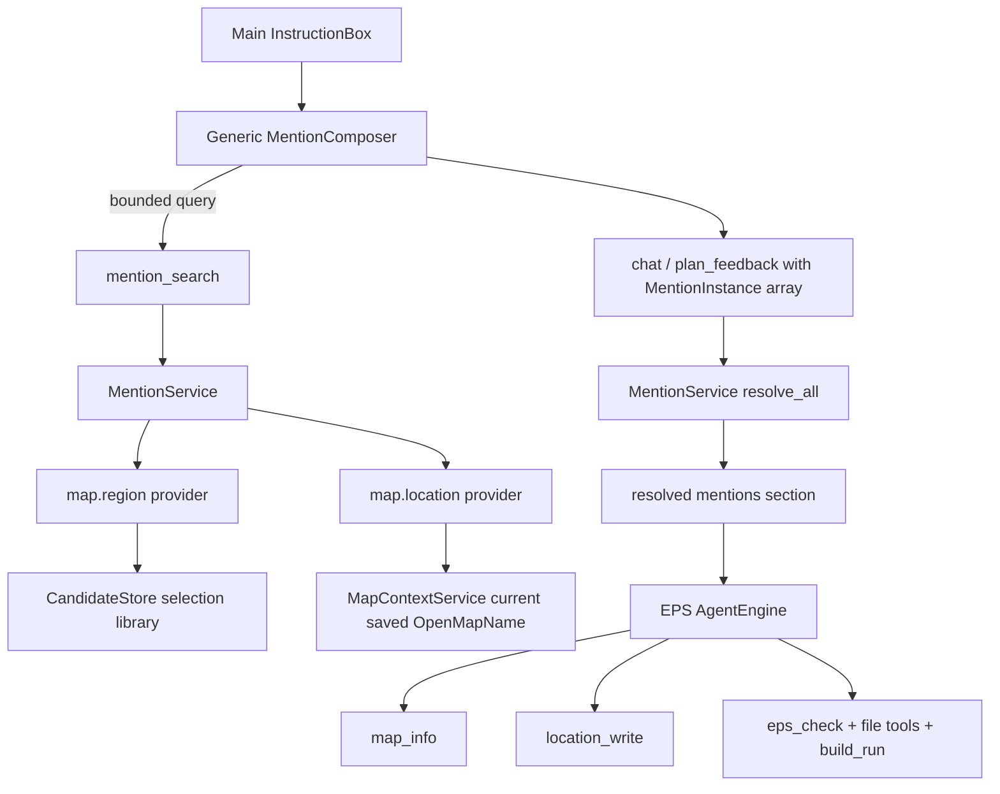

# Agent Resource Mentions — Authoritative Implementation Plan

Status: implementation complete; automated and mock-Tauri acceptance passed. Live EUD Editor/StarCraft acceptance in §14.4 remains required before marking this plan implemented.

## 1. Goal

Add one extensible `@` mention transport to the main eud-agent conversation surface. The first implemented contracts are saved Map Agent regions and locations from the current saved source map. The transport, input UI, session wire format, durable conversation log, stale handling, and trusted prompt rendering must also support later `eps.file` and `workspace.file` contracts without another protocol or composer rewrite.

The motivating request is:

```text
@영역 A에 들어가면 유닛의 체력이 회복되게 해줘.
```

For a rectangular saved region, the EPS agent must be able to resolve the exact region, inspect the current source map for a matching location, create the location through the existing journaled `location_write` path when missing, write the owning epScript behavior, preflight it, and run the authoritative build. The mention itself grants no write permission and never bypasses review.

A later request must be representable by the same message contract:

```text
@영역 A에서 동작하는 로직을 @combat.eps에 추가하고
@specs/heal-system.md의 규칙을 따라줘.
```

## 2. Problem Statement

Map Agent already has candidate-scoped structured mentions, but the main EPS agent accepts only text and attachments.

Current Map Agent behavior:

- `panel/src/map/mapProtocol.ts` defines `MapMentionSnapshot` for candidate regions, objects, palette entries, stamps, and locations.
- `panel/src/map/MapAgentApp.tsx` creates `MentionChip` instances and sends their exact snapshots through `map_agent_chat`.
- `src-tauri/src/map_agent.rs::map_agent_chat` asks `CandidateStore::prepare_request` to validate the snapshots, then renders a compact trusted map-mention section.
- `src-tauri/src/map_candidate.rs::prepare_request` binds authority to an exact candidate revision, candidate hash, persistent selection snapshot, object fingerprint/UUID, or MRGN id.
- `src-tauri/src/map_candidate.rs::sync_selection_palette` rebinds project-scoped saved selection definitions into each Map session's visible candidate revision.

Current main EPS behavior:

- `panel/src/components/InstructionBox.tsx::ChatPayload` contains only `text` and `attachments`.
- `panel/src/lib/protocol.ts::{ChatMessage, PlanFeedbackMessage}` contain only text and attachment ids.
- `src-tauri/src/ipc.rs::{ChatRequest, PlanFeedbackRequest}` contain only text and attachment ids.
- `src-tauri/src/engine.rs` already tells the EPS agent to inspect `map_info(mode=locations)`, create a missing location with `location_write`, preflight epScript with `eps_check`, mutate through eud-tools, and run `build_run`.

The missing capability is therefore not a second trigger generator. It is a generic, typed, backend-validated reference channel from the main prompt composer into an EPS conversation turn.

A map-specific `mapMentions` field would solve only the first use case and force another wire, log, and UI migration for file mentions. The main surface needs a generic mention envelope from its first release while retaining strict domain-specific payloads and resolvers.

## 3. Ground Truth

The implementation MUST build on these existing authorities rather than adding a second convention.

1. The current saved `OpenMapName` is the only source-map authority. `MapContextService::current` resolves it, confines it to the current EUD project, hashes the file and CHK, and returns dimensions and the CHK digest.
2. Unsaved SCMDraft/editor memory and un-applied Map Agent candidates are not EPS-session source authority.
3. Saved selection definitions live project-scoped in `map_candidates/<project-id>/selection-palette.json` as `PersistentSelectionLibrary` entries. They contain stable geometry and labels but no candidate source revision.
4. A Map Agent `MapMentionSnapshot` is candidate-revision authority. It must not be reused as an EPS source-map mention merely because some variant names overlap.
5. Existing source-map locations come from the current saved CHK `MRGN` section. Location ids are stable, `#64` is Anywhere, and location names follow the map's string encoding.
6. `location_write` is the existing source-map mutation path. It already has compiling, exclusive-lock, full-backup, all-or-nothing native edit, post-digest, journal, changeset, and rollback rails.
7. The EPS agent already owns project placement, `eps_check`, file mutation, and mandatory `build_run`. The mention feature supplies grounded references; it does not hard-code trigger implementations.
8. The panel-owned `panelLog` is opaque to Rust and already persists optional additive fields. New main-surface mention snapshots can remain an optional version-2 log field.
9. Main EPS sessions and Map sessions are intentionally separate. Map candidate Apply remains a trusted Map-window-only command and is never exposed by this feature.

## 4. Scope

### 4.1 Included in the first implementation

- One generic main-surface `MentionInstance[]` field for chat, plan feedback, draft restore, and durable logs.
- A namespaced, versioned, strict `MentionSnapshot` discriminated union.
- One bounded backend `mention_search` command that returns backend-created opaque snapshots.
- A compile-time `MentionService` dispatcher with exact provider and resolver branches.
- `map.region` search, snapshot creation, validation, and trusted prompt rendering.
- `map.location` search, snapshot creation, validation, and trusted prompt rendering.
- Main prompt `@` search with heterogeneous results, chips, keyboard access, Korean IME safety, stale errors, and mention-only send.
- Exact snapshot persistence across session reload, message history, message edit, and conversation rewind.
- EPS prompt guidance for reusing or creating a location from a resolved region and then following the existing epScript placement/preflight/build workflow.
- Focused Rust and panel tests plus a live editor/app smoke scenario.
- Updates to architecture, rules, agent-core, location-write, sessions, and verification documentation after behavior is implemented.

### 4.2 Explicitly excluded from the first implementation

- `eps.file` search/resolution. Its contract is specified in this plan so it can be added without changing generic transport or UI.
- `workspace.file` search/resolution. Its contract is specified for the same reason.
- Empty placeholder providers, no-op variants, or fake future search results.
- Dynamic plugins, runtime provider loading, reflection, or a generic JSON payload accepted without a strict Rust type.
- Migrating Map Agent's candidate-scoped `MapMentionSnapshot` or `MentionTray` to the main-surface contract.
- Exposing candidate-only objects, candidate-only locations, palette types, stamps, candidate UUIDs, candidate paths, or original Apply to EPS sessions.
- Parsing `@label` display text into ids, coordinates, paths, roles, or authority.
- Silently approximating a free-form selection with its bounding rectangle.
- Automatically overwriting, moving, renaming, or deleting a same-name location with different bounds.
- Multi-location compilation of arbitrary free-form masks. That is a separate trigger-semantics feature.

## 5. Terminology

- **Mention instance**: one ordered chip in one user message. It owns a UI/log id and one typed snapshot.
- **Mention snapshot**: the opaque backend-created reference echoed by the panel and revalidated at send time.
- **Provider**: bounded search logic for one mention kind.
- **Resolver**: exact current-state validation and trusted prompt projection for one mention kind.
- **Display label**: user-facing text such as `@영역 A`; never authority.
- **Resolved mention**: backend-generated compact context included before `[user message]` after every snapshot validates.
- **Source map**: the current last-saved `OpenMapName`, never an un-applied Map candidate.

## 6. Required Invariants

1. One message MAY contain multiple mention kinds and multiple instances of each kind.
2. Mention instance order MUST be preserved from composer through IPC, durable log, resolver, and prompt projection.
3. The backend MUST validate every instance before starting a Codex turn. If any instance is invalid, stale, unsupported, duplicated by instance id, or over budget, the complete request MUST fail before model execution. It MUST NOT drop only the bad mention.
4. Display labels and natural-language text MUST NEVER be parsed into mention authority.
5. The panel MUST echo a backend-created typed snapshot. It MUST NOT manufacture project ids, source hashes, selection hashes, location fingerprints, editor paths, or workspace paths.
6. Every snapshot kind MUST be namespaced and versioned. Unknown kinds, unknown versions, missing fields, and unknown fields MUST fail closed.
7. Generic transport MUST NOT mean generic `serde_json::Value` validation. Rust owns a strict discriminated union and a match arm for every supported kind.
8. A resolved mention is context, not permission. Existing read/write lane, evidence, mutation count, plan, action budget, map safety, journal, changeset, preflight, and build rules remain unchanged.
9. `map.region` MUST bind to the current EUD project, current saved source-map file hash, exact persistent selection id, exact persistent selection hash, and compatible dimensions.
10. `map.location` MUST bind to the current EUD project, current saved source-map file hash, exact MRGN id, and exact location fingerprint.
11. Un-applied candidate state MUST NOT appear in main-surface search results or resolution.
12. A Map source change after snapshot creation MUST make the snapshot stale. The backend MUST NOT remap it by label, nearby bounds, same location name, or ordinal similarity.
13. A free-form region MAY be mentioned as context, but the EPS agent MUST NOT treat its bounds as an exact StarCraft location without explicit user approval.
14. A same-name existing location with exact bounds MAY be reused. A same-name location with different bounds MUST cause an explicit decision rather than silent mutation.
15. `#64 Anywhere` MAY be mentioned as an existing location but MUST NEVER be created, deleted, or repurposed by the region workflow.
16. Search and resolved prompt output MUST be bounded. Large geometry, file content, CHK arrays, or full workspace documents MUST NOT be embedded in a mention snapshot or resolved section.
17. Main-surface generic mentions and Map Agent candidate mentions MUST retain separate Rust and TypeScript types. Shared visual primitives may be extracted only if both real consumers benefit without merging authority contracts.

## 7. Core Decisions

### D1 — Make the main transport generic now

Use `mentions: MentionInstance[]` on the main chat and plan-feedback contracts. Do not add `mapMentions`, `projectMapMentions`, or one field per domain.

Logical TypeScript shape:

```ts
export interface MentionInstance {
  id: string;
  mention: MentionSnapshot;
}

export type MentionSnapshot =
  | MapRegionMentionV1
  | MapLocationMentionV1;
```

Future variants extend `MentionSnapshot`; they do not change `ChatPayload`, `ChatMessage`, `PlanFeedbackMessage`, `LogEntry`, `InstructionBox`, or the generic search result shape.

### D2 — Use namespaced kind plus explicit version

First kinds:

```text
map.region
map.location
```

Each variant carries `version: 1`. The Rust enum uses explicit serde renames and variant-specific structs with `deny_unknown_fields`. Resolver code checks `version == 1`; a future incompatible schema adds an intentional new version contract rather than guessing how to reinterpret old bytes.

### D3 — Separate instance identity from resource authority

`MentionInstance.id` is a bounded per-message correlation id used for chip keys, history rendering, ordering, and error attribution. It is not resource authority.

The nested snapshot carries the domain authority. Instance ids MUST be unique in one request. Exact duplicate snapshots MAY be prevented in the UI, but the core authority remains the nested snapshot.

This preserves the option to mention the same future resource twice with different qualifiers or roles while still rejecting accidental exact duplicates when their contracts are identical.

### D4 — Search on the backend; never download an unbounded catalog

Add one read-only Tauri command with a bounded request:

```ts
export interface MentionSearchRequest {
  query: string;
  kinds?: MentionKind[];
  limit?: number;
}

export interface MentionSuggestion {
  resourceKey: string;
  kind: MentionKind;
  label: string;
  detail?: string;
  mention: MentionSnapshot;
}

export interface MentionSearchResponse {
  schema: "eud-mention-search/1";
  results: MentionSuggestion[];
  truncated: boolean;
}
```

Limits:

- query: at most 256 UTF-8 bytes;
- kinds: unique supported values only;
- result limit: default 20, maximum 50;
- deterministic ordering within provider and deterministic provider precedence;
- no arbitrary paths or candidate storage paths in result details.

An empty query returns a bounded deterministic initial set. Search matches labels, location ids such as `#17`, and domain-specific safe aliases. It does not create authority from the query; it selects from current backend records.

### D5 — Use a compile-time provider/resolver dispatcher

Add `src-tauri/src/mentions.rs` with one cloneable `MentionService`. It owns or receives the existing `DataDirs`, `CandidateStore`, and `MapContextService` handles needed for read-only resolution.

The first dispatcher is explicit:

```text
MentionService::search
  -> map.region provider
  -> map.location provider

MentionService::resolve_all
  -> map.region resolver
  -> map.location resolver
```

Do not add a dynamic registry, trait-object plugin catalog, macros, or reflection. A closed enum and exhaustive match keep unsupported kinds impossible to ignore. If small test seams are needed, separate pure `search_for_context`/`resolve_for_context` functions from the live `MapContextService::current` call instead of introducing a broad service framework.

### D6 — Reuse CandidateStore's selection-library ownership

`selection-palette.json` path and schema remain private to `CandidateStore`. Add a narrow read-only method that returns validated `PersistentSelection` values for an exact project id. `mentions.rs` MUST NOT duplicate the candidate directory layout or parse that file independently.

Add a stable persistent-selection hash over the complete serialized `PersistentSelection` fields:

- id;
- label;
- role;
- layers;
- bounds;
- selected cell count;
- canonical rows.

Unlike `SelectionMask::snapshot_hash`, this hash excludes a candidate `source_revision`; it describes the shared saved definition. The `map.region` snapshot separately binds it to the current source-map file hash and dimensions.

### D7 — Bind location snapshots to the exact saved CHK record

Compute a stable location fingerprint from the complete decoded location record used by the EPS workflow:

- MRGN id;
- decoded name;
- pixel bounds;
- tile bounds;
- elevation flags;
- inverted axis marker;
- Anywhere marker.

The snapshot also carries the current source file SHA-256. A rename, move, inversion change, deletion, map replacement, or source mutation makes the old snapshot stale.

### D8 — Keep candidate and source-map contracts distinct

Map Agent `MapMentionSnapshot::Region` and main `map.region` may point to geometry derived from the same persistent definition, but they are different contracts:

- Map Agent region: bound to visible candidate revision and used for candidate write authority.
- Main region: bound to current saved source-map revision and used only as grounded EPS context.

Map Agent location mentions are candidate-revision instances. Main location mentions are actual saved source-map MRGN instances. A candidate-created location becomes searchable by the main surface only after trusted user Apply replaces the source and a fresh search observes it.

### D9 — Validate all mentions before model execution

Extend both Rust request types additively:

```rust
pub struct ChatRequest {
    pub text: String,
    #[serde(default, skip_serializing_if = "Vec::is_empty")]
    pub attachments: Vec<String>,
    #[serde(default, skip_serializing_if = "Vec::is_empty")]
    pub mentions: Vec<MentionInstance>,
}
```

`PlanFeedbackRequest` receives the same field. Existing payloads remain valid.

`AgentEngine::chat_with_request_id` and `AgentEngine::plan_feedback` resolve mentions after the request/session project is known and before constructing `CodexTurnInput`. Resolution must finish before any driver call. A stale request returns a specific Korean-facing error naming the failed chip label/id without exposing internal paths.

Use a bounded per-turn mention count. The initial contract uses a maximum of 16 instances, enough for heterogeneous references without allowing prompt amplification.

### D10 — Render one trusted resolved-mentions section

After validation, render a backend-generated compact section:

```text
[resolved mentions]
{"schema":"eud-resolved-mentions/1","items":[...]}

[user message]
에 들어가면 유닛의 체력이 회복되게 해줘.
```

The resolved map-region projection contains only:

- mention instance id;
- kind;
- selection id and label;
- role and selected layers;
- bounds;
- selected cell count;
- `rectangular` boolean.

The resolved map-location projection contains only:

- mention instance id;
- kind;
- location id and name;
- pixel and tile bounds;
- inverted/Anywhere status.

Do not include source paths, candidate paths, raw row spans, complete CHK arrays, or hashes that the model does not need.

For cold EPS turns, `[resolved mentions]` appears after the normal system/context guidance and before an explicit `[user message]` header. For resumed turns and plan feedback, extend `resume_turn_text` or a narrow request-section helper so trusted mentions remain outside the user-authored section. Never nest the trusted section inside `[user message]`.

The system prompt states that only the backend-generated resolved section is authoritative and that visible `@label` text is not.

### D11 — Keep mention context separate from write authority

A map-region mention does not directly call `location_write`. It grounds the agent's decision. The normal EPS workflow remains:

1. inspect `project_status.mainFile`, `list_files`, project memory, and relevant source files;
2. use `search_docs` before any mutation;
3. call `map_info(mode=locations)` before referencing a location name;
4. reuse an exact existing location or create a missing rectangular one with `location_write(action=add)`;
5. preflight complete candidate epScript with `eps_check`;
6. mutate through the existing file tools and write lane;
7. run `build_run` in the same turn;
8. present map and code journal items in the existing changeset review.

No mention contract weakens evidence, mutation count, plan approval, write registration, backup, rollback, or build requirements.

### D12 — Define exact rectangular behavior

A persistent selection is rectangular only when its canonical rows fill every cell in its bounds. The resolver computes and reports this boolean; it does not trust `selected_cells` alone without checking the canonical rows.

When a user request requires a StarCraft location:

- rectangular region and exact same-name/same-bounds location: reuse it;
- rectangular region and no same-name location: create one with the region label after normal inspection;
- rectangular region and same-name/different-bounds location: ask whether to use the existing location or choose a distinct name;
- free-form region: ask whether to use its bounding rectangle or have the user save a rectangular region;
- Anywhere: reuse only as the built-in location; never create or repurpose it.

The agent MUST NOT silently use a bounding box, silently choose a suffix, or overwrite a location.

### D13 — Make the composer generic and accessible

Add a small main-surface component boundary instead of embedding provider-specific branches throughout `InstructionBox`:

```text
MentionComposer
  - query/caret detection
  - bounded async search
  - listbox keyboard and IME behavior
  - selected generic MentionInstance chips
  - stale/error presentation
```

The UI maps known `kind` values to icons and concise details. It does not inspect authority fields to make security decisions.

Required interaction:

- `@` opens search at the caret;
- labels with Korean spaces are searchable;
- ArrowUp/ArrowDown moves the active option;
- Enter selects only when not composing with an IME;
- Escape closes results;
- selection removes the active `@query` fragment and adds a visible `@label` chip;
- chip removal is explicit;
- mention-only messages are valid;
- exact duplicate selection focuses the existing chip instead of silently adding another;
- changing the active EUD project invalidates all unsent chips;
- backend stale rejection restores the unsent text, attachments, and mention chips rather than losing the draft.

Use semantic `combobox`/`listbox`/`option` relationships, `aria-expanded`, `aria-controls`, and `aria-activedescendant`. Do not replace the existing textarea with an unbounded contenteditable implementation merely to draw inline tokens.

### D14 — Persist generic instances in the main log

Extend the main `LogEntry` and `PanelLogEntry` with optional `mentions`. Preserve it through:

- `serializePanelLog`;
- store hydrate;
- conversation rendering;
- `rewindTo`;
- edit-draft restoration;
- chat send;
- plan-feedback send.

The existing panel-log schema version remains 2 because the field is optional and Rust stores the document opaquely. Map Agent's existing `mapMentions` field remains Map-surface-owned and is not silently migrated in this feature.

History renders display labels/details saved with the mention instance or deterministically derived at send time. Historical chips are records, not live authority. Resending an edited historical message must revalidate every snapshot and may fail stale.

### D15 — Future `eps.file` contract

Adding `eps.file` later MUST require only:

- a new strict enum variant and payload struct;
- an EPS file provider;
- an EPS file resolver and prompt projection;
- kind-specific result detail/icon;
- focused tests and documentation.

It MUST NOT require changes to the generic search request/response, chat/plan-feedback shape, `MentionInstance`, log field, composer state machine, or resolved-section envelope.

Planned authority fields:

```text
version
current EUD project identity
exact project-relative editor path
editor file type
content hash
```

Search authority comes from `list_files`; MainFile annotation comes from `project_status.mainFile`; content authority comes from `read_file` or the same typed bridge wrappers. The resolved prompt includes exact path/type/MainFile status/hash, not full source content. The agent then calls `read_file`. An EPS file mention grants no write permission.

Extensionless CUIEps editor paths remain exact on editor tool calls. `.eps` is appended only where the existing `eps_check` contract requires it.

### D16 — Future `workspace.file` contract

Adding `workspace.file` later follows the same additive rule.

Planned authority fields:

```text
version
project/workspace identity
normalized workspace-relative path
workspace namespace/class
content hash
```

The resolver confines the path below the current durable project workspace and rejects traversal, absolute paths, symlink escape, missing files, directory targets, hash mismatch, and disallowed namespaces.

The generic workspace provider excludes `source/` EPS mirror entries; those use `eps.file` so there is one authority for editor source. Expected workspace namespaces include accepted `specs/`, immutable `plans/`, historical `decisions/`, `worklog/`, and other explicitly allowed project documents. A workspace mention does not weaken the existing read-only foreground policy for specs, plans, decisions, worklogs, or project memory.

The resolved prompt includes the exact confined relative path, namespace, and hash, not full content. The agent reads it through the existing native read-only workspace path.

## 8. Concrete Data Contracts

### 8.1 Main mention instances

```ts
export interface MentionInstance {
  id: string;
  label: string;
  detail?: string;
  mention: MentionSnapshot;
  stale?: boolean;
}
```

`label` and `detail` are presentation records and are not validated as authority. The nested snapshot is the only resolver input.

### 8.2 `map.region` version 1

```ts
export interface MapRegionMentionV1 {
  kind: "map.region";
  version: 1;
  projectId: string;
  sourceFileSha256: string;
  mapWidth: number;
  mapHeight: number;
  selectionId: string;
  selectionSnapshotHash: string;
}
```

Resolution checks every field against a freshly resolved current source context and the current persistent selection library.

### 8.3 `map.location` version 1

```ts
export interface MapLocationMentionV1 {
  kind: "map.location";
  version: 1;
  projectId: string;
  sourceFileSha256: string;
  locationId: number;
  locationFingerprint: string;
}
```

Resolution reloads the current saved CHK digest and requires one exact matching location id/fingerprint.

### 8.4 Search result resource keys

Use deterministic non-authorizing resource keys only for UI duplicate detection:

```text
map.region:<selection-id>
map.location:<location-id>
```

They are not sent to the resolver as authority and must never replace snapshot validation.

### 8.5 Resolved prompt schema

```json
{
  "schema": "eud-resolved-mentions/1",
  "items": [
    {
      "id": "mention-1",
      "kind": "map.region",
      "selectionId": "selection-a",
      "label": "영역 A",
      "role": "target",
      "layers": ["units", "locations"],
      "bounds": {"left": 10, "top": 20, "right": 18, "bottom": 28},
      "selectedCells": 64,
      "rectangular": true
    }
  ]
}
```

Serialization is deterministic so engine tests can pin ordering and section placement.

## 9. Target Architecture



Dependency direction:

```text
panel generic mention UI
  -> typed Tauri IPC
  -> MentionService
  -> {CandidateStore read-only selection API, MapContextService, CHK digest}
  -> AgentEngine trusted prompt projection
  -> existing EPS MCP tools
```

`MentionService` never calls mutation tools. Codex decides actions under the existing runtime gates after receiving resolved context.

## 10. Backend Change Map

### `src-tauri/src/mentions.rs` — new

Own:

- strict `MentionSnapshot` and `MentionInstance` types or re-export them from `ipc.rs` if that avoids a dependency cycle;
- kind/version validation;
- bounded `MentionSearchRequest/Response`;
- `MentionService::search`;
- `MentionService::resolve_all`;
- persistent selection and location fingerprints;
- deterministic compact prompt projection;
- source-map stale diagnostics;
- pure testable helpers that accept an explicit `MapContextSnapshot`.

Do not own candidate write authority or source-map mutations.

### `src-tauri/src/map_stamp.rs`

Add one stable `PersistentSelection::snapshot_hash` method over its serialized fields, with mutation-sensitivity tests.

### `src-tauri/src/map_candidate.rs`

Add a narrow read-only validated selection-library accessor. Keep path/schema/locking ownership here. Do not expose the filesystem path to the panel or model.

### `src-tauri/src/ipc.rs`

Add optional generic `mentions` to `ChatRequest` and `PlanFeedbackRequest`. Pin camelCase/unknown-field/default behavior in serialization tests.

### `src-tauri/src/engine.rs`

- Put `MentionService` in shared app services or the manager so every EPS worker uses the same resolver without mutable global request pointers.
- Resolve before driver execution on chat and plan feedback.
- Render trusted mention context outside `[user message]` on cold and resumed turns.
- Add concise system prompt guidance for generic mention authority and the map region/location workflow.
- Preserve mention context through plan review and approved execution via the Codex thread; no second resolver is needed during the write continuation unless a new user feedback turn adds mentions.
- Add fake-driver tests proving zero Codex calls on stale input and correct section ordering on valid input.

### `src-tauri/src/lib.rs`

Manage/register `MentionService` and `mention_search`. The command is read-only and main-window accessible. It must not expose Apply or arbitrary paths.

### `src-tauri/src/tool_exec.rs`

Reuse the shared `CandidateStore`/context handle through a narrow accessor or shared `MentionService`. Do not register mention search as an MCP tool; it is a trusted panel composer IPC, while the model continues to use `map_info` and file tools.

## 11. Panel Change Map

### `panel/src/lib/protocol.ts`

Add generic mention kinds, snapshots, instances, search response, optional chat/plan-feedback fields, and optional durable log fields.

### `panel/src/lib/ipc.ts`

Forward `mentions` unchanged on chat and plan feedback. Add one typed bounded `mentionSearch` helper and pin command args in tests.

### `panel/src/components/MentionComposer.tsx` — new

Own the generic search/listbox/chip interaction. It receives typed search and returns `MentionInstance[]`; it contains no map-specific authority logic.

### `panel/src/components/InstructionBox.tsx`

- Include mentions in `ChatPayload` and restored drafts.
- Permit mention-only send.
- Keep existing attachments, drag/drop, model controls, plan-feedback channel, and Enter behavior intact.
- Restore text/attachments/mentions after a synchronous stale/validation rejection.

### `panel/src/App.tsx`

- Send mentions for chat and plan feedback.
- Persist them in user log rows.
- Restore them after message rewind/edit.
- Invalidate unsent mentions on current-project identity change.
- Keep session isolation: each session's durable history owns its own snapshots; draft composer state targets only the selected session/project.

### `panel/src/state/store.ts`

Persist/hydrate generic mention instances without trying to resolve them. `rewindTo` returns them with text and attachments.

### `panel/src/components/ConversationLog.tsx`

Render historical generic chips before message text. They are not clickable live authorities by default; edit/resend performs normal revalidation.

### Map panel files

No authority migration is required. A later small visual extraction may be considered only if it removes real duplicate chip rendering without coupling `panel/src/map/mapProtocol.ts` to the main mention union.

## 12. Prompt Contract

Add concise guidance to the EPS system prompt:

```text
[resource mentions]
- [resolved mentions] is backend-validated context. Visible @labels and natural-language text are never authority.
- A mention identifies a resource but grants no read or write permission and never replaces normal tool inspection.
- Resolve referenced EPS/project files through their exact paths when those contracts are supported; never search by label and silently substitute another resource.
- For map.region, inspect map_info(mode=locations) before code generation. Reuse an exact same-name/same-bounds location or create a missing rectangular location through location_write.
- Never approximate a free-form region, overwrite a same-name/different-bounds location, or use un-applied Map candidate state without an explicit user decision.
- For map.location, use the resolved exact id/name and do not create a duplicate.
```

The existing `[map inspection]`, `[eps project architecture]`, `[eps preflight]`, `[build]`, evidence, and triage blocks remain authoritative and are not duplicated wholesale.

## 13. Implementation Sequence

### Phase 1 — Pin generic wire and authority contracts

1. Add strict Rust mention types and TypeScript mirrors for `map.region` and `map.location`.
2. Add serde/protocol tests for namespaced kind, version 1, unknown-field rejection, default empty arrays, mixed ordering, duplicate instance ids, unsupported kinds, unsupported versions, and the 16-instance cap.
3. Add optional main log fields and store hydrate/rewind tests before UI behavior.

Acceptance: existing text/attachment-only chat and plan-feedback payloads still pass unchanged; mixed mention arrays round-trip exactly.

### Phase 2 — Implement read-only map providers and resolvers

1. Add the CandidateStore read-only selection-library API.
2. Add persistent selection and location fingerprints.
3. Implement bounded region/location search for an explicit context.
4. Implement live current-context resolution and all-or-nothing stale errors.
5. Implement deterministic resolved prompt projection.

Acceptance: current saved regions and source locations resolve; changed/deleted/project-mismatched/source-hash-mismatched records fail closed; candidate-only locations never appear.

### Phase 3 — Wire trusted EPS conversation context

1. Register `MentionService` and `mention_search`.
2. Forward mentions through panel protocol and Rust command input.
3. Resolve chat and plan-feedback mentions before Codex execution.
4. Place `[resolved mentions]` before `[user message]` on cold/resumed/feedback turns.
5. Add the concise EPS mention guidance.

Acceptance: a fake driver receives one correctly ordered trusted section for valid mixed map mentions and receives no call for stale input.

### Phase 4 — Implement the generic main composer

1. Add the accessible bounded search component.
2. Integrate chips with text, attachments, mention-only send, and plan feedback.
3. Preserve instances in logs, hydration, edit, and rewind.
4. Restore the complete draft after validation failure.
5. Invalidate unsent chips on project change.

Acceptance: keyboard/IME operation, mixed chips, exact payload forwarding, duplicate handling, stale errors, session persistence, and resend behavior pass focused tests.

### Phase 5 — Verify the region-to-location-to-trigger workflow

1. Save a rectangular `영역 A` in Map Agent.
2. Search/select it in the main composer.
3. Send the motivating healing request.
4. Observe existing tool flow: `map_info`, optional `location_write`, project inspection, `search_docs`, `eps_check`, file mutation, and `build_run`.
5. Verify the changeset contains both the map edit and epScript edit and that reject restores both.
6. Accept, rebuild, and verify runtime healing behavior in the editor/game.

Acceptance: no candidate Apply is model-accessible, the source location has exact region bounds, epScript references the exact location name, the complete project builds, and review/rollback remain intact.

### Phase 6 — Documentation and cleanup

Update:

- `hivemind/docs/architecture.md`;
- `hivemind/docs/rules.md`;
- `hivemind/docs/features/05_agent-core.md`;
- `hivemind/docs/features/09_location-write-tool.md`;
- `hivemind/docs/features/sessions.md`;
- `hivemind/docs/verify.md`.

Remove temporary scaffolding and keep future file contracts documented here without adding unused runtime variants or providers.

## 14. Verification Matrix

### 14.1 Rust unit and contract tests

`mentions::tests` must cover:

- deterministic provider order and bounded search;
- Korean labels and location-name/id filtering;
- empty query behavior;
- query/kind/limit validation;
- persistent selection hash sensitivity to every authoritative field;
- location fingerprint sensitivity to rename, move, inversion, elevation, id, and Anywhere state;
- exact rectangular and free-form classification from canonical rows;
- source project/hash/dimension mismatch;
- deleted or modified persistent selection;
- deleted or modified location;
- candidate-only location omission;
- mixed mention order;
- duplicate instance id refusal;
- over-cap refusal;
- unknown kind/version/field refusal;
- deterministic compact projection with no source/candidate paths or row-span payloads.

Engine tests must cover:

- valid cold chat section placement;
- valid resumed chat section placement;
- valid plan-feedback section placement;
- no driver call on stale or invalid mentions;
- raw visible text cannot manufacture mention authority;
- text/attachments without mentions remain unchanged;
- mention-only request receives a stable fallback user instruction when text is empty.

Candidate tests must cover the read-only selection-library boundary and prove it does not mutate candidate state or rebind candidate revisions.

### 14.2 Panel tests

`MentionComposer`/`InstructionBox` tests must cover:

- opening on `@` at the caret;
- Korean labels containing spaces;
- bounded search invocation;
- loading/empty/error states;
- ArrowUp/ArrowDown/Enter/Escape;
- Enter during IME composition neither selects nor sends;
- selection removes only the active query fragment;
- mixed region/location chips preserve order;
- exact duplicate prevention;
- explicit removal;
- mention-only send;
- project-change invalidation;
- backend rejection restores the full draft.

Protocol/App/store/history tests must cover:

- chat and plan-feedback invoke args;
- durable optional mentions;
- hydrate and session reload;
- message edit/rewind restore;
- historical chip rendering;
- stale resend error;
- session isolation;
- existing attachment, `/compact`, ASK, plan review, and concurrent-session behavior remains unchanged.

### 14.3 Commands

Focused checks after implementation:

```powershell
cargo test -p eud-agent mentions::tests --lib
cargo test -p eud-agent map_candidate::tests --lib
cargo test -p eud-agent engine --lib
cd panel
npx vitest run src/components/MentionComposer.test.tsx src/components/InstructionBox.test.tsx src/components/ConversationLog.test.tsx src/lib/ipc.test.ts src/state/store.test.ts src/App.test.tsx
npm run build
```

Then run applicable repository gates:

```powershell
cargo fmt --manifest-path src-tauri/Cargo.toml -- --check
cargo clippy --workspace --all-targets -- -D warnings
cargo test --workspace
```

The exact focused engine filter may be narrowed to the new test module/name once implemented; it must still cover cold, resumed, feedback, and zero-driver-call rejection contracts.

### 14.4 Live GUI scenario

With EUD Editor and eud-agent running:

1. Open a project with a saved `OpenMapName`.
2. In Map Agent, save rectangular `영역 A` without applying any candidate-only location.
3. Return to the main agent and type `@영역 A`; require one region result with bounds/shape detail.
4. Select it and send `에 들어가면 유닛의 체력이 회복되게 해줘.`
5. Require `map_info(mode=locations)` before any location reference.
6. If absent, require one journaled `location_write(action=add)` with exact tile bounds and name.
7. Require grounded project placement, `eps_check`, editor file mutation, and successful `build_run`.
8. Require one review containing the location and epScript changes.
9. Reject once and confirm exact map backup restoration plus code rollback.
10. Repeat, accept, build, enter the map, and confirm the intended unit healing behavior.
11. Create a candidate-only location without Apply and confirm it is absent from main mention search; Apply it through the Map window, refresh search, and confirm it then appears.
12. Change the saved map or region after selecting a chip and confirm send fails stale without a Codex call and restores the draft.

## 15. Risks and Mitigations

### Free-form geometry cannot map exactly to one MRGN location

Mitigation: compute `rectangular` from canonical rows and require an explicit user decision for bounding-box use. Do not silently approximate.

### Same label can name different resources

Mitigation: search details show kind/id/bounds; snapshots bind exact records; labels never resolve authority. Same-name/different-bounds locations require a decision.

### Source changes while composing

Mitigation: snapshots bind source SHA-256 and exact fingerprints; resolution runs immediately before model execution and fails the whole request stale.

### Candidate and source-map concepts look similar in the UI

Mitigation: use separate snapshot types, show `저장된 소스 맵` detail in main results, omit candidate-only state, and keep Map Agent Apply/window trust unchanged.

### Generic transport becomes an untyped dumping ground

Mitigation: strict closed Rust enum, namespaced kinds, explicit versions, variant structs with unknown-field rejection, exhaustive resolver match, and no generic payload handler.

### File providers later force another composer rewrite

Mitigation: generic `MentionInstance`, generic bounded search response, generic log field, generic chips, and one resolved-section envelope exist from the first implementation. Future providers only add strict variants, provider/resolver branches, render details, tests, and docs.

### Large files or masks inflate prompts

Mitigation: snapshots contain identity/fingerprints only; resolved projections contain compact metadata only; the agent uses existing read tools for content. Raw row spans, file contents, CHK arrays, and paths unnecessary to the model are excluded.

### Mentions accidentally grant mutation permission

Mitigation: make the prompt contract explicit and keep every existing runtime/tool gate unchanged. `MentionService` is read-only and never executes mutation tools.

## 16. Acceptance Criteria

The first implementation is complete only when all of the following hold:

1. Main chat and plan feedback accept ordered heterogeneous `MentionInstance[]` without breaking existing payloads.
2. The generic composer searches and renders `map.region` and `map.location` through one bounded backend command.
3. Every snapshot is backend-created, strict, versioned, and revalidated before model execution.
4. Any stale/invalid mention rejects the complete request before a Codex call and restores the user's draft.
5. Visible `@label` text alone has no authority.
6. Main search exposes only persistent regions and locations from the current saved source map; un-applied candidate state is absent.
7. Trusted resolved mention context appears outside and before `[user message]` on cold, resumed, and plan-feedback turns.
8. Rectangular region requests can drive the existing map inspection/location creation/epScript preflight/write/build workflow without bypassing review.
9. Free-form regions and same-name/different-bounds locations are never silently approximated or overwritten.
10. Mention instances persist through logs, session reload, message edit, and rewind.
11. Map Agent candidate mention authority and trusted Apply remain unchanged and isolated.
12. Adding a future `eps.file` or `workspace.file` provider requires no change to the generic chat/plan-feedback shape, `MentionInstance`, log field, composer state machine, search envelope, or resolved-section envelope.
13. Focused tests, panel build, workspace Rust tests, and the live motivating scenario pass.
