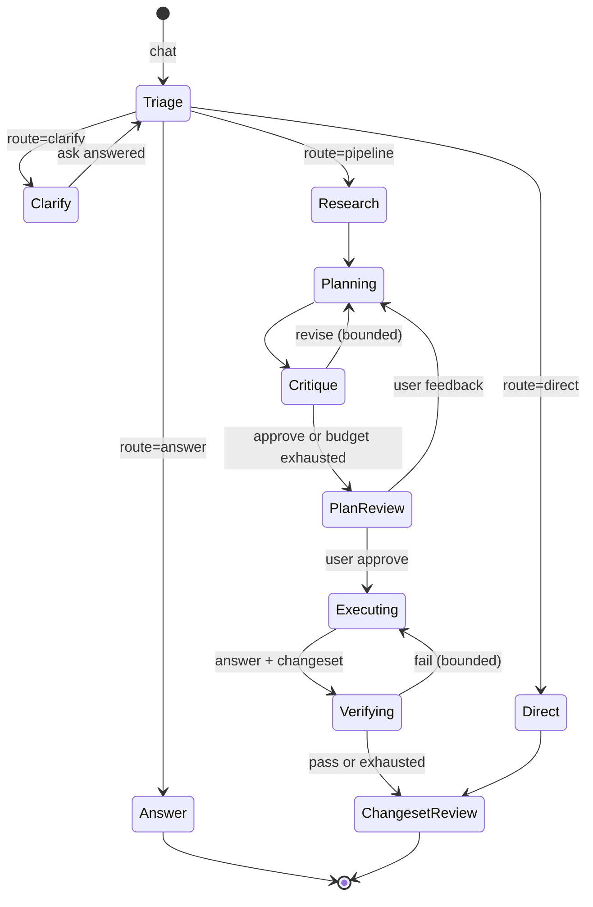

# Staged agent workflow plan (triage → research → plan → approve → execute → verify)

## Status

Approved on 2026-09-17. Phases 0–7 are implemented as of 2026-09-18 (deterministic contracts
and project gates); the live scenario run is not. This document is the review artifact for the
cutover; the verification section is the acceptance contract. Because triage now runs on every
interactive EPS request, the "pre" scenario rows can only be recorded on a build that predates this
change (commit `c23f0b2`), and the "post" rows on the current build; neither has been recorded.

## Problem

The EPS foreground is a single prompt plus a 64-round tool loop with a build gate. Measured against
the intended "understand → plan → research → work → test" loop, the current source has these gaps:

- `[triage]` in `engine.rs` instructs the model to "execute the requested change directly regardless
  of its size" and to call `propose_plan` only when the user explicitly asks for a plan. There is no
  request understanding, no goal/acceptance agreement, and no agent-initiated planning.
- `[project state]` (`lib.rs:135-150`) is five lines: name, root, source map, MainFile, building.
  The model rediscovers the tree with `list_files`/`read_file` every turn. Harness documents under
  `.eud-agent/workspace/{specs,decisions,worklog}` are written but never rendered into a prompt, and
  `WORKSPACE_GUIDE` tells the model not to search prior worklogs.
- Research is a server-enforced ritual: the evidence gate (`tools.rs:2188`) rejects mutation until
  one `search_docs` has run. Nothing requires or structures source investigation, and nothing
  connects investigation results to a plan.
- The plan is one markdown card held only in engine memory (`current_plan_markdown`,
  `approved_plan_sha256`). It is written to `plans/<request-id>.md` only on approval, the approval
  prompt is one paragraph ("Execute it now"), and plan review is lost on reconnect/restart because
  `SessionRecord` has no plan field.
- Completion means "the model answered and the current revision has a successful `build_run`"
  (`autonomous_completion_blocker`, `engine.rs:585-607`). Runtime tests are optional and
  `TRACE_TEST_GUIDE` states they never block review. No independent context reviews the plan or
  verifies the result; the same context self-approves.
- `StructuredJobExecutor` (`provider_runtime/runtime/structured.rs`) makes exactly one adapter step
  with empty tool descriptors and no MCP endpoint, and every adapter's structured branch forbids
  tools. There is no way to run an isolated model context that can read the project.
- No measurement exists for "vague request → correct EUD result". `verify.md` covers runtime
  plumbing only.

Users will not learn skill names. The pipeline must start from an ordinary chat message.

## Goals

1. Every EPS chat request is triaged by the agent into `answer`, `direct`, `pipeline`, or `clarify`
   without user-selected modes.
2. `pipeline` requests run research → plan (+ critic) → user approval → execute → verify → changeset
   review as explicit, durable session stages with visible artifacts.
3. Research, planning, critique, and verification run in isolated model contexts with read-only
   project tools and a schema-validated result, never in the executing context.
4. The plan is a structured file under `.eud-agent/workspace/plans/` before approval; execution is
   instructed by that file and verification is judged against its acceptance criteria.
5. The default plan depth is planner + one critic round. An explicit "더 똑똑한 계획" setting, with a
   token-cost warning, enables planner + architect + critic consensus iteration.
6. Verification failure re-enters execution with the unmet criteria, bounded; only a passing or
   exhausted verification reaches changeset review, with the verdict attached.
7. The model receives a compact project map and the accepted spec index every turn without paying
   for the full tree on every delta.
8. Plan review, stage progress, and stage artifacts survive reconnect and restart. Startup never
   resumes an in-flight stage.
9. A fixed scenario set measures routing and outcomes before and after the cutover.

## Non-goals

- Map Agent sessions keep their existing candidate workflow.
- No per-role provider/model bindings; every stage uses the session binding. A cheaper critic or
  verifier model is a later, separate settings change.
- No parallel research fan-out; stages are sequential and share the session's tool runtime.
- No change to journal, changeset review, harness post-acceptance job, MapSafe, or build rules.
- No new EUD tools for the model beyond `submit_result`; no native shell access for jobs.
- The existing opt-in autonomous run remains separate; the pipeline uses interactive continuation.

## Invariants

- Read-only stage jobs never take a write ticket, never register write intent, and never mutate
  canonical state. A write tool name in a job is a fatal admission error, not a transition.
- `build_run` is admitted to the verifier only; it is a project transaction, not a canonical
  write, and runs while the foreground is idle. The runtime trace harness is not an agent tool.
- Exactly one stage runs at a time per session. Stage jobs use the session's `SessionToolRuntime`
  under the request's identity and cancellation generation.
- The plan file is the execution authority. Approval stores its SHA-256; execution and verification
  read the approved revision only.
- Every stage result is whole-schema validated before persistence. Prose, partial JSON, or a
  missing `submit_result` call fails the stage explicitly. No provider or model fallback.
- Cancellation at any stage returns the session to idle and retains completed artifacts.
- Map sessions, the `answer` route, and the `direct` route keep the current turn behavior.

## Stage model



Routes:

- `answer`: questions and explanations. Ordinary read foreground, no write tools, unchanged.
- `direct`: one clearly specified, single-site change whose target and value are explicit in the
  message and the project (rename one thing, change one value, add one line). Ordinary foreground
  with write transition and changeset review, unchanged.
- `pipeline`: everything else that writes.
- `clarify`: the goal, target, or acceptance is materially ambiguous. The engine emits an ASK with
  the triage questions; the answers are appended and triage runs again. At most two clarify rounds
  per request; a third ambiguity becomes an answer that states what is missing. An unanswered ask
  (240 s) is the same text handoff as the `ask` tool, not a failure: the turn ends with the
  questions as its answer and the user's next message continues that triage.

## Phase 0: Scenario set

Add `hivemind/docs/features/staged-workflow-scenarios.md` with 8 fixed prompts against a fixture
EPS project defined verbatim in that document (three modules, one deliberate defect, created from
the real acceptance map): two questions, two one-line edits, two feature requests, one vague
request, one bug report. Each row states the expected route, the expected artifacts, and the
expected end state. The set is run manually per provider before and after the cutover and recorded
in `verify.md`. This is the only measurement of routing quality; it is not automated.

### Acceptance

- The scenario document defines the fixture, the procedure, the eight rows, and the record format.
- The pre-cutover run records the current behavior for each row on at least one live provider. By
  source, the expectation is that every writing row routes directly and no plan or research
  artifact appears; the run confirms or corrects that.

## Phase 1: Read-only tool jobs

Status: implemented 2026-09-17 (see "Implemented result" below).

A `DelegatedRunExecutor` runs one isolated model context with a filtered tool list and terminates
on a `submit_result` call. It replaces neither `StructuredJobExecutor` nor the foreground loop.

This is the same primitive as Phase 1 of the
[subagent delegation plan](subagent-delegation-and-team-handoff-plan.md): one executor, one
request type, one result-submission channel. The two plans differ only in the caller. Stage jobs
here are engine-owned with `parent_run_id: None`; `delegate_read` there is model-invoked from a
live foreground run with `parent_run_id: Some(parent)`. Whichever plan lands first implements the
executor with a `ToolProfile` parameter; the other adds only its profiles and call sites. The
delegation plan's fixed `DELEGATED_READ_RESULT_SCHEMA` is one profile's output schema, not a
property of the executor.

### Gate profile

- `gate_state.rs`: add `ToolProfile { Foreground, Job { allowed: &'static [&'static str] } }` on
  `RunGateInner`.
- `run_gate.rs`: `descriptors()` filters by profile and appends the job's `submit_result`
  descriptor whose `input_schema` is the job's output schema. `execute_outcome` in a job profile
  returns a fatal admission error for any `requires_write_workspace` tool instead of registering a
  write request. `submit_result` is captured by the gate as the terminal result and never dispatched
  to `SessionToolRuntime`.
- `mcp.rs`: `tool_list` returns `gate.descriptors()` instead of the registry so native CLIs see the
  same filtered list.
- `validation.rs` unknown-tool rejection already makes a filtered-out name fatal.

Profiles:

| job | allowed tools |
|---|---|
| triage | `project_status`, `list_files`, `read_file`, `source_search` |
| research | triage set + `search_docs`, `docs_get`, `dat_get`, `xdat_get`, `tbl_get`, `req_get`, `btn_get`, `settings_get`, `plugins_list`, `map_info`, `map_status` |
| planner, architect, critic | research set |
| verifier | research set + `build_run`, `build_log_read` |

### Executor

- `DelegatedRunRequest` carries `parent_run_id: Option<RunId>` (engine stages pass `None`).
  Moving it onto `RunIdentity`, as the delegation plan sketches, is deferred to the
  `delegate_read` change that needs it on every gate identity.
- `provider_runtime/runtime/delegated.rs`: `DelegatedRunRequest { identity, parent_run_id,
  binding, kind, prompt, workspace_root, workspace_temp, output_schema, profile, policy }` and
  `run()`; loop up to
  `policy.max_tool_rounds` like `foreground.rs:161-478` without transcript writer, write-turn
  recorder, workspace preparation, or native receipt recovery. History accumulates in memory.
  `NeedsTools` dispatches through the gate; a captured `submit_result` validates with
  `validate_structured_output` and returns `DelegatedRunOutcome::Result(value, usage)`. Text-only
  completion, deadline, cancellation, and round exhaustion are distinct failures.
- Native CLIs (Codex, Claude Code) use the foreground request kind with a fresh session and the
  per-run MCP endpoint; `--json-schema`/structured branches are not used. Direct adapters
  (OpenCode Go, Ollama, Antigravity) receive the filtered descriptors as ordinary function tools.
  No adapter structured branch changes.
- A call made after the accepted submission (a second `submit_result` or any read) completes as
  a non-fatal usage error naming the ended run; the first submission stays the result. This keeps
  a native CLI that keeps talking after submitting from failing an otherwise complete run.
- Profiles validate every name against the EPS read registry at construction; Map candidate tools
  are registered as reads with candidate authority, so the executor refuses Map sessions until a
  Map classification exists. The executor also refuses a session holding a live write ticket and
  stops (cancelled on user pause, failed on the action boundary) when the gate reports an
  iteration boundary after a batch.
- The run's text and reasoning are not forwarded to the session sink; tool calls and results are,
  through the gate's ordinary event path. Provider usage is captured on the outcome only.
- `RuntimeExecutor` gains `run_delegated`. `SessionToolRuntime::begin_request` is called with the
  job request id; jobs run only while the session has no live write ticket.
- Round budgets: triage 8, research 40, planner 24, architect 16, critic 16, verifier 24. Engine-owned
  stages have a 900-second active deadline (`STAGE_DEADLINE`): a native research step reads sources,
  docs, and map state inside one CLI turn and routinely outlives the harness 300-second class, while
  the strip's 중단 control ends a stage early. `delegate_read` children keep the 240-second tool
  bound. `max_output_bytes` matches the foreground turn (32 MiB); a native-session stage accumulates
  every tool observation in one step, so a smaller cap fails research runs that read sources.
- A `submit_result` accepted by the gate is the run's result even when the native CLI then keeps
  its turn open (final text, late reads) until the deadline cuts it: the executor stops the
  provider and returns the captured value instead of `TimedOut`.
- The budget is a soft bound on direct adapters: the last round after at least one tool round is
  submission-only. The gate advertises `submit_result` alone, a `[tool budget]` user notice opens
  the round, and a profile read on it completes as a non-fatal usage error instead of executing,
  so the model submits what it has read. A run that still does not submit fails as exhausted.
  Native runs settle inside their first step and never reach the round.

### Acceptance

- A job with a write tool call fails admission and leaves no write ticket, journal entry, or
  registration.
- A job whose model returns prose without `submit_result` fails with a distinct error.
- `submit_result` violating the schema completes as a correctable usage error within the round
  budget; a second violation after exhaustion fails the job.
- On a direct adapter, the final round of a multi-round budget advertises only `submit_result`;
  a submission there returns the result, while a read there completes with the submission-only
  usage error and the run fails as exhausted.
- The MCP `tools/list` for a job contains exactly the profile plus `submit_result`.
- Cancellation during a job returns within `shutdown_grace` and retains no partial result.
- Deterministic adapter fixtures for all five providers complete one job with two read rounds and a
  final `submit_result`.

### Implemented result

`provider_tool_loop/profile.rs` (`ToolProfile`, `DelegatedToolProfile`, `SUBMIT_RESULT_TOOL`),
`RunGate::delegated`, `mcp::tool_list` over gate descriptors, `DelegatedRunRequest` /
`DelegatedRunKind` / `DelegatedRunOutcome`, `provider_runtime/runtime/delegated.rs`, and
`RuntimeExecutor::run_delegated` (default: unavailable; `ProviderRuntime` builds a fresh
production adapter like `run_structured`). Contract evidence: gate unit tests for submission
capture, post-submission usage completion, and write refusal without registration; MCP list
parity; OpenCode Responses two-read/submit, write-fatal, prose-fatal, schema-correctable,
round-exhaustion, and cancellation; Ollama and Antigravity two-read/submit; Codex and Claude
Code two-read/submit, write-fatal, and prose-fatal over the real loopback MCP server with the
PowerShell native fixture. No engine call site exists yet; that is Phase 3.

## Implemented result (Phases 2–7)

`workflow.rs` owns the state model, stage schemas/profiles/policies, deterministic Korean-headed
renderers, and stage prompts; `engine/workflow_stages.rs` owns the transitions on `AgentEngine`.
`SessionRecord.workflow` persists every transition; startup recovery marks in-flight jobs and
orphaned executions `interrupted`. Stage jobs prepare the session workspace themselves; the
approved plan and research are inlined (bounded) into the executing instruction because direct
providers cannot read workspace files. Verification runs after the executing turn under the
retained write ticket, re-enters once on `fail` with the unmet items (unverifiable criteria are
reported but never handed to a fix turn), and the rendered verdict reaches the harness job.
Review rounds are recorded per iteration (`PlanArtifact.reviews`, `verify/<id>.plan.<n>.md`); a
revision that was not re-reviewed shows no verdict. The `[project map]` section is delivered
through a new context-cursor slot. Panel: stage strip, research/plan/verify report tabs
(2026-09-21 cutover from inline cards), interrupted controls, and the deep-planning switch. Deviations from the sections
below: the answer route stays at `triage` rather than `executing`; `workflow_restart` is refused
while a review or write ticket is live; `clarify` counts as an in-flight stage.

## Phase 2: Durable workflow state

### Session field

`SessionRecord.workflow: Option<WorkflowState>` in `session.rs`:

```text
WorkflowState {
  request_id, client_turn_id, project_revision_at_start,
  stage: Triage | Clarify | Research | Planning | Critique | PlanReview | Executing | Verifying | ChangesetReview | Interrupted | Done | Failed,
  route: Option<answer | direct | pipeline>,
  triage: Option<TriageResult>,          // goal, acceptance_criteria, rationale, clarify_round
  research: Option<ArtifactRef>,         // path + sha256
  plan: Option<PlanArtifact>,            // path, revision, sha256, approved_sha256, critic summary, deep
  critique_rounds: u8,
  verify_attempts: u8,
  verdict: Option<VerifyResult>,
  deep_planning: bool,
  started_at, updated_at,
}
```

Persisted atomically at every stage transition through the existing session store. `Phase` on the
engine becomes a projection of `WorkflowState.stage` for EPS sessions.

### Events and IPC

- `EngineEvent::Workflow(ipc::WorkflowEvent)` carrying stage, route, artifact paths, revision,
  critic summary, verdict, and attempt counters. Emitted on every transition and on hydrate.
- `plan_approve` and `plan_feedback` keep their commands; `plan_feedback` re-enters `Planning`
  with the feedback text and the previous plan.
- New `workflow_resume` and `workflow_restart` commands for `Interrupted`.

### Restore

- `hydrate` restores `PlanReview` with the persisted plan file and critic summary and re-emits the
  plan and workflow events. Reconnect no longer drops a plan under review.
- `Research`, `Planning`, `Critique`, `Verifying` found at startup become `Interrupted` with the
  last completed artifact retained. `workflow_resume` validates project identity/revision and
  restarts the interrupted stage from its persisted inputs; it never replays a completed stage.
- `Executing` found at startup follows the existing pending-write/changeset rules.

### Panel

- `store.ts` `Phase` gains `research`, `planning`, `verifying`; `BUSY_PHASES` includes them.
- A stage strip above the conversation: 파악 → 조사 → 계획 → 승인 → 실행 → 검증 → 검토, with the
  active stage, attempt counters, and a cancel control; reduced-motion safe; aria-current on the
  active step.
- Stage artifacts open as center document tabs (user decision 2026-09-21, replacing the
  earlier inline cards): `research/<id>.md` as 조사 보고 and `verify/<id>.<n>.md` as 검증 보고
  read through `workspace_read` once per artifact hash (the event's workspace-relative path
  is prefixed with `.eud-agent/workspace/` for the project-relative tab, which renders from its
  path even before the tree refresh lists it) and activated on arrival unless the changeset/ASK surface
  is waiting in the conversation; the plan is
  the virtual "계획 (rev N)" tab (`PlanView` with acceptance criteria, critic summary, and the
  승인 control) that remains read-only after approval. The research summary still archives
  into the log. The verdict archives as a row whose text (검증 통과 / 검증 실패 — 미충족 N건 ·
  summary) is clamped to two lines while folded; a 자세히 toggle reveals the full text and the
  unmet list + report path in a bounded scroll box (`LogEntry.detail`). It never pops a toast
  (`LogEntry.silent`): the unmet list is the executor's fix ticket and can run to a screenful.
  The prompt input sits under every tab.
- `Interrupted` shows 이어서 진행 / 처음부터 buttons.

### Acceptance

- Engine tests with a fake executor drive every transition in the state diagram, including both
  bounded loops, cancellation at each stage, and restart at each stage.
- Panel tests cover stage strip rendering, plan review restore after reconnect, and interrupted
  controls.

## Phase 3: Triage and clarify

- `chat_with_request_id` for EPS sessions runs the triage job before any foreground turn. Prompt:
  the user message, resolved mentions, `[project map]`, spec index, project memory, task snapshot.
  Schema:

```text
{ route: answer|direct|pipeline|clarify,
  goal: string, acceptance_criteria: [string],
  rationale: string,
  questions: [{ id, question, options: [{ label, description }], multi }] }
```

- `clarify` emits the existing `AskEvent` from the engine (not via the model's `ask` tool), waits
  through the existing pending-ask path, appends the answers as `[clarification]` to the triage
  input, and re-runs triage. Round limit two.
- `answer` and `direct` run the current foreground path. `TRIAGE_INSTRUCTIONS` no longer says to
  execute regardless of size; it tells the model the route already decided and forbids
  `propose_plan` in these routes.
- `pipeline` stores `goal`/`acceptance_criteria` in `WorkflowState.triage` and enters Research.
- Map sessions skip triage; `DelegatedRunExecutor` refuses non-EPS sessions.
- Request scope: the executor requires `matches_run_scope`, so a stage job needs the session's
  open request. `SessionToolRuntime::begin_request` resets `pending_plan`, `last_build`,
  `request_state`, the autonomous pause flag, and cancels a pending ASK of another request. Stage
  jobs therefore reuse the user request's id (opened once at triage) and never call
  `begin_request` between stages; the verifier's `build_run` result is read from the job's own
  tool result, not from `last_build_evidence`. A test covers that a pending ASK and the foreground
  `last_build` survive a stage job.

### Acceptance

- The scenario set routes each row as expected on at least one provider.
- Clarify emits an ASK without a model tool call and re-triages with the answers.
- A malformed triage result fails the request explicitly; the session returns to idle.

## Phase 4: Research and project map

### Project map section

- `native_runtime.rs`: `render_project_map()` from `NativeSourceSnapshot`: MainFile, ordered
  Python entrypoints, every `src/**` path with byte length and first-line summary, plugin list,
  DAT override counts per family, and `.eud-agent/workspace/specs/index.md` verbatim (capped).
- `context_state.rs`: a new `project_map_sha256` cursor slot delivered like memory/wiki: full on
  epoch change, replacement only when the hash changes. `[project state]` remains the five-line
  live status.
- `WORKSPACE_GUIDE` drops "Do not search for prior worklogs"; worklog titles are listed in the map.

### Research job

- Prompt: goal, acceptance criteria, user message, project map, memory, wiki facts. Instruction:
  locate every file, symbol, DAT entry, and document relevant to the goal; cite docs with
  `docs_get` chunks; list constraints from `[first principles]`; list risks and open questions.
- Schema:

```text
{ summary, relevant_files: [{ path, why, symbols: [string] }],
  dat_targets: [{ family, dat, obj_id, why }],
  doc_evidence: [{ title, url, claim }],
  constraints: [string], risks: [string], open_questions: [string] }
```

- Server renders `.eud-agent/workspace/research/<request-id>.md` deterministically from the JSON
  and stores the path/sha256 in `WorkflowState.research`. Research documents are not part of the
  harness changeset; they are workspace artifacts like approved plans.
- The evidence gate accepts a request with a research artifact containing at least one
  `doc_evidence` entry as satisfied; otherwise the existing `search_docs` rule applies to the
  executing turn.

### Acceptance

- The project map is sent in full on a new conversation and only as a replacement when a file
  changes.
- A research result with an invalid path fails validation.
- The rendered research markdown is byte-deterministic for the same JSON.

## Phase 5: Plan, critic, and deep planning

### Plan job

- Prompt: research markdown, goal, acceptance criteria, project map, memory, prior plan and user
  feedback when revising, prior critic issues when revising.
- Schema:

```text
{ title, goal, acceptance_criteria: [string],
  steps: [{ id, title, files: [string], change: string, verification: string, depends_on: [id] }],
  build_required: bool, tests: [{ path, scenario }],
  risks: [string], out_of_scope: [string] }
```

- Server renders `plans/<request-id>.md` (revision N) from the JSON before approval and records
  the SHA-256 in `WorkflowState.plan`. `record_plan_approval` stores the approved revision and
  SHA-256 exactly as today; the approval prompt no longer inlines the plan text.

### Critic job

- Prompt: plan markdown, research markdown, acceptance criteria. Instruction: find missing steps,
  wrong files, unverifiable steps, first-principles violations, and acceptance criteria without a
  verification step. Schema `{ verdict: approve|revise, issues: [{ severity, step_id?, text }],
  summary }`.
- Default depth: planner → critic → planner revision when `revise` → PlanReview. One critic round.

### Deep planning

- `AppSettings.deepPlanning: bool` persisted in config, rendered in Settings as a `Switch` under
  the agent section with the warning text "계획마다 모델 호출이 여러 번 추가되어 토큰 사용량이 크게
  늘어납니다". Off by default. The value is captured into `WorkflowState.deep_planning` at
  triage so a change mid-request does not alter the running pipeline.
- Deep: planner → architect → critic, repeated while either returns `revise`, at most three
  iterations. Architect job schema `{ verdict, structure_issues: [{ step_id?, text }],
  suggested_modules: [string], summary }`, focused on MainFile composition-root policy, module
  placement, import cycles, and lifecycle hooks.
- The plan tab shows "심층 계획" and the iteration count when deep planning ran.

### Plan review

- `PlanView` renders the plan markdown, acceptance criteria, critic summary, and revision.
- Feedback re-enters Planning with the feedback text; the critic runs again in deep mode only.
- Approval: existing `plan_approve` path, then Executing.

### Acceptance

- Critic `revise` produces plan revision 2 before the tab appears; `approve` produces revision 1.
- Deep mode runs at most three iterations and records each verdict in the workflow state.
- Toggling the setting during PlanReview does not change the running request.
- The plan file exists at revision 1 before approval; approval records its SHA-256.

## Phase 6: Plan-driven execution and verification

### Execution instruction

`approved_plan_execution_instruction` becomes: read `plans/<request-id>.md` and
`research/<request-id>.md`; implement the steps in dependency order; after source, DAT, plugin, or
Python changes, run `build_run`; answer with a per-step status list. The interactive continuation
already carries the turn across soft boundaries.

### Verifier job

- Runs after the executing turn answers and the request has a non-empty changeset. Inputs: plan
  markdown, acceptance criteria, changeset with unified diffs, the last `build_run` JSON captured
  from the tool result, current revision.
- The verifier may re-run `build_run`. Schema:

```text
{ verdict: pass|fail,
  criteria: [{ text, status: met|unmet|unverifiable, evidence }],
  step_status: [{ id, status: done|partial|missing, note }],
  build: { ok, revision },
  summary }
```

- `fail` with attempts < 2 re-enters Executing with `[verification]` listing unmet criteria and
  missing steps; the same request id and journal continue. `pass`, or `fail` after two attempts,
  enters ChangesetReview with the verdict rendered above the changeset.
- `tool_exec.rs` retains the last `build_run` result JSON per request so the verifier receives
  file/line diagnostics, not only `BuildEvidence { ok, error_count }`.

### Acceptance

- A verifier `fail` produces one more executing turn and a second verification.
- Two failed verifications still reach changeset review with the verdict visible.
- The verifier cannot mutate: a write tool call is a fatal admission error.
- The harness post-acceptance job receives the approved plan and verdict unchanged.

## Phase 7: Documentation and acceptance

- Update `architecture.md`, `05_agent-core.md`, `06_changeset-review-panel.md`, `sessions.md`,
  and `verify.md`.
- Remove obsolete prompt text: "execute the requested change directly regardless of its size",
  "Call propose_plan only when the user explicitly asks", "Do not search for prior worklogs".

## Code map

| area | files |
|---|---|
| gate profile, submit_result | `provider_tool_loop/gate_state.rs`, `provider_tool_loop/run_gate.rs`, `provider_tool_loop/validation.rs`, `mcp.rs` |
| delegated run executor (shared with the delegation plan) | `provider_runtime/requests.rs`, `provider_runtime/runtime/delegated.rs` (new), `provider_runtime/runtime.rs`, `provider_runtime.rs` (`RuntimeExecutor`) |
| workflow state | `session.rs`, `workflow.rs` (new: state, schemas, renderers), `engine.rs` (stage controller, hydrate, events), `ipc.rs` |
| triage/clarify | `engine.rs` `chat_with_request_id`, pending-ask path in `tool_exec.rs` |
| project map | `native_runtime.rs`, `context_state.rs`, `lib.rs` provider, `engine.rs` prompt sections |
| artifacts | `workspace.rs` (`research/` directory, plan draft revisions) |
| verifier evidence | `tool_exec.rs` (retain last build result), `journal.rs` changeset |
| settings | `ipc.rs` `AppSettings`, `config.rs`, `panel/src/components/SettingsDialog.tsx`, `panel/src/lib/ipc.ts` |
| panel | `panel/src/state/store.ts`, `panel/src/App.tsx`, `panel/src/components/PlanView.tsx` (plan tab body), `DocumentTabStrip.tsx`, new `WorkflowStrip.tsx` (`ResearchCard.tsx`/`VerdictCard.tsx` retired by the tab cutover) |

## Verification plan

### Focused behavioral contracts

- Gate: profile filtering, write-tool fatal admission, `submit_result` capture and schema usage
  error, MCP list parity.
- Delegated run: two-round fixture per adapter, prose termination failure, cancellation, deadline.
- Workflow: every transition, bounded critique/verify loops, restart at each stage, resume
  validation, reconnect restore of PlanReview, Map session bypass.
- Renderers: deterministic research/plan/verdict markdown from JSON.
- Context: project map delta delivery.
- Settings: `deepPlanning` round-trip and capture at triage.

### Project gates

Rust full suite, library check, strict Clippy, formatter, panel TypeScript, Vitest, production
build.

### Actual acceptance

On the sample EPS project with Codex and one OpenCode Go wire: run the Phase 0 scenario set;
confirm each expected route; for the two feature rows confirm research and plan files, critic
summary, approval, per-step execution, verifier verdict, changeset review, and restart during
PlanReview restoring the card. Record results in `verify.md` as the post-cutover run.

## Implementation order

1. Phase 0 scenario set and pre-cutover record.
2. Phase 1 delegated runs with deterministic adapter fixtures (shared with the delegation plan).
3. Phase 2 workflow state, events, restore, panel strip.
4. Phase 3 triage and clarify.
5. Phase 4 project map and research.
6. Phase 5 plan, critic, deep planning, settings.
7. Phase 6 execution instruction, verifier, fix loop.
8. Phase 7 documentation and actual acceptance.

Each phase ends with its acceptance contracts passing and the full project gates green before the
next phase starts.
